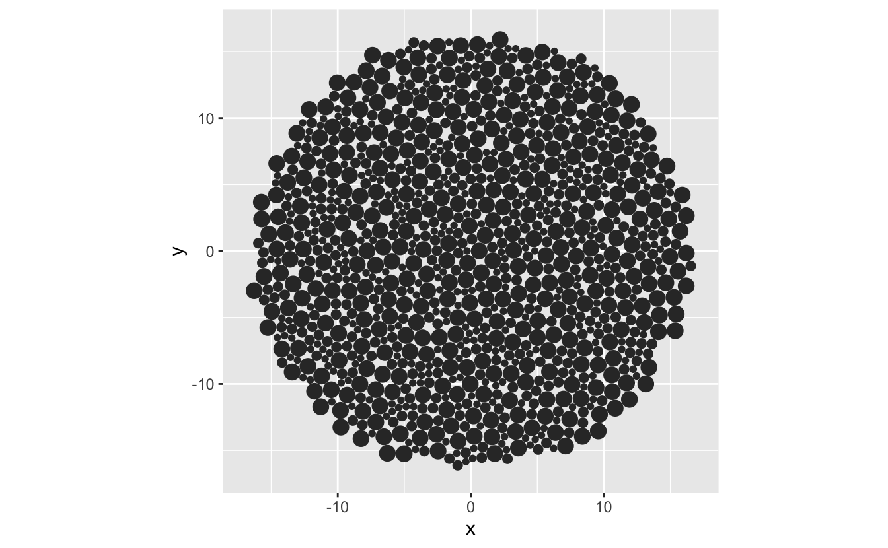
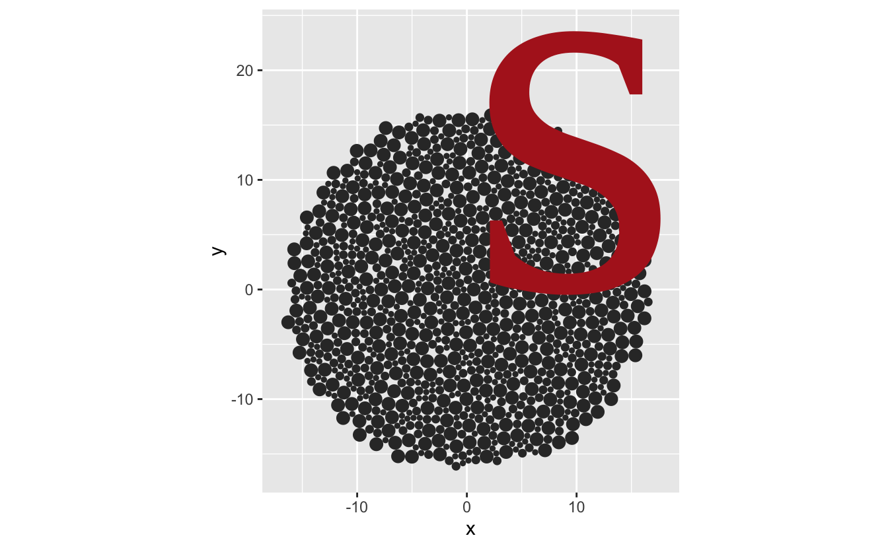
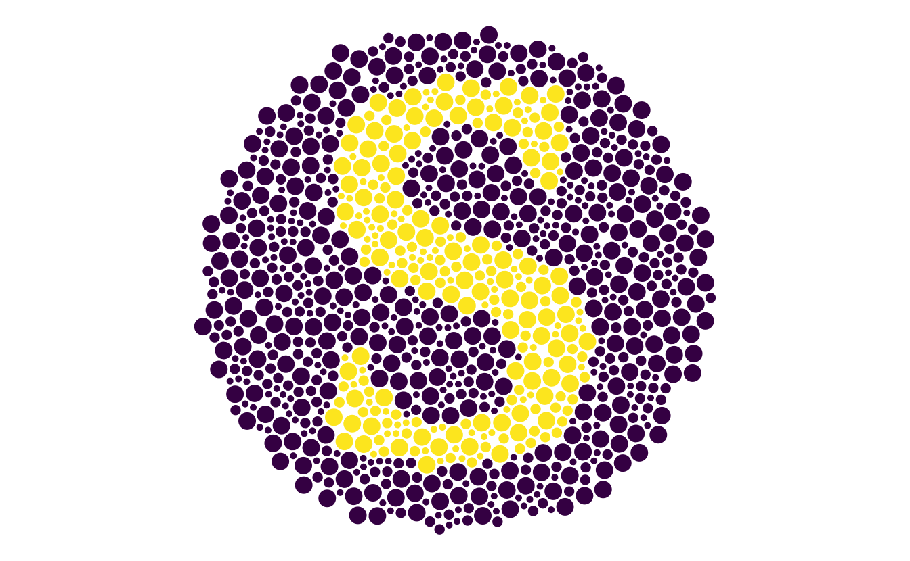
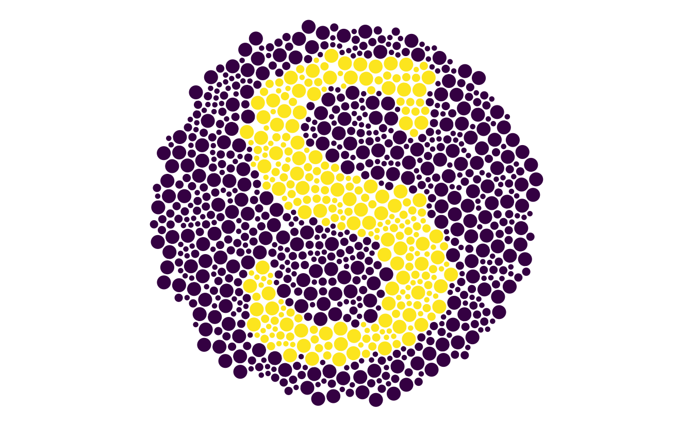
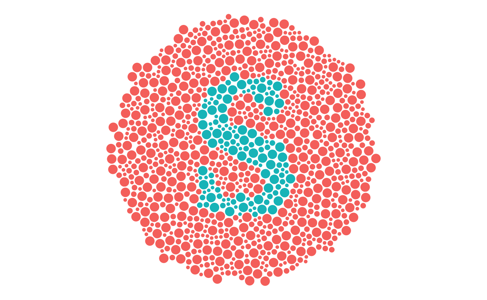

I'm working on an experiment with [Adam Sparks](https://adamhsparks.com/) on how people read maps. As a part of the experiment, we wanted to assess whether people were colourblind. I thought we could use something like an [ishihara test](https://en.wikipedia.org/wiki/Ishihara_test) to assess this. You might have seen this plates before, they look like this:


The idea being that if you are not colourblind, you can identify a number or letter in these plates, and if you have colourblindness, you cannot identify the number (which should be 74).

I figured that I could probably find some tests online, and use them. Looking around, it didn't seem like there was a clearly marked, "this one is free to use, go ahead" one. 

Although, there were some nice tests like [color-blindness.com](https://www.color-blindness.com/color-blindness-tests/). I wanted a bit more control over how the plates were generated, and how the data was created from the tests. And it seemed like it could be fun! So I have spent some spare time from the weekends on trying to make Ishihara plates in R.

In my searches I did find a nice [blog post from Ian Faust](http://ianfaust.com/2016/02/19/Ishihara/) on generating these Ishihara plates. This inspired me to think about creating something within R, and gave me an idea of implementing this.

So, this blog post discusses my first proof of concept, of how to make these plates in R, which will be developed at [`ishihara`](https://github.com/njtierney/ishihara), along with some thoughts about testing.

Thinking about this, I figured out a rough plan of attack:

1. Create a bunch of circles with [`packcircles`](https://cran.r-project.org/web/packages/packcircles/index.html)
2. Convert those circles to an [`sf`](https://cran.r-project.org/web/packages/sf/index.html) spatial object
3. Pull in a vector font
4. Convert that font into an SF object
5. Overlay the two SF objects and see where they intersect
6. Plot the circles that are intersected by the text
7. Change the colour palette in ggplot2 to see the impact of colourblindness

# 1. Create a bunch of circles with [`packcircles`]().

Following along through the examples from the `packcircles` vignette, I wrote this function:


```r
create_poly_packings <- function(areas,
                                 n_points){

  n_circles <- length(areas)

  areas %>%
    sample(n_circles) %>%
    packcircles::circleProgressiveLayout() %>%
    packcircles::circleLayoutVertices(npoints = n_points) %>%
    tibble::as_tibble()

}
```

This outputs a tibble that contains circles (well, actually, polygons). Let's explore.

We can create one triangle:


```r
suppressPackageStartupMessages({
library(tidyverse)
})
tri <- create_poly_packings(areas = 20, n_points = 3)
tri
#> # A tibble: 4 x 3
#>       x         y    id
#>   <dbl>     <dbl> <int>
#> 1  0     0.           1
#> 2 -3.28  1.89e+ 0     1
#> 3 -3.28 -1.89e+ 0     1
#> 4  0    -5.35e-16     1

ggplot(tri, 
       aes(x = x,
           y = y,
           group = id)) +
  geom_polygon()
```


Or many triangles:


```r
tris <- create_poly_packings(areas = c(20, 15, 10, 5), 
                             n_points = 3)
tris
#> # A tibble: 16 x 3
#>         x         y    id
#>     <dbl>     <dbl> <int>
#>  1  0      0.           1
#>  2 -2.68   1.55e+ 0     1
#>  3 -2.68  -1.55e+ 0     1
#>  4  0     -4.37e-16     1
#>  5  2.52   0.           2
#>  6  0.631  1.09e+ 0     2
#>  7  0.631 -1.09e+ 0     2
#>  8  2.52  -3.09e-16     2
#>  9  2.56  -3.33e+ 0     3
#> 10 -0.718 -1.44e+ 0     3
#> 11 -0.718 -5.22e+ 0     3
#> 12  2.56  -3.33e+ 0     3
#> 13  2.96   3.69e+ 0     4
#> 14 -0.829  5.88e+ 0     4
#> 15 -0.829  1.51e+ 0     4
#> 16  2.96   3.69e+ 0     4

ggplot(tris, 
       aes(x = x,
           y = y,
           group = id)) +
  geom_polygon()
```


But if we make many points, we get circles:


```r
circles_df <- create_poly_packings(areas = c(20, 15, 10, 5), 
                                   n_points = 50)
circles_df
#> # A tibble: 204 x 3
#>          x     y    id
#>      <dbl> <dbl> <int>
#>  1  0      0         1
#>  2 -0.0141 0.224     1
#>  3 -0.0561 0.444     1
#>  4 -0.125  0.657     1
#>  5 -0.221  0.860     1
#>  6 -0.341  1.05      1
#>  7 -0.484  1.22      1
#>  8 -0.647  1.37      1
#>  9 -0.828  1.51      1
#> 10 -1.02   1.61      1
#> # … with 194 more rows

ggplot(circles_df, 
       aes(x = x,
           y = y,
           group = id)) +
  geom_polygon() +
  coord_equal()
```


We can create many circles packed together like so:


```r
create_circle_plate <- function(){
  circle_vec <- sample(x = (c(25, 50, 125)/100),
                       size = 1000,
                       replace = TRUE)
  
  create_poly_packings(areas = circle_vec, 
                       n_points = 50)
}
```


```r
circle_plate <- create_circle_plate()

circle_plate
#> # A tibble: 51,000 x 3
#>           x      y    id
#>       <dbl>  <dbl> <int>
#>  1  0       0          1
#>  2 -0.00222 0.0354     1
#>  3 -0.00886 0.0702     1
#>  4 -0.0198  0.104      1
#>  5 -0.0349  0.136      1
#>  6 -0.0539  0.166      1
#>  7 -0.0765  0.193      1
#>  8 -0.102   0.217      1
#>  9 -0.131   0.238      1
#> 10 -0.162   0.255      1
#> # … with 50,990 more rows

ggplot(circle_plate,
       aes(x = x,
           y = y,
           group = id)) +
  geom_polygon() +
  coord_equal()
```




# 2. Convert those circles to an `sf` spatial object.


```r
cast_packing_poly <- function(poly_packing){
  sf::st_as_sf(poly_packing,
               coords = c("x", "y")) %>%
    dplyr::group_by(id) %>%
    dplyr::summarise(do_union = FALSE) %>%
    sf::st_cast("POLYGON") %>%
    dplyr::ungroup()
}
```


```r

circle_plate_sf <- cast_packing_poly(circle_plate)
#> `summarise()` ungrouping output (override with `.groups` argument)

circle_plate_sf
#> Simple feature collection with 1000 features and 1 field
#> geometry type:  POLYGON
#> dimension:      XY
#> bbox:           xmin: -16.91085 ymin: -16.5197 xmax: 16.92988 ymax: 16.5243
#> CRS:            NA
#> # A tibble: 1,000 x 2
#>       id                                                                geometry
#>    <int>                                                               <POLYGON>
#>  1     1 ((0 0, -0.002224402 0.03535585, -0.008862527 0.07015412, -0.01980969 0…
#>  2     2 ((1.261566 0, 1.256592 0.07905809, 1.241749 0.1568694, 1.21727 0.23220…
#>  3     3 ((0.3898454 -0.9119497, 0.3848715 -0.8328916, 0.3700282 -0.7550803, 0.…
#>  4     4 ((-0.5451949 -0.159723, -0.5483406 -0.1097222, -0.5577284 -0.06051006,…
#>  5     5 ((-0.2425009 0.5785156, -0.2456467 0.6285163, -0.2550344 0.6777285, -0…
#>  6     6 ((0.495987 0.8806008, 0.4928412 0.9306015, 0.4834535 0.9798137, 0.4679…
#>  7     7 ((1.713749 1.177744, 1.708775 1.256802, 1.693932 1.334613, 1.669453 1.…
#>  8     8 ((2.015647 0.2971429, 2.012501 0.3471437, 2.003113 0.3963559, 1.987631…
#>  9     9 ((2.28924 -0.7317357, 2.284266 -0.6526776, 2.269422 -0.5748663, 2.2449…
#> 10    10 ((1.417519 -1.643685, 1.412545 -1.564627, 1.397701 -1.486816, 1.373223…
#> # … with 990 more rows
```


# 3. Pull in a vector font.

I had first used [Mike Cheng (coolbutuseless)](https://github.com/coolbutuseless)'s [`gridfont`](https://github.com/coolbutuseless/gridfont), but since discovered [Yixuan Qiu's](https://github.com/yixuan), [`fontr`](https://github.com/yixuan/fontr), which provides a general way to pull in fonts as a vector/polygon.


```r
glyph <- function(glyph, 
                  family = "serif", 
                  face = "regular",
                  nseg = 10) {
  
  if (nchar(glyph) > 1){
    stop("'glyph' only takes one character, input '", 
         glyph, 
         "' is more than one character")
  }
  
  fontr::glyph_polygon(ch = glyph, 
                       family = family, 
                       face = face,
                       nseg = nseg) %>% 
    dplyr::mutate(glyph = glyph) %>% 
    tibble::as_tibble()
}
```


```r
letter_s <- glyph("s")

letter_s
#> # A tibble: 425 x 3
#>        x      y glyph
#>    <dbl>  <dbl> <chr>
#>  1 0.353 0.129  s    
#>  2 0.353 0.123  s    
#>  3 0.353 0.117  s    
#>  4 0.352 0.111  s    
#>  5 0.351 0.105  s    
#>  6 0.351 0.0994 s    
#>  7 0.350 0.0938 s    
#>  8 0.348 0.0882 s    
#>  9 0.347 0.0828 s    
#> 10 0.345 0.0775 s    
#> # … with 415 more rows
```


```r
ggplot(letter_s,
       aes(x = x,
           y = y)) + 
  geom_polygon() +
  coord_equal()
```


# 4. Convert that font into an SF object

We now need to convert this font into an SF object, so we can detect where it overlays on the circles.


```r
cast_font_sf <- function(font_df){
  font_df %>% 
  sf::st_as_sf(coords = c("x", "y")) %>% 
  dplyr::group_by(glyph) %>%
  dplyr::summarise(do_union = FALSE) %>%
  sf::st_cast("POLYGON") %>% 
  dplyr::ungroup() 
}
```


```r
letter_s_sf <- cast_font_sf(letter_s)
#> `summarise()` ungrouping output (override with `.groups` argument)
letter_s_sf
#> Simple feature collection with 1 feature and 1 field
#> geometry type:  POLYGON
#> dimension:      XY
#> bbox:           xmin: 0.04101562 ymin: -0.009765625 xmax: 0.3530273 ymax: 0.4711914
#> CRS:            NA
#> # A tibble: 1 x 2
#>   glyph                                                                 geometry
#>   <chr>                                                                <POLYGON>
#> 1 s     ((0.3530273 0.1289062, 0.3529297 0.1228027, 0.3526367 0.1167969, 0.3521…
```

What's cool about this is that you can use the default `plot` method from `sf`:


```r
plot(letter_s_sf)
```


# 5. Overlay the two SF objects and see where they intersect

What we want to do is overlay the letter over the circles, and then colour those circles that intersect the circles. I can show you what I mean by plotting the data on top of each other.


```r
ggplot(circle_plate,
       aes(x = x,
           y = y,
           group = id)) +
  geom_polygon() +
  geom_polygon(data = letter_s,
               aes(x = x, 
                   y = y,
                   group = glyph),
               colour = "firebrick") +
  coord_equal()
```


... which reveals that we need to scale the font size, or the circles. Let's change the font size.

## Surprise section (5A - scaling fonts)


```r
font_increase <- function(font_df, size){
  font_df %>% 
    dplyr::mutate(x = x * size,
                  y = y * size)
}

font_center <- function(text_df){
  text_df %>% 
    dplyr::mutate_at(dplyr::vars(x, y), scale, scale = FALSE) 
}
```


```r
letter_s_bigger <- letter_s %>% 
  font_increase(50)

ggplot(circle_plate,
       aes(x = x,
           y = y,
           group = id)) +
  geom_polygon() +
  geom_polygon(data = letter_s_bigger,
               aes(x = x, 
                   y = y,
                   group = glyph),
               fill = "firebrick") +
  coord_equal()
```



We need to center the font


```r
letter_s_bigger <- letter_s %>% 
  font_increase(50) %>% 
  font_center()

ggplot(circle_plate,
       aes(x = x,
           y = y,
           group = id)) +
  geom_polygon() +
  geom_polygon(data = letter_s_bigger,
               aes(x = x, 
                   y = y,
                   group = glyph),
               fill = "firebrick") +
  coord_equal()
```


# 5. (again) Overlay the two SF objects and see where they intersect


```r
# syntactic sugar to remove unneeded intersection gaff from sf
is_sf_intersects <- function(x, y) {
  as.logical(lengths(sf::st_intersects(x, y)))
}

overlay_text_in_circle <- function(circle_plate, glyph_sf){
  circle_plate %>% 
    dplyr::mutate(in_text = is_sf_intersects(circle_plate, 
                                             glyph_sf))
}
```


```r
letter_s_bigger_sf <- cast_font_sf(letter_s_bigger)
#> `summarise()` ungrouping output (override with `.groups` argument)
```


```r
overlayed_circle <- overlay_text_in_circle(circle_plate_sf, 
                                           letter_s_bigger_sf)
```

So now we have our packed circles. where the colours are indicated by the intersections.

# 6. Plot the circles that are intersected by the text


```r
gg_ishihara <- ggplot(overlayed_circle) +
  geom_sf(aes(fill = in_text),
          colour = "white") +
  theme_void() +
  theme(legend.position = "none")
```


# 7. Change the colour palette in ggplot2 to see the impact of colourblindness


```r
gg_ishihara + scale_fill_viridis_d()
```



```r
gg_ishihara + scale_fill_grey()
```


# All together now

Create a bunch of circles


```r
circle_plate <- create_circle_plate()
```

Convert circles to an `sf` spatial object.


```r
circle_plate_sf <- cast_packing_poly(circle_plate)
#> `summarise()` ungrouping output (override with `.groups` argument)
```

Pull in a vector font (and resize the font)


```r
letter_s <- glyph("s") %>% 
  font_increase(50) %>% 
  font_center()
```

Convert that font into an SF object 


```r
letter_s_sf <- cast_font_sf(letter_s)
#> `summarise()` ungrouping output (override with `.groups` argument)
```

Overlay the two SF objects and see where they intersect


```r
overlayed_circle <- overlay_text_in_circle(circle_plate_sf, letter_s_sf)
```

plot the object


```r
gg_ishihara <- ggplot(overlayed_circle) +
  geom_sf(aes(fill = in_text),
          colour = "white") +
  theme_void() +
  theme(legend.position = "none")

gg_ishihara
```


Change the colour palette in ggplot2 to see the impact of colourblindness


```r
gg_ishihara + scale_fill_viridis_d()
```



# Surely there's just some magic function to do this, right?

Yes, absolutely. `ishihara_data` creates the data based on the text, and `gg_ishihara` does the plotting:


```r
library(ishihara)
ish <- ishihara_data("s")
gg_ish <- gg_ishihara(ish)
gg_ish
```




# Other applications

[Miles McBain](https://github.com/milesmcbain) had a nice suggestion that we could use these test plates to identify whether colour palettes are good for people with colourblindness. What if we can validate this as a method, and then people can assess their colour palettes using these plates? Wouldn't that be neat?

Sure, there are methods to assess the properties of colour, and whether they are perceptually uniform, and all that.

# More work to be done

There is more to be done on this, which I have outlined [in the issues](https://github.com/njtierney/ishihara/issues). The short answer is "this is a really hard problem".

# Closing thoughts

I started this because I wanted to have a simple question "are you colourblind?", and I wanted to control the inputs more precisely.

Now, we could just ask that in the questionnaire ("are you colourblind"), since generally people will know if they are colourblind or not. 

But, it got me thinking about testing in general. I just assumed that there would be some public domain test that I could use to assess colourblindness. But, it looks like there isn't. And I can understand why. These tests need to be administered under specific conditions, as can be seen in the [manual referenced in wikipedia](http://www.dfisica.ubi.pt/~hgil/p.v.2/Ishihara/Ishihara.24.Plate.TEST.Book.pdf).

And it looks like there is a business in making colourblindness tests, in a similar way to vaccines. These are clinically useful tests.

But, I wonder if there is room for an open source one, that, sure, might not be as good...but what if it's _good enough_?

Are you a researcher who knows about colourblindness? Is this useful?

