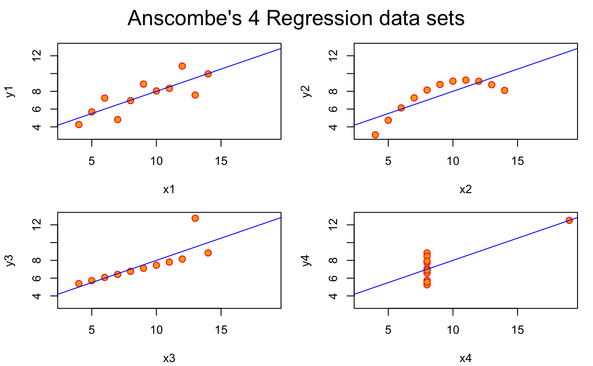
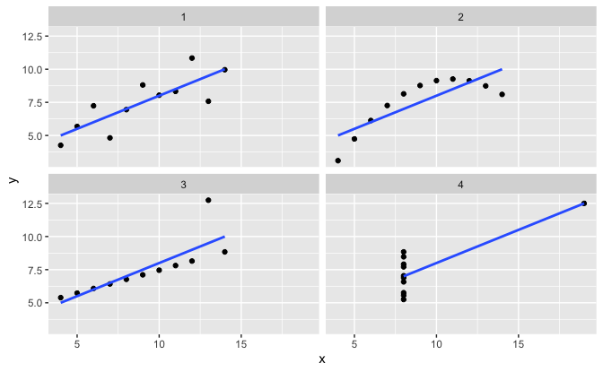

Anscombe's quartet is a really cool dataset that is used to illustrate the importance of data visualisation. It even comes built into R (how cool is that?), and reading the helpfile, it states:

> \[Anscombe's quartet\] Four x-y datasets which have the same traditional statistical properties (mean, variance, correlation, regression line, etc.), yet are quite different.

Different, how?

The helpfile provides code exploring and visualising anscombe's quartet, presented below:

<div class="highlight">

<pre class='chroma'><code class='language-r' data-lang='r'><span class='nf'>require</span>(<span class='k'><a href='https://rdrr.io/r/stats'>stats</a></span>); <span class='nf'>require</span>(<span class='k'><a href='https://rdrr.io/r/graphics'>graphics</a></span>)
<span class='nf'>summary</span>(<span class='k'>anscombe</span>)
<span class='c'>#&gt;        x1             x2             x3             x4           y1        </span>
<span class='c'>#&gt;  Min.   : 4.0   Min.   : 4.0   Min.   : 4.0   Min.   : 8   Min.   : 4.260  </span>
<span class='c'>#&gt;  1st Qu.: 6.5   1st Qu.: 6.5   1st Qu.: 6.5   1st Qu.: 8   1st Qu.: 6.315  </span>
<span class='c'>#&gt;  Median : 9.0   Median : 9.0   Median : 9.0   Median : 8   Median : 7.580  </span>
<span class='c'>#&gt;  Mean   : 9.0   Mean   : 9.0   Mean   : 9.0   Mean   : 9   Mean   : 7.501  </span>
<span class='c'>#&gt;  3rd Qu.:11.5   3rd Qu.:11.5   3rd Qu.:11.5   3rd Qu.: 8   3rd Qu.: 8.570  </span>
<span class='c'>#&gt;  Max.   :14.0   Max.   :14.0   Max.   :14.0   Max.   :19   Max.   :10.840  </span>
<span class='c'>#&gt;        y2              y3              y4        </span>
<span class='c'>#&gt;  Min.   :3.100   Min.   : 5.39   Min.   : 5.250  </span>
<span class='c'>#&gt;  1st Qu.:6.695   1st Qu.: 6.25   1st Qu.: 6.170  </span>
<span class='c'>#&gt;  Median :8.140   Median : 7.11   Median : 7.040  </span>
<span class='c'>#&gt;  Mean   :7.501   Mean   : 7.50   Mean   : 7.501  </span>
<span class='c'>#&gt;  3rd Qu.:8.950   3rd Qu.: 7.98   3rd Qu.: 8.190  </span>
<span class='c'>#&gt;  Max.   :9.260   Max.   :12.74   Max.   :12.500</span>

<span class='c'>##-- now some "magic" to do the 4 regressions in a loop:</span>
<span class='k'>ff</span> <span class='o'>&lt;-</span> <span class='k'>y</span> <span class='o'>~</span> <span class='k'>x</span>
<span class='k'>mods</span> <span class='o'>&lt;-</span> <span class='nf'><a href='https://rdrr.io/r/stats/setNames.html'>setNames</a></span>(<span class='nf'>as.list</span>(<span class='m'>1</span><span class='o'>:</span><span class='m'>4</span>), <span class='nf'>paste0</span>(<span class='s'>"lm"</span>, <span class='m'>1</span><span class='o'>:</span><span class='m'>4</span>))
<span class='kr'>for</span>(<span class='k'>i</span> <span class='kr'>in</span> <span class='m'>1</span><span class='o'>:</span><span class='m'>4</span>) {
  <span class='k'>ff</span>[<span class='m'>2</span><span class='o'>:</span><span class='m'>3</span>] <span class='o'>&lt;-</span> <span class='nf'>lapply</span>(<span class='nf'>paste0</span>(<span class='nf'>c</span>(<span class='s'>"y"</span>,<span class='s'>"x"</span>), <span class='k'>i</span>), <span class='k'>as.name</span>)
  <span class='k'>mods</span>[[<span class='k'>i</span>]] <span class='o'>&lt;-</span> <span class='k'>lmi</span> <span class='o'>&lt;-</span> <span class='nf'><a href='https://rdrr.io/r/stats/lm.html'>lm</a></span>(<span class='k'>ff</span>, data = <span class='k'>anscombe</span>)
  <span class='nf'>print</span>(<span class='nf'><a href='https://rdrr.io/r/stats/anova.html'>anova</a></span>(<span class='k'>lmi</span>))
}
<span class='c'>#&gt; Analysis of Variance Table</span>
<span class='c'>#&gt; </span>
<span class='c'>#&gt; Response: y1</span>
<span class='c'>#&gt;           Df Sum Sq Mean Sq F value  Pr(&gt;F)   </span>
<span class='c'>#&gt; x1         1 27.510 27.5100   17.99 0.00217 **</span>
<span class='c'>#&gt; Residuals  9 13.763  1.5292                   </span>
<span class='c'>#&gt; ---</span>
<span class='c'>#&gt; Signif. codes:  0 '***' 0.001 '**' 0.01 '*' 0.05 '.' 0.1 ' ' 1</span>
<span class='c'>#&gt; Analysis of Variance Table</span>
<span class='c'>#&gt; </span>
<span class='c'>#&gt; Response: y2</span>
<span class='c'>#&gt;           Df Sum Sq Mean Sq F value   Pr(&gt;F)   </span>
<span class='c'>#&gt; x2         1 27.500 27.5000  17.966 0.002179 **</span>
<span class='c'>#&gt; Residuals  9 13.776  1.5307                    </span>
<span class='c'>#&gt; ---</span>
<span class='c'>#&gt; Signif. codes:  0 '***' 0.001 '**' 0.01 '*' 0.05 '.' 0.1 ' ' 1</span>
<span class='c'>#&gt; Analysis of Variance Table</span>
<span class='c'>#&gt; </span>
<span class='c'>#&gt; Response: y3</span>
<span class='c'>#&gt;           Df Sum Sq Mean Sq F value   Pr(&gt;F)   </span>
<span class='c'>#&gt; x3         1 27.470 27.4700  17.972 0.002176 **</span>
<span class='c'>#&gt; Residuals  9 13.756  1.5285                    </span>
<span class='c'>#&gt; ---</span>
<span class='c'>#&gt; Signif. codes:  0 '***' 0.001 '**' 0.01 '*' 0.05 '.' 0.1 ' ' 1</span>
<span class='c'>#&gt; Analysis of Variance Table</span>
<span class='c'>#&gt; </span>
<span class='c'>#&gt; Response: y4</span>
<span class='c'>#&gt;           Df Sum Sq Mean Sq F value   Pr(&gt;F)   </span>
<span class='c'>#&gt; x4         1 27.490 27.4900  18.003 0.002165 **</span>
<span class='c'>#&gt; Residuals  9 13.742  1.5269                    </span>
<span class='c'>#&gt; ---</span>
<span class='c'>#&gt; Signif. codes:  0 '***' 0.001 '**' 0.01 '*' 0.05 '.' 0.1 ' ' 1</span>

<span class='c'>## See how close they are (numerically!)</span>
<span class='nf'>sapply</span>(<span class='k'>mods</span>, <span class='k'>coef</span>)
<span class='c'>#&gt;                   lm1      lm2       lm3       lm4</span>
<span class='c'>#&gt; (Intercept) 3.0000909 3.000909 3.0024545 3.0017273</span>
<span class='c'>#&gt; x1          0.5000909 0.500000 0.4997273 0.4999091</span>
<span class='nf'>lapply</span>(<span class='k'>mods</span>, <span class='nf'>function</span>(<span class='k'>fm</span>) <span class='nf'><a href='https://rdrr.io/r/stats/coef.html'>coef</a></span>(<span class='nf'>summary</span>(<span class='k'>fm</span>)))
<span class='c'>#&gt; $lm1</span>
<span class='c'>#&gt;              Estimate Std. Error  t value    Pr(&gt;|t|)</span>
<span class='c'>#&gt; (Intercept) 3.0000909  1.1247468 2.667348 0.025734051</span>
<span class='c'>#&gt; x1          0.5000909  0.1179055 4.241455 0.002169629</span>
<span class='c'>#&gt; </span>
<span class='c'>#&gt; $lm2</span>
<span class='c'>#&gt;             Estimate Std. Error  t value    Pr(&gt;|t|)</span>
<span class='c'>#&gt; (Intercept) 3.000909  1.1253024 2.666758 0.025758941</span>
<span class='c'>#&gt; x2          0.500000  0.1179637 4.238590 0.002178816</span>
<span class='c'>#&gt; </span>
<span class='c'>#&gt; $lm3</span>
<span class='c'>#&gt;              Estimate Std. Error  t value    Pr(&gt;|t|)</span>
<span class='c'>#&gt; (Intercept) 3.0024545  1.1244812 2.670080 0.025619109</span>
<span class='c'>#&gt; x3          0.4997273  0.1178777 4.239372 0.002176305</span>
<span class='c'>#&gt; </span>
<span class='c'>#&gt; $lm4</span>
<span class='c'>#&gt;              Estimate Std. Error  t value    Pr(&gt;|t|)</span>
<span class='c'>#&gt; (Intercept) 3.0017273  1.1239211 2.670763 0.025590425</span>
<span class='c'>#&gt; x4          0.4999091  0.1178189 4.243028 0.002164602</span>

<span class='c'>## Now, do what you should have done in the first place: PLOTS</span>
<span class='k'>op</span> <span class='o'>&lt;-</span> <span class='nf'><a href='https://rdrr.io/r/graphics/par.html'>par</a></span>(mfrow = <span class='nf'>c</span>(<span class='m'>2</span>, <span class='m'>2</span>), mar = <span class='m'>0.1</span><span class='o'>+</span><span class='nf'>c</span>(<span class='m'>4</span>,<span class='m'>4</span>,<span class='m'>1</span>,<span class='m'>1</span>), oma =  <span class='nf'>c</span>(<span class='m'>0</span>, <span class='m'>0</span>, <span class='m'>2</span>, <span class='m'>0</span>))
<span class='kr'>for</span>(<span class='k'>i</span> <span class='kr'>in</span> <span class='m'>1</span><span class='o'>:</span><span class='m'>4</span>) {
  <span class='k'>ff</span>[<span class='m'>2</span><span class='o'>:</span><span class='m'>3</span>] <span class='o'>&lt;-</span> <span class='nf'>lapply</span>(<span class='nf'>paste0</span>(<span class='nf'>c</span>(<span class='s'>"y"</span>,<span class='s'>"x"</span>), <span class='k'>i</span>), <span class='k'>as.name</span>)
  <span class='nf'><a href='https://rdrr.io/r/graphics/plot.default.html'>plot</a></span>(<span class='k'>ff</span>, data = <span class='k'>anscombe</span>, col = <span class='s'>"red"</span>, pch = <span class='m'>21</span>, bg = <span class='s'>"orange"</span>, cex = <span class='m'>1.2</span>,
       xlim = <span class='nf'>c</span>(<span class='m'>3</span>, <span class='m'>19</span>), ylim = <span class='nf'>c</span>(<span class='m'>3</span>, <span class='m'>13</span>))
  <span class='nf'><a href='https://rdrr.io/r/graphics/abline.html'>abline</a></span>(<span class='k'>mods</span>[[<span class='k'>i</span>]], col = <span class='s'>"blue"</span>)
}
<span class='nf'><a href='https://rdrr.io/r/graphics/mtext.html'>mtext</a></span>(<span class='s'>"Anscombe's 4 Regression data sets"</span>, outer = <span class='m'>TRUE</span>, cex = <span class='m'>1.5</span>)
</code></pre>

<pre class='chroma'><code class='language-r' data-lang='r'><span class='nf'><a href='https://rdrr.io/r/graphics/par.html'>par</a></span>(<span class='k'>op</span>)</code></pre>

</div>

It's nice to see some fun style in the comments!

But what we learn here is that the data itself has similar statistical properties, in terms of summary statistics, but also in terms of regression fit.

So, you might look at those and think what you've learned is: "Everything looks the same".

But the point is that when we visualise the data, we learn:

> Everything is actually very different.

And that the only way to learn this is through data visualisation!

Exploring Anscombe using the tidyverse
======================================

The helpfile does a great job of providing summaries of the data and plots!

There have been some recent changes with dplyr 1.0.0 coming out just the other day. I think it would be interesting to try doing the same steps as in the helpfile, but using the [tidyverse](https://tidyverse.org/) tools.

There are a few key parts to this analysis:

1.  Tidy up the data
2.  Explore the summary statistics of each group
3.  Fit a model to each group
4.  Make the plots in ggplot2.

Tidy up the data
----------------

Before we tidy up the data, it is good to think about what format we want the data in.

Currently, the data is in this format:

<div class="highlight">

<pre class='chroma'><code class='language-r' data-lang='r'><span class='nf'>head</span>(<span class='k'>anscombe</span>)
<span class='c'>#&gt;   x1 x2 x3 x4   y1   y2    y3   y4</span>
<span class='c'>#&gt; 1 10 10 10  8 8.04 9.14  7.46 6.58</span>
<span class='c'>#&gt; 2  8  8  8  8 6.95 8.14  6.77 5.76</span>
<span class='c'>#&gt; 3 13 13 13  8 7.58 8.74 12.74 7.71</span>
<span class='c'>#&gt; 4  9  9  9  8 8.81 8.77  7.11 8.84</span>
<span class='c'>#&gt; 5 11 11 11  8 8.33 9.26  7.81 8.47</span>
<span class='c'>#&gt; 6 14 14 14  8 9.96 8.10  8.84 7.04</span></code></pre>

</div>

So how do we know the "right" format?

One trick that I use is to imagine how I would write the ggplot code. Because this then allows me to work out what I want the columns to be.

So, perhaps at a basic level, I'd want code like this:

<div class="highlight">

<pre class='chroma'><code class='language-r' data-lang='r'><span class='nf'>ggplot</span>(<span class='k'>anscombe</span>,
       <span class='nf'>aes</span>(x = <span class='k'>x</span>,
           y = <span class='k'>y</span>)) <span class='o'>+</span> 
  <span class='nf'>geom_point</span>() <span class='o'>+</span> 
  <span class='nf'>facet_wrap</span>(<span class='o'>~</span><span class='k'>set</span>)</code></pre>

</div>

So this tells me:

-   The x axis maps onto the x column
-   The y axis maps onto the y column
-   I have a column, set

What we want is a format where we have:

<div class="highlight">

|  set|    x|     y|
|----:|----:|-----:|
|    1|   10|  8.04|

</div>

In fact, reading the recent documentation for `tidyr`'s `pivot_longer` (the new version of `gather`), we have new example that shows you how to clean the `anscombe` data:

<div class="highlight">

<pre class='chroma'><code class='language-r' data-lang='r'><span class='nf'>library</span>(<span class='k'><a href='https://tidyverse.tidyverse.org/reference'>tidyverse</a></span>)
<span class='c'>#&gt; -- Attaching packages ----------------------------- tidyverse 1.3.0 --</span>
<span class='c'>#&gt; v ggplot2 3.3.1     v purrr   0.3.4</span>
<span class='c'>#&gt; v tibble  3.0.1     v dplyr   1.0.0</span>
<span class='c'>#&gt; v tidyr   1.1.0     v stringr 1.4.0</span>
<span class='c'>#&gt; v readr   1.3.1     v forcats 0.5.0</span>
<span class='c'>#&gt; -- Conflicts -------------------------------- tidyverse_conflicts() --</span>
<span class='c'>#&gt; x dplyr::filter() masks stats::filter()</span>
<span class='c'>#&gt; x dplyr::lag()    masks stats::lag()</span>

<span class='k'>tidy_anscombe</span> <span class='o'>&lt;-</span> <span class='k'>anscombe</span> <span class='o'>%&gt;%</span>
 <span class='nf'>pivot_longer</span>(cols = <span class='nf'>everything</span>(),
              names_to = <span class='nf'>c</span>(<span class='s'>".value"</span>, <span class='s'>"set"</span>),
              names_pattern = <span class='s'>"(.)(.)"</span>)

<span class='k'>tidy_anscombe</span>
<span class='c'>#&gt; # A tibble: 44 x 3</span>
<span class='c'>#&gt;    set       x     y</span>
<span class='c'>#&gt;    &lt;chr&gt; &lt;dbl&gt; &lt;dbl&gt;</span>
<span class='c'>#&gt;  1 1        10  8.04</span>
<span class='c'>#&gt;  2 2        10  9.14</span>
<span class='c'>#&gt;  3 3        10  7.46</span>
<span class='c'>#&gt;  4 4         8  6.58</span>
<span class='c'>#&gt;  5 1         8  6.95</span>
<span class='c'>#&gt;  6 2         8  8.14</span>
<span class='c'>#&gt;  7 3         8  6.77</span>
<span class='c'>#&gt;  8 4         8  5.76</span>
<span class='c'>#&gt;  9 1        13  7.58</span>
<span class='c'>#&gt; 10 2        13  8.74</span>
<span class='c'>#&gt; # ... with 34 more rows</span></code></pre>

</div>

So, what happened there? Let's break it down.

``` r
cols = everything()
```

> We pivot the data into a longer format, selecting *every column* with:

``` r
names_to = c(".value", "set")
```

> We specify how we want to create the new names of the data with:

Now this includes a nice bit of **magic** here, the ".value" command indicates a component of the name is also in the value. What does that mean? Well we go from:

<div class="highlight">

|   x1|   x2|    y1|    y2|
|----:|----:|-----:|-----:|
|   10|   10|  8.04|  9.14|
|    8|    8|  6.95|  8.14|

</div>

to

<div class="highlight">

| set |    x|     y|
|:----|----:|-----:|
| 1   |   10|  8.04|
| 1   |    8|  6.95|
| 2   |   10|  9.14|
| 2   |    8|  8.14|

</div>

Because the names `x1` and `y1` are tied to both the "names" that we want to create ("x" and "y"), and the values we want create (set - 1...4). We are actually doing two steps here:

1.  Splitting up the variables "x1" into "x" and
2.  A value "1" in the variable in "set".

So, the:

``` r
names_to = c(".value", "set")
```

Tells us there is something special about the current names, but now we need a way to specify how to break up the names. We need to split up the variables, "x1, x2, ... y3, y4", and we need to describe how to do that using `names_pattern`:

``` r
names_pattern = "(.)(.)"
```

> The names and values are separated by two characters

I don't speak regex good, so I looked it up on ["regexr"](https://regexr.com/), and basically this translates to "two characters", so it will create a column for each character. You could equivalently write:

``` r
names_pattern = "([a-z])([1-9])"
```

Which would more explicitly say: \"The first thing is a character, the second thing is a number.

This means that we end up with:

<div class="highlight">

<pre class='chroma'><code class='language-r' data-lang='r'><span class='k'>tidy_anscombe</span>
<span class='c'>#&gt; # A tibble: 44 x 3</span>
<span class='c'>#&gt;    set       x     y</span>
<span class='c'>#&gt;    &lt;chr&gt; &lt;dbl&gt; &lt;dbl&gt;</span>
<span class='c'>#&gt;  1 1        10  8.04</span>
<span class='c'>#&gt;  2 2        10  9.14</span>
<span class='c'>#&gt;  3 3        10  7.46</span>
<span class='c'>#&gt;  4 4         8  6.58</span>
<span class='c'>#&gt;  5 1         8  6.95</span>
<span class='c'>#&gt;  6 2         8  8.14</span>
<span class='c'>#&gt;  7 3         8  6.77</span>
<span class='c'>#&gt;  8 4         8  5.76</span>
<span class='c'>#&gt;  9 1        13  7.58</span>
<span class='c'>#&gt; 10 2        13  8.74</span>
<span class='c'>#&gt; # ... with 34 more rows</span></code></pre>

</div>

Also just to give you a sense of the improvement of `pivot_longer` / `pivot_wider` over `gather` / `spread`, this is how I previously wrote this example (this blog post was started on 2017-12-08 and published on 2020-06-01) - and it didn't actually quite work and I gave up. (Although [David Robinsons's post on tidyverse plotting of Anscombe's quartet](https://rpubs.com/dgrtwo/tidy-anscombe) could have helped in retrospect).

<div class="highlight">

<pre class='chroma'><code class='language-r' data-lang='r'>
<span class='k'>old_tidy_anscombe</span> <span class='o'>&lt;-</span> <span class='k'>anscombe</span> <span class='o'>%&gt;%</span>
  <span class='nf'>gather</span>(key = <span class='s'>"variable"</span>,
         value = <span class='s'>"value"</span>) <span class='o'>%&gt;%</span>
  <span class='nf'>as_tibble</span>() <span class='o'>%&gt;%</span>
  <span class='c'># So now we need to split this out into groups based on the number.</span>
  <span class='nf'>mutate</span>(group = <span class='k'>readr</span>::<span class='nf'><a href='https://readr.tidyverse.org/reference/parse_number.html'>parse_number</a></span>(<span class='k'>variable</span>),
         variable = <span class='k'>stringr</span>::<span class='nf'><a href='https://stringr.tidyverse.org/reference/str_remove.html'>str_remove</a></span>(<span class='k'>variable</span>, <span class='s'>"[1-9]"</span>)) <span class='o'>%&gt;%</span>
  <span class='nf'>select</span>(<span class='k'>variable</span>,
         <span class='k'>group</span>,
         <span class='k'>value</span>) <span class='o'>%&gt;%</span>
  <span class='c'># And then we actually want to spread out the variable column</span>
  <span class='nf'>rowid_to_column</span>() <span class='o'>%&gt;%</span>
  <span class='nf'>spread</span>(key = <span class='k'>variable</span>,
         value = <span class='k'>value</span>)

<span class='k'>old_tidy_anscombe</span>
<span class='c'>#&gt; # A tibble: 88 x 4</span>
<span class='c'>#&gt;    rowid group     x     y</span>
<span class='c'>#&gt;    &lt;int&gt; &lt;dbl&gt; &lt;dbl&gt; &lt;dbl&gt;</span>
<span class='c'>#&gt;  1     1     1    10    NA</span>
<span class='c'>#&gt;  2     2     1     8    NA</span>
<span class='c'>#&gt;  3     3     1    13    NA</span>
<span class='c'>#&gt;  4     4     1     9    NA</span>
<span class='c'>#&gt;  5     5     1    11    NA</span>
<span class='c'>#&gt;  6     6     1    14    NA</span>
<span class='c'>#&gt;  7     7     1     6    NA</span>
<span class='c'>#&gt;  8     8     1     4    NA</span>
<span class='c'>#&gt;  9     9     1    12    NA</span>
<span class='c'>#&gt; 10    10     1     7    NA</span>
<span class='c'>#&gt; # ... with 78 more rows</span></code></pre>

</div>

Explore the summary statistics of each group
============================================

So we want to be able to do:

<div class="highlight">

<pre class='chroma'><code class='language-r' data-lang='r'><span class='nf'>summary</span>(<span class='k'>anscombe</span>)
<span class='c'>#&gt;        x1             x2             x3             x4           y1        </span>
<span class='c'>#&gt;  Min.   : 4.0   Min.   : 4.0   Min.   : 4.0   Min.   : 8   Min.   : 4.260  </span>
<span class='c'>#&gt;  1st Qu.: 6.5   1st Qu.: 6.5   1st Qu.: 6.5   1st Qu.: 8   1st Qu.: 6.315  </span>
<span class='c'>#&gt;  Median : 9.0   Median : 9.0   Median : 9.0   Median : 8   Median : 7.580  </span>
<span class='c'>#&gt;  Mean   : 9.0   Mean   : 9.0   Mean   : 9.0   Mean   : 9   Mean   : 7.501  </span>
<span class='c'>#&gt;  3rd Qu.:11.5   3rd Qu.:11.5   3rd Qu.:11.5   3rd Qu.: 8   3rd Qu.: 8.570  </span>
<span class='c'>#&gt;  Max.   :14.0   Max.   :14.0   Max.   :14.0   Max.   :19   Max.   :10.840  </span>
<span class='c'>#&gt;        y2              y3              y4        </span>
<span class='c'>#&gt;  Min.   :3.100   Min.   : 5.39   Min.   : 5.250  </span>
<span class='c'>#&gt;  1st Qu.:6.695   1st Qu.: 6.25   1st Qu.: 6.170  </span>
<span class='c'>#&gt;  Median :8.140   Median : 7.11   Median : 7.040  </span>
<span class='c'>#&gt;  Mean   :7.501   Mean   : 7.50   Mean   : 7.501  </span>
<span class='c'>#&gt;  3rd Qu.:8.950   3rd Qu.: 7.98   3rd Qu.: 8.190  </span>
<span class='c'>#&gt;  Max.   :9.260   Max.   :12.74   Max.   :12.500</span></code></pre>

</div>

But in a tidyverse way?

We can take this opportunity to use some of the new features in `dplyr` 1.0.0, `across` and co, combined with [`tibble::lst()`](https://tibble.tidyverse.org/reference/lst.html) to give us nice column names:

<div class="highlight">

<pre class='chroma'><code class='language-r' data-lang='r'><span class='nf'>library</span>(<span class='k'><a href='https://dplyr.tidyverse.org/reference'>dplyr</a></span>)

<span class='k'>tidy_anscombe_summary</span> <span class='o'>&lt;-</span> <span class='k'>tidy_anscombe</span> <span class='o'>%&gt;%</span>
  <span class='nf'><a href='https://dplyr.tidyverse.org/reference/group_by.html'>group_by</a></span>(<span class='k'>set</span>) <span class='o'>%&gt;%</span>
  <span class='nf'><a href='https://dplyr.tidyverse.org/reference/summarise.html'>summarise</a></span>(<span class='nf'><a href='https://dplyr.tidyverse.org/reference/across.html'>across</a></span>(.cols = <span class='nf'><a href='https://tidyselect.r-lib.org/reference/everything.html'>everything</a></span>(),
                   .fns = <span class='nf'><a href='https://tibble.tidyverse.org/reference/lst.html'>lst</a></span>(<span class='k'>min</span>,<span class='k'>max</span>,<span class='k'>median</span>,<span class='k'>mean</span>,<span class='k'>sd</span>,<span class='k'>var</span>),
                   .names = <span class='s'>"{col}_{fn}"</span>))
<span class='c'>#&gt; `summarise()` ungrouping output (override with `.groups` argument)</span>

<span class='k'>tidy_anscombe_summary</span>
<span class='c'>#&gt; # A tibble: 4 x 13</span>
<span class='c'>#&gt;   set   x_min x_max x_median x_mean  x_sd x_var y_min y_max y_median y_mean</span>
<span class='c'>#&gt;   &lt;chr&gt; &lt;dbl&gt; &lt;dbl&gt;    &lt;dbl&gt;  &lt;dbl&gt; &lt;dbl&gt; &lt;dbl&gt; &lt;dbl&gt; &lt;dbl&gt;    &lt;dbl&gt;  &lt;dbl&gt;</span>
<span class='c'>#&gt; 1 1         4    14        9      9  3.32    11  4.26 10.8      7.58   7.50</span>
<span class='c'>#&gt; 2 2         4    14        9      9  3.32    11  3.1   9.26     8.14   7.50</span>
<span class='c'>#&gt; 3 3         4    14        9      9  3.32    11  5.39 12.7      7.11   7.5 </span>
<span class='c'>#&gt; 4 4         8    19        8      9  3.32    11  5.25 12.5      7.04   7.50</span>
<span class='c'>#&gt; # ... with 2 more variables: y_sd &lt;dbl&gt;, y_var &lt;dbl&gt;</span></code></pre>

</div>

Let's break that down.

``` r
tidy_anscombe %>%
  group_by(set)
```

> For each set

``` r
summarise(across(.cols = everything(),
```

> Calculate a one row summary (per group), across every variable:

``` r
.fns = lst(min,max,median,mean,sd,var),
```

> Apply these functions

(`lst` automatically names the functions after their input)

<div class="highlight">

<pre class='chroma'><code class='language-r' data-lang='r'><span class='nf'>names</span>(<span class='k'>tibble</span>::<span class='nf'><a href='https://tibble.tidyverse.org/reference/lst.html'>lst</a></span>(<span class='k'>max</span>))
<span class='c'>#&gt; [1] "max"</span></code></pre>

</div>

``` r
.names = "{col}_{fn}"
```

> Then produce column names that inherit the column name, then the function name (thanks to our friend `lst`).

One more time, this is what we get:

<div class="highlight">

<pre class='chroma'><code class='language-r' data-lang='r'><span class='k'>tidy_anscombe_summary</span>
<span class='c'>#&gt; # A tibble: 4 x 13</span>
<span class='c'>#&gt;   set   x_min x_max x_median x_mean  x_sd x_var y_min y_max y_median y_mean</span>
<span class='c'>#&gt;   &lt;chr&gt; &lt;dbl&gt; &lt;dbl&gt;    &lt;dbl&gt;  &lt;dbl&gt; &lt;dbl&gt; &lt;dbl&gt; &lt;dbl&gt; &lt;dbl&gt;    &lt;dbl&gt;  &lt;dbl&gt;</span>
<span class='c'>#&gt; 1 1         4    14        9      9  3.32    11  4.26 10.8      7.58   7.50</span>
<span class='c'>#&gt; 2 2         4    14        9      9  3.32    11  3.1   9.26     8.14   7.50</span>
<span class='c'>#&gt; 3 3         4    14        9      9  3.32    11  5.39 12.7      7.11   7.5 </span>
<span class='c'>#&gt; 4 4         8    19        8      9  3.32    11  5.25 12.5      7.04   7.50</span>
<span class='c'>#&gt; # ... with 2 more variables: y_sd &lt;dbl&gt;, y_var &lt;dbl&gt;</span></code></pre>

</div>

There's no getting around the fact that `summary(anscombe)` is less work, in this instance. Like, it is actually amazing.

But, what you trade off there is the fact that you need data in an inherently inconvenient format for other parts of data analysis, and gain tools that allow you to express yourselve in a variety of circumstance well beyond `summary` can do.

I think this is pretty dang neat!

Fit a model to each group
-------------------------

This is a good one.

<div class="highlight">

<pre class='chroma'><code class='language-r' data-lang='r'><span class='c'>##-- now some "magic" to do the 4 regressions in a loop:</span>
<span class='k'>ff</span> <span class='o'>&lt;-</span> <span class='k'>y</span> <span class='o'>~</span> <span class='k'>x</span>
<span class='k'>mods</span> <span class='o'>&lt;-</span> <span class='nf'><a href='https://rdrr.io/r/stats/setNames.html'>setNames</a></span>(<span class='nf'>as.list</span>(<span class='m'>1</span><span class='o'>:</span><span class='m'>4</span>), <span class='nf'>paste0</span>(<span class='s'>"lm"</span>, <span class='m'>1</span><span class='o'>:</span><span class='m'>4</span>))
<span class='kr'>for</span>(<span class='k'>i</span> <span class='kr'>in</span> <span class='m'>1</span><span class='o'>:</span><span class='m'>4</span>) {
  <span class='k'>ff</span>[<span class='m'>2</span><span class='o'>:</span><span class='m'>3</span>] <span class='o'>&lt;-</span> <span class='nf'>lapply</span>(<span class='nf'>paste0</span>(<span class='nf'>c</span>(<span class='s'>"y"</span>,<span class='s'>"x"</span>), <span class='k'>i</span>), <span class='k'>as.name</span>)
  <span class='k'>mods</span>[[<span class='k'>i</span>]] <span class='o'>&lt;-</span> <span class='k'>lmi</span> <span class='o'>&lt;-</span> <span class='nf'><a href='https://rdrr.io/r/stats/lm.html'>lm</a></span>(<span class='k'>ff</span>, data = <span class='k'>anscombe</span>)
  <span class='nf'>print</span>(<span class='nf'><a href='https://rdrr.io/r/stats/anova.html'>anova</a></span>(<span class='k'>lmi</span>))
}
<span class='c'>#&gt; Analysis of Variance Table</span>
<span class='c'>#&gt; </span>
<span class='c'>#&gt; Response: y1</span>
<span class='c'>#&gt;           Df Sum Sq Mean Sq F value  Pr(&gt;F)   </span>
<span class='c'>#&gt; x1         1 27.510 27.5100   17.99 0.00217 **</span>
<span class='c'>#&gt; Residuals  9 13.763  1.5292                   </span>
<span class='c'>#&gt; ---</span>
<span class='c'>#&gt; Signif. codes:  0 '***' 0.001 '**' 0.01 '*' 0.05 '.' 0.1 ' ' 1</span>
<span class='c'>#&gt; Analysis of Variance Table</span>
<span class='c'>#&gt; </span>
<span class='c'>#&gt; Response: y2</span>
<span class='c'>#&gt;           Df Sum Sq Mean Sq F value   Pr(&gt;F)   </span>
<span class='c'>#&gt; x2         1 27.500 27.5000  17.966 0.002179 **</span>
<span class='c'>#&gt; Residuals  9 13.776  1.5307                    </span>
<span class='c'>#&gt; ---</span>
<span class='c'>#&gt; Signif. codes:  0 '***' 0.001 '**' 0.01 '*' 0.05 '.' 0.1 ' ' 1</span>
<span class='c'>#&gt; Analysis of Variance Table</span>
<span class='c'>#&gt; </span>
<span class='c'>#&gt; Response: y3</span>
<span class='c'>#&gt;           Df Sum Sq Mean Sq F value   Pr(&gt;F)   </span>
<span class='c'>#&gt; x3         1 27.470 27.4700  17.972 0.002176 **</span>
<span class='c'>#&gt; Residuals  9 13.756  1.5285                    </span>
<span class='c'>#&gt; ---</span>
<span class='c'>#&gt; Signif. codes:  0 '***' 0.001 '**' 0.01 '*' 0.05 '.' 0.1 ' ' 1</span>
<span class='c'>#&gt; Analysis of Variance Table</span>
<span class='c'>#&gt; </span>
<span class='c'>#&gt; Response: y4</span>
<span class='c'>#&gt;           Df Sum Sq Mean Sq F value   Pr(&gt;F)   </span>
<span class='c'>#&gt; x4         1 27.490 27.4900  18.003 0.002165 **</span>
<span class='c'>#&gt; Residuals  9 13.742  1.5269                    </span>
<span class='c'>#&gt; ---</span>
<span class='c'>#&gt; Signif. codes:  0 '***' 0.001 '**' 0.01 '*' 0.05 '.' 0.1 ' ' 1</span>

<span class='c'>## See how close they are (numerically!)</span>
<span class='nf'>sapply</span>(<span class='k'>mods</span>, <span class='k'>coef</span>)
<span class='c'>#&gt;                   lm1      lm2       lm3       lm4</span>
<span class='c'>#&gt; (Intercept) 3.0000909 3.000909 3.0024545 3.0017273</span>
<span class='c'>#&gt; x1          0.5000909 0.500000 0.4997273 0.4999091</span>
<span class='nf'>lapply</span>(<span class='k'>mods</span>, <span class='nf'>function</span>(<span class='k'>fm</span>) <span class='nf'><a href='https://rdrr.io/r/stats/coef.html'>coef</a></span>(<span class='nf'>summary</span>(<span class='k'>fm</span>)))
<span class='c'>#&gt; $lm1</span>
<span class='c'>#&gt;              Estimate Std. Error  t value    Pr(&gt;|t|)</span>
<span class='c'>#&gt; (Intercept) 3.0000909  1.1247468 2.667348 0.025734051</span>
<span class='c'>#&gt; x1          0.5000909  0.1179055 4.241455 0.002169629</span>
<span class='c'>#&gt; </span>
<span class='c'>#&gt; $lm2</span>
<span class='c'>#&gt;             Estimate Std. Error  t value    Pr(&gt;|t|)</span>
<span class='c'>#&gt; (Intercept) 3.000909  1.1253024 2.666758 0.025758941</span>
<span class='c'>#&gt; x2          0.500000  0.1179637 4.238590 0.002178816</span>
<span class='c'>#&gt; </span>
<span class='c'>#&gt; $lm3</span>
<span class='c'>#&gt;              Estimate Std. Error  t value    Pr(&gt;|t|)</span>
<span class='c'>#&gt; (Intercept) 3.0024545  1.1244812 2.670080 0.025619109</span>
<span class='c'>#&gt; x3          0.4997273  0.1178777 4.239372 0.002176305</span>
<span class='c'>#&gt; </span>
<span class='c'>#&gt; $lm4</span>
<span class='c'>#&gt;              Estimate Std. Error  t value    Pr(&gt;|t|)</span>
<span class='c'>#&gt; (Intercept) 3.0017273  1.1239211 2.670763 0.025590425</span>
<span class='c'>#&gt; x4          0.4999091  0.1178189 4.243028 0.002164602</span></code></pre>

</div>

How to do this in tidyverse?

<div class="highlight">

<pre class='chroma'><code class='language-r' data-lang='r'><span class='nf'>library</span>(<span class='k'><a href='https://rdrr.io/pkg/broom/man'>broom</a></span>)

<span class='k'>tidy_anscombe_models</span> <span class='o'>&lt;-</span> <span class='k'>tidy_anscombe</span> <span class='o'>%&gt;%</span> 
  <span class='nf'><a href='https://dplyr.tidyverse.org/reference/group_nest.html'>group_nest</a></span>(<span class='k'>set</span>) <span class='o'>%&gt;%</span> 
  <span class='nf'><a href='https://dplyr.tidyverse.org/reference/mutate.html'>mutate</a></span>(fit = <span class='nf'>map</span>(<span class='k'>data</span>, <span class='o'>~</span><span class='nf'><a href='https://rdrr.io/r/stats/lm.html'>lm</a></span>(<span class='k'>y</span> <span class='o'>~</span> <span class='k'>x</span>, data = <span class='k'>.x</span>)),
         tidy = <span class='nf'>map</span>(<span class='k'>fit</span>, <span class='k'>tidy</span>),
         glance = <span class='nf'>map</span>(<span class='k'>fit</span>, <span class='k'>glance</span>))</code></pre>

</div>

What this is doing is fitting a linear model to each of the groups in `set`, and then calculating summaries on the statistical model. Briefly:

``` r
group_nest(set)
```

> Nest the data into groups based on set, which we can then do cool things with:

``` r
fit = map(data, ~lm(y ~ x, data = .x))
```

> Fit a linear model to each of the datasets in `set`

``` r
tidy = map(fit, tidy)
```

> Tidy up each of the linear models in `set` to get the coefficient information

``` r
glance = map(fit, glance))
```

> Get the model fit statistics for each of the models.

Now, we unnest the `tidy_anscombe_models`:

<div class="highlight">

<pre class='chroma'><code class='language-r' data-lang='r'><span class='k'>tidy_anscombe_models</span> <span class='o'>%&gt;%</span> 
  <span class='nf'>unnest</span>(cols = <span class='nf'>c</span>(<span class='k'>tidy</span>)) 
<span class='c'>#&gt; # A tibble: 8 x 9</span>
<span class='c'>#&gt;   set          data fit    term   estimate std.error statistic p.value glance   </span>
<span class='c'>#&gt;   &lt;chr&gt; &lt;list&lt;tbl_&gt; &lt;list&gt; &lt;chr&gt;     &lt;dbl&gt;     &lt;dbl&gt;     &lt;dbl&gt;   &lt;dbl&gt; &lt;list&gt;   </span>
<span class='c'>#&gt; 1 1        [11 x 2] &lt;lm&gt;   (Inte~    3.00      1.12       2.67 0.0257  &lt;tibble ~</span>
<span class='c'>#&gt; 2 1        [11 x 2] &lt;lm&gt;   x         0.500     0.118      4.24 0.00217 &lt;tibble ~</span>
<span class='c'>#&gt; 3 2        [11 x 2] &lt;lm&gt;   (Inte~    3.00      1.13       2.67 0.0258  &lt;tibble ~</span>
<span class='c'>#&gt; 4 2        [11 x 2] &lt;lm&gt;   x         0.5       0.118      4.24 0.00218 &lt;tibble ~</span>
<span class='c'>#&gt; 5 3        [11 x 2] &lt;lm&gt;   (Inte~    3.00      1.12       2.67 0.0256  &lt;tibble ~</span>
<span class='c'>#&gt; 6 3        [11 x 2] &lt;lm&gt;   x         0.500     0.118      4.24 0.00218 &lt;tibble ~</span>
<span class='c'>#&gt; 7 4        [11 x 2] &lt;lm&gt;   (Inte~    3.00      1.12       2.67 0.0256  &lt;tibble ~</span>
<span class='c'>#&gt; 8 4        [11 x 2] &lt;lm&gt;   x         0.500     0.118      4.24 0.00216 &lt;tibble ~</span></code></pre>

</div>

But we'll need to make the dataset wider with `pivot_wider`:

<div class="highlight">

<pre class='chroma'><code class='language-r' data-lang='r'><span class='k'>tidy_anscombe_models</span> <span class='o'>%&gt;%</span> 
  <span class='nf'>unnest</span>(cols = <span class='nf'>c</span>(<span class='k'>tidy</span>)) <span class='o'>%&gt;%</span> 
  <span class='nf'>pivot_wider</span>(id_cols = <span class='nf'>c</span>(<span class='k'>set</span>,<span class='k'>term</span>),
              names_from = <span class='k'>term</span>,
              values_from = <span class='k'>estimate</span>)
<span class='c'>#&gt; # A tibble: 4 x 3</span>
<span class='c'>#&gt;   set   `(Intercept)`     x</span>
<span class='c'>#&gt;   &lt;chr&gt;         &lt;dbl&gt; &lt;dbl&gt;</span>
<span class='c'>#&gt; 1 1              3.00 0.500</span>
<span class='c'>#&gt; 2 2              3.00 0.5  </span>
<span class='c'>#&gt; 3 3              3.00 0.500</span>
<span class='c'>#&gt; 4 4              3.00 0.500</span></code></pre>

</div>

Wow, so...the linear models give us basically the same information? Jeez.

> But what do these `pivot_wider` things do?

I hear you cry?

Well, briefly:

``` r
id_cols = c(set,term)
```

> Which columns give us unique rows that you want to make wider?

``` r
names_from = term
```

> Which column contains the information we want to take names from?

``` r
values_from = estimate
```

> Which column contains information we want to take the values from?

OK so maybe the model coefficients are bad, but surely some of the other model fit statistics help identify differences between the sets? Right?

<div class="highlight">

<pre class='chroma'><code class='language-r' data-lang='r'><span class='k'>tidy_anscombe_models</span> <span class='o'>%&gt;%</span> 
  <span class='nf'>unnest</span>(cols = <span class='nf'>c</span>(<span class='k'>glance</span>)) <span class='o'>%&gt;%</span> 
  <span class='nf'><a href='https://dplyr.tidyverse.org/reference/select.html'>select</a></span>(<span class='k'>set</span>, <span class='k'>r.squared</span><span class='o'>:</span><span class='k'>df.residual</span>)
<span class='c'>#&gt; # A tibble: 4 x 12</span>
<span class='c'>#&gt;   set   r.squared adj.r.squared sigma statistic p.value    df logLik   AIC   BIC</span>
<span class='c'>#&gt;   &lt;chr&gt;     &lt;dbl&gt;         &lt;dbl&gt; &lt;dbl&gt;     &lt;dbl&gt;   &lt;dbl&gt; &lt;int&gt;  &lt;dbl&gt; &lt;dbl&gt; &lt;dbl&gt;</span>
<span class='c'>#&gt; 1 1         0.667         0.629  1.24      18.0 0.00217     2  -16.8  39.7  40.9</span>
<span class='c'>#&gt; 2 2         0.666         0.629  1.24      18.0 0.00218     2  -16.8  39.7  40.9</span>
<span class='c'>#&gt; 3 3         0.666         0.629  1.24      18.0 0.00218     2  -16.8  39.7  40.9</span>
<span class='c'>#&gt; 4 4         0.667         0.630  1.24      18.0 0.00216     2  -16.8  39.7  40.9</span>
<span class='c'>#&gt; # ... with 2 more variables: deviance &lt;dbl&gt;, df.residual &lt;int&gt;</span></code></pre>

</div>

Oh, dear. They're all the same.

Make the plots in ggplot (which you should have done in the first place).
=========================================================================

<div class="highlight">

<pre class='chroma'><code class='language-r' data-lang='r'><span class='nf'>library</span>(<span class='k'><a href='https://ggplot2.tidyverse.org/reference'>ggplot2</a></span>)
<span class='nf'><a href='https://ggplot2.tidyverse.org/reference/ggplot.html'>ggplot</a></span>(<span class='k'>tidy_anscombe</span>,
       <span class='nf'><a href='https://ggplot2.tidyverse.org/reference/aes.html'>aes</a></span>(x = <span class='k'>x</span>,
           y = <span class='k'>y</span>)) <span class='o'>+</span>
  <span class='nf'><a href='https://ggplot2.tidyverse.org/reference/geom_point.html'>geom_point</a></span>() <span class='o'>+</span> 
  <span class='nf'><a href='https://ggplot2.tidyverse.org/reference/facet_wrap.html'>facet_wrap</a></span>(<span class='o'>~</span><span class='k'>set</span>) <span class='o'>+</span>
  <span class='nf'><a href='https://ggplot2.tidyverse.org/reference/geom_smooth.html'>geom_smooth</a></span>(method = <span class='s'>"lm"</span>, se = <span class='m'>FALSE</span>)
<span class='c'>#&gt; `geom_smooth()` using formula 'y ~ x'</span>
</code></pre>


</div>

Yeah wow, the data really is quite different. Should have done that first!

Some thoughts
=============

In writing this I noticed that, well, this is actually pretty dang hard. It covers a large chunk of skills you need to do a data analysis:

1.  Tidy up data
2.  Explore summary statistics
3.  Fit a (or many!) model(s)
4.  Make some plots.

It certainly packs a punch, for such a small dataset.

The state of the tools
----------------------

I think it's easy to look at the base R code in the helpfile for `?anscombe` and say "oh, there's better ways to write that code now!".

Well, sure, there might be. But I can't help but think there are *always* going to be better ways to write the code. I'm certain that there are better ways to write the code I created for this blog post.

But that's kind of not the point, the point is to demonstrate how to explore a dataset. The authors of the helpfile provided that for us. And if I wanted to explore the data myself without that helpfile, it would have actually been harder.

Let's reflect on this for a moment. R include the `anscombe` dataset **in it's base (well, datasets) distribution**, and not only that, **in the help file, provide code that replicates the summary statistics and graphics presented by Anscombe in 1973**.

We absolutely get the point of the summaries and the graphics.

And I think that is something to celebrate, I'm not sure who wrote that help file, but I think that was very kind of them.

Further reading
===============

Check out [Rasmus Bååth's post on fitting a Bayesian spike-slab model to accurately fit to anscombe's quartet](http://www.sumsar.net/blog/2013/06/bayesian-modeling-of-anscombes-quartet/). Cool stuff!

[David Robinsons's RPubs on tidyverse plotting of Anscombe's quartet](https://rpubs.com/dgrtwo/tidy-anscombe). I wish I read this back in 2017.

[Same Stats, Different Graphs: Generating Datasets with Varied Appearance and Identical Statistics through Simulated Annealing](https://www.autodeskresearch.com/publications/samestats)

