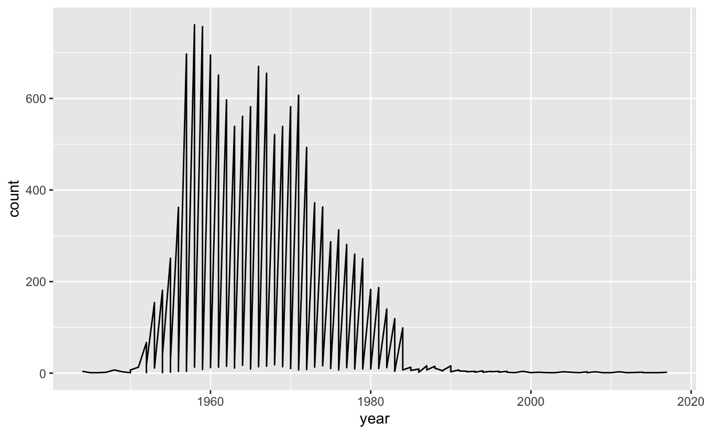
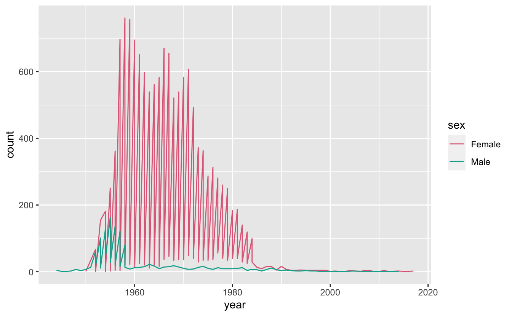
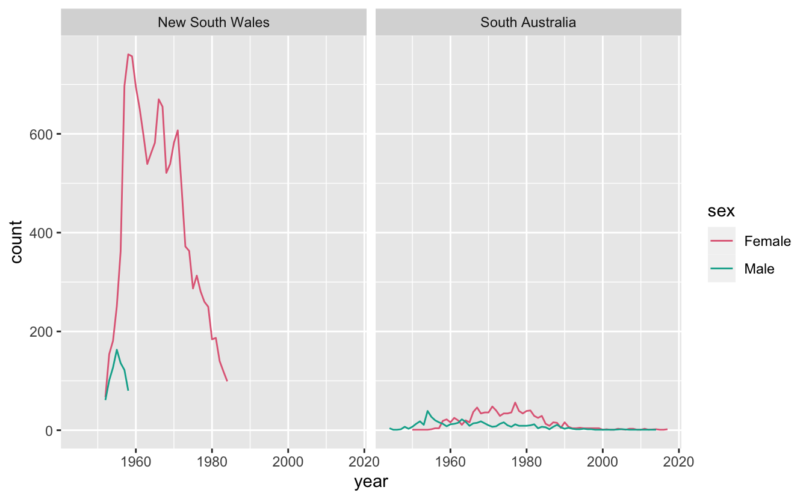

Sometimes you come across a plot that looks like the following:

And you might think:

> Something does not look right but I have no idea what is going on here

And that's OK.

So, what's the problem with the plot, and how do you solve it?

Well, the problem is we have these "sawtooth" patterns in the data, where the data goes up and down.

Typically, we can solve this problem by including some grouping characteristic into the data visualisation.

It is also worth noting that this doesn't always mean a plot is bad - this could actually be the exact type of plot that you might expect to see (for example in a time series with very high periodicity, perhaps).

But, in our case, we need to understand what our data is first, and what we expect. We are looking at [ozbabynames](https://github.com/ropenscilabs/ozbabynames) - the names at birth of people in Australia. So we are plotting the number of names of a person at birth for each year. In our example we can look at the occurrences of the name, "Kim", like so:

<pre class='chroma'><code class='language-r' data-lang='r'>ggplot(oz_kim,
       aes(x = year,
           y = count)) + 
  geom_line()
</code></pre>

We don't expect the name "kim" to suddenly crash down each year - especially since this looks to be an exact vertical drop.

So what do we do?

This vis problem often means there is some grouping characteristic missing from the graphic. For example, in this case, "sex" is not shown in the data. In showing it, we get:

<pre class='chroma'><code class='language-r' data-lang='r'><a href='https://rdrr.io/r/base/library.html'>library</a>(<a href='http://colorspace.R-Forge.R-project.org'>colorspace</a>)
  ggplot(oz_kim,
         aes(x = year,
             y = count,
             colour = sex)) + 
  geom_line() +
  <a href='http://colorspace.R-Forge.R-project.org//reference/scale_colour_discrete_qualitative.html'>scale_colour_discrete_qualitative</a>()
</code></pre>

So we see that there is still some sawtooth patterns going on. Let's look at the data to see if there are other variables we are missing:

<pre class='chroma'><code class='language-r' data-lang='r'>oz_kim
#&gt; # A tibble: 164 x 5
#&gt;    name  sex     year count state          
#&gt;    &lt;chr&gt; &lt;chr&gt;  &lt;int&gt; &lt;int&gt; &lt;chr&gt;          
#&gt;  1 Kim   Female  2017     2 South Australia
#&gt;  2 Kim   Female  2016     1 South Australia
#&gt;  3 Kim   Female  2015     1 South Australia
#&gt;  4 Kim   Female  2014     2 South Australia
#&gt;  5 Kim   Male    2014     1 South Australia
#&gt;  6 Kim   Female  2012     1 South Australia
#&gt;  7 Kim   Female  2011     3 South Australia
#&gt;  8 Kim   Female  2010     1 South Australia
#&gt;  9 Kim   Female  2009     1 South Australia
#&gt; 10 Kim   Female  2008     3 South Australia
#&gt; # … with 154 more rows</code></pre>

Aha! We can see that there is another grouping characteristic going on: State.

<pre class='chroma'><code class='language-r' data-lang='r'>ggplot(oz_kim,
       aes(x = year,
           y = count,
           colour = sex)) + 
  geom_line() + 
  facet_wrap(~state) +
  <a href='http://colorspace.R-Forge.R-project.org//reference/scale_colour_discrete_qualitative.html'>scale_colour_discrete_qualitative</a>()
</code></pre>

So, **how to remove sawtooth patterns in a plot?**

1.  Understand what sort of graphic you are expecting
2.  Explore and potentially include all grouping features into the graphic

