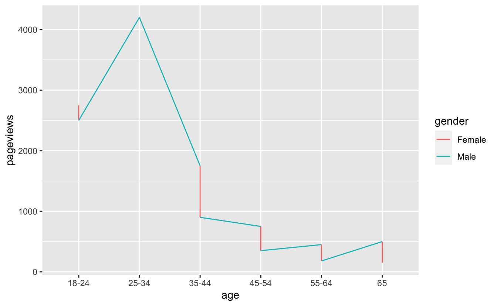

Sometimes you come across a plot that looks like the following:

And you might think:

> Something does not look right but I have no idea what is going on here

And that's OK.

So, what's the problem with the plot, and how do you solve it?

Well, the problem is we have these "sawtooth" patterns in the data, where the data goes up and down.

Typically, we can solve this problem by including some grouping characteristic into the data visualisation.

It is also worth noting that this doesn't always mean a plot is bad - this could actually be the exact type of plot that you might expect to see (for example in a time series with very high periodicity, perhaps).

But, in our case, we need to understand what our data is first, and what we expect. We are looking at [ozbabynames](https://github.com/ropenscilabs/ozbabynames) - the names at birth of people in Australia. So we are plotting the number of names of a person at birth for each year. In our example we can look at the occurrences of the name, "Kim", like so:

<pre class='chroma'><code class='language-r' data-lang='r'>ggplot(oz_kim,
       aes(x = year,
           y = count)) + 
  geom_line()
</code></pre>

We don't expect the name "kim" to suddenly crash down each year - especially since this looks to be an exact vertical drop.

So what do we do?

This vis problem often means there is some grouping characteristic missing from the graphic. For example, in this case, "sex" is not shown in the data. In showing it, we get:

<pre class='chroma'><code class='language-r' data-lang='r'><a href='https://rdrr.io/r/base/library.html'>library</a>(<a href='http://colorspace.R-Forge.R-project.org'>colorspace</a>)
  ggplot(oz_kim,
         aes(x = year,
             y = count,
             colour = sex)) + 
  geom_line() +
  <a href='http://colorspace.R-Forge.R-project.org//reference/scale_colour_discrete_qualitative.html'>scale_colour_discrete_qualitative</a>()
</code></pre>

So we see that there is still some sawtooth patterns going on. Let's look at the data to see if there are other variables we are missing:

<pre class='chroma'><code class='language-r' data-lang='r'>oz_kim
#&gt; # A tibble: 164 x 5
#&gt;    name  sex     year count state          
#&gt;    &lt;chr&gt; &lt;chr&gt;  &lt;int&gt; &lt;int&gt; &lt;chr&gt;          
#&gt;  1 Kim   Female  2017     2 South Australia
#&gt;  2 Kim   Female  2016     1 South Australia
#&gt;  3 Kim   Female  2015     1 South Australia
#&gt;  4 Kim   Female  2014     2 South Australia
#&gt;  5 Kim   Male    2014     1 South Australia
#&gt;  6 Kim   Female  2012     1 South Australia
#&gt;  7 Kim   Female  2011     3 South Australia
#&gt;  8 Kim   Female  2010     1 South Australia
#&gt;  9 Kim   Female  2009     1 South Australia
#&gt; 10 Kim   Female  2008     3 South Australia
#&gt; # … with 154 more rows</code></pre>

Aha! We can see that there is another grouping characteristic going on - State. Let's facet the graph for each state, giving us:

<pre class='chroma'><code class='language-r' data-lang='r'>ggplot(oz_kim,
       aes(x = year,
           y = count,
           colour = sex)) + 
  geom_line() + 
  facet_wrap(~state) +
  <a href='http://colorspace.R-Forge.R-project.org//reference/scale_colour_discrete_qualitative.html'>scale_colour_discrete_qualitative</a>()
</code></pre>

Setting group correctly (Addition as of 2020/06/22)
---------------------------------------------------

[Emma Vitz](https://twitter.com/EmmaVitz) had an interesting example of another sawtooth type problem shared on twitter:



The solution was discussed in the thread, but let's unpack this. Let's first recreate the data used (taken by eyeballing the graphic):

<pre class='chroma'><code class='language-r' data-lang='r'>
pageviews &lt;- tibble(
  age = <a href='https://rdrr.io/r/base/factor.html'>factor</a>(<a href='https://rdrr.io/r/base/rep.html'>rep</a>(<a href='https://rdrr.io/r/base/c.html'>c</a>("18-24",
                     "25-34",
                     "35-44",
                     "45-54",
                     "55-64",
                     "65"), 2)),
  gender = <a href='https://rdrr.io/r/base/factor.html'>factor</a>(x = <a href='https://rdrr.io/r/base/c.html'>c</a>(<a href='https://rdrr.io/r/base/rep.html'>rep</a>("Female", 6),
                        <a href='https://rdrr.io/r/base/rep.html'>rep</a>("Male", 6))),
  pageviews = <a href='https://rdrr.io/r/base/c.html'>c</a>(2750, 4200, 1750, 750, 450, 500,
                2500, 4200, 900, 350, 180, 150)
)

pageviews
#&gt; # A tibble: 12 x 3
#&gt;    age   gender pageviews
#&gt;    &lt;fct&gt; &lt;fct&gt;      &lt;dbl&gt;
#&gt;  1 18-24 Female      2750
#&gt;  2 25-34 Female      4200
#&gt;  3 35-44 Female      1750
#&gt;  4 45-54 Female       750
#&gt;  5 55-64 Female       450
#&gt;  6 65    Female       500
#&gt;  7 18-24 Male        2500
#&gt;  8 25-34 Male        4200
#&gt;  9 35-44 Male         900
#&gt; 10 45-54 Male         350
#&gt; 11 55-64 Male         180
#&gt; 12 65    Male         150</code></pre>

So here is the warning given for the first of Emma's plots:

<pre class='chroma'><code class='language-r' data-lang='r'>ggplot(pageviews,
       aes(x = age,
           y = pageviews,
           colour = gender)) + 
  geom_line()
#&gt; geom_path: Each group consists of only one observation. Do you need to adjust
#&gt; the group aesthetic?
</code></pre>

What to do? One way to get the lines to appear is to set `group = 1`

<pre class='chroma'><code class='language-r' data-lang='r'>ggplot(pageviews,
       aes(x = age,
           y = pageviews,
           colour = gender,
           group = 1)) + 
  geom_line()
</code></pre>

But then we get this! That isn't ideal. The solution proposed on twitter was to set `group = gender` as well as `colour = gender`.

<pre class='chroma'><code class='language-r' data-lang='r'>ggplot(pageviews,
       aes(x = age,
           y = pageviews,
           colour = gender,
           group = gender)) + 
  geom_line()
</code></pre>

The answer was provided by [Peter Green](https://twitter.com/pitakakariki), who said:

> Looks like since x=age is a factor, ggplot is "helpfully" making age the group instead of gender? Which would explain why fixing it with the explicit group=gender works?

My take on this is that since there are two factors here, it causes `ggplot` some confusion. The default behaviour of `ggplot` when setting `colour` is to use the same grouping, but in this case, as there are two factors, it doesn't know what to pick. By setting the `group` explicitly, you get the right plot.

Wrapping Up
===========

So, **how to remove sawtooth patterns in a plot?**

1.  Understand what sort of graphic you are expecting
2.  Explore and potentially include all grouping features into the graphic
3.  Ensure that if you have factors in some of your aesthetics (`x`, `y`, `colour`, `size`), that you specify `group` to the right variable in your dataset.

