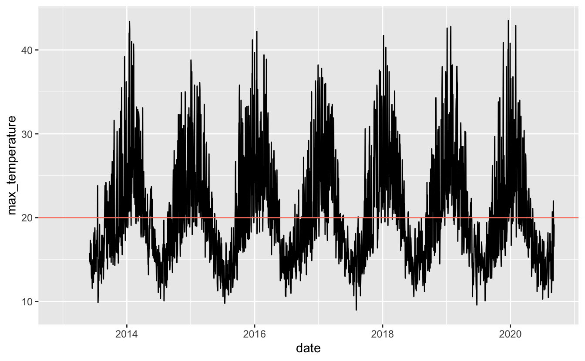
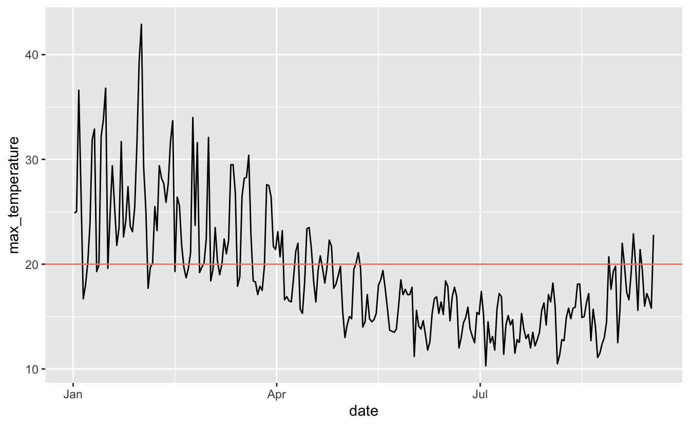
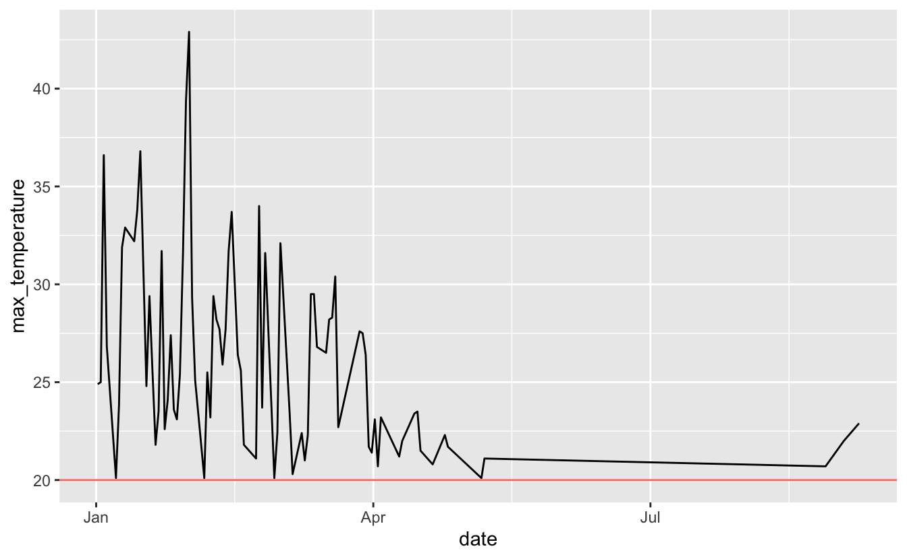
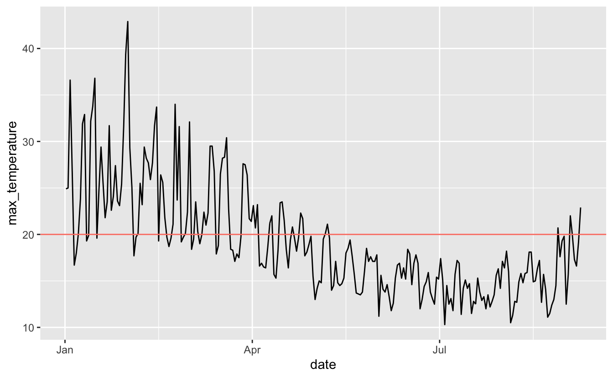

It's starting to get warmer here in Melbourne. Today was the first day of over 20 degrees Celsius we've had in...well how long? It feels like a while. We hit this middle part of the year and we don't get over 20C for a while. But I'd like to know the last time it got over 20 degrees Celsius. How do we do that? With the [`bomrang`](https://github.com/ropensci/bomrang) package by [Adam Sparks](https://github.com/adamhsparks)!

First, you'll need the latest version of `bomrang` - you should be on version 0.7.0.9000 or greater:

<pre class='chroma'><code class='language-r' data-lang='r'># remotes::install_github("ropensci/bomrang")
<a href='https://rdrr.io/r/base/message.html'>suppressPackageStartupMessages</a>(<a href='https://rdrr.io/r/base/library.html'>library</a>(<a href='https://docs.ropensci.org/bomrang'>bomrang</a>))
<a href='https://rdrr.io/r/utils/packageDescription.html'>packageVersion</a>("bomrang")

#&gt; [1] '0.7.0.9000'
</code></pre>

Next, we sweep for stations nearby Melbourne. I know there are packages (like [geocoder]()) that help get the coordinates, but when I just need one coordinate I usually just copy it from google maps.

<pre class='chroma'><code class='language-r' data-lang='r'>melb_stations &lt;- <a href='https://docs.ropensci.org/bomrang/reference/sweep_for_stations.html'>sweep_for_stations</a>(latlon = <a href='https://rdrr.io/r/base/c.html'>c</a>(-37.800372,
                                                        144.996162))

melb_stations

#&gt;        site dist                          name start  end      lat      lon
#&gt;   1: 086338   86      MELBOURNE (OLYMPIC PARK)  2013 2020 -37.8255 144.9816
#&gt;   2: 086220   86       ST KILDA HARBOUR - RMYS  2006 2020 -37.8642 144.9639
#&gt;   3: 086351   86 BUNDOORA (LATROBE UNIVERSITY)  1979 2020 -37.7163 145.0453
#&gt;   4: 086068   86                      VIEWBANK  1999 2020 -37.7408 145.0972
#&gt;   5: 086038   86              ESSENDON AIRPORT  1929 2020 -37.7276 144.9066
#&gt;  ---                                                                       
#&gt; 883: 300039  300                            G3  1999 2020 -70.8919  69.8725
#&gt; 884: 200284  200          COCOS ISLAND AIRPORT  1901 2020 -12.1892  96.8344
#&gt; 885: 300028  300       HEARD ISLAND (THE SPIT)  1992 2020 -53.1082  73.7225
#&gt; 886: 300005  300     HEARD ISLAND (ATLAS COVE)  1948 2020 -53.0190  73.3918
#&gt; 887: 300001  300                        MAWSON  1954 2020 -67.6017  62.8753
#&gt;      state elev bar_ht   wmo state_code
#&gt;   1:   VIC  7.5    7.5 95936          V
#&gt;   2:   VIC  6.4     NA 95864          V
#&gt;   3:   VIC 83.0     NA 95873          V
#&gt;   4:   VIC 66.1   66.4 95874          V
#&gt;   5:   VIC 78.4   78.8 95866          V
#&gt;  ---                                   
#&gt; 883:   ANT 84.0   84.0 89767          T
#&gt; 884:    WA  3.0    4.0 96996          W
#&gt; 885:   ANT 12.0   12.5 94997          T
#&gt; 886:   ANT  3.0    3.5 95997          T
#&gt; 887:   ANT  9.9   16.0 89564          T
#&gt;                                                         url    distance
#&gt;   1: http://www.bom.gov.au/fwo/IDV60801/IDV60801.95936.json    3.073013
#&gt;   2: http://www.bom.gov.au/fwo/IDV60801/IDV60801.95864.json    7.642001
#&gt;   3: http://www.bom.gov.au/fwo/IDV60801/IDV60801.95873.json   10.298180
#&gt;   4: http://www.bom.gov.au/fwo/IDV60801/IDV60801.95874.json   11.079185
#&gt;   5: http://www.bom.gov.au/fwo/IDV60801/IDV60801.95866.json   11.289837
#&gt;  ---                                                                   
#&gt; 883: http://www.bom.gov.au/fwo/IDT60803/IDT60803.89767.json 5536.751202
#&gt; 884: http://www.bom.gov.au/fwo/IDW60801/IDW60801.96996.json 5544.800897
#&gt; 885: http://www.bom.gov.au/fwo/IDT60803/IDT60803.94997.json 5562.364714
#&gt; 886: http://www.bom.gov.au/fwo/IDT60803/IDT60803.95997.json 5586.092643
#&gt; 887: http://www.bom.gov.au/fwo/IDT60803/IDT60803.89564.json 5844.280345
</code></pre>

This then returns information on the number of stations in Melbourne and their location.

We take the first station and get the max temperature.

<pre class='chroma'><code class='language-r' data-lang='r'>melbourne_weather &lt;- <a href='https://docs.ropensci.org/bomrang/reference/get_historical_weather.html'>get_historical</a>(stationid = melb_stations$site[1],
                                    type = "max")

#&gt; Warning: The list of available stations for `type = rain` is currently empty.
#&gt; This is likely a temporary error in the Bureau of Meteorology's
#&gt; database and may cause requests for rain station data to fail.

#&gt; Data saved as /var/folders/mw/gj7418356js6s29x7wn8crfmljy4wh/T//RtmpfgXQLS/IDCJAC0010_086338_1800_Data.csv

melbourne_weather

#&gt;   --- Australian Bureau of Meteorology (BOM) Data Resource ---
#&gt;   (Original Request Parameters)
#&gt;   Station:    MELBOURNE (OLYMPIC PARK) [086338] 
#&gt;   Location:    lat: -37.8255, lon: 144.9816
#&gt;   Measurement / Origin:  Max / Historical
#&gt;   Timespan:    2013-06-01 -- 2020-09-01 [7.3 years]
#&gt;   ---------------------------------------------------------------  
#&gt;       product_code station_number year month day max_temperature accum_days_max
#&gt;    1:   IDCJAC0010          86338 2013     1   1              NA             NA
#&gt;    2:   IDCJAC0010          86338 2013     1   2              NA             NA
#&gt;    3:   IDCJAC0010          86338 2013     1   3              NA             NA
#&gt;    4:   IDCJAC0010          86338 2013     1   4              NA             NA
#&gt;    5:   IDCJAC0010          86338 2013     1   5              NA             NA
#&gt;   ---                                                                          
#&gt; 2812:   IDCJAC0010          86338 2020     9  12            16.0              1
#&gt; 2813:   IDCJAC0010          86338 2020     9  13            17.2              1
#&gt; 2814:   IDCJAC0010          86338 2020     9  14            16.6              1
#&gt; 2815:   IDCJAC0010          86338 2020     9  15            15.8              1
#&gt; 2816:   IDCJAC0010          86338 2020     9  16            22.8              1
#&gt;       quality
#&gt;    1:        
#&gt;    2:        
#&gt;    3:        
#&gt;    4:        
#&gt;    5:        
#&gt;   ---        
#&gt; 2812:       N
#&gt; 2813:       N
#&gt; 2814:       N
#&gt; 2815:       N
#&gt; 2816:       N
</code></pre>

We can convert this into a date format with one of my favourite R functions of all time, [`ISOdate()`](https://rdrr.io/r/base/ISOdatetime.html) (also [`ISOdatetime()`](https://rdrr.io/r/base/ISOdatetime.html) is great):

<pre class='chroma'><code class='language-r' data-lang='r'>melb_weather_date &lt;- melbourne_weather %&gt;% 
  <a href='https://docs.ropensci.org/bomrang/reference/mutate.html'>mutate</a>(date = <a href='https://rdrr.io/r/base/ISOdatetime.html'>ISOdate</a>(year, month, day))

melb_weather_date

#&gt;   --- Australian Bureau of Meteorology (BOM) Data Resource ---
#&gt;   (Original Request Parameters)
#&gt;   Station:    MELBOURNE (OLYMPIC PARK) [086338] 
#&gt;   Location:    lat: -37.8255, lon: 144.9816
#&gt;   Measurement / Origin:  Max / Historical
#&gt;   Timespan:    2013-06-01 -- 2020-09-01 [7.3 years]
#&gt;   ---------------------------------------------------------------  
#&gt;       product_code station_number year month day max_temperature accum_days_max
#&gt;    1:   IDCJAC0010          86338 2013     1   1              NA             NA
#&gt;    2:   IDCJAC0010          86338 2013     1   2              NA             NA
#&gt;    3:   IDCJAC0010          86338 2013     1   3              NA             NA
#&gt;    4:   IDCJAC0010          86338 2013     1   4              NA             NA
#&gt;    5:   IDCJAC0010          86338 2013     1   5              NA             NA
#&gt;   ---                                                                          
#&gt; 2812:   IDCJAC0010          86338 2020     9  12            16.0              1
#&gt; 2813:   IDCJAC0010          86338 2020     9  13            17.2              1
#&gt; 2814:   IDCJAC0010          86338 2020     9  14            16.6              1
#&gt; 2815:   IDCJAC0010          86338 2020     9  15            15.8              1
#&gt; 2816:   IDCJAC0010          86338 2020     9  16            22.8              1
#&gt;       quality                date
#&gt;    1:         2013-01-01 12:00:00
#&gt;    2:         2013-01-02 12:00:00
#&gt;    3:         2013-01-03 12:00:00
#&gt;    4:         2013-01-04 12:00:00
#&gt;    5:         2013-01-05 12:00:00
#&gt;   ---                            
#&gt; 2812:       N 2020-09-12 12:00:00
#&gt; 2813:       N 2020-09-13 12:00:00
#&gt; 2814:       N 2020-09-14 12:00:00
#&gt; 2815:       N 2020-09-15 12:00:00
#&gt; 2816:       N 2020-09-16 12:00:00
</code></pre>

Now we can look at when it last hit 20C for the past little while:

<pre class='chroma'><code class='language-r' data-lang='r'><a href='https://rdrr.io/r/base/message.html'>suppressPackageStartupMessages</a>(<a href='https://rdrr.io/r/base/library.html'>library</a>(<a href='http://ggplot2.tidyverse.org'>ggplot2</a>))

<a href='https://ggplot2.tidyverse.org/reference/ggplot.html'>ggplot</a>(melb_weather_date,
       <a href='https://ggplot2.tidyverse.org/reference/aes.html'>aes</a>(x = date,
           y = max_temperature)) + 
  <a href='https://ggplot2.tidyverse.org/reference/geom_path.html'>geom_line</a>() + 
  <a href='https://ggplot2.tidyverse.org/reference/geom_abline.html'>geom_hline</a>(yintercept = 20, colour = "salmon")

#&gt; Warning: Removed 151 row(s) containing missing values (geom_path).

</code></pre>

Let's just focus on 2020:

<pre class='chroma'><code class='language-r' data-lang='r'><a href='https://rdrr.io/r/base/message.html'>suppressPackageStartupMessages</a>(<a href='https://rdrr.io/r/base/library.html'>library</a>(<a href='https://dplyr.tidyverse.org'>dplyr</a>))
melb_weather_2020 &lt;- melb_weather_date %&gt;% 
  <a href='https://dplyr.tidyverse.org/reference/filter.html'>filter</a>(year == 2020)

melb_2020_plot &lt;- 
<a href='https://ggplot2.tidyverse.org/reference/ggplot.html'>ggplot</a>(melb_weather_2020,
       <a href='https://ggplot2.tidyverse.org/reference/aes.html'>aes</a>(x = date,
           y = max_temperature)) + 
  <a href='https://ggplot2.tidyverse.org/reference/geom_path.html'>geom_line</a>() + 
  <a href='https://ggplot2.tidyverse.org/reference/geom_abline.html'>geom_hline</a>(yintercept = 20, colour = "salmon")

melb_2020_plot

</code></pre>

So now rather than squinting at a graph, I want to return the last times it was over 20C.

I was tempted to try something like this:

<pre class='chroma'><code class='language-r' data-lang='r'>melb_weather_2020 %&gt;% 
  <a href='https://dplyr.tidyverse.org/reference/filter.html'>filter</a>(max_temperature &gt; 20) %&gt;% 
  <a href='https://ggplot2.tidyverse.org/reference/ggplot.html'>ggplot</a>(<a href='https://ggplot2.tidyverse.org/reference/aes.html'>aes</a>(x = date,
           y = max_temperature)) + 
  <a href='https://ggplot2.tidyverse.org/reference/geom_path.html'>geom_line</a>() + 
  <a href='https://ggplot2.tidyverse.org/reference/geom_abline.html'>geom_hline</a>(yintercept = 20, colour = "salmon")

</code></pre>

But this doesn't realllly help me. We just see a bit gap. I still need to squint. Let's take a look at the plot again:

<pre class='chroma'><code class='language-r' data-lang='r'>melb_2020_plot

</code></pre>

I want to be able to identify when it stopped being over 20, and then when it started again.

Buckle up, we're going into the realm of RLE - Run Length Encodings.

[Earo Wang](https://github.com/earowang) first showed this to me I first arrived at Monash, (where it was used for [`miss_var_run`](http://naniar.njtierney.com/reference/miss_var_run.html)).

`rle` counts the length of a "run" of a vector. Here's an example to explain from the help file:

<pre class='chroma'><code class='language-r' data-lang='r'>z &lt;- <a href='https://rdrr.io/r/base/c.html'>c</a>(TRUE, TRUE, FALSE, FALSE, TRUE, FALSE, TRUE, TRUE, TRUE)
<a href='https://rdrr.io/r/base/rle.html'>rle</a>(z)

#&gt; Run Length Encoding
#&gt;   lengths: int [1:5] 2 2 1 1 3
#&gt;   values : logi [1:5] TRUE FALSE TRUE FALSE TRUE
</code></pre>

So this tells us that we have 2 runs of the same thing, then 2 more, then 1, 1, and 3. Another way I think about it is is like a simplified/summary of storing a number. Here's another brief example to help get this solidified:

<pre class='chroma'><code class='language-r' data-lang='r'><a href='https://rdrr.io/r/base/rle.html'>rle</a>(1:10)

#&gt; Run Length Encoding
#&gt;   lengths: int [1:10] 1 1 1 1 1 1 1 1 1 1
#&gt;   values : int [1:10] 1 2 3 4 5 6 7 8 9 10

<a href='https://rdrr.io/r/base/rle.html'>rle</a>(<a href='https://rdrr.io/r/base/c.html'>c</a>(1,2,2,3,3,3))

#&gt; Run Length Encoding
#&gt;   lengths: int [1:3] 1 2 3
#&gt;   values : num [1:3] 1 2 3

<a href='https://rdrr.io/r/base/rle.html'>rle</a>(<a href='https://rdrr.io/r/base/c.html'>c</a>(1,1,1,2,2,3))

#&gt; Run Length Encoding
#&gt;   lengths: int [1:3] 3 2 1
#&gt;   values : num [1:3] 1 2 3
</code></pre>

So, we can use `rle` to calculate the run of the times that temperature was below 20. We can calculate a new column that is TRUE when temperature is below, and FALSE otherwise:

<pre class='chroma'><code class='language-r' data-lang='r'>melb_weather_2020 %&gt;% 
  <a href='https://dplyr.tidyverse.org/reference/mutate.html'>mutate</a>(below_20 = max_temperature &lt; 20) 

#&gt;   --- Australian Bureau of Meteorology (BOM) Data Resource ---
#&gt;   (Original Request Parameters)
#&gt;   Station:    MELBOURNE (OLYMPIC PARK) [086338] 
#&gt;   Location:    lat: -37.8255, lon: 144.9816
#&gt;   Measurement / Origin:  Max / Historical
#&gt;   Timespan:    2013-06-01 -- 2020-09-01 [7.3 years]
#&gt;   ---------------------------------------------------------------  
#&gt;      product_code station_number year month day max_temperature accum_days_max
#&gt;   1:   IDCJAC0010          86338 2020     1   1            24.9              1
#&gt;   2:   IDCJAC0010          86338 2020     1   2            25.0              1
#&gt;   3:   IDCJAC0010          86338 2020     1   3            36.6              1
#&gt;   4:   IDCJAC0010          86338 2020     1   4            26.8              1
#&gt;   5:   IDCJAC0010          86338 2020     1   5            16.7              1
#&gt;  ---                                                                          
#&gt; 256:   IDCJAC0010          86338 2020     9  12            16.0              1
#&gt; 257:   IDCJAC0010          86338 2020     9  13            17.2              1
#&gt; 258:   IDCJAC0010          86338 2020     9  14            16.6              1
#&gt; 259:   IDCJAC0010          86338 2020     9  15            15.8              1
#&gt; 260:   IDCJAC0010          86338 2020     9  16            22.8              1
#&gt;      quality                date below_20
#&gt;   1:       Y 2020-01-01 12:00:00    FALSE
#&gt;   2:       Y 2020-01-02 12:00:00    FALSE
#&gt;   3:       Y 2020-01-03 12:00:00    FALSE
#&gt;   4:       Y 2020-01-04 12:00:00    FALSE
#&gt;   5:       Y 2020-01-05 12:00:00     TRUE
#&gt;  ---                                     
#&gt; 256:       N 2020-09-12 12:00:00     TRUE
#&gt; 257:       N 2020-09-13 12:00:00     TRUE
#&gt; 258:       N 2020-09-14 12:00:00     TRUE
#&gt; 259:       N 2020-09-15 12:00:00     TRUE
#&gt; 260:       N 2020-09-16 12:00:00    FALSE
</code></pre>

then `pull` it out

<pre class='chroma'><code class='language-r' data-lang='r'>melb_weather_2020 %&gt;% 
  <a href='https://dplyr.tidyverse.org/reference/mutate.html'>mutate</a>(below_20 = max_temperature &lt; 20) %&gt;% 
  <a href='https://dplyr.tidyverse.org/reference/pull.html'>pull</a>(below_20) 

#&gt;   [1] FALSE FALSE FALSE FALSE  TRUE  TRUE FALSE FALSE FALSE FALSE  TRUE  TRUE
#&gt;  [13] FALSE FALSE FALSE  TRUE FALSE FALSE FALSE FALSE FALSE FALSE FALSE FALSE
#&gt;  [25] FALSE FALSE FALSE FALSE FALSE FALSE FALSE FALSE FALSE  TRUE  TRUE FALSE
#&gt;  [37] FALSE FALSE FALSE FALSE FALSE FALSE FALSE FALSE FALSE  TRUE FALSE FALSE
#&gt;  [49] FALSE  TRUE  TRUE  TRUE FALSE FALSE FALSE FALSE  TRUE  TRUE FALSE FALSE
#&gt;  [61] FALSE  TRUE  TRUE FALSE FALSE  TRUE FALSE FALSE FALSE FALSE FALSE FALSE
#&gt;  [73] FALSE  TRUE  TRUE FALSE FALSE FALSE FALSE FALSE  TRUE  TRUE  TRUE  TRUE
#&gt;  [85]  TRUE  TRUE FALSE FALSE FALSE FALSE FALSE FALSE FALSE FALSE  TRUE  TRUE
#&gt;  [97]  TRUE  TRUE  TRUE FALSE FALSE  TRUE  TRUE  TRUE FALSE FALSE FALSE  TRUE
#&gt; [109]  TRUE  TRUE FALSE  TRUE  TRUE  TRUE FALSE FALSE  TRUE  TRUE  TRUE  TRUE
#&gt; [121]  TRUE  TRUE  TRUE  TRUE  TRUE  TRUE FALSE FALSE  TRUE  TRUE  TRUE  TRUE
#&gt; [133]  TRUE  TRUE  TRUE  TRUE  TRUE  TRUE  TRUE  TRUE  TRUE  TRUE  TRUE  TRUE
#&gt; [145]  TRUE  TRUE  TRUE  TRUE  TRUE  TRUE  TRUE  TRUE  TRUE  TRUE  TRUE  TRUE
#&gt; [157]  TRUE  TRUE  TRUE  TRUE  TRUE  TRUE  TRUE  TRUE  TRUE  TRUE  TRUE  TRUE
#&gt; [169]  TRUE  TRUE  TRUE  TRUE  TRUE  TRUE  TRUE  TRUE  TRUE  TRUE  TRUE  TRUE
#&gt; [181]  TRUE  TRUE  TRUE  TRUE  TRUE  TRUE  TRUE  TRUE  TRUE  TRUE  TRUE  TRUE
#&gt; [193]  TRUE  TRUE  TRUE  TRUE  TRUE  TRUE  TRUE  TRUE  TRUE  TRUE  TRUE  TRUE
#&gt; [205]  TRUE  TRUE  TRUE  TRUE  TRUE  TRUE  TRUE  TRUE  TRUE  TRUE  TRUE  TRUE
#&gt; [217]  TRUE  TRUE  TRUE  TRUE  TRUE  TRUE  TRUE  TRUE  TRUE  TRUE  TRUE  TRUE
#&gt; [229]  TRUE  TRUE  TRUE  TRUE  TRUE  TRUE  TRUE  TRUE  TRUE  TRUE  TRUE FALSE
#&gt; [241]  TRUE  TRUE  TRUE  TRUE  TRUE FALSE  TRUE  TRUE  TRUE  TRUE FALSE  TRUE
#&gt; [253]  TRUE FALSE  TRUE  TRUE  TRUE  TRUE  TRUE FALSE
</code></pre>

And then use `rle` on the vector of TRUE/FALSE

<pre class='chroma'><code class='language-r' data-lang='r'>melb_rle &lt;- melb_weather_2020 %&gt;% 
  <a href='https://dplyr.tidyverse.org/reference/mutate.html'>mutate</a>(below_20 = max_temperature &lt; 20) %&gt;% 
  <a href='https://dplyr.tidyverse.org/reference/pull.html'>pull</a>(below_20) %&gt;% 
  <a href='https://rdrr.io/r/base/rle.html'>rle</a>()

melb_rle

#&gt; Run Length Encoding
#&gt;   lengths: int [1:43] 4 2 4 2 3 1 17 2 10 1 ...
#&gt;   values : logi [1:43] FALSE TRUE FALSE TRUE FALSE TRUE ...
</code></pre>

This provides two named vectors, `lengths` and `values`. Lengths is the number of times a corresponding value repeats.

We can then identify what the largest gap was by taking the max of `lengths`:

<pre class='chroma'><code class='language-r' data-lang='r'># what was the largest gap?
what_gap &lt;- <a href='https://rdrr.io/r/base/Extremes.html'>max</a>(melb_rle$lengths)

what_gap

#&gt; [1] 111
</code></pre>

Neat! So we now know that the period between the start and the end spanned 111 days.

So, *when* was that?

This part involves a few steps, let me break it down.

We want to find that date it was last over 20C - which is the day before it had that 111 day stretch. We can get this by summing up all the numbers of run lengths before the 111 day stretch.

First we calculate which position has the max with `which.max`. I like to print the vector with it for my own sanity's sake:

<pre class='chroma'><code class='language-r' data-lang='r'><a href='https://rdrr.io/r/base/which.min.html'>which.max</a>(melb_rle$lengths)

#&gt; [1] 34

melb_rle$lengths

#&gt;  [1]   4   2   4   2   3   1  17   2  10   1   3   3   4   2   3   2   2   1   7
#&gt; [20]   2   5   6   8   5   2   3   3   3   1   3   2  10   2 111   1   5   1   4
#&gt; [39]   1   2   1   5   1
</code></pre>

So it is the 34th one.

But we want the *second* last one - the day before 111, so we subtract 1.

<pre class='chroma'><code class='language-r' data-lang='r'>last_day_position &lt;- <a href='https://rdrr.io/r/base/which.min.html'>which.max</a>(melb_rle$lengths) - 1
last_day_position

#&gt; [1] 33
</code></pre>

We then want 1 through to that number so we can get all the numbers out, using `seq_len`:

<pre class='chroma'><code class='language-r' data-lang='r'>seq_last_day_position &lt;- <a href='https://rdrr.io/r/base/seq.html'>seq_len</a>(last_day_position)
seq_last_day_position

#&gt;  [1]  1  2  3  4  5  6  7  8  9 10 11 12 13 14 15 16 17 18 19 20 21 22 23 24 25
#&gt; [26] 26 27 28 29 30 31 32 33
</code></pre>

We then subset this lengths like so, and sum them up to get the number of days **before** it went below 20C:

<pre class='chroma'><code class='language-r' data-lang='r'>melb_rle$lengths[seq_last_day_position]

#&gt;  [1]  4  2  4  2  3  1 17  2 10  1  3  3  4  2  3  2  2  1  7  2  5  6  8  5  2
#&gt; [26]  3  3  3  1  3  2 10  2

n_days_before_20c &lt;- <a href='https://rdrr.io/r/base/sum.html'>sum</a>(melb_rle$lengths[seq_last_day_position])
n_days_before_20c

#&gt; [1] 128
</code></pre>

Now...what date is that?

We can use `lubridate` to calculate it like so, by saying, the number of days from the start of 2020:

<pre class='chroma'><code class='language-r' data-lang='r'><a href='https://rdrr.io/r/base/library.html'>library</a>(<a href='http://lubridate.tidyverse.org'>lubridate</a>)

#&gt; 
#&gt; Attaching package: 'lubridate'

#&gt; The following objects are masked from 'package:base':
#&gt; 
#&gt;     date, intersect, setdiff, union

# when was that?
last_day_of_20c &lt;- <a href='http://lubridate.tidyverse.org/reference/ymd.html'>ymd</a>("2020-01-01") + <a href='http://lubridate.tidyverse.org/reference/period.html'>days</a>(n_days_before_20c)
last_day_of_20c

#&gt; [1] "2020-05-08"
</code></pre>

Awesome, now when did it finish?

<pre class='chroma'><code class='language-r' data-lang='r'># when did it end?
first_day_of_20c &lt;- last_day_of_20c + <a href='http://lubridate.tidyverse.org/reference/period.html'>days</a>(what_gap)
first_day_of_20c

#&gt; [1] "2020-08-27"
</code></pre>

And just to come full circle, let's check the difference

<pre class='chroma'><code class='language-r' data-lang='r'>first_day_of_20c - last_day_of_20c

#&gt; Time difference of 111 days
</code></pre>

whew! That was a lot of work. I almost forgot what I was trying to answer so let's put this in a header now

When was the last time in 2020 Melbourne was above 20 Celsius?
==============================================================

-   The last day of over 20C was 2020-05-08
-   The first day of over 20C was 2020-08-27
-   Which means we had 111 days where Melbourne was below 20C.

Post Script
===========

In retrospect there is more to add to this plot, and probably other simpler ways to calculate this, I'm keen to hear your thoughts below.

I suspect this sort of function will come in handy in the future as we start to compare COVID19 days, to help us answer: "when was the last day of ... cases".

~~I'm trying to get this blog post out in one sitting so I'll skip over writing a function for this, this time~~ Here is a function and an example below of this, which might be useful:

<pre class='chroma'><code class='language-r' data-lang='r'>n_days_below &lt;- function(x, below){
  rle_below &lt;- <a href='https://rdrr.io/r/base/rle.html'>rle</a>(x &lt; below)
  <a href='https://rdrr.io/r/base/Extremes.html'>max</a>(rle_below$lengths)
}

last_day_below &lt;- function(x, below){
  rle_below &lt;- <a href='https://rdrr.io/r/base/rle.html'>rle</a>(x &lt; below)
  last_day_position &lt;- <a href='https://rdrr.io/r/base/which.min.html'>which.max</a>(rle_below$lengths) - 1
  seq_last_day_position &lt;- <a href='https://rdrr.io/r/base/seq.html'>seq_len</a>(last_day_position)
  n_days_before_below &lt;- <a href='https://rdrr.io/r/base/sum.html'>sum</a>(rle_below$lengths[seq_last_day_position])
  n_days_before_below
}

summary_days_below &lt;- function(x, below, origin){
  
  vec_n_days_below &lt;- n_days_below(x, below)
  vec_last_day_below &lt;- n_days_below(x, below)
  
  last_day_of_below &lt;- lubridate::<a href='http://lubridate.tidyverse.org/reference/ymd.html'>ymd</a>(origin) + lubridate::<a href='http://lubridate.tidyverse.org/reference/period.html'>days</a>(vec_last_day_below)
  first_day_of_below &lt;- last_day_of_below + vec_n_days_below
  
  <a href='https://rdrr.io/r/base/list.html'>list</a>(last_date_below = last_day_of_below,
       first_date_above = first_day_of_below,
       time_between = first_day_of_below - last_day_of_below)
  
}

n_days_below(melb_weather_2020$max_temperature, 20)

#&gt; [1] 111

last_day_below(melb_weather_2020$max_temperature, 20)

#&gt; [1] 128

summary_days_below(melb_weather_2020$max_temperature, 20, "2020-01-01")

#&gt; $last_date_below
#&gt; [1] "2020-04-21"
#&gt; 
#&gt; $first_date_above
#&gt; [1] "2020-08-10"
#&gt; 
#&gt; $time_between
#&gt; Time difference of 111 days
</code></pre>

A side note on the history of `bomrang`
=======================================

I take great joy in seeing `bomrang` and using it. I first posted [an issue](https://github.com/ropensci/unconf16/issues/24) about it in 2016 at the [rOpenSci unconf]() which was held in the USA, but [Miles](https://milesmcbain.xyz/), [Jessie](https://acems.org.au/our-people/jessie-roberts), and I (And also [Alex Simmons](https://scholar.google.com.au/citations?user=plaGy54AAAAJ&hl=en)) participated remotely, with [Bob Rudis](https://rud.is/b/), [Brooke Anderson](https://github.com/geanders), [Maëlle Salmon](https://masalmon.eu/) and a few folks. My memory is a bit hazy because in order to keep pace with the USA we had to stay up all night, and I don't really remember the days before or after it. It got somewhere, but I didn't really know what we were doing, I just thought, "this should be a thing, why can't I get Australian weather data from R?", but had no idea what I was doing with web scraping, and knew nothing about the weather other than what I'd seen on the news and that lightning can indeed strike the same place twice. So I suggested the idea, but everyone else provided the know how. It was hard, because it turned out the BoM weather bureau API didn't exist and required a bit of domain expertise

Next, it was [picked up by much more experienced team](https://github.com/ropensci/auunconf/issues/6) at the first [Australian rOpenSci Ozunconf](https://github.com/ropensci/auunconf) (then, au-unconf), in 2016 in Brisbane. Happily they knew what they were doing, and has experience with Australian weather data. The project grew from there, being headed by [Adam Sparks](https://adamhsparks.com/), initially it was called `bomr`, but [Di Cook](http://dicook.org/) suggested, "bomrang", the name stuck, and Adam submitted it to rOpenSci for package review, and the package became more mature and in it's current state of glory.

