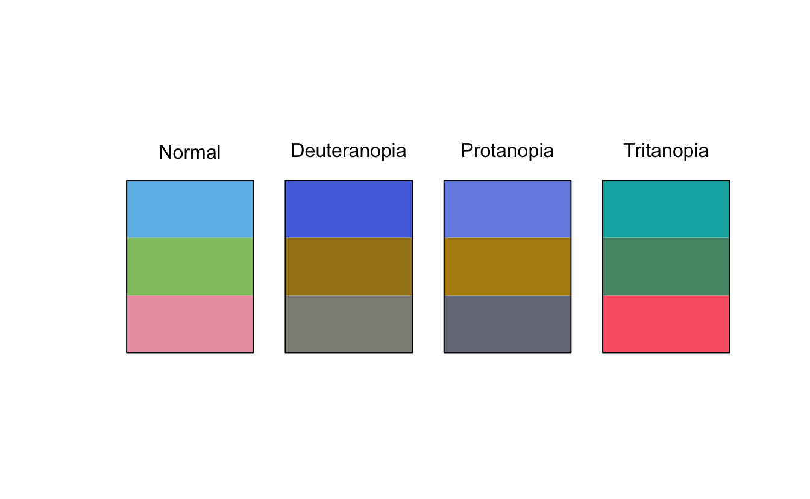
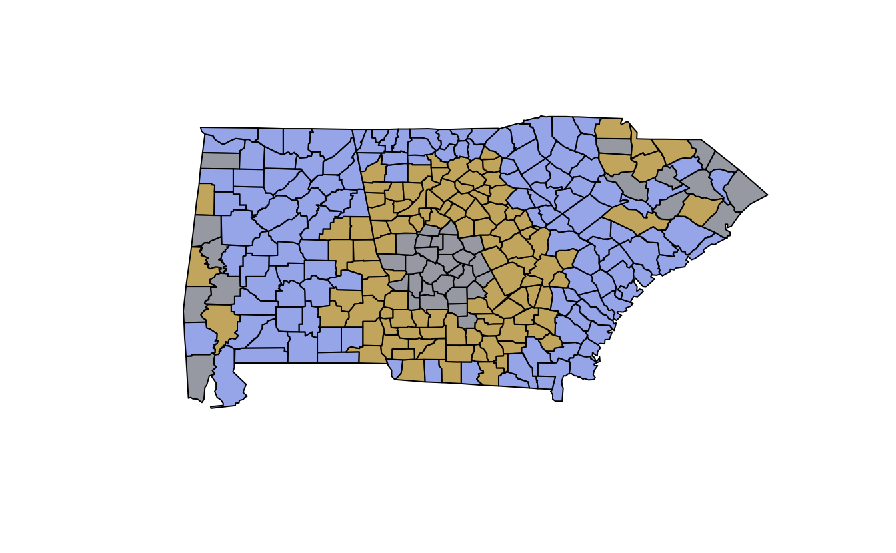
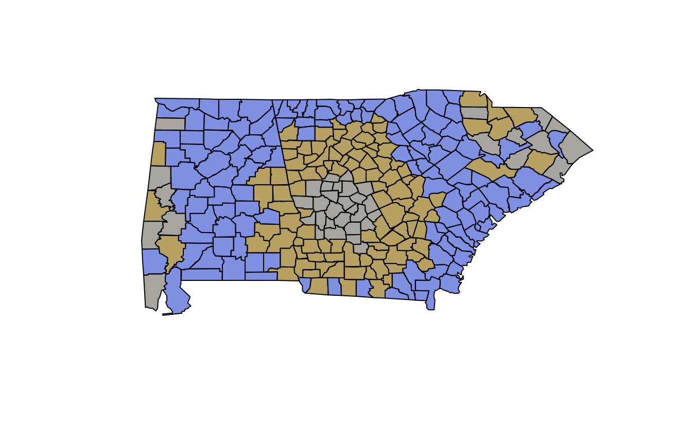

You want to use a nice colour palette but you're not sure if it's colour blind friendly? Here are some quick ways to check this in \#rstats.

Using prismatic
===============

The [prismatic](https://github.com/EmilHvitfeldt/prismatic) package by [Emil Hvitfeldt](https://github.com/EmilHvitfeldt) provides some nice approaches to this with the function [`check_color_blindness()`](https://rdrr.io/pkg/prismatic/man/check_color_blindness.html). You provide a vector of colour codes, and it simulates how they appear for people with different types of colourblindness.

For example, we can check the "Cold" palette from the `qualitative_chl` colour palette from [colorspace](https://colorspace.r-forge.r-project.org/index.html) by [Achim Zeileis](https://eeecon.uibk.ac.at/~zeileis/) and co, like so:

<pre class='chroma'><code class='language-r' data-lang='r'><a href='https://rdrr.io/r/base/library.html'>library</a>(<a href='http://colorspace.R-Forge.R-project.org'>colorspace</a>)
hcl_cold &lt;- 
<a href='http://colorspace.R-Forge.R-project.org//reference/hcl_palettes.html'>qualitative_hcl</a>(n = 3,
                palette = "Cold")

<a href='https://rdrr.io/r/base/library.html'>library</a>(<a href='https://github.com/EmilHvitfeldt/prismatic'>prismatic</a>)
<a href='https://rdrr.io/pkg/prismatic/man/check_color_blindness.html'>check_color_blindness</a>(hcl_cold)

</code></pre>

But what if you want to check a few palettes in quicker succession? I used a function like this to help. First, getting a handle on what qualitative colour palettes are available:

<pre class='chroma'><code class='language-r' data-lang='r'>hcl_pals_q &lt;- <a href='http://colorspace.R-Forge.R-project.org//reference/hcl_palettes.html'>hcl_palettes</a>(type = "qualitative")
hcl_pals_q

#&gt; HCL palettes
#&gt; 
#&gt; Type:  Qualitative 
#&gt; Names: Pastel 1, Dark 2, Dark 3, Set 2, Set 3, Warm, Cold, Harmonic, Dynamic
</code></pre>

Then writing a function to pick three colours. I also needed a specific alpha level of 0.67, but that was just me. I called it `qual_cvd` because it assesses qualitative colour palettes for colour vision deficiency (CVD).

<pre class='chroma'><code class='language-r' data-lang='r'><a href='https://rdrr.io/r/base/library.html'>library</a>(magrittr)
qual_cvd &lt;- function(palette = "Pastel1", alpha = 0.67){
  <a href='http://colorspace.R-Forge.R-project.org//reference/hcl_palettes.html'>qualitative_hcl</a>(n = 3,
                  alpha = alpha,
                  palette = palette)  %&gt;% 
    <a href='https://rdrr.io/pkg/prismatic/man/check_color_blindness.html'>check_color_blindness</a>()
}
</code></pre>

Then we can demonstrate it like so:

<pre class='chroma'><code class='language-r' data-lang='r'>qual_cvd("Dark 2")

</code></pre>

<pre class='chroma'><code class='language-r' data-lang='r'>qual_cvd("Dark 3")

</code></pre>

Looks like Dark 3 is a good one!

Using colorspace
================

The `colorspace` package provides some really nice functions for exploring CVD.

One thing I really love here is the `demoplot` function, which provides an example of what a plot might look like with a given colour palette. For example:

<pre class='chroma'><code class='language-r' data-lang='r'><a href='http://colorspace.R-Forge.R-project.org//reference/hcl_palettes.html'>qualitative_hcl</a>(n = 3,
                alpha = 0.67,
                palette = "Cold") %&gt;% 
  <a href='http://colorspace.R-Forge.R-project.org//reference/demoplot.html'>demoplot</a>(type = "map")

</code></pre>

There are many other plot types you can choose from, ("map", "heatmap", "scatter", "spine", "bar", "pie", "perspective", "mosaic", and "lines").

You can combine your returned colour hex codes with the [`protan()`](http://colorspace.R-Forge.R-project.org//reference/simulate_cvd.html), [`deutan()`](http://colorspace.R-Forge.R-project.org//reference/simulate_cvd.html), and [`tritan()`](http://colorspace.R-Forge.R-project.org//reference/simulate_cvd.html) functions to simulate a particular type of CVD. For example, convert the colours into protanopia:

<pre class='chroma'><code class='language-r' data-lang='r'><a href='http://colorspace.R-Forge.R-project.org//reference/hcl_palettes.html'>qualitative_hcl</a>(n = 3,
                alpha = 0.67,
                palette = "Cold") %&gt;% 
  <a href='http://colorspace.R-Forge.R-project.org//reference/simulate_cvd.html'>protan</a>()

#&gt; [1] "#98ABE5AB" "#A4AECDAB" "#B7AD90AB"
</code></pre>

Let's wrap this up into a function to return the colour palettes as a list.

<pre class='chroma'><code class='language-r' data-lang='r'>qual_return_cvd &lt;- function(palette = "Cold", 
                            alpha = 0.67){
  pals &lt;- <a href='http://colorspace.R-Forge.R-project.org//reference/hcl_palettes.html'>qualitative_hcl</a>(n = 3,
                          alpha = alpha,
                          palette = palette)
  pals_protan &lt;- <a href='http://colorspace.R-Forge.R-project.org//reference/simulate_cvd.html'>protan</a>(pals)
  pals_deutan &lt;- <a href='http://colorspace.R-Forge.R-project.org//reference/simulate_cvd.html'>deutan</a>(pals)
  pals_tritan &lt;- <a href='http://colorspace.R-Forge.R-project.org//reference/simulate_cvd.html'>tritan</a>(pals)
  
  <a href='https://rdrr.io/r/base/function.html'>return</a>(<a href='https://rdrr.io/r/base/list.html'>list</a>(
    protan = pals_protan,
    deutan = pals_deutan,
    tritan = pals_tritan
    ))
}
qual_return_cvd()

#&gt; $protan
#&gt; [1] "#98ABE5AB" "#A4AECDAB" "#B7AD90AB"
#&gt; 
#&gt; $deutan
#&gt; [1] "#98A9DFAB" "#8C9BCCAB" "#A39F94AB"
#&gt; 
#&gt; $tritan
#&gt; [1] "#A2ACB6AB" "#2CC4BEAB" "#4ABEAFAB"
</code></pre>

Why return a list? Then we can use [`purrr::walk()`](https://purrr.tidyverse.org/reference/map.html) to iterate over it ([`purrr::map()`](https://purrr.tidyverse.org/reference/map.html) also works, but we just want the side effect, the plot, so walk is fine here).

<pre class='chroma'><code class='language-r' data-lang='r'>qual_return_cvd() %&gt;%  purrr::<a href='https://purrr.tidyverse.org/reference/map.html'>walk</a>(demoplot)

</code></pre>

Hmm, Ok, so not the best, let's try dark 3 again

<pre class='chroma'><code class='language-r' data-lang='r'>qual_return_cvd(palette = "Dark 3") %&gt;%  purrr::<a href='https://purrr.tidyverse.org/reference/map.html'>walk</a>(demoplot)

</code></pre>

We get much better separation between the colours, so I think I'd go with "Dark 3".

What is really lovely about the `demoplot` function is that you can get a quick sense of what your selected palette might look like for a given type of plot, without needing to go to the hassle of putting it through your data. This quick iteration is really key, I think.

End
===

There is *always* more to talk about when it comes to colours, and this is just a short post on the topic - I've left a lot out of it, otherwise it wouldn't ever get finished! I do have an upcoming in depth blog post series I've been working on that explains the details of what colour blindness is, but it has been a work in progress for about a year. So, I figured I'd rather get this post out quickly and keep it brief.

If you'd like to learn more about colour blindness in graphics, I gave a talk at Monash Data Fluency about this earlier this year, entitled, "The Use of Colour in Graphics" [slides and materials are available here](https://github.com/njtierney/monash-colour-in-graphics), which also has some nice resources provided on where you can learn more.

