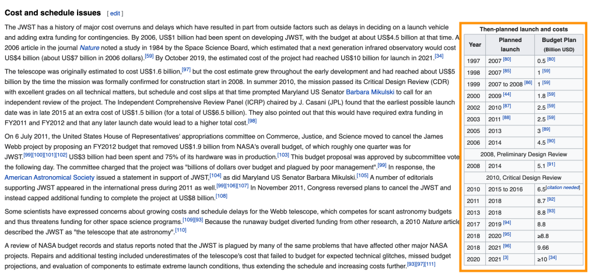

```{r setup, include = FALSE}
options(cli.width = 70)  # For tidyverse loading messages
knitr::opts_chunk$set(
  tidy.opts = list(width.cutoff = 70),  # For code
  width = 70,
  collapse = TRUE, 
  comment = "#>", 
  fig.width = 7, 
  fig.align = 'center',
  fig.asp = 0.618, # 1 / phi
  fig.retina = 2,
  out.width = "700px"
)
```

I was talking (well, via video) to a friend about the [James Webb Telescope](https://en.wikipedia.org/wiki/James_Webb_Space_Telescope). The James Webb is going to be a pretty big deal when it launches. It is one of the most complex things designed by humans, and it will do a lot more than the Hubble telescope, which means we can learn more about space, and, well, who knows?

When is it due to launch? It's been delayed quite a few times. There's even a relevant XKCD on this:

```{r xkcd-include, echo = FALSE}
knitr::include_graphics("https://imgs.xkcd.com/comics/jwst_delays.png")
```

And, looking at this, I was wondering how accurate the plot Randall Munrow made was? Turns out this was an interesting exercise in itself! 

This blog post covers how to scrape some tables from Wikipedia, tidy them up, perform some basic modelling, make some forecasts, and plot them.

# The packages

First let's load up a few libraries:

```{r libraries}
library(polite)
library(rvest)
library(tidyverse)
library(janitor)
conflicted::conflict_prefer("pluck", "purrr")
```

- `polite` and `rvest` are the webscraping tools
- `tidyverse` gives us many data analysis tools
- `janitor` provides some extra data cleaning powers.

We also use `conflicted` to state we prefer `pluck` from the `purrr` package (as there is a `map` in `rvest`, which has caught me out many a time)

First, let's take a look at the [Wiki article](https://en.wikipedia.org/wiki/James_Webb_Space_Telescope) to get the data and the dates.

It looks like this table is what we want:

```{r james-web, echo = FALSE}

```

But how do we download the table into R?

We "inspect element" to identify the table (CMD + Shift + C on Chrome):

```{r james-web-element, echo = FALSE}
knitr::include_graphics("figs/wiki-james-web-element.png")
```

Mousing over the table we see that this has the class: "wikitable". We can use this information to help extract out the right part of the website.

First, let's use the `polite` package to check we can download the data:

```{r check-url}
wiki_url <- "https://en.wikipedia.org/wiki/James_Webb_Space_Telescope"

bow(wiki_url)

```

Ok looks like we are all good! Now let's `scrape` it.

```{r scapes}
jwebb_data <- bow(wiki_url) %>% scrape()

jwebb_data
```

We use tools from `rvest` to identify particular parts. In our case, we want to use `html_nodes` and tell it to get the `.wikitable` that we saw earlier.

```{r jwebb-html-nodes}
jwebb_data %>% 
  html_nodes(".wikitable")
```
We see here that we have three tables, let's extract the tables from each of these, using `map` to run `html_table` on each, using `fill = TRUE` to fill rows with fewer than max columns with NAs, to ensure we get proper data back.

```{r jwebb-html-nodes-map}
jwebb_data %>% 
  html_nodes(".wikitable") %>% 
  map(html_table, fill = TRUE)
```

We want the third table, so we use `pluck`, and convert it to a `tibble` for nice printing

```{r jwebb-html-nodes-map-pluck}
jwebb_data %>% 
  html_nodes(".wikitable") %>% 
  map(html_table, fill = TRUE) %>% 
  pluck(3) %>% 
  as_tibble()
```

We get rid of rows 9 and 11 as they are rows that span the full table and aren't proper data in this context, and then run `clean_names` from `janitor` to make the variable names nicer.

```{r jwebb-html-nodes-map-pluck-clean}
jwebb_data %>% 
  html_nodes(".wikitable") %>% 
  map(html_table, fill = TRUE) %>% 
  pluck(3) %>% 
  as_tibble() %>% 
  slice(-9, 
        -11) %>% 
  clean_names()
```

Finally we `parse_number` over all columns, using `across` and friends:

```{r jwebb-data}
jwebb <- jwebb_data %>% 
  html_nodes(".wikitable") %>% 
  map(html_table, fill = TRUE) %>% 
  pluck(3) %>% 
  as_tibble() %>% 
  slice(-9,
        -11) %>% 
  clean_names() %>% 
  mutate(across(everything(), parse_number))

jwebb
```

We now want to check we can make a similar plot to XKCD, let's plot the data, with a linear model fit overlayed:


```{r jwebb-plot}
gg_jwebb <- ggplot(jwebb,
       aes(x = year,
           y = plannedlaunch)) + 
  geom_point() + 
  geom_smooth(method = "lm",
              se = FALSE)
gg_jwebb
```

OK but now we need to extend out the plot to get a sense of where it can extrapolate to. Let's extend the limits, and add an abline, a line with slope of 1 and intercept through 0.

```{r jwebb-plot-abline}
gg_jwebb +
  lims(x = c(1997,2030),
       y = c(1997,2030)) + 
  geom_abline(linetype = 2)
```

We want to extend that fitted line ahead, so let's fit a linear model to the data with `plannedlaunch` being predicted by `year` (which is what `geom_smooth(method = "lm")` does under the hood): 

```{r lm}
lm_jwebb <- lm(plannedlaunch ~ year, jwebb)
```

Then we use `augment` to predict some new data for 1997 through to 2030:

```{r predict}
library(broom)
new_data <- tibble(year = 1997:2030)
jwebb_predict <- augment(lm_jwebb, newdata = new_data)
jwebb_predict
```

Now we can add that to our plot:

```{r lm-add}
gg_jwebb_pred <- gg_jwebb +
  lims(x = c(1997,2030),
       y = c(1997,2030)) + 
  geom_abline(linetype = 2) +
  geom_line(data = jwebb_predict,
            colour = "steelblue",
            linetype = 3,
            size = 1,
            aes(x = year,
                y = .fitted))
gg_jwebb_pred
```

And finally add some extra details that XKCD had, using `geom_vline` and `geom_label_rep`

```{r lm-repel}
library(ggrepel)

gg_jwebb_pred + 
  geom_vline(xintercept = 2026.5,
             linetype = 2,
             colour = "orange") +
  labs(title = "Predicted James Webb Launch",
       subtitle = "Did Randell Munroe get it right?") +
  geom_label_repel(data = data.frame(year = 2026.5,
                               plannedlaunch = 2026.5),
             label = "2026",
             nudge_x = -2,
             nudge_y = 3,
             segment.colour = "gray50")

```

Did he get it right?

Yes, of course. Why did I ever doubt him.
