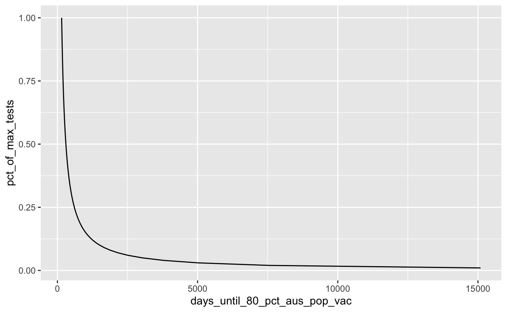
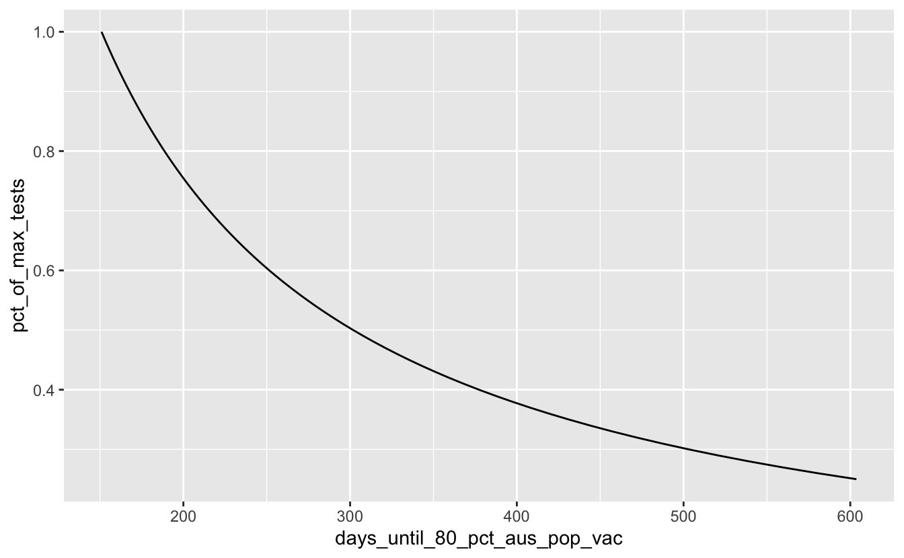
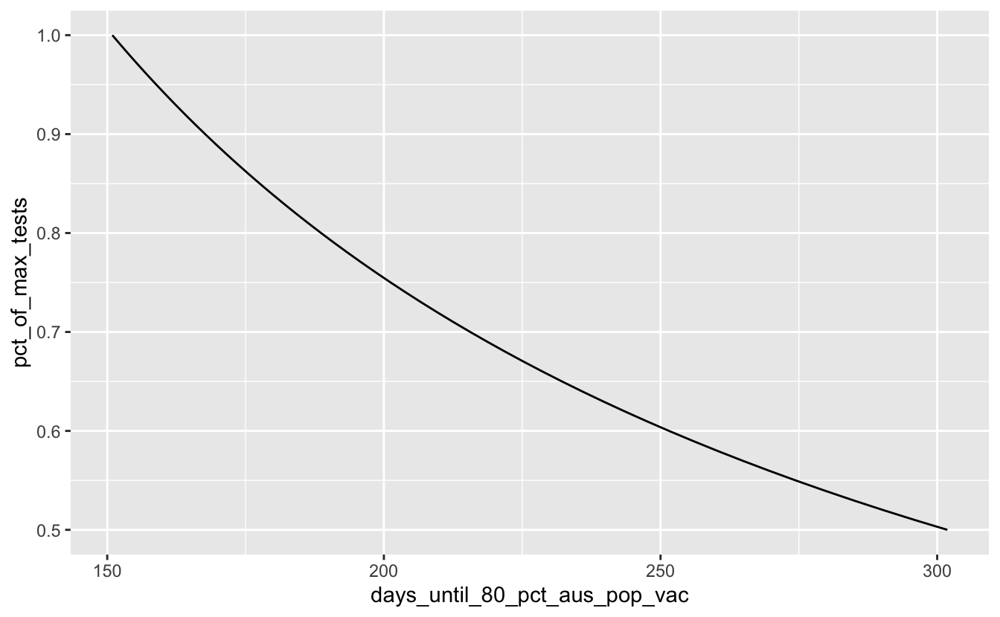
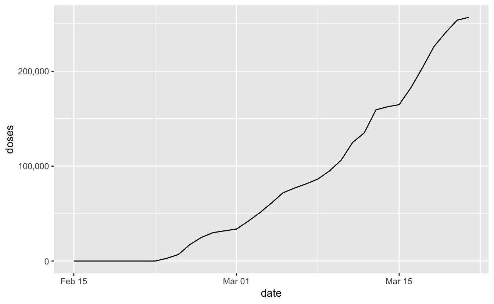

The COVID19 vaccines (plural!) are rolling out around the world, and about 4 weeks ago in late Feb, [Australians got their first vaccine jab](https://www.abc.net.au/news/2021-02-21/australias-first-coronavirus-vaccine-recipient-jane-malysiak/13176274). It's a pretty massive relief that these vaccines (plural!!!) are rolling out so soon.

The ABC helps answer, ["When will you get the COVID-19 vaccine?"](https://www.abc.net.au/news/2021-02-05/when-will-you-get-the-covid-19-vaccine/13112610), which is super cool! The Australian government reckons we'll be vaccinated at a good percentage (80%?) by sometime later in the year - I forget exactly when they said, but let's say about October.

Now, I'm not sure how to imagine how this all takes place, but one thing I thought might be an interesting proxy is using the number of COVID19 tests that we can conduct in a day in Australia to proxy in for the number of vaccinations we can do.

Now, sure, getting a test isn't the same as getting a vaccine, but there are similar PPE controls in place, waiting in queue, and getting swabbed takes about as long as a jab, and I figured it might tell us something.

Fortunately the data is very accessible so it's a question that we can answer with R, some web scraping, some data wrangling, and some graphs.

So the question I'm focusing on in this blog post is:

> "Based on the COVID19 tests that Australia can perform each day, how long will it take to get to 80% of Australians vaccinated?".

To do this we'll recycle some of the code from my previous blog post on [exploring covid numbers in Australia](https://www.njtierney.com/post/2020/10/20/roll-avg-covid/) - I skim over some of the repeated parts of code in this post, but I do provide a full explanation at the previously linked blog post. The data is kindly sourced from [covidliveau](https://covidlive.com.au/).

First, we load up the packages we need:

<pre class='chroma'><code class='language-r' data-lang='r'><a href='https://rdrr.io/r/base/library.html'>library</a>(<a href='http://tidyverse.tidyverse.org'>tidyverse</a>)
#&gt; ── Attaching packages ───────────────────────────── tidyverse 1.3.0 ──
#&gt; ✔ ggplot2 3.3.3     ✔ purrr   0.3.4
#&gt; ✔ tibble  3.1.0     ✔ dplyr   1.0.5
#&gt; ✔ tidyr   1.1.3     ✔ stringr 1.4.0
#&gt; ✔ readr   1.4.0     ✔ forcats 0.5.1
#&gt; ── Conflicts ──────────────────────────────── tidyverse_conflicts() ──
#&gt; ✖ dplyr::filter() masks stats::filter()
#&gt; ✖ dplyr::lag()    masks stats::lag()
<a href='https://rdrr.io/r/base/library.html'>library</a>(<a href='https://github.com/dmi3kno/polite'>polite</a>)
<a href='https://rdrr.io/r/base/library.html'>library</a>(<a href='https://rvest.tidyverse.org/'>rvest</a>)
#&gt; 
#&gt; Attaching package: 'rvest'
#&gt; The following object is masked from 'package:readr':
#&gt; 
#&gt;     guess_encoding
<a href='https://rdrr.io/r/base/library.html'>library</a>(<a href='https://github.com/rstudio/htmltools'>htmltools</a>)
<a href='https://rdrr.io/r/base/library.html'>library</a>(<a href='https://scales.r-lib.org'>scales</a>)
#&gt; 
#&gt; Attaching package: 'scales'
#&gt; The following object is masked from 'package:purrr':
#&gt; 
#&gt;     discard
#&gt; The following object is masked from 'package:readr':
#&gt; 
#&gt;     col_factor</code></pre>

-   `tidyverse` for data wrangling and plotting and magic
-   `polite`, `rvest`, `htmltools` for web scraping
-   `scales` for making nicer plot scales and stuff

We scrape the data for tests in Australia, and extract the table

<pre class='chroma'><code class='language-r' data-lang='r'>aus_test_url &lt;- "https://covidlive.com.au/report/daily-tests/aus"

aus_test_data_raw &lt;- <a href='https://rdrr.io/pkg/polite/man/bow.html'>bow</a>(aus_test_url) %&gt;% 
  <a href='https://rdrr.io/pkg/polite/man/scrape.html'>scrape</a>() %&gt;% 
  <a href='https://rvest.tidyverse.org/reference/html_table.html'>html_table</a>() %&gt;% 
  purrr::<a href='https://purrr.tidyverse.org/reference/pluck.html'>pluck</a>(2) %&gt;% 
  as_tibble()

aus_test_data_raw
#&gt; # A tibble: 386 x 4
#&gt;    DATE      TESTS      VAR   NET   
#&gt;    &lt;chr&gt;     &lt;chr&gt;      &lt;lgl&gt; &lt;chr&gt; 
#&gt;  1 21 Mar 21 15,186,991 NA    34,669
#&gt;  2 20 Mar 21 15,152,322 NA    36,037
#&gt;  3 19 Mar 21 15,116,285 NA    44,082
#&gt;  4 18 Mar 21 15,072,203 NA    50,496
#&gt;  5 17 Mar 21 15,021,707 NA    54,260
#&gt;  6 16 Mar 21 14,967,447 NA    33,843
#&gt;  7 15 Mar 21 14,933,604 NA    32,312
#&gt;  8 14 Mar 21 14,901,292 NA    29,392
#&gt;  9 13 Mar 21 14,871,900 NA    36,989
#&gt; 10 12 Mar 21 14,834,911 NA    45,015
#&gt; # … with 376 more rows</code></pre>

We then clean up the dates and numbers, defining a little function, `strp_date`, to present the dates nicely.

<pre class='chroma'><code class='language-r' data-lang='r'>strp_date &lt;- function(x) <a href='https://rdrr.io/r/base/as.Date.html'>as.Date</a>(<a href='https://rdrr.io/r/base/strptime.html'>strptime</a>(x, format = "%d %b"))

aus_tests &lt;- aus_test_data_raw %&gt;% 
  mutate(DATE = strp_date(DATE),
         TESTS = parse_number(TESTS),
         NET = parse_number(NET)) %&gt;% 
  janitor::<a href='https://rdrr.io/pkg/janitor/man/clean_names.html'>clean_names</a>() %&gt;% 
  rename(daily_tests = net)
#&gt; Warning: 29 parsing failures.
#&gt; row col expected actual
#&gt; 358  -- a number      -
#&gt; 359  -- a number      -
#&gt; 360  -- a number      -
#&gt; 361  -- a number      -
#&gt; 362  -- a number      -
#&gt; ... ... ........ ......
#&gt; See problems(...) for more details.

aus_tests
#&gt; # A tibble: 386 x 4
#&gt;    date          tests var   daily_tests
#&gt;    &lt;date&gt;        &lt;dbl&gt; &lt;lgl&gt;       &lt;dbl&gt;
#&gt;  1 2021-03-21 15186991 NA          34669
#&gt;  2 2021-03-20 15152322 NA          36037
#&gt;  3 2021-03-19 15116285 NA          44082
#&gt;  4 2021-03-18 15072203 NA          50496
#&gt;  5 2021-03-17 15021707 NA          54260
#&gt;  6 2021-03-16 14967447 NA          33843
#&gt;  7 2021-03-15 14933604 NA          32312
#&gt;  8 2021-03-14 14901292 NA          29392
#&gt;  9 2021-03-13 14871900 NA          36989
#&gt; 10 2021-03-12 14834911 NA          45015
#&gt; # … with 376 more rows</code></pre>

We get a sense of the distribution of tests by ploting the number of daily tests in Australia as a boxplot.

This extra line of code improves how big numbers are presented: `scale_x_continuous(labels = label_number(big.mark = ","))`, turning 100000 into 100,000. Perhaps not a big deal, but I think it helps.

<pre class='chroma'><code class='language-r' data-lang='r'>ggplot(aus_tests,
       aes(x = daily_tests)) + 
  geom_boxplot() + 
  scale_x_continuous(labels = <a href='https://scales.r-lib.org//reference/label_number.html'>label_number</a>(big.mark = ","))
#&gt; Warning: Removed 29 rows containing non-finite values (stat_boxplot).
</code></pre>

We learn most of the data is around 25-55K tests per day, give or take, and there were some extreme days where we tested over 150K! Not bad, not bad.

Another way to present the same data is to plot is as a density, along with a rug plot to show the data frequency.

<pre class='chroma'><code class='language-r' data-lang='r'>gg_cov_dens &lt;- ggplot(aus_tests,
       aes(x = daily_tests)) + 
  geom_density() +
  geom_rug(alpha = 0.2) +
  scale_x_continuous(labels = <a href='https://scales.r-lib.org//reference/label_number.html'>label_number</a>(big.mark = ","))

gg_cov_dens
#&gt; Warning: Removed 29 rows containing non-finite values (stat_density).
</code></pre>

This is pretty much a similar presentation of the previous plot, it's fun to look at, plus rug plots are great. If we're interested in what kind of distribution this follows, we can overlay a normal curve over the top with `geom_function`, adding in the estimated mean and standard deviation

<pre class='chroma'><code class='language-r' data-lang='r'>tests_mean &lt;- <a href='https://rdrr.io/r/base/mean.html'>mean</a>(aus_tests$daily_tests, na.rm = TRUE)
tests_sd &lt;- <a href='https://rdrr.io/r/stats/sd.html'>sd</a>(aus_tests$daily_tests, na.rm = TRUE)

gg_cov_dens + 
  geom_function(fun = dnorm, 
                args = <a href='https://rdrr.io/r/base/list.html'>list</a>(mean = tests_mean, sd = tests_sd),
                colour = "orange")
#&gt; Warning: Removed 29 rows containing non-finite values (stat_density).
</code></pre>

It looks somewhat normal, but it's a bit more peaky to the left. So, if you needed to assign this a distribution, maybe representing this as a normal isn't the best, or at least we could understand where it isn't representing the data.

Back on task
============

OK so what were we doing? Back to the question:

> "Based on the COVID19 tests that Australia can perform each day, how long will it take to get to 80% of Australians vaccinated?".

Let's calculate the maximum number of tests, and define 80% of [Australia's population](https://www.abs.gov.au/statistics/people/population).

<pre class='chroma'><code class='language-r' data-lang='r'>max_tests &lt;- <a href='https://rdrr.io/r/base/Extremes.html'>max</a>(aus_tests$daily_tests, na.rm = TRUE)
oz_pop_80_pct &lt;- 0.8 * 25693059</code></pre>

With this new information we then create a new table with a column of the percentage of maximum tests. We want to create a 100 row table, where each row is a percentage of the maximum tests. We can then calculate the number of days until Australia reaches 80% vaccination by dividing the number of 80% of the population bt the propotion of max tests.

<pre class='chroma'><code class='language-r' data-lang='r'>covid_days_until_vac &lt;- tibble(pct_of_max_tests = (1:100)/100,
       max_tests = max_tests,
       prop_of_max_tests = max_tests * pct_of_max_tests,
       days_until_80_pct_aus_pop_vac = oz_pop_80_pct / prop_of_max_tests)

covid_days_until_vac
#&gt; # A tibble: 100 x 4
#&gt;    pct_of_max_tests max_tests prop_of_max_tests days_until_80_pct_aus_pop_vac
#&gt;               &lt;dbl&gt;     &lt;dbl&gt;             &lt;dbl&gt;                         &lt;dbl&gt;
#&gt;  1             0.01    136194             1362.                        15092.
#&gt;  2             0.02    136194             2724.                         7546.
#&gt;  3             0.03    136194             4086.                         5031.
#&gt;  4             0.04    136194             5448.                         3773.
#&gt;  5             0.05    136194             6810.                         3018.
#&gt;  6             0.06    136194             8172.                         2515.
#&gt;  7             0.07    136194             9534.                         2156.
#&gt;  8             0.08    136194            10896.                         1887.
#&gt;  9             0.09    136194            12257.                         1677.
#&gt; 10             0.1     136194            13619.                         1509.
#&gt; # … with 90 more rows</code></pre>

Then we can plot this!

<pre class='chroma'><code class='language-r' data-lang='r'>ggplot(covid_days_until_vac,
         aes(x = days_until_80_pct_aus_pop_vac,
             y = pct_of_max_tests)) + 
  geom_line()
</code></pre>

Ooof. Ok, so let's assume that we will do better than 25% of our maximum tests by filtering that out:

<pre class='chroma'><code class='language-r' data-lang='r'>covid_days_until_vac %&gt;% 
<a href='https://rdrr.io/r/stats/filter.html'>filter</a>(pct_of_max_tests &gt;= 0.25) %&gt;% 
  ggplot(aes(x = days_until_80_pct_aus_pop_vac,
             y = pct_of_max_tests)) + 
  geom_line()
</code></pre>

Hmmm, OK so if we want to do it within 1 year from now, looks like we'd need to do over 50% of our tests per day?

<pre class='chroma'><code class='language-r' data-lang='r'>covid_days_until_vac %&gt;% 
<a href='https://rdrr.io/r/stats/filter.html'>filter</a>(pct_of_max_tests &gt;= 0.50) %&gt;% 
  ggplot(aes(x = days_until_80_pct_aus_pop_vac,
             y = pct_of_max_tests)) + 
  geom_line()
</code></pre>

And how many tests is that now? We can change the y axis to proportion of max tests.

<pre class='chroma'><code class='language-r' data-lang='r'>gg_covid_50pct_days &lt;- 
covid_days_until_vac %&gt;% 
  <a href='https://rdrr.io/r/stats/filter.html'>filter</a>(pct_of_max_tests &gt;= 0.50) %&gt;% 
  ggplot(aes(x = days_until_80_pct_aus_pop_vac,
             y = prop_of_max_tests)) + 
  geom_line() +
  scale_y_continuous(labels = <a href='https://scales.r-lib.org//reference/label_number.html'>label_number</a>(big.mark = ","))
  
gg_covid_50pct_days
</code></pre>

Let's say we want to be done by October 31, that is currently how many days away? We can use lubridate to work that out:

<pre class='chroma'><code class='language-r' data-lang='r'><a href='https://rdrr.io/r/base/library.html'>library</a>(<a href='https://lubridate.tidyverse.org'>lubridate</a>)
#&gt; 
#&gt; Attaching package: 'lubridate'
#&gt; The following objects are masked from 'package:base':
#&gt; 
#&gt;     date, intersect, setdiff, union
n_days_until_vac &lt;- <a href='http://lubridate.tidyverse.org/reference/ymd.html'>ymd</a>("2021-10-31") - <a href='http://lubridate.tidyverse.org/reference/now.html'>today</a>()
n_days_until_vac
#&gt; Time difference of 224 days</code></pre>

So that's 224 days.

<pre class='chroma'><code class='language-r' data-lang='r'>gg_covid_50pct_days + 
  geom_vline(xintercept = n_days_until_vac,
             colour = "red",
             lty = 2)
</code></pre>

And that means we need about this many tests per day:

<pre class='chroma'><code class='language-r' data-lang='r'>n_tests_per_day_needed &lt;- 
covid_days_until_vac %&gt;% 
  # there is no 224 days
  <a href='https://rdrr.io/r/stats/filter.html'>filter</a>(days_until_80_pct_aus_pop_vac &lt;= 225) %&gt;% 
  slice_head(n = 1) %&gt;% 
  pull(max_tests)

n_tests_per_day_needed
#&gt; [1] 136194</code></pre>

So we need doses per day to get there by October.

What are COVID vaccinations like currently in Australia?
========================================================

And because why not, let's look at what COVID vaccinations are currently like in Australia.

<pre class='chroma'><code class='language-r' data-lang='r'>aus_vac_url &lt;- "https://covidlive.com.au/report/daily-vaccinations/aus"

aus_test_data_raw &lt;- <a href='https://rdrr.io/pkg/polite/man/bow.html'>bow</a>(aus_vac_url) %&gt;% 
  <a href='https://rdrr.io/pkg/polite/man/scrape.html'>scrape</a>() %&gt;% 
  <a href='https://rvest.tidyverse.org/reference/html_table.html'>html_table</a>() %&gt;% 
  purrr::<a href='https://purrr.tidyverse.org/reference/pluck.html'>pluck</a>(2) %&gt;% 
  as_tibble() %&gt;% 
  janitor::<a href='https://rdrr.io/pkg/janitor/man/clean_names.html'>clean_names</a>() %&gt;% 
  mutate(date = strp_date(date)) %&gt;% 
  mutate(net = stringr::<a href='https://stringr.tidyverse.org/reference/str_replace.html'>str_replace_all</a>(string = net, 
                                        pattern = "-", 
                                        replacement = "0")) %&gt;% 
  mutate(across(<a href='https://rdrr.io/r/base/c.html'>c</a>("cwealth", "doses", "net"), parse_number)) %&gt;% 
  rename(daily_vacc = net)

aus_test_data_raw 
#&gt; # A tibble: 35 x 5
#&gt;    date       cwealth  doses var   daily_vacc
#&gt;    &lt;date&gt;       &lt;dbl&gt;  &lt;dbl&gt; &lt;lgl&gt;      &lt;dbl&gt;
#&gt;  1 2021-03-21   50000 256782 NA          2951
#&gt;  2 2021-03-20   50000 253831 NA         13077
#&gt;  3 2021-03-19   50000 240754 NA         14697
#&gt;  4 2021-03-18   50000 226057 NA         22500
#&gt;  5 2021-03-17   45607 203557 NA         21120
#&gt;  6 2021-03-16   42800 182437 NA         17656
#&gt;  7 2021-03-15   39760 164781 NA          2230
#&gt;  8 2021-03-14   39760 162551 NA          3257
#&gt;  9 2021-03-13   38934 159294 NA         24191
#&gt; 10 2021-03-12   30000 135103 NA         10103
#&gt; # … with 25 more rows</code></pre>

<pre class='chroma'><code class='language-r' data-lang='r'>ggplot(aus_test_data_raw,
       aes(x = date,
           y = doses)) + 
  geom_line() +
  scale_y_continuous(labels = <a href='https://scales.r-lib.org//reference/label_number.html'>label_number</a>(big.mark = ","))
</code></pre>

Things are just starting out here in Australia with the vaccine, but we're doing to need to see some pretty substantial ramp ups in the future to meet a goal date of the end of October.

