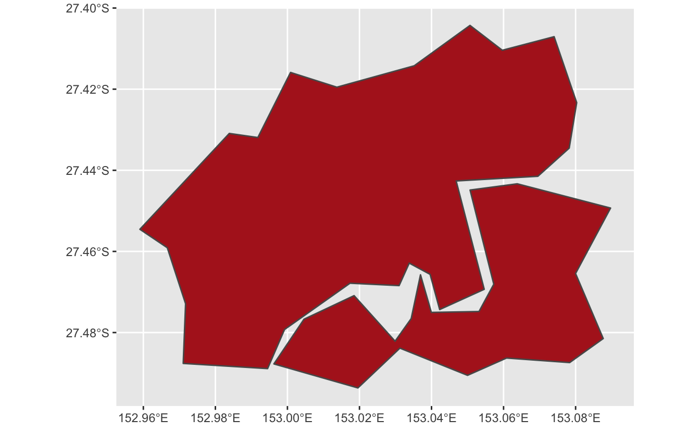
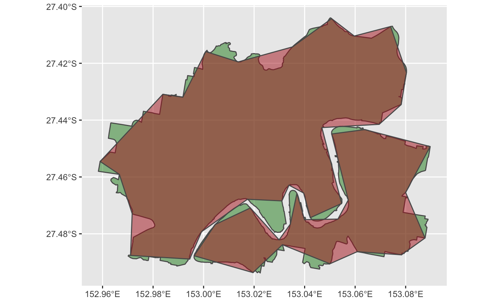

Photo By <a href="https://www.instagram.com/p/CSrX0-qh1tp/">Nick Tierney</a>

Last week I needed to understand how to calculate how much two spatial areas overlapped. I found a nice [thread on GIS stack exchange](https://gis.stackexchange.com/questions/362466/calculate-percentage-overlap-of-2-sets-of-polygons-in-r) that explained an answer (from user [Sandy AB](https://gis.stackexchange.com/users/161806/sandy-ab)). This pretty much gave me what I was looking for - but I was after something with more pictures, so here's an example of that.

## The Data

I started by getting some spatial areas from the ABS at [this link](https://www.abs.gov.au/statistics/standards/australian-statistical-geography-standard-asgs-edition-3/jul2021-jun2026/access-and-downloads/digital-boundary-files), selecting, "statistical local areas level 4 2021":

I then did a bit of processing to shrink the data down to just my hometown, Brisbane.

Let's read this in with [`sf`](https://r-spatial.github.io/sf/index.html):

<pre class='chroma'><code class='language-r' data-lang='r'><a href='https://rdrr.io/r/base/library.html'>library</a>(<a href='https://r-spatial.github.io/sf/'>sf</a>)
#&gt; Linking to GEOS 3.8.1, GDAL 3.2.1, PROJ 7.2.1
brisbane_sf &lt;- <a href='https://r-spatial.github.io/sf/reference/st_read.html'>read_sf</a>(here::<a href='https://here.r-lib.org//reference/here.html'>here</a>("content/post/2021-08-18-how-do-i-find-out-how-much-a-shapefile-overlaps-another/data/brisbane-sla4.shp"))</code></pre>

## The Data Vis

Let's plot my hometown, Brisbane with [`ggplot2`](https://ggplot2.tidyverse.org/index.html) and `geom_sf()`.

<pre class='chroma'><code class='language-r' data-lang='r'><a href='https://rdrr.io/r/base/library.html'>library</a>(<a href='https://ggplot2.tidyverse.org'>ggplot2</a>)
<a href='https://ggplot2.tidyverse.org/reference/ggplot.html'>ggplot</a>() + 
  <a href='https://ggplot2.tidyverse.org/reference/ggsf.html'>geom_sf</a>(data = brisbane_sf,
          fill = "forestgreen") 
</code></pre>

Let's say we have a simpler shape file that we want to compare to this - which we create by simplifying the shapefile with [`rmapshaper`](https://github.com/ateucher/rmapshaper).

<pre class='chroma'><code class='language-r' data-lang='r'><a href='https://rdrr.io/r/base/library.html'>library</a>(<a href='https://github.com/ateucher/rmapshaper'>rmapshaper</a>)
#&gt; Registered S3 method overwritten by 'geojsonlint':
#&gt;   method         from 
#&gt;   print.location dplyr
brisbane_simpler_sf &lt;- brisbane_sf %&gt;% <a href='https://rdrr.io/pkg/rmapshaper/man/ms_simplify.html'>ms_simplify</a>(keep = 0.01)</code></pre>

With this simpler file, we want to know how much area we are losing. Here's the "simpler" Brisbane in red.

<pre class='chroma'><code class='language-r' data-lang='r'><a href='https://ggplot2.tidyverse.org/reference/ggplot.html'>ggplot</a>() + 
  <a href='https://ggplot2.tidyverse.org/reference/ggsf.html'>geom_sf</a>(data = brisbane_simpler_sf, 
          fill = "firebrick")
</code></pre>

We can overlay them to see how similar they are, full Brisbane in green, and new Brisbane in red:

<pre class='chroma'><code class='language-r' data-lang='r'><a href='https://ggplot2.tidyverse.org/reference/ggplot.html'>ggplot</a>() + 
  <a href='https://ggplot2.tidyverse.org/reference/ggsf.html'>geom_sf</a>(data = brisbane_sf,
          fill = "forestgreen", alpha = 0.5) + 
  <a href='https://ggplot2.tidyverse.org/reference/ggsf.html'>geom_sf</a>(data = brisbane_simpler_sf, 
          fill = "firebrick",
          alpha = 0.5)
</code></pre>

So how do we calculate the difference between the two? We can use `st_intersection` to find where both shapes overlap. Here it is visualised:

<pre class='chroma'><code class='language-r' data-lang='r'><a href='https://r-spatial.github.io/sf/reference/geos_binary_ops.html'>st_intersection</a>(brisbane_sf, brisbane_simpler_sf) %&gt;% 
  <a href='https://ggplot2.tidyverse.org/reference/ggplot.html'>ggplot</a>() +
  <a href='https://ggplot2.tidyverse.org/reference/ggsf.html'>geom_sf</a>(fill = "brown", alpha = 0.5)
#&gt; although coordinates are longitude/latitude, st_intersection assumes that they are planar
#&gt; Warning: attribute variables are assumed to be spatially constant throughout all geometries
</code></pre>

Compare this again to the previous plot - these are the brown sections.

But say we want to calculate the ratio of how similar these two shape files are - how do we do that? Here are the steps:

1.  Find the area of the shapefile for the original Brisbane file
2.  Find the area of the overlap between the two files
3.  Calculate the ratio of the area in the original shapefile, and the area of the overlapping area
4.  Calculate the area of the overlap compared to the original Brisbane file, giving us the percentage of overlap!

## The area of the shapefile for the original Brisbane file

Here are the steps:

1.  Calculate area with `st_area`
2.  Reduce the size of the data - then only keep the relevant data (just keeping the SA4 name (`SA4_NAME21`), and then area, then drop the geometry column).

<pre class='chroma'><code class='language-r' data-lang='r'><a href='https://rdrr.io/r/base/library.html'>library</a>(<a href='https://dplyr.tidyverse.org'>dplyr</a>)
#&gt; 
#&gt; Attaching package: 'dplyr'
#&gt; The following objects are masked from 'package:stats':
#&gt; 
#&gt;     filter, lag
#&gt; The following objects are masked from 'package:base':
#&gt; 
#&gt;     intersect, setdiff, setequal, union
brisbane_sf_areas &lt;- brisbane_sf %&gt;% 
  <a href='https://dplyr.tidyverse.org/reference/mutate.html'>mutate</a>(brisbane_original_area = <a href='https://r-spatial.github.io/sf/reference/geos_measures.html'>st_area</a>(.)) %&gt;% 
  <a href='https://dplyr.tidyverse.org/reference/select.html'>select</a>(SA4_NAME21, brisbane_original_area) %&gt;% 
  <a href='https://r-spatial.github.io/sf/reference/st_geometry.html'>st_drop_geometry</a>()
  
brisbane_sf_areas
#&gt; # A tibble: 1 × 2
#&gt;   SA4_NAME21          brisbane_original_area
#&gt; * &lt;chr&gt;                                [m^2]
#&gt; 1 Brisbane Inner City               81738079</code></pre>

## The area of the overlap between the two files

1.  Calculate the intersection of these two shape files (`st_intersection`)
2.  Calculate that area (`st_area`)
3.  Then only keep the relevant data again

<pre class='chroma'><code class='language-r' data-lang='r'>intersection_area &lt;- <a href='https://r-spatial.github.io/sf/reference/geos_binary_ops.html'>st_intersection</a>(brisbane_sf, brisbane_simpler_sf) %&gt;% 
    <a href='https://dplyr.tidyverse.org/reference/mutate.html'>mutate</a>(intersect_area = <a href='https://r-spatial.github.io/sf/reference/geos_measures.html'>st_area</a>(.)) %&gt;% 
    <a href='https://dplyr.tidyverse.org/reference/select.html'>select</a>(SA4_NAME21, intersect_area) %&gt;% 
    <a href='https://r-spatial.github.io/sf/reference/st_geometry.html'>st_drop_geometry</a>()
#&gt; although coordinates are longitude/latitude, st_intersection assumes that they are planar
#&gt; Warning: attribute variables are assumed to be spatially constant throughout all geometries

intersection_area
#&gt; # A tibble: 1 × 2
#&gt;   SA4_NAME21          intersect_area
#&gt; * &lt;chr&gt;                        [m^2]
#&gt; 1 Brisbane Inner City       76638525</code></pre>

## The ratio of the area in the original shapefile, and the area of the overlapping areas

Now we have our pieces, now let us add these columns of the other data back to it:

<pre class='chroma'><code class='language-r' data-lang='r'>intersection_area %&gt;% 
    <a href='https://dplyr.tidyverse.org/reference/mutate-joins.html'>left_join</a>(brisbane_sf_areas, 
              by = "SA4_NAME21") 
#&gt; # A tibble: 1 × 3
#&gt;   SA4_NAME21          intersect_area brisbane_original_area
#&gt;   &lt;chr&gt;                        [m^2]                  [m^2]
#&gt; 1 Brisbane Inner City       76638525               81738079</code></pre>

And then calculate the ratio - which will tell us how much the simpler shape file overlaps the original ratio.

<pre class='chroma'><code class='language-r' data-lang='r'>intersection_area %&gt;% 
    <a href='https://dplyr.tidyverse.org/reference/mutate-joins.html'>left_join</a>(brisbane_sf_areas, 
              by = "SA4_NAME21") %&gt;% 
    <a href='https://dplyr.tidyverse.org/reference/mutate.html'>mutate</a>(weight = intersect_area / brisbane_original_area)
#&gt; # A tibble: 1 × 4
#&gt;   SA4_NAME21          intersect_area brisbane_original_area   weight
#&gt;   &lt;chr&gt;                        [m^2]                  [m^2]      [1]
#&gt; 1 Brisbane Inner City       76638525               81738079 0.937611</code></pre>

And, because I think it's good practice, all together as a function:

<pre class='chroma'><code class='language-r' data-lang='r'>calculate_spatial_overlap &lt;- function(shape_new,
                                      shape_old) &#123;
  
  
  intersection_area &lt;- <a href='https://r-spatial.github.io/sf/reference/geos_binary_ops.html'>st_intersection</a>(shape_new, shape_old) %&gt;% 
    <a href='https://dplyr.tidyverse.org/reference/mutate.html'>mutate</a>(intersect_area = <a href='https://r-spatial.github.io/sf/reference/geos_measures.html'>st_area</a>(.)) %&gt;% 
    <a href='https://dplyr.tidyverse.org/reference/select.html'>select</a>(SA4_NAME21, intersect_area) %&gt;% 
    <a href='https://r-spatial.github.io/sf/reference/st_geometry.html'>st_drop_geometry</a>()
  
  # Create a fresh area variable for counties
  shape_old_areas &lt;- shape_old %&gt;% 
    <a href='https://dplyr.tidyverse.org/reference/mutate.html'>mutate</a>(original_area = <a href='https://r-spatial.github.io/sf/reference/geos_measures.html'>st_area</a>(.)) %&gt;% 
    <a href='https://dplyr.tidyverse.org/reference/select.html'>select</a>(original_area, SA4_NAME21) %&gt;% 
    <a href='https://r-spatial.github.io/sf/reference/st_geometry.html'>st_drop_geometry</a>()
  
  intersection_area %&gt;% 
    <a href='https://dplyr.tidyverse.org/reference/mutate-joins.html'>left_join</a>(shape_old_areas, 
              by = "SA4_NAME21") %&gt;% 
    <a href='https://dplyr.tidyverse.org/reference/mutate.html'>mutate</a>(weight = intersect_area / original_area)
  
&#125;</code></pre>

<pre class='chroma'><code class='language-r' data-lang='r'>calculate_spatial_overlap(
    brisbane_simpler_sf, brisbane_sf
  )
#&gt; although coordinates are longitude/latitude, st_intersection assumes that they are planar
#&gt; Warning: attribute variables are assumed to be spatially constant throughout all geometries
#&gt; # A tibble: 1 × 4
#&gt;   SA4_NAME21          intersect_area original_area   weight
#&gt;   &lt;chr&gt;                        [m^2]         [m^2]      [1]
#&gt; 1 Brisbane Inner City       76638525      81738079 0.937611</code></pre>

So this tells us:

> The new shapefile covers about 93% of the old shape file.

That is, the red areas cover 93% of the green area:

# Why do this?

Our use case in this example was to calculate the difference between shapefiles so we could then use this overalapping difference as a weight in subsequent measurements.

But you can do more with this - the example from [the GIS stack exchange thread](https://gis.stackexchange.com/questions/362466/calculate-percentage-overlap-of-2-sets-of-polygons-in-r) was trying to calculate the amount of overlap of a lot of smaller shape files on another shapefile - a measurement often referred to as "coverage".

And that's it - hope that helps someone!

# Thanks

Thank you again to user [Sandy AB](https://gis.stackexchange.com/users/161806/sandy-ab) from Stack Exchange, who posted the answer!

