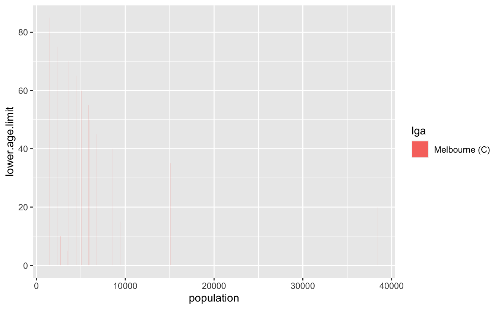
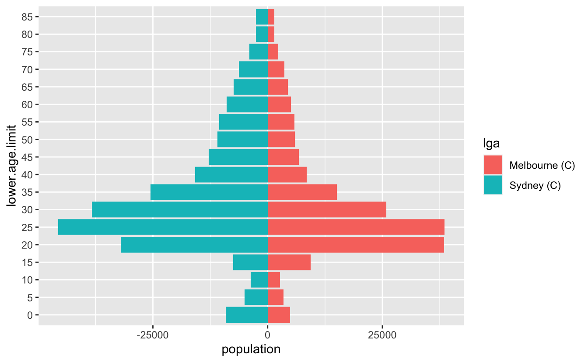
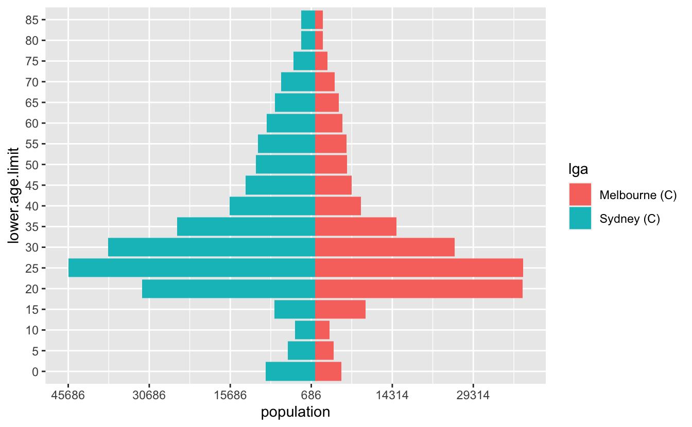
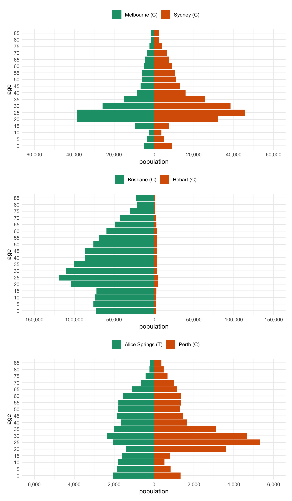

I recently had to make some pyramid plots in R. They are a useful way to compare age structures of populations. They look like this:

It's been a while since I had to make them, and in the past I've cooked them up in a relatively bespoke way. This time I needed to be able to have some level of programming to them - I wanted to be able to provide any two LGAs in Australia and then make a pyramid plot of them that looked nice.

I started by looking at this [SO thread](https://stackoverflow.com/questions/14680075/simpler-population-pyramid-in-ggplot2) - overall this gave me what I wanted, but I thought I'd walk through my solution, as it is a little different, and might hopefully be useful to others.

# The data

The data is comes from the Australian Bureau of Statistics, which is then cleaned up, and packaged in the [conmat](https://github.com/njtierney/conmat) R package, which I maintain. Before I show that, I'll load the packages I need, `tidyverse` , and `conmat`:

<pre class='chroma'><code class='language-r' data-lang='r'><a href='https://rdrr.io/r/base/library.html'>library</a>(<a href='https://tidyverse.tidyverse.org'>tidyverse</a>)#&gt; ── Attaching packages ───────────────────────────── tidyverse 1.3.1 ──#&gt; ✔ ggplot2 3.3.6     ✔ purrr   0.3.4
#&gt; ✔ tibble  3.1.7     ✔ dplyr   1.0.9
#&gt; ✔ tidyr   1.2.0     ✔ stringr 1.4.0
#&gt; ✔ readr   2.1.2     ✔ forcats 0.5.1#&gt; ── Conflicts ──────────────────────────────── tidyverse_conflicts() ──
#&gt; ✖ dplyr::filter() masks stats::filter()
#&gt; ✖ dplyr::lag()    masks stats::lag()<a href='https://rdrr.io/r/base/library.html'>library</a>(conmat)</code></pre>

You can access the age structured population for a given LGA like so:

<pre class='chroma'><code class='language-r' data-lang='r'># |label: LGA-hobart
<a href='https://rdrr.io/pkg/conmat/man/abs_age_lga.html'>abs_age_lga</a>("Hobart (C)")#&gt; # A tibble: 18 × 4
#&gt;    lga        lower.age.limit  year population
#&gt;    &lt;chr&gt;                &lt;dbl&gt; &lt;dbl&gt;      &lt;dbl&gt;
#&gt;  1 Hobart (C)               0  2020       2442
#&gt;  2 Hobart (C)               5  2020       2833
#&gt;  3 Hobart (C)              10  2020       2771
#&gt;  4 Hobart (C)              15  2020       3038
#&gt;  5 Hobart (C)              20  2020       4982
#&gt;  6 Hobart (C)              25  2020       5132
#&gt;  7 Hobart (C)              30  2020       4196
#&gt;  8 Hobart (C)              35  2020       3510
#&gt;  9 Hobart (C)              40  2020       3214
#&gt; 10 Hobart (C)              45  2020       3428
#&gt; 11 Hobart (C)              50  2020       3202
#&gt; 12 Hobart (C)              55  2020       3381
#&gt; 13 Hobart (C)              60  2020       3291
#&gt; 14 Hobart (C)              65  2020       3036
#&gt; 15 Hobart (C)              70  2020       2512
#&gt; 16 Hobart (C)              75  2020       1721
#&gt; 17 Hobart (C)              80  2020       1189
#&gt; 18 Hobart (C)              85  2020       1372</code></pre>

In our case, we want to combine two LGAs and compare them. So let's write a little helper function, `two_abs_age_lga`:

<pre class='chroma'><code class='language-r' data-lang='r'>two_abs_age_lga &lt;- function(lga_1, lga_2)&#123;
  <a href='https://dplyr.tidyverse.org/reference/bind.html'>bind_rows</a>(
    <a href='https://rdrr.io/pkg/conmat/man/abs_age_lga.html'>abs_age_lga</a>(lga_1),
    <a href='https://rdrr.io/pkg/conmat/man/abs_age_lga.html'>abs_age_lga</a>(lga_2)
  )
&#125;</code></pre>

So now we can get say, Melbourne and Sydney, like so:

<pre class='chroma'><code class='language-r' data-lang='r'>melb_syd &lt;- two_abs_age_lga("Melbourne (C)", "Sydney (C)")
melb_syd#&gt; # A tibble: 36 × 4
#&gt;    lga           lower.age.limit  year population
#&gt;    &lt;chr&gt;                   &lt;dbl&gt; &lt;dbl&gt;      &lt;dbl&gt;
#&gt;  1 Melbourne (C)               0  2020       4882
#&gt;  2 Melbourne (C)               5  2020       3450
#&gt;  3 Melbourne (C)              10  2020       2675
#&gt;  4 Melbourne (C)              15  2020       9396
#&gt;  5 Melbourne (C)              20  2020      38434
#&gt;  6 Melbourne (C)              25  2020      38546
#&gt;  7 Melbourne (C)              30  2020      25834
#&gt;  8 Melbourne (C)              35  2020      15072
#&gt;  9 Melbourne (C)              40  2020       8554
#&gt; 10 Melbourne (C)              45  2020       6753
#&gt; # … with 26 more rows<a href='https://rdrr.io/r/utils/head.html'>tail</a>(melb_syd)#&gt; # A tibble: 6 × 4
#&gt;   lga        lower.age.limit  year population
#&gt;   &lt;chr&gt;                &lt;dbl&gt; &lt;dbl&gt;      &lt;dbl&gt;
#&gt; 1 Sydney (C)              60  2020       8950
#&gt; 2 Sydney (C)              65  2020       7377
#&gt; 3 Sydney (C)              70  2020       6308
#&gt; 4 Sydney (C)              75  2020       4002
#&gt; 5 Sydney (C)              80  2020       2583
#&gt; 6 Sydney (C)              85  2020       2506</code></pre>

# The data wrangling

Now, to get the data into this plot, what we want is a plot of the population against each age group. To illustrate this I'll just use Melbourne data:

<pre class='chroma'><code class='language-r' data-lang='r'>melb &lt;- <a href='https://rdrr.io/pkg/conmat/man/abs_age_lga.html'>abs_age_lga</a>("Melbourne (C)")
<a href='https://ggplot2.tidyverse.org/reference/ggplot.html'>ggplot</a>(melb,
       <a href='https://ggplot2.tidyverse.org/reference/aes.html'>aes</a>(x = population,
           y = lower.age.limit,
           fill = lga)) + 
  <a href='https://ggplot2.tidyverse.org/reference/geom_bar.html'>geom_col</a>()</code></pre>

Ack, we need the `y` variable to be a factor

<pre class='chroma'><code class='language-r' data-lang='r'><a href='https://ggplot2.tidyverse.org/reference/ggplot.html'>ggplot</a>(melb,
       <a href='https://ggplot2.tidyverse.org/reference/aes.html'>aes</a>(x = population,
           y = <a href='https://rdrr.io/r/base/factor.html'>factor</a>(lower.age.limit),
           fill = lga)) + 
  <a href='https://ggplot2.tidyverse.org/reference/geom_bar.html'>geom_col</a>()</code></pre>

But what we actually want are two plots, one going the other way for the other group. We can make this happen by making the population negative:

<pre class='chroma'><code class='language-r' data-lang='r'>syd &lt;- <a href='https://rdrr.io/pkg/conmat/man/abs_age_lga.html'>abs_age_lga</a>("Sydney (C)")
<a href='https://ggplot2.tidyverse.org/reference/ggplot.html'>ggplot</a>(syd,
       <a href='https://ggplot2.tidyverse.org/reference/aes.html'>aes</a>(x = -population,
           y = <a href='https://rdrr.io/r/base/factor.html'>factor</a>(lower.age.limit),
           fill = lga)) + 
  <a href='https://ggplot2.tidyverse.org/reference/geom_bar.html'>geom_col</a>()</code></pre>

And then we want to combine those two plots - so we can write something bespoke, like this. Let's also make that age limit data a factor while we are here

<pre class='chroma'><code class='language-r' data-lang='r'>melb_syd_pyramid &lt;- melb_syd <a href='https://magrittr.tidyverse.org/reference/pipe.html'>%&gt;%</a> 
  <a href='https://dplyr.tidyverse.org/reference/mutate.html'>mutate</a>(
    population = <a href='https://dplyr.tidyverse.org/reference/case_when.html'>case_when</a>(
      lga == "Sydney (C)" ~ -population,
      TRUE ~ population
    ),
    lower.age.limit = <a href='https://forcats.tidyverse.org/reference/as_factor.html'>as_factor</a>(lower.age.limit)
  )

melb_syd_pyramid#&gt; # A tibble: 36 × 4
#&gt;    lga           lower.age.limit  year population
#&gt;    &lt;chr&gt;         &lt;fct&gt;           &lt;dbl&gt;      &lt;dbl&gt;
#&gt;  1 Melbourne (C) 0                2020       4882
#&gt;  2 Melbourne (C) 5                2020       3450
#&gt;  3 Melbourne (C) 10               2020       2675
#&gt;  4 Melbourne (C) 15               2020       9396
#&gt;  5 Melbourne (C) 20               2020      38434
#&gt;  6 Melbourne (C) 25               2020      38546
#&gt;  7 Melbourne (C) 30               2020      25834
#&gt;  8 Melbourne (C) 35               2020      15072
#&gt;  9 Melbourne (C) 40               2020       8554
#&gt; 10 Melbourne (C) 45               2020       6753
#&gt; # … with 26 more rows</code></pre>

So now we can get this:

<pre class='chroma'><code class='language-r' data-lang='r'><a href='https://ggplot2.tidyverse.org/reference/ggplot.html'>ggplot</a>(melb_syd_pyramid,
         <a href='https://ggplot2.tidyverse.org/reference/aes.html'>aes</a>(x = population,
             y = lower.age.limit,
             fill = lga)) +
    <a href='https://ggplot2.tidyverse.org/reference/geom_bar.html'>geom_col</a>() </code></pre>

And that's pretty good!

Let's tidy it up a little bit - we want to change the axis on the bottom to be positive in both directions, so we'll need to specify the break points for the axis marks, as well as the labels. So we want a sequence from one end to the other, but for it to be symmetric. Let's start by getting the range, by using the `range` function:

<pre class='chroma'><code class='language-r' data-lang='r'>pop_range &lt;- <a href='https://rdrr.io/r/base/range.html'>range</a>(melb_syd_pyramid$population)
pop_range#&gt; [1] -45686  38546</code></pre>

Now we want a sequence from there to the end value. We can use `seq` to make a sequence

<pre class='chroma'><code class='language-r' data-lang='r'>pop_range_seq &lt;- <a href='https://rdrr.io/r/base/seq.html'>seq</a>(pop_range[1], pop_range[2], by = 15000)
pop_range_seq#&gt; [1] -45686 -30686 -15686   -686  14314  29314</code></pre>

Briefly, what we want to do is something like this:

<pre class='chroma'><code class='language-r' data-lang='r'><a href='https://ggplot2.tidyverse.org/reference/ggplot.html'>ggplot</a>(melb_syd_pyramid,
         <a href='https://ggplot2.tidyverse.org/reference/aes.html'>aes</a>(x = population,
             y = lower.age.limit,
             fill = lga)) +
    <a href='https://ggplot2.tidyverse.org/reference/geom_bar.html'>geom_col</a>() +
    <a href='https://ggplot2.tidyverse.org/reference/scale_continuous.html'>scale_x_continuous</a>(breaks  = pop_range_seq,
                       labels = <a href='https://rdrr.io/r/base/MathFun.html'>abs</a>(pop_range_seq))</code></pre>

Ugh, but the numbers aren't very nice. We want some nicer numbers. We can use a negative number in `round` to give us something slightly better.

<pre class='chroma'><code class='language-r' data-lang='r'><a href='https://rdrr.io/r/base/Round.html'>round</a>(pop_range, -2)#&gt; [1] -45700  38500</code></pre>

But I'd like to round to the nearest 500...and we also need to have a 0 in there as well.

# `base::pretty()`

Turns out this is a pretty common thing to do, and base R has us covered, with [`pretty()`](https://rdrr.io/r/base/pretty.html)! It even includes 0!

<pre class='chroma'><code class='language-r' data-lang='r'><a href='https://rdrr.io/r/base/pretty.html'>pretty</a>(pop_range)#&gt; [1] -60000 -40000 -20000      0  20000  40000</code></pre>

There are loads of options, but we'll just specify `n` to change the number of breaks

<pre class='chroma'><code class='language-r' data-lang='r'>pop_range_breaks &lt;- <a href='https://rdrr.io/r/base/pretty.html'>pretty</a>(pop_range, n = 7)</code></pre>

So now we have something that looks pretty good

<pre class='chroma'><code class='language-r' data-lang='r'><a href='https://ggplot2.tidyverse.org/reference/ggplot.html'>ggplot</a>(melb_syd_pyramid,
         <a href='https://ggplot2.tidyverse.org/reference/aes.html'>aes</a>(x = population,
             y = lower.age.limit,
             fill = lga)) +
    <a href='https://ggplot2.tidyverse.org/reference/geom_bar.html'>geom_col</a>() +
    <a href='https://ggplot2.tidyverse.org/reference/scale_continuous.html'>scale_x_continuous</a>(breaks  = pop_range_breaks,
                       labels = <a href='https://rdrr.io/r/base/MathFun.html'>abs</a>(pop_range_breaks))</code></pre>

OK, but a few more gripes:

-   The numbers are a bit hard to read - we can add a comma into them to improve that with [`scales::comma`](https://scales.r-lib.org/reference/comma.html)

-   the legend needs to be on top

-   The colour scale should be colourblind friendly

## `scales::comma()`

A really cool function! It takes number input and adds commas into them.

<pre class='chroma'><code class='language-r' data-lang='r'>scales::<a href='https://scales.r-lib.org/reference/comma.html'>comma</a>(10)#&gt; [1] "10"scales::<a href='https://scales.r-lib.org/reference/comma.html'>comma</a>(100)#&gt; [1] "100"scales::<a href='https://scales.r-lib.org/reference/comma.html'>comma</a>(1000)#&gt; [1] "1,000"scales::<a href='https://scales.r-lib.org/reference/comma.html'>comma</a>(1000000)#&gt; [1] "1,000,000"</code></pre>

Let's add that in, along with the changes to the legend, as well as an improved colour scale

<pre class='chroma'><code class='language-r' data-lang='r'><a href='https://ggplot2.tidyverse.org/reference/ggplot.html'>ggplot</a>(melb_syd_pyramid,
         <a href='https://ggplot2.tidyverse.org/reference/aes.html'>aes</a>(x = population,
             y = lower.age.limit,
             fill = lga)) +
    <a href='https://ggplot2.tidyverse.org/reference/geom_bar.html'>geom_col</a>() +
    <a href='https://ggplot2.tidyverse.org/reference/scale_continuous.html'>scale_x_continuous</a>(breaks  = pop_range_breaks,
                       labels = scales::<a href='https://scales.r-lib.org/reference/comma.html'>comma</a>(<a href='https://rdrr.io/r/base/MathFun.html'>abs</a>(pop_range_breaks))) + 
  <a href='https://ggplot2.tidyverse.org/reference/scale_brewer.html'>scale_fill_brewer</a>(palette = "Dark2") +
  <a href='https://ggplot2.tidyverse.org/reference/ggtheme.html'>theme_minimal</a>() +
  <a href='https://ggplot2.tidyverse.org/reference/theme.html'>theme</a>(legend.position = "top") </code></pre>

# This doesn't generalise to other data

Unfortunately, if I want to do this to another dataset, which doesn't have Sydney and Melbourne, I'll need to write custom code each time. We can do a little better, let's write this as a function, which takes two inputs, the name of each of the LGAs we want to explore.

This involves a few steps - first, we need to modify the data as we've done above. Let's call this a `prep_pop_pyramid` function. First let's scratch out what it will do.

So we need to get the data.

<pre class='chroma'><code class='language-r' data-lang='r'>melb_syd &lt;- two_abs_age_lga("Melbourne (C)", "Sydney (C)")</code></pre>

Then we need to multiply one of the populations by -1, so that we get the reflected population in the other direction. We had previously done:

<pre class='chroma'><code class='language-r' data-lang='r'>melb_syd <a href='https://magrittr.tidyverse.org/reference/pipe.html'>%&gt;%</a> 
  <a href='https://dplyr.tidyverse.org/reference/mutate.html'>mutate</a>(
    population = <a href='https://dplyr.tidyverse.org/reference/case_when.html'>case_when</a>(
      lga == "Sydney (C)" ~ -population,
      TRUE ~ population
    )
  )#&gt; # A tibble: 36 × 4
#&gt;    lga           lower.age.limit  year population
#&gt;    &lt;chr&gt;                   &lt;dbl&gt; &lt;dbl&gt;      &lt;dbl&gt;
#&gt;  1 Melbourne (C)               0  2020       4882
#&gt;  2 Melbourne (C)               5  2020       3450
#&gt;  3 Melbourne (C)              10  2020       2675
#&gt;  4 Melbourne (C)              15  2020       9396
#&gt;  5 Melbourne (C)              20  2020      38434
#&gt;  6 Melbourne (C)              25  2020      38546
#&gt;  7 Melbourne (C)              30  2020      25834
#&gt;  8 Melbourne (C)              35  2020      15072
#&gt;  9 Melbourne (C)              40  2020       8554
#&gt; 10 Melbourne (C)              45  2020       6753
#&gt; # … with 26 more rows</code></pre>

But this will not generalise to *any* two LGA names. So instead we can assign one of the LGAs to a number, which we can do by first grouping by lga, then using [`cur_group_id()`](https://dplyr.tidyverse.org/reference/context.html), to label the groups as a number.

<pre class='chroma'><code class='language-r' data-lang='r'>melb_syd <a href='https://magrittr.tidyverse.org/reference/pipe.html'>%&gt;%</a> 
    <a href='https://dplyr.tidyverse.org/reference/group_by.html'>group_by</a>(lga) <a href='https://magrittr.tidyverse.org/reference/pipe.html'>%&gt;%</a>
    <a href='https://dplyr.tidyverse.org/reference/mutate.html'>mutate</a>(
      age_multiplier = <a href='https://dplyr.tidyverse.org/reference/context.html'>cur_group_id</a>(),
      .after = lga
    )#&gt; # A tibble: 36 × 5
#&gt; # Groups:   lga [2]
#&gt;    lga           age_multiplier lower.age.limit  year population
#&gt;    &lt;chr&gt;                  &lt;int&gt;           &lt;dbl&gt; &lt;dbl&gt;      &lt;dbl&gt;
#&gt;  1 Melbourne (C)              1               0  2020       4882
#&gt;  2 Melbourne (C)              1               5  2020       3450
#&gt;  3 Melbourne (C)              1              10  2020       2675
#&gt;  4 Melbourne (C)              1              15  2020       9396
#&gt;  5 Melbourne (C)              1              20  2020      38434
#&gt;  6 Melbourne (C)              1              25  2020      38546
#&gt;  7 Melbourne (C)              1              30  2020      25834
#&gt;  8 Melbourne (C)              1              35  2020      15072
#&gt;  9 Melbourne (C)              1              40  2020       8554
#&gt; 10 Melbourne (C)              1              45  2020       6753
#&gt; # … with 26 more rows</code></pre>

This then gives us a 1 or a 2. We can then set this to be negative if it is the second group.

<pre class='chroma'><code class='language-r' data-lang='r'>melb_syd <a href='https://magrittr.tidyverse.org/reference/pipe.html'>%&gt;%</a> 
    <a href='https://dplyr.tidyverse.org/reference/group_by.html'>group_by</a>(lga) <a href='https://magrittr.tidyverse.org/reference/pipe.html'>%&gt;%</a>
    <a href='https://dplyr.tidyverse.org/reference/mutate.html'>mutate</a>(
      age_multiplier = <a href='https://dplyr.tidyverse.org/reference/context.html'>cur_group_id</a>(),
      age_multiplier = <a href='https://dplyr.tidyverse.org/reference/case_when.html'>case_when</a>(age_multiplier == 2 ~ 1,
                                 TRUE ~ -1),
      .after = lga
    ) #&gt; # A tibble: 36 × 5
#&gt; # Groups:   lga [2]
#&gt;    lga           age_multiplier lower.age.limit  year population
#&gt;    &lt;chr&gt;                  &lt;dbl&gt;           &lt;dbl&gt; &lt;dbl&gt;      &lt;dbl&gt;
#&gt;  1 Melbourne (C)             -1               0  2020       4882
#&gt;  2 Melbourne (C)             -1               5  2020       3450
#&gt;  3 Melbourne (C)             -1              10  2020       2675
#&gt;  4 Melbourne (C)             -1              15  2020       9396
#&gt;  5 Melbourne (C)             -1              20  2020      38434
#&gt;  6 Melbourne (C)             -1              25  2020      38546
#&gt;  7 Melbourne (C)             -1              30  2020      25834
#&gt;  8 Melbourne (C)             -1              35  2020      15072
#&gt;  9 Melbourne (C)             -1              40  2020       8554
#&gt; 10 Melbourne (C)             -1              45  2020       6753
#&gt; # … with 26 more rows</code></pre>

Then, we have something that we can use to multiply the population by -1 ! Let's also take this chance to turn age into a factor.

<pre class='chroma'><code class='language-r' data-lang='r'>melb_syd <a href='https://magrittr.tidyverse.org/reference/pipe.html'>%&gt;%</a> 
    <a href='https://dplyr.tidyverse.org/reference/group_by.html'>group_by</a>(lga) <a href='https://magrittr.tidyverse.org/reference/pipe.html'>%&gt;%</a>
    <a href='https://dplyr.tidyverse.org/reference/mutate.html'>mutate</a>(
      age_multiplier = <a href='https://dplyr.tidyverse.org/reference/context.html'>cur_group_id</a>(),
      age_multiplier = <a href='https://dplyr.tidyverse.org/reference/case_when.html'>case_when</a>(age_multiplier == 2 ~ 1,
                                 TRUE ~ -1),
      .after = lga
    ) <a href='https://magrittr.tidyverse.org/reference/pipe.html'>%&gt;%</a>
    <a href='https://dplyr.tidyverse.org/reference/group_by.html'>ungroup</a>() <a href='https://magrittr.tidyverse.org/reference/pipe.html'>%&gt;%</a>
    <a href='https://dplyr.tidyverse.org/reference/mutate.html'>mutate</a>(age = <a href='https://forcats.tidyverse.org/reference/as_factor.html'>as_factor</a>(lower.age.limit),
           population = population * age_multiplier)#&gt; # A tibble: 36 × 6
#&gt;    lga           age_multiplier lower.age.limit  year population age  
#&gt;    &lt;chr&gt;                  &lt;dbl&gt;           &lt;dbl&gt; &lt;dbl&gt;      &lt;dbl&gt; &lt;fct&gt;
#&gt;  1 Melbourne (C)             -1               0  2020      -4882 0    
#&gt;  2 Melbourne (C)             -1               5  2020      -3450 5    
#&gt;  3 Melbourne (C)             -1              10  2020      -2675 10   
#&gt;  4 Melbourne (C)             -1              15  2020      -9396 15   
#&gt;  5 Melbourne (C)             -1              20  2020     -38434 20   
#&gt;  6 Melbourne (C)             -1              25  2020     -38546 25   
#&gt;  7 Melbourne (C)             -1              30  2020     -25834 30   
#&gt;  8 Melbourne (C)             -1              35  2020     -15072 35   
#&gt;  9 Melbourne (C)             -1              40  2020      -8554 40   
#&gt; 10 Melbourne (C)             -1              45  2020      -6753 45   
#&gt; # … with 26 more rows</code></pre>

And then let's wrap this into a function:

<pre class='chroma'><code class='language-r' data-lang='r'>prep_pop_pyramid &lt;- function(data)&#123;
  data <a href='https://magrittr.tidyverse.org/reference/pipe.html'>%&gt;%</a> 
    <a href='https://dplyr.tidyverse.org/reference/group_by.html'>group_by</a>(lga) <a href='https://magrittr.tidyverse.org/reference/pipe.html'>%&gt;%</a>
    <a href='https://dplyr.tidyverse.org/reference/mutate.html'>mutate</a>(
      age_multiplier = <a href='https://dplyr.tidyverse.org/reference/context.html'>cur_group_id</a>(),
      age_multiplier = <a href='https://dplyr.tidyverse.org/reference/case_when.html'>case_when</a>(age_multiplier == 2 ~ 1,
                                 TRUE ~ -1),
      .after = lga
    ) <a href='https://magrittr.tidyverse.org/reference/pipe.html'>%&gt;%</a>
    <a href='https://dplyr.tidyverse.org/reference/group_by.html'>ungroup</a>() <a href='https://magrittr.tidyverse.org/reference/pipe.html'>%&gt;%</a>
    <a href='https://dplyr.tidyverse.org/reference/mutate.html'>mutate</a>(age = <a href='https://forcats.tidyverse.org/reference/as_factor.html'>as_factor</a>(lower.age.limit),
           population = population * age_multiplier)
&#125;</code></pre>

OK so now let's put those two parts together:

<pre class='chroma'><code class='language-r' data-lang='r'>melb_syd &lt;- two_abs_age_lga(
  "Melbourne (C)",
  "Sydney (C)"
) <a href='https://magrittr.tidyverse.org/reference/pipe.html'>%&gt;%</a> 
  prep_pop_pyramid()

melb_syd#&gt; # A tibble: 36 × 6
#&gt;    lga           age_multiplier lower.age.limit  year population age  
#&gt;    &lt;chr&gt;                  &lt;dbl&gt;           &lt;dbl&gt; &lt;dbl&gt;      &lt;dbl&gt; &lt;fct&gt;
#&gt;  1 Melbourne (C)             -1               0  2020      -4882 0    
#&gt;  2 Melbourne (C)             -1               5  2020      -3450 5    
#&gt;  3 Melbourne (C)             -1              10  2020      -2675 10   
#&gt;  4 Melbourne (C)             -1              15  2020      -9396 15   
#&gt;  5 Melbourne (C)             -1              20  2020     -38434 20   
#&gt;  6 Melbourne (C)             -1              25  2020     -38546 25   
#&gt;  7 Melbourne (C)             -1              30  2020     -25834 30   
#&gt;  8 Melbourne (C)             -1              35  2020     -15072 35   
#&gt;  9 Melbourne (C)             -1              40  2020      -8554 40   
#&gt; 10 Melbourne (C)             -1              45  2020      -6753 45   
#&gt; # … with 26 more rows</code></pre>

And now let's wrap the plotting code into a function:

<pre class='chroma'><code class='language-r' data-lang='r'>plot_pop_pyramid &lt;- function(data)&#123;
  pop_range &lt;- <a href='https://rdrr.io/r/base/range.html'>range</a>(data$population)
  
  age_range_seq &lt;- <a href='https://rdrr.io/r/base/pretty.html'>pretty</a>(pop_range, n = 10)
  
  <a href='https://ggplot2.tidyverse.org/reference/ggplot.html'>ggplot</a>(data,
         <a href='https://ggplot2.tidyverse.org/reference/aes.html'>aes</a>(x = population,
             y = age,
             fill = lga)) +
    <a href='https://ggplot2.tidyverse.org/reference/geom_bar.html'>geom_col</a>() +
    <a href='https://ggplot2.tidyverse.org/reference/scale_continuous.html'>scale_x_continuous</a>(breaks  = age_range_seq,
                       labels = scales::<a href='https://scales.r-lib.org/reference/comma.html'>comma</a>(<a href='https://rdrr.io/r/base/MathFun.html'>abs</a>(age_range_seq))) +
    <a href='https://ggplot2.tidyverse.org/reference/scale_brewer.html'>scale_fill_brewer</a>(palette = "Dark2",
                      guide = <a href='https://ggplot2.tidyverse.org/reference/guide_legend.html'>guide_legend</a>(
                        title = ""
                      )) +
    <a href='https://ggplot2.tidyverse.org/reference/ggtheme.html'>theme_minimal</a>() +
    <a href='https://ggplot2.tidyverse.org/reference/theme.html'>theme</a>(legend.position = "top")
&#125;</code></pre>

<pre class='chroma'><code class='language-r' data-lang='r'>plot_pop_pyramid(melb_syd)</code></pre>

# End

And that was the end of this blog post. But something about the plots kind of bothered me...

# Bonus

Well, there's actually one final step here that you might be interested in - which is centering the "0" of the population. Perhaps there is another way around this, but the approach that I ended up doing was the following:

<pre class='chroma'><code class='language-r' data-lang='r'>pretty_symmetric &lt;- function(range, n = 5)&#123;
  range_1 &lt;- <a href='https://rdrr.io/r/base/c.html'>c</a>(-range[1], range[2])
  range_2 &lt;- <a href='https://rdrr.io/r/base/c.html'>c</a>(range[1], -range[2])
  
  pretty_vec_1 &lt;- <a href='https://rdrr.io/r/base/pretty.html'>pretty</a>(range_1)
  pretty_vec_2 &lt;- <a href='https://rdrr.io/r/base/pretty.html'>pretty</a>(range_2)
  
  <a href='https://rdrr.io/r/base/pretty.html'>pretty</a>(
    <a href='https://rdrr.io/r/base/c.html'>c</a>(pretty_vec_1, pretty_vec_2), 
    n = n
  )
  
&#125;

pretty_symmetric(<a href='https://rdrr.io/r/base/c.html'>c</a>(-5000, 10000))#&gt; [1] -10000  -5000      0   5000  10000</code></pre>

So then we replace `pretty`, with `pretty_symmetric` , and then need to add this other bit, `expand_limits` which ensures the limits are kept

<pre class='chroma'><code class='language-r' data-lang='r'>plot_pop_pyramid &lt;- function(data)&#123;
  pop_range &lt;- <a href='https://rdrr.io/r/base/range.html'>range</a>(data$population)
  
  age_range_seq &lt;- pretty_symmetric(pop_range, n = 5)
  
  <a href='https://ggplot2.tidyverse.org/reference/ggplot.html'>ggplot</a>(data,
         <a href='https://ggplot2.tidyverse.org/reference/aes.html'>aes</a>(x = population,
             y = age,
             fill = lga)) +
    <a href='https://ggplot2.tidyverse.org/reference/geom_bar.html'>geom_col</a>() +
    <a href='https://ggplot2.tidyverse.org/reference/scale_continuous.html'>scale_x_continuous</a>(breaks  = age_range_seq,
                       labels = scales::<a href='https://scales.r-lib.org/reference/comma.html'>comma</a>(<a href='https://rdrr.io/r/base/MathFun.html'>abs</a>(age_range_seq))) +
    <a href='https://ggplot2.tidyverse.org/reference/expand_limits.html'>expand_limits</a>(x = <a href='https://rdrr.io/r/base/range.html'>range</a>(age_range_seq)) + 
    <a href='https://ggplot2.tidyverse.org/reference/scale_brewer.html'>scale_fill_brewer</a>(palette = "Dark2",
                      guide = <a href='https://ggplot2.tidyverse.org/reference/guide_legend.html'>guide_legend</a>(
                        title = ""
                      )) +
    <a href='https://ggplot2.tidyverse.org/reference/ggtheme.html'>theme_minimal</a>() +
    <a href='https://ggplot2.tidyverse.org/reference/theme.html'>theme</a>(legend.position = "top")
&#125;</code></pre>

<pre class='chroma'><code class='language-r' data-lang='r'>plot_pop_pyramid(melb_syd)</code></pre>

This has a nice benefit of facilitating stacking the plots with something like `patchwork` and the 0s will be aligned.

<pre class='chroma'><code class='language-r' data-lang='r'>melb_syd &lt;- two_abs_age_lga(
  "Melbourne (C)",
  "Sydney (C)"
) <a href='https://magrittr.tidyverse.org/reference/pipe.html'>%&gt;%</a> 
  prep_pop_pyramid()

bris_hobart &lt;- two_abs_age_lga(
  "Brisbane (C)",
  "Hobart (C)"
) <a href='https://magrittr.tidyverse.org/reference/pipe.html'>%&gt;%</a> 
  prep_pop_pyramid()

alice_perth &lt;- two_abs_age_lga(
  "Alice Springs (T)",
  "Perth (C)"
) <a href='https://magrittr.tidyverse.org/reference/pipe.html'>%&gt;%</a> 
  prep_pop_pyramid()</code></pre>

Then we can stack them together with patchwork

<pre class='chroma'><code class='language-r' data-lang='r'><a href='https://rdrr.io/r/base/library.html'>library</a>(<a href='https://patchwork.data-imaginist.com'>patchwork</a>)
plot_pop_pyramid(melb_syd) /
plot_pop_pyramid(bris_hobart) /
plot_pop_pyramid(alice_perth)</code></pre>

