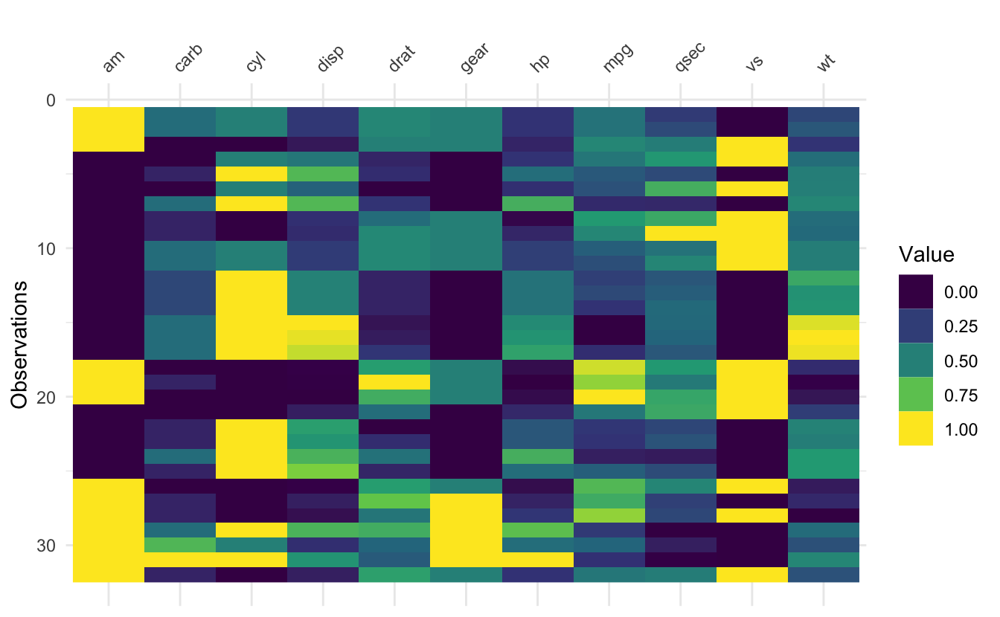
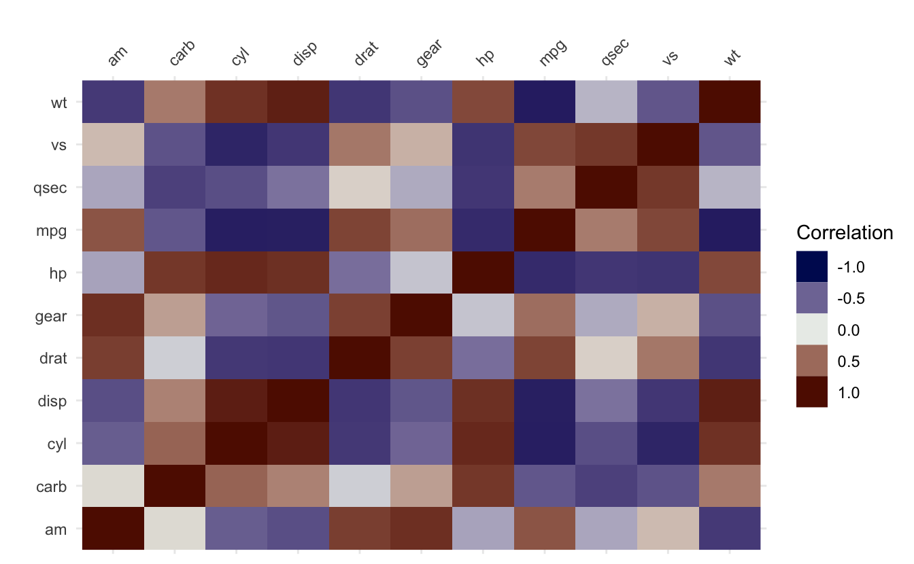
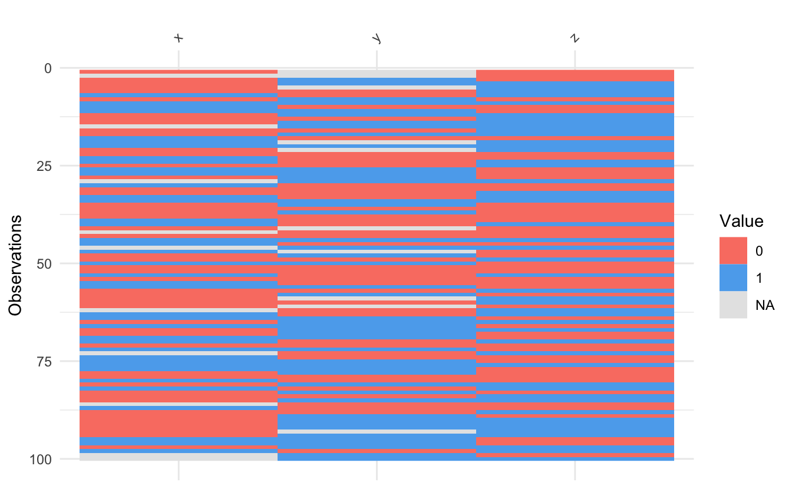
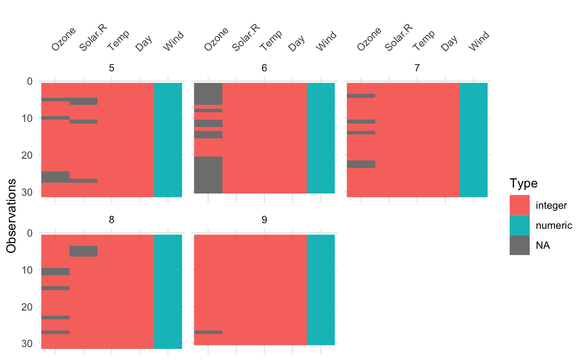
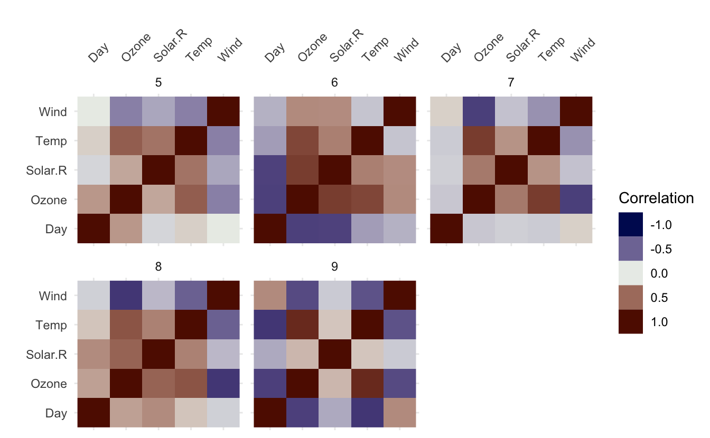
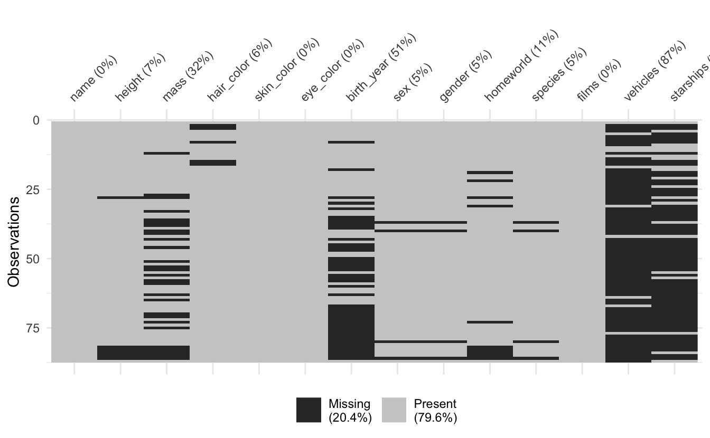
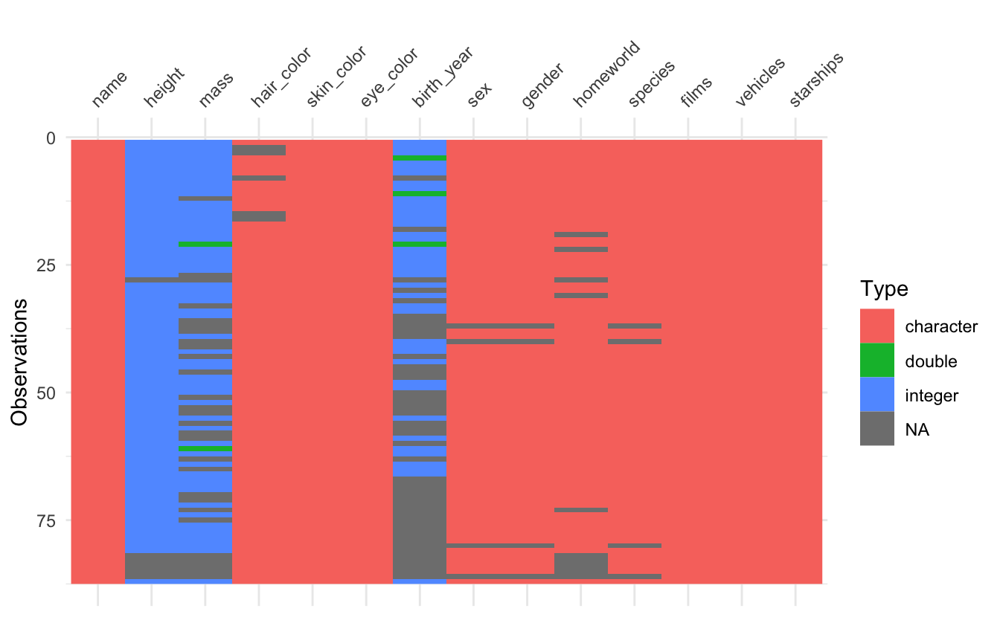
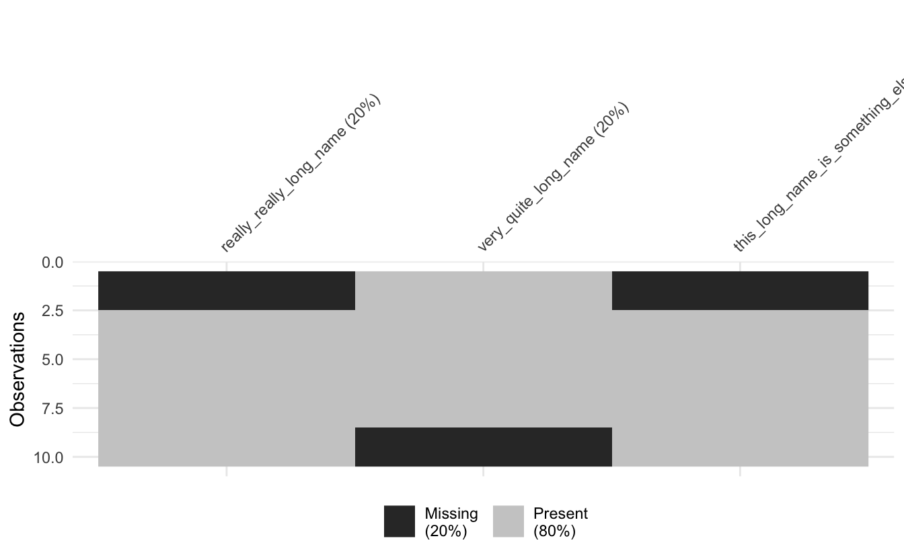

I'm please to say that visdat version 0.6.0 (codename: "Superman, Lazlo Bane") is now on CRAN. This is the first release in nearly 3 years, there are a couple of new functions for visualising numeric and binary data, as well as some maintenance and bug fixes.

Let's walk through some of the new features, bug fixes, and other misc changes.

# New Features

<pre class='chroma'><code class='language-r' data-lang='r'><a href='https://rdrr.io/r/base/options.html'>options</a>(tidyverse.quiet = TRUE)
<a href='https://rdrr.io/r/base/library.html'>library</a>(<a href='https://tidyverse.tidyverse.org'>tidyverse</a>)
<a href='https://rdrr.io/r/base/library.html'>library</a>(<a href='https://docs.ropensci.org/visdat/'>visdat</a>)</code></pre>

## `vis_value()` - visualise values

The idea of [`vis_value()`](https://docs.ropensci.org/visdat/reference/vis_value.html) is to visualise numeric data, so that you can get a quick idea of the values in your dataset. It does this by scaling all the data between 0 and 1, but it only works with numeric data.

<pre class='chroma'><code class='language-r' data-lang='r'><a href='https://docs.ropensci.org/visdat/reference/vis_value.html'>vis_value</a>(mtcars)
</code></pre>

It can be fun and interesting to arrange by a variable and then show see how that changes the plot.

<pre class='chroma'><code class='language-r' data-lang='r'><a href='https://docs.ropensci.org/visdat/reference/vis_cor.html'>vis_cor</a>(mtcars)
</code></pre>

<pre class='chroma'><code class='language-r' data-lang='r'>mtcars <a href='https://magrittr.tidyverse.org/reference/pipe.html'>%&gt;%</a> <a href='https://dplyr.tidyverse.org/reference/arrange.html'>arrange</a>(cyl) <a href='https://magrittr.tidyverse.org/reference/pipe.html'>%&gt;%</a> <a href='https://docs.ropensci.org/visdat/reference/vis_value.html'>vis_value</a>()
</code></pre>

Although fair warning that there's a whole set of statistics/data visualisation that focusses on how to arrange rows and columns - a technique called seriation. For a fun introduction, I'd recommend this lovely [blogpost](http://nicolas.kruchten.com/content/2018/02/seriation/) by [Nicholas Kruchten](https://github.com/nicolaskruchten). One day I will [implement seriation in visdat](https://github.com/ropensci/visdat/issues/8).

Note that if you use [`vis_value()`](https://docs.ropensci.org/visdat/reference/vis_value.html) on a dataset that isn't entirely numeric, you will get an error:

<pre class='chroma'><code class='language-r' data-lang='r'><a href='https://docs.ropensci.org/visdat/reference/vis_value.html'>vis_value</a>(diamonds)
#&gt; Error in `test_if_all_numeric()` at <a href='file:///Users/nick/github/njtierney/visdat/R/vis-value.R'>visdat/R/vis-value.R:33:2</a>:
#&gt; ! Data input can only contain numeric values
#&gt; Please subset the data to the numeric values you would like.
#&gt; `dplyr::select(&lt;data&gt;, where(is.numeric))`
#&gt; Can be helpful here!
</code></pre>

## `vis_binary()` visualise binary values

The [`vis_binary()`](https://docs.ropensci.org/visdat/reference/vis_binary.html) function is for visualising datasets with binary values - similar to [`vis_value()`](https://docs.ropensci.org/visdat/reference/vis_value.html), but just for binary data (0, 1, NA).

<pre class='chroma'><code class='language-r' data-lang='r'><a href='https://docs.ropensci.org/visdat/reference/vis_binary.html'>vis_binary</a>(dat_bin)
</code></pre>

Thank you to [Trish Gilholm](https://child-health-research.centre.uq.edu.au/profile/3264/trish-gilholm) for her suggested use case for this.

## Facetting in visdat

It is now possible to perform facetting for the following functions in visdat: [`vis_dat()`](https://docs.ropensci.org/visdat/reference/vis_dat.html), [`vis_cor()`](https://docs.ropensci.org/visdat/reference/vis_cor.html), and [`vis_miss()`](https://docs.ropensci.org/visdat/reference/vis_miss.html) via the `facet` argument. This lead to some internal cleaning up of package code (always fun to revisit some old code and refactor!) Here's an example of facetting:

<pre class='chroma'><code class='language-r' data-lang='r'><a href='https://docs.ropensci.org/visdat/reference/vis_dat.html'>vis_dat</a>(airquality, facet = Month) 
</code></pre>

<pre class='chroma'><code class='language-r' data-lang='r'><a href='https://docs.ropensci.org/visdat/reference/vis_cor.html'>vis_cor</a>(airquality, facet = Month) 
</code></pre>

<pre class='chroma'><code class='language-r' data-lang='r'><a href='https://docs.ropensci.org/visdat/reference/vis_miss.html'>vis_miss</a>(airquality, facet = Month) 
</code></pre>

Notably for `vis_miss` when using facetting, you don't get column missingness summaries, as I couldn't quite work out how to do this for each facet.

Thank you to [Sam Firke's](https://twitter.com/samfirke/status/984425923243134976) initial tweet on this that inspired this, and [Jonathan Zadra's](https://github.com/jzadra) contributions in the [issue thread](https://github.com/ropensci/visdat/issues/78).

The next release will implement facetting for [`vis_value()`](https://docs.ropensci.org/visdat/reference/vis_value.html), [`vis_binary()`](https://docs.ropensci.org/visdat/reference/vis_binary.html), [`vis_compare()`](https://docs.ropensci.org/visdat/reference/vis_compare.html), [`vis_expect()`](https://docs.ropensci.org/visdat/reference/vis_expect.html), and [`vis_guess()`](https://docs.ropensci.org/visdat/reference/vis_guess.html) - see [#159](https://github.com/ropensci/visdat/issues/159) to keep track.

## Data methods for plotting

Related to facetting, I have implemented methods that provide data methods for plots with [`data_vis_dat()`](https://docs.ropensci.org/visdat/reference/data-vis-dat.html), [`data_vis_cor()`](https://docs.ropensci.org/visdat/reference/data-vis-cor.html), and [`data_vis_miss()`](https://docs.ropensci.org/visdat/reference/data-vis-miss.html):

<pre class='chroma'><code class='language-r' data-lang='r'><a href='https://docs.ropensci.org/visdat/reference/data-vis-dat.html'>data_vis_dat</a>(airquality)
#&gt; # A tibble: 918 × 4
#&gt;     rows variable valueType value
#&gt;    &lt;int&gt; &lt;chr&gt;    &lt;chr&gt;     &lt;chr&gt;
#&gt;  1     1 Day      integer   41   
#&gt;  2     1 Month    integer   190  
#&gt;  3     1 Ozone    integer   7.4  
#&gt;  4     1 Solar.R  integer   67   
#&gt;  5     1 Temp     integer   5    
#&gt;  6     1 Wind     numeric   1    
#&gt;  7     2 Day      integer   36   
#&gt;  8     2 Month    integer   118  
#&gt;  9     2 Ozone    integer   8    
#&gt; 10     2 Solar.R  integer   72   
#&gt; # … with 908 more rows
</code></pre>

<pre class='chroma'><code class='language-r' data-lang='r'><a href='https://docs.ropensci.org/visdat/reference/data-vis-miss.html'>data_vis_miss</a>(airquality)
#&gt; # A tibble: 918 × 4
#&gt;     rows variable valueType value
#&gt;    &lt;int&gt; &lt;chr&gt;    &lt;chr&gt;     &lt;chr&gt;
#&gt;  1     1 Day      FALSE     FALSE
#&gt;  2     1 Month    FALSE     FALSE
#&gt;  3     1 Ozone    FALSE     FALSE
#&gt;  4     1 Solar.R  FALSE     FALSE
#&gt;  5     1 Temp     FALSE     FALSE
#&gt;  6     1 Wind     FALSE     FALSE
#&gt;  7     2 Day      FALSE     FALSE
#&gt;  8     2 Month    FALSE     FALSE
#&gt;  9     2 Ozone    FALSE     FALSE
#&gt; 10     2 Solar.R  FALSE     FALSE
#&gt; # … with 908 more rows
</code></pre>

<pre class='chroma'><code class='language-r' data-lang='r'><a href='https://docs.ropensci.org/visdat/reference/data-vis-cor.html'>data_vis_cor</a>(airquality)
#&gt; # A tibble: 36 × 3
#&gt;    row_1   row_2     value
#&gt;    &lt;chr&gt;   &lt;chr&gt;     &lt;dbl&gt;
#&gt;  1 Ozone   Ozone    1     
#&gt;  2 Ozone   Solar.R  0.348 
#&gt;  3 Ozone   Wind    -0.602 
#&gt;  4 Ozone   Temp     0.698 
#&gt;  5 Ozone   Month    0.165 
#&gt;  6 Ozone   Day     -0.0132
#&gt;  7 Solar.R Ozone    0.348 
#&gt;  8 Solar.R Solar.R  1     
#&gt;  9 Solar.R Wind    -0.0568
#&gt; 10 Solar.R Temp     0.276 
#&gt; # … with 26 more rows
</code></pre>

The implementation of this works by providing these functions as S3 methods that have a `.grouped_df` method to facilitate plotting with facets.

<pre class='chroma'><code class='language-r' data-lang='r'>airquality <a href='https://magrittr.tidyverse.org/reference/pipe.html'>%&gt;%</a> <a href='https://dplyr.tidyverse.org/reference/group_by.html'>group_by</a>(Month) <a href='https://magrittr.tidyverse.org/reference/pipe.html'>%&gt;%</a> <a href='https://docs.ropensci.org/visdat/reference/data-vis-dat.html'>data_vis_dat</a>()
#&gt; # A tibble: 765 × 5
#&gt; # Groups:   Month [5]
#&gt;    Month  rows variable valueType value
#&gt;    &lt;int&gt; &lt;int&gt; &lt;chr&gt;    &lt;chr&gt;     &lt;chr&gt;
#&gt;  1     5     1 Day      integer   41   
#&gt;  2     5     1 Ozone    integer   190  
#&gt;  3     5     1 Solar.R  integer   7.4  
#&gt;  4     5     1 Temp     integer   67   
#&gt;  5     5     1 Wind     numeric   1    
#&gt;  6     5     2 Day      integer   36   
#&gt;  7     5     2 Ozone    integer   118  
#&gt;  8     5     2 Solar.R  integer   8    
#&gt;  9     5     2 Temp     integer   72   
#&gt; 10     5     2 Wind     numeric   2    
#&gt; # … with 755 more rows
</code></pre>

## Missing values show up in list columns

[`vis_dat()`](https://docs.ropensci.org/visdat/reference/vis_dat.html) [`vis_miss()`](https://docs.ropensci.org/visdat/reference/vis_miss.html) and [`vis_guess()`](https://docs.ropensci.org/visdat/reference/vis_guess.html) now render missing values in list-columns. Let's demonstrate this with the `star_wars` dataset from `dplyr`, which has a few list columns.

<pre class='chroma'><code class='language-r' data-lang='r'>starwars
#&gt; # A tibble: 87 × 14
#&gt;    name        height  mass hair_…¹ skin_…² eye_c…³ birth…⁴ sex   gender homew…⁵
#&gt;    &lt;chr&gt;        &lt;int&gt; &lt;dbl&gt; &lt;chr&gt;   &lt;chr&gt;   &lt;chr&gt;     &lt;dbl&gt; &lt;chr&gt; &lt;chr&gt;  &lt;chr&gt;  
#&gt;  1 Luke Skywa…    172    77 blond   fair    blue       19   male  mascu… Tatooi…
#&gt;  2 C-3PO          167    75 NA      gold    yellow    112   none  mascu… Tatooi…
#&gt;  3 R2-D2           96    32 NA      white,… red        33   none  mascu… Naboo  
#&gt;  4 Darth Vader    202   136 none    white   yellow     41.9 male  mascu… Tatooi…
#&gt;  5 Leia Organa    150    49 brown   light   brown      19   fema… femin… Aldera…
#&gt;  6 Owen Lars      178   120 brown,… light   blue       52   male  mascu… Tatooi…
#&gt;  7 Beru White…    165    75 brown   light   blue       47   fema… femin… Tatooi…
#&gt;  8 R5-D4           97    32 NA      white,… red        NA   none  mascu… Tatooi…
#&gt;  9 Biggs Dark…    183    84 black   light   brown      24   male  mascu… Tatooi…
#&gt; 10 Obi-Wan Ke…    182    77 auburn… fair    blue-g…    57   male  mascu… Stewjon
#&gt; # … with 77 more rows, 4 more variables: species &lt;chr&gt;, films &lt;list&gt;,
#&gt; #   vehicles &lt;list&gt;, starships &lt;list&gt;, and abbreviated variable names
#&gt; #   ¹​hair_color, ²​skin_color, ³​eye_color, ⁴​birth_year, ⁵​homeworld
</code></pre>

<pre class='chroma'><code class='language-r' data-lang='r'><a href='https://pillar.r-lib.org/reference/glimpse.html'>glimpse</a>(starwars)
#&gt; Rows: 87
#&gt; Columns: 14
#&gt; $ name       &lt;chr&gt; "Luke Skywalker", "C-3PO", "R2-D2", "Darth Vader", "Leia Or…
#&gt; $ height     &lt;int&gt; 172, 167, 96, 202, 150, 178, 165, 97, 183, 182, 188, 180, 2…
#&gt; $ mass       &lt;dbl&gt; 77.0, 75.0, 32.0, 136.0, 49.0, 120.0, 75.0, 32.0, 84.0, 77.…
#&gt; $ hair_color &lt;chr&gt; "blond", NA, NA, "none", "brown", "brown, grey", "brown", N…
#&gt; $ skin_color &lt;chr&gt; "fair", "gold", "white, blue", "white", "light", "light", "…
#&gt; $ eye_color  &lt;chr&gt; "blue", "yellow", "red", "yellow", "brown", "blue", "blue",…
#&gt; $ birth_year &lt;dbl&gt; 19.0, 112.0, 33.0, 41.9, 19.0, 52.0, 47.0, NA, 24.0, 57.0, …
#&gt; $ sex        &lt;chr&gt; "male", "none", "none", "male", "female", "male", "female",…
#&gt; $ gender     &lt;chr&gt; "masculine", "masculine", "masculine", "masculine", "femini…
#&gt; $ homeworld  &lt;chr&gt; "Tatooine", "Tatooine", "Naboo", "Tatooine", "Alderaan", "T…
#&gt; $ species    &lt;chr&gt; "Human", "Droid", "Droid", "Human", "Human", "Human", "Huma…
#&gt; $ films      &lt;list&gt; &lt;"The Empire Strikes Back", "Revenge of the Sith", "Return…
#&gt; $ vehicles   &lt;list&gt; &lt;"Snowspeeder", "Imperial Speeder Bike"&gt;, &lt;&gt;, &lt;&gt;, &lt;&gt;, "Imp…
#&gt; $ starships  &lt;list&gt; &lt;"X-wing", "Imperial shuttle"&gt;, &lt;&gt;, &lt;&gt;, "TIE Advanced x1",…
</code></pre>

<pre class='chroma'><code class='language-r' data-lang='r'><a href='https://docs.ropensci.org/visdat/reference/vis_dat.html'>vis_dat</a>(starwars)
</code></pre>

<pre class='chroma'><code class='language-r' data-lang='r'><a href='https://docs.ropensci.org/visdat/reference/vis_miss.html'>vis_miss</a>(starwars)
</code></pre>

<pre class='chroma'><code class='language-r' data-lang='r'><a href='https://docs.ropensci.org/visdat/reference/vis_guess.html'>vis_guess</a>(starwars)
</code></pre>

As you can see, lists are now displayed in the visualisation. Unfortunately `vis_guess` has trouble guessing lists, but that is a limitation due to how it guesses variable types.

Thank you to github user [cregouby](https://github.com/cregouby) for adding this in [#138](https://github.com/ropensci/visdat/pull/138).

## Abbreviation helpers

Long variable names can be annoying and can crowd a plot. The [`abbreviate_vars()`](https://docs.ropensci.org/visdat/reference/abbreviate_vars.html) function can be used to help with this:

<pre class='chroma'><code class='language-r' data-lang='r'>long_data &lt;- <a href='https://tibble.tidyverse.org/reference/tibble.html'>tibble</a>(
  really_really_long_name = <a href='https://rdrr.io/r/base/c.html'>c</a>(NA, NA, 1:8),
  very_quite_long_name = <a href='https://rdrr.io/r/base/c.html'>c</a>(-1:-8, NA, NA),
  this_long_name_is_something_else = <a href='https://rdrr.io/r/base/c.html'>c</a>(NA, NA,
                                       <a href='https://rdrr.io/r/base/seq.html'>seq</a>(from = 0, to = 1, length.out = 8))
)

<a href='https://docs.ropensci.org/visdat/reference/vis_miss.html'>vis_miss</a>(long_data)
</code></pre>

Ugh no good.

Use [`abbreviate_vars()`](https://docs.ropensci.org/visdat/reference/abbreviate_vars.html) to help:

<pre class='chroma'><code class='language-r' data-lang='r'>long_data <a href='https://magrittr.tidyverse.org/reference/pipe.html'>%&gt;%</a> <a href='https://docs.ropensci.org/visdat/reference/abbreviate_vars.html'>abbreviate_vars</a>() <a href='https://magrittr.tidyverse.org/reference/pipe.html'>%&gt;%</a> <a href='https://docs.ropensci.org/visdat/reference/vis_miss.html'>vis_miss</a>()
</code></pre>

You can control the length of the abbreviation with `min_length`:

<pre class='chroma'><code class='language-r' data-lang='r'>long_data <a href='https://magrittr.tidyverse.org/reference/pipe.html'>%&gt;%</a> <a href='https://docs.ropensci.org/visdat/reference/abbreviate_vars.html'>abbreviate_vars</a>(min_length = 5) <a href='https://magrittr.tidyverse.org/reference/pipe.html'>%&gt;%</a> <a href='https://docs.ropensci.org/visdat/reference/vis_miss.html'>vis_miss</a>()
</code></pre>

Under the hood this uses the base R function, [`abbreviate()`](https://rdrr.io/r/base/abbreviate.html) - a gem of a function.

Thank you to [chapau3](https://github.com/chapau3), and [ivanhanigan](https://github.com/ivanhanigan) for requesting this feature ([#140](https://github.com/ropensci/visdat/issues/140) and [#9](https://github.com/ropensci/visdat/issues/9)).

## Missingness percentages are now integers.

The [`vis_miss()`](https://docs.ropensci.org/visdat/reference/vis_miss.html) function shows a percentage missing of the missing values in each column - I've decided to make this round to integers, as it is only a guide and I found them to be a bit cluttered. I also do not like the idea of extracting summary statistics from graphics, so they now look like this:

<pre class='chroma'><code class='language-r' data-lang='r'><a href='https://docs.ropensci.org/visdat/reference/vis_miss.html'>vis_miss</a>(airquality)
</code></pre>

For more accurate representation of missingness summaries please use the [`naniar` R package](http://naniar.njtierney.com/) functions like [`miss_var_summary()`](https://rdrr.io/pkg/naniar/man/miss_var_summary.html):

<pre class='chroma'><code class='language-r' data-lang='r'><a href='https://rdrr.io/r/base/library.html'>library</a>(<a href='https://github.com/njtierney/naniar'>naniar</a>)
<a href='https://rdrr.io/pkg/naniar/man/miss_var_summary.html'>miss_var_summary</a>(airquality)
#&gt; # A tibble: 6 × 3
#&gt;   variable n_miss pct_miss
#&gt;   &lt;chr&gt;     &lt;int&gt;    &lt;dbl&gt;
#&gt; 1 Ozone        37    24.2 
#&gt; 2 Solar.R       7     4.58
#&gt; 3 Wind          0     0   
#&gt; 4 Temp          0     0   
#&gt; 5 Month         0     0   
#&gt; 6 Day           0     0
</code></pre>

Which also works with [`dplyr::group_by()`](https://dplyr.tidyverse.org/reference/group_by.html):

<pre class='chroma'><code class='language-r' data-lang='r'>airquality <a href='https://magrittr.tidyverse.org/reference/pipe.html'>%&gt;%</a> 
  <a href='https://dplyr.tidyverse.org/reference/group_by.html'>group_by</a>(Month) <a href='https://magrittr.tidyverse.org/reference/pipe.html'>%&gt;%</a> 
  <a href='https://rdrr.io/pkg/naniar/man/miss_var_summary.html'>miss_var_summary</a>()
#&gt; # A tibble: 25 × 4
#&gt; # Groups:   Month [5]
#&gt;    Month variable n_miss pct_miss
#&gt;    &lt;int&gt; &lt;chr&gt;     &lt;int&gt;    &lt;dbl&gt;
#&gt;  1     5 Ozone         5     16.1
#&gt;  2     5 Solar.R       4     12.9
#&gt;  3     5 Wind          0      0  
#&gt;  4     5 Temp          0      0  
#&gt;  5     5 Day           0      0  
#&gt;  6     6 Ozone        21     70  
#&gt;  7     6 Solar.R       0      0  
#&gt;  8     6 Wind          0      0  
#&gt;  9     6 Temp          0      0  
#&gt; 10     6 Day           0      0  
#&gt; # … with 15 more rows
</code></pre>

If you find that this really bothers you and you want to have control over the percentage missingness in the columns, please file an issue on visdat and I will look into adding more user control. Ideally I would have added control for users in the first place, but it just wasn't something I was certain users wanted, and would require more arguments to a function, which require more tests...and so on. So with the mindset of keeping this package easy to maintain, I figured this might be the easiest way forward.

## Bug Fixes and Other changes

Here is a quick listing of the other changes in this release of visdat:

-   No longer use `gather` internally: [#141](https://github.com/ropensci/visdat/issues/141)
-   Resolve bug where [`vis_value()`](https://docs.ropensci.org/visdat/reference/vis_value.html) displayed constant values as NA values [128](https://github.com/ropensci/visdat/issues/128) - these constant values are now shown as 1.
-   Removed use of the now deprecated "aes_string" from ggplot2
-   Output of plot in `vis_expect` would reorder columns ([#133](https://github.com/ropensci/visdat/issues/133)), fixed in [#143](https://github.com/ropensci/visdat/pull/134) by [muschellij2](https://github.com/muschellij2).
-   A new vignette on customising colour palettes in visdat, "Customising colour palettes in visdat".
-   No longer uses gdtools for testing [#145](https://github.com/ropensci/visdat/issues/145)
-   Use `cli` internally for error messages.
-   Speed up some internal functions

# Thanks

Thank you to all the users who contributed to this release!

[muschellij2](https://github.com/muschellij2), [chapau3](https://github.com/chapau3), [ivanhanigan](https://github.com/ivanhanigan), [cregouby](https://github.com/cregouby), [jzadra](https://github.com/jzadra).

