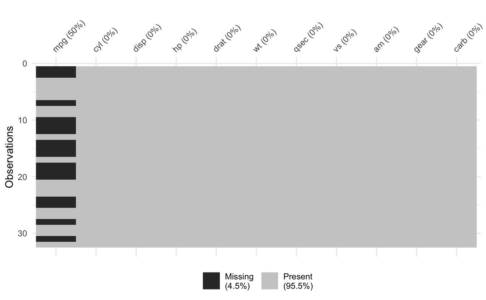
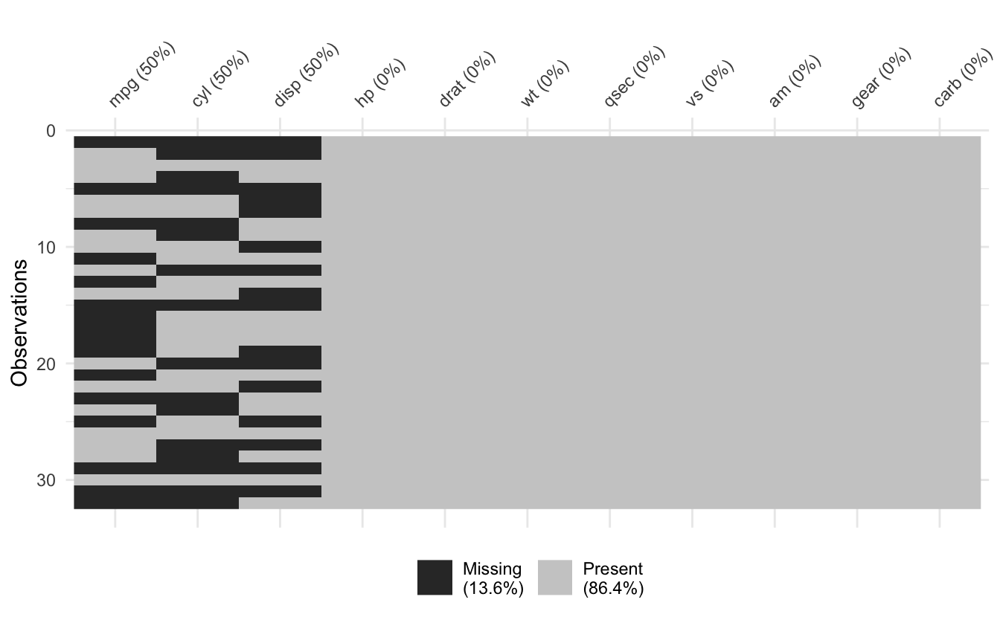

# naniar 1.0.0

I'm very pleased to announce that naniar version 1.0.0 is now on CRAN!

Version 1.0.0 of naniar is to signify that this release is associated with the publication of the associated JSS paper <doi:10.18637/jss.v105.i07> (!!!). This paper has been the labour of a lot of effort between myself and [Di Cook](http://www.dicook.org/), and I am very excited to be able to share it.

There is still a lot to do in naniar, and this release does not signify that there are no changes upcoming. It is a 1.0.0 release to establish that this is a stable release, and any changes upcoming will go through a more formal deprecation process.

Here's a brief description of some of the changes in this release

# New things

## JSS publication

You can now retrieve a citation for `naniar` with [`citation()`](https://rdrr.io/r/utils/citation.html):

<pre class='chroma'><code class='language-r' data-lang='r'><a href='https://rdrr.io/r/utils/citation.html'>citation</a>("naniar")
#&gt; 
#&gt; To cite naniar in publications use:
#&gt; 
#&gt;   Tierney N, Cook D (2023). "Expanding Tidy Data Principles to
#&gt;   Facilitate Missing Data Exploration, Visualization and Assessment of
#&gt;   Imputations." _Journal of Statistical Software_, *105*(7), 1-31.
#&gt;   doi:10.18637/jss.v105.i07 &lt;https://doi.org/10.18637/jss.v105.i07&gt;.
#&gt; 
#&gt; A BibTeX entry for LaTeX users is
#&gt; 
#&gt;   @Article&#123;,
#&gt;     title = &#123;Expanding Tidy Data Principles to Facilitate Missing Data Exploration, Visualization and Assessment of Imputations&#125;,
#&gt;     author = &#123;Nicholas Tierney and Dianne Cook&#125;,
#&gt;     journal = &#123;Journal of Statistical Software&#125;,
#&gt;     year = &#123;2023&#125;,
#&gt;     volume = &#123;105&#125;,
#&gt;     number = &#123;7&#125;,
#&gt;     pages = &#123;1--31&#125;,
#&gt;     doi = &#123;10.18637/jss.v105.i07&#125;,
#&gt;   &#125;
</code></pre>

## Set missing values with `set_n_miss()` and `set_prop_miss()`

These functions allow you to set a random amount of missingness either as a number of values, or as a proportion:

<pre class='chroma'><code class='language-r' data-lang='r'><a href='https://rdrr.io/r/base/library.html'>library</a>(<a href='https://github.com/njtierney/naniar'>naniar</a>)
vec &lt;- 1:10
# different each time
<a href='https://rdrr.io/pkg/naniar/man/set-prop-n-miss.html'>set_n_miss</a>(vec, n = 1)
#&gt;  [1] NA  2  3  4  5  6  7  8  9 10
<a href='https://rdrr.io/pkg/naniar/man/set-prop-n-miss.html'>set_n_miss</a>(vec, n = 1)
#&gt;  [1]  1  2  3  4  5  6  7  8  9 NA

<a href='https://rdrr.io/pkg/naniar/man/set-prop-n-miss.html'>set_prop_miss</a>(vec, prop = 0.2)
#&gt;  [1] NA  2  3 NA  5  6  7  8  9 10
<a href='https://rdrr.io/pkg/naniar/man/set-prop-n-miss.html'>set_prop_miss</a>(vec, prop = 0.6)
#&gt;  [1]  1 NA NA  4 NA NA NA  8  9 NA
</code></pre>

I would suggest that these functions are used inside a dataframe. I will provide a few examples below using `dplyr`. For just one variable, you could set missingness like so:

<pre class='chroma'><code class='language-r' data-lang='r'><a href='https://rdrr.io/r/base/library.html'>library</a>(<a href='https://tidyverse.tidyverse.org'>tidyverse</a>)
#&gt; ── Attaching packages ───────────────────────────── tidyverse 1.3.2 ──
#&gt; ✔ ggplot2 3.4.0     ✔ purrr   1.0.1
#&gt; ✔ tibble  3.1.8     ✔ dplyr   1.1.0
#&gt; ✔ tidyr   1.3.0     ✔ stringr 1.5.0
#&gt; ✔ readr   2.1.3     ✔ forcats 1.0.0
#&gt; ── Conflicts ──────────────────────────────── tidyverse_conflicts() ──
#&gt; ✖ dplyr::filter() masks stats::filter()
#&gt; ✖ dplyr::lag()    masks stats::lag()
mtcars_df &lt;- <a href='https://tibble.tidyverse.org/reference/as_tibble.html'>as_tibble</a>(mtcars)

<a href='https://docs.ropensci.org/visdat/reference/vis_miss.html'>vis_miss</a>(mtcars_df)
</code></pre>

<pre class='chroma'><code class='language-r' data-lang='r'>
mtcars_miss_mpg &lt;- mtcars_df <a href='https://magrittr.tidyverse.org/reference/pipe.html'>%&gt;%</a> 
  <a href='https://dplyr.tidyverse.org/reference/mutate.html'>mutate</a>(mpg = <a href='https://rdrr.io/pkg/naniar/man/set-prop-n-miss.html'>set_prop_miss</a>(mpg, 0.5))

<a href='https://docs.ropensci.org/visdat/reference/vis_miss.html'>vis_miss</a>(mtcars_miss_mpg)
</code></pre>

Or add missingness to a few variables:

<pre class='chroma'><code class='language-r' data-lang='r'>mtcars_miss_some &lt;- mtcars_df <a href='https://magrittr.tidyverse.org/reference/pipe.html'>%&gt;%</a> 
  <a href='https://dplyr.tidyverse.org/reference/mutate.html'>mutate</a>(
    <a href='https://dplyr.tidyverse.org/reference/across.html'>across</a>(
      <a href='https://rdrr.io/r/base/c.html'>c</a>(mpg, cyl, disp),
      \(x) <a href='https://rdrr.io/pkg/naniar/man/set-prop-n-miss.html'>set_prop_miss</a>(x, 0.5)
    )
  )

mtcars_miss_some
#&gt; # A tibble: 32 × 11
#&gt;      mpg   cyl  disp    hp  drat    wt  qsec    vs    am  gear  carb
#&gt;    &lt;dbl&gt; &lt;dbl&gt; &lt;dbl&gt; &lt;dbl&gt; &lt;dbl&gt; &lt;dbl&gt; &lt;dbl&gt; &lt;dbl&gt; &lt;dbl&gt; &lt;dbl&gt; &lt;dbl&gt;
#&gt;  1  NA      NA   NA    110  3.9   2.62  16.5     0     1     4     4
#&gt;  2  21      NA   NA    110  3.9   2.88  17.0     0     1     4     4
#&gt;  3  22.8     4  108     93  3.85  2.32  18.6     1     1     4     1
#&gt;  4  21.4    NA  258    110  3.08  3.22  19.4     1     0     3     1
#&gt;  5  NA      NA   NA    175  3.15  3.44  17.0     0     0     3     2
#&gt;  6  18.1     6   NA    105  2.76  3.46  20.2     1     0     3     1
#&gt;  7  14.3     8   NA    245  3.21  3.57  15.8     0     0     3     4
#&gt;  8  NA      NA  147.    62  3.69  3.19  20       1     0     4     2
#&gt;  9  22.8    NA  141.    95  3.92  3.15  22.9     1     0     4     2
#&gt; 10  19.2     6   NA    123  3.92  3.44  18.3     1     0     4     4
#&gt; # … with 22 more rows

<a href='https://docs.ropensci.org/visdat/reference/vis_miss.html'>vis_miss</a>(mtcars_miss_some)
</code></pre>

Or you can add missingness to all variables like so:

<pre class='chroma'><code class='language-r' data-lang='r'>mtcars_miss_all &lt;- mtcars_df <a href='https://magrittr.tidyverse.org/reference/pipe.html'>%&gt;%</a> 
  <a href='https://dplyr.tidyverse.org/reference/mutate.html'>mutate</a>(
    <a href='https://dplyr.tidyverse.org/reference/across.html'>across</a>(
      <a href='https://tidyselect.r-lib.org/reference/everything.html'>everything</a>(),
      \(x) <a href='https://rdrr.io/pkg/naniar/man/set-prop-n-miss.html'>set_prop_miss</a>(x, 0.5)
    )
  )

mtcars_miss_all
#&gt; # A tibble: 32 × 11
#&gt;      mpg   cyl  disp    hp  drat    wt  qsec    vs    am  gear  carb
#&gt;    &lt;dbl&gt; &lt;dbl&gt; &lt;dbl&gt; &lt;dbl&gt; &lt;dbl&gt; &lt;dbl&gt; &lt;dbl&gt; &lt;dbl&gt; &lt;dbl&gt; &lt;dbl&gt; &lt;dbl&gt;
#&gt;  1  NA      NA  160    110  3.9   2.62  16.5    NA    NA     4    NA
#&gt;  2  21      NA   NA    110  3.9   2.88  17.0     0     1    NA    NA
#&gt;  3  22.8     4   NA     NA NA    NA     18.6     1    NA     4    NA
#&gt;  4  NA      NA   NA    110 NA    NA     19.4    NA    NA    NA     1
#&gt;  5  NA       8   NA     NA NA     3.44  NA      NA    NA     3     2
#&gt;  6  18.1     6  225     NA NA    NA     20.2     1     0     3     1
#&gt;  7  NA      NA   NA     NA  3.21  3.57  NA       0    NA    NA     4
#&gt;  8  24.4    NA  147.    NA  3.69  3.19  20      NA    NA     4     2
#&gt;  9  NA       4  141.    95  3.92  3.15  22.9    NA     0    NA    NA
#&gt; 10  NA      NA  168.   123  3.92 NA     NA      NA     0     4     4
#&gt; # … with 22 more rows

<a href='https://docs.ropensci.org/visdat/reference/vis_miss.html'>vis_miss</a>(mtcars_miss_all)
</code></pre>

<pre class='chroma'><code class='language-r' data-lang='r'>
<a href='https://rdrr.io/pkg/naniar/man/miss_var_summary.html'>miss_var_summary</a>(mtcars_miss_all)
#&gt; # A tibble: 11 × 3
#&gt;    variable n_miss pct_miss
#&gt;    &lt;chr&gt;     &lt;int&gt;    &lt;dbl&gt;
#&gt;  1 mpg          16       50
#&gt;  2 cyl          16       50
#&gt;  3 disp         16       50
#&gt;  4 hp           16       50
#&gt;  5 drat         16       50
#&gt;  6 wt           16       50
#&gt;  7 qsec         16       50
#&gt;  8 vs           16       50
#&gt;  9 am           16       50
#&gt; 10 gear         16       50
#&gt; 11 carb         16       50
</code></pre>

This resolves [#298](https://github.com/njtierney/naniar/issues/298).

## Bug Fixes and other small changes

-   Replaced [`tidyr::gather`](https://tidyr.tidyverse.org/reference/gather.html) with [`tidyr::pivot_longer`](https://tidyr.tidyverse.org/reference/pivot_longer.html) ([#301](https://github.com/njtierney/naniar/issues/301))

-   Fixed bug in [`gg_miss_var()`](https://rdrr.io/pkg/naniar/man/gg_miss_var.html) where a warning appears to due change in how to remove legend ([#288](https://github.com/njtierney/naniar/issues/288)).

-   Removed package `gdtools` as it is no longer needed ([302](https://github.com/njtierney/naniar/issues/302)).

-   Imported the packages, `vctrs` and `cli` to assist with internal checking and error messages. Both of these packages are "free" dependencies, as they imported by existing dependencies, `dplyr` and `ggplot2`.

# Some thank yous

Thank you to everyone who has contributed to this release! Especially the following people: [@ddauber](https://github.com/ddauber), [@davidgohel](https://github.com/davidgohel).

I am also excited to announce that I have been supported by the R Consortium to improve how R handles missing values! Through this grant, I will be improving the R packages `naniar` and `visdat`. I will be posting more details about this soon, but what this means for you the user is that there will be more updates and improvements to both of these packages in the coming months. Stay tuned.

