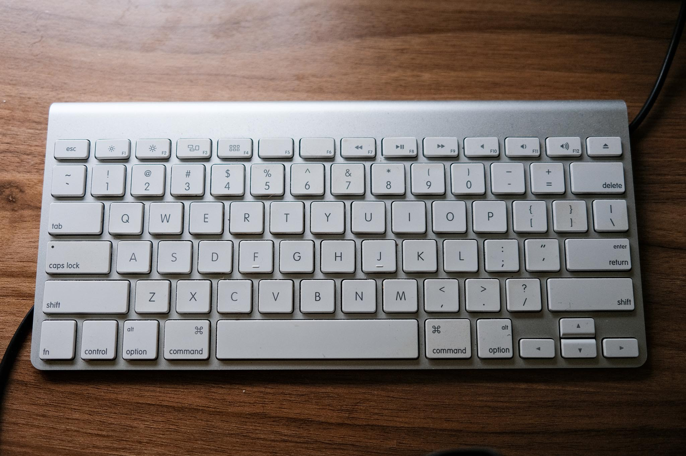
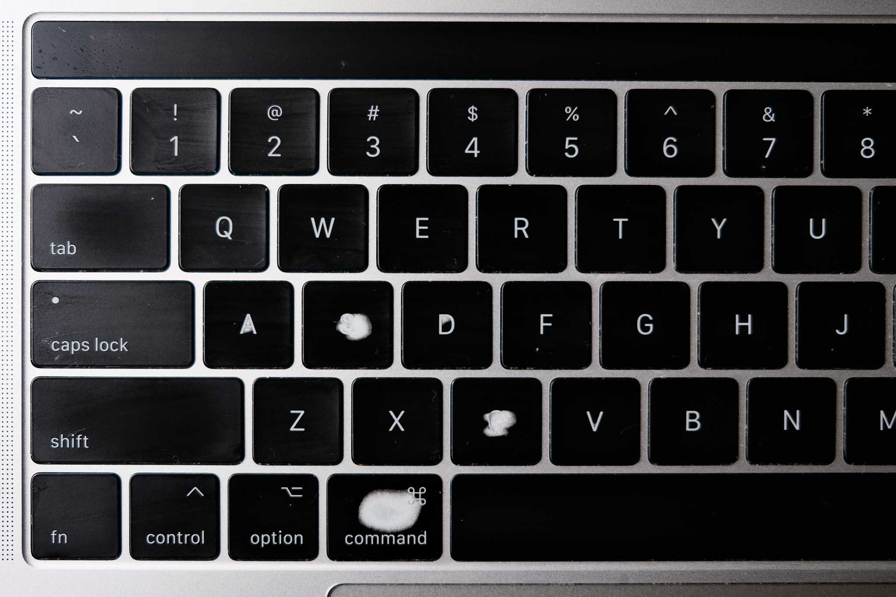

<figure>

<figcaption aria-hidden="true">Full Send. A blank trail blaze with a fun message. Fuji X100V</figcaption>
</figure>

Previously, I wrote a blog post, ["How to get good with R"](https://www.njtierney.com/post/2023/11/10/how-to-get-good-with-r/), where I touched on a bunch of ideas on how to improve your R skills, focussing on the coding aspect. It is by no means definitive, and I kind of wish I had named it "How to improve your R skills" or something less grandiose. But it was a catchy title. Anyway, I digress. I said I would write another post about the non coding side, but it started to get really big, so I'm breaking them into smaller blog posts, as I think this gives me a bit more mental space to write well on a smaller topic. I will be linking the posts below here as I write them.

## Motivation

Here's the jam - if you can type faster, then you operate closer to the speed of thought. It's not just about working faster, as much as it is about being able to clearly express what is in your head. I think when you can clearly express what is in your head, then you put yourself in a good position to enter the wonderful [flow state](https://en.wikipedia.org/wiki/Flow_(psychology)) of programming. Flow state, "in the zone", is where you are completely absorbed, enjoying what you are doing, and things often feel easy and make sense. It's a good thing. And when you are typing fast, and accurately, you aren't making too many small stumbling mistakes that would take you out of the flow state. Similarly, when you can use keyboard shortcuts, you are getting more of what is in your head onto the screen fluently, which helps you stay in the flow state.

## Typing accurately and fast

<figure>

<figcaption aria-hidden="true">My (not entirely clean) Keyboard, Fuji X100V</figcaption>
</figure>

Hadley Wickham [tweeted about typing speed back in 2019](https://twitter.com/hadleywickham/status/1169603647614967808?lang=en). My friend [Miles](https://milesmcbain.xyz/) had written something about this, I think - although I can't find it on his blog or twitter. But Miles noticed that an improvement in his typing speed helped him stay in the programming flow state. He was already a very talented programmer at this stage, so it's basically like giving Usain Bolt a pair of roller skates and asking him to race someone downhill.

I don't think being a fast typist is **necessary** to be a better programmer, but I think tools that help you work faster and with less resistance are good. I remember changing to a [new keyboard](https://ergodox-ez.com/), and I felt this friction where I couldn't put what was in my head onto the screen. I felt like I was slow - like I was walking around with a bunch of ankle weights and a large unwieldy backpack. Like a lot of things in life, taking time to revisit the basics helps you with more advanced skills. I took time every day for a couple of months to work on my typing speed, and it resulted in more accurate, faster typing. Which resulted in faster coding. I ended up ditching the new keyboard, but I kept my typing skills.

There are a lot of options out there for programs to help with typing speed. It's important to remember to focus on accuracy first. There's not a lot of benefit to being able to type the wrong and intelligible words really quickly. I liked [keybr](https://www.keybr.com/) a lot, and I've heard good things about [monkeytype](https://monkeytype.com/).

Also worth noting that I don't think you need to get a new keyboard to be a faster at typing. I still think that my old mac wireless keyboard (pictured above) is my favourite. I've spent a lot of time and money trying to find a good keyboard. I'm not there yet. I think it is a better use of your time to practice typing, than to buy a new keyboard. But hey, you might find that isn't true for you! Get the keyboard if you want it, I say.

## Use keyboard shortcuts

<figure>

<figcaption aria-hidden="true">My old laptop keyboard with some worn down shortcut keys. Fuji X100V</figcaption>
</figure>

Learn some keyboard shortcuts, it saves not just keystrokes or your time, but it helps you operate a bit closer to the speed of thought. Here are some shorcuts I use that aren't R related a lot:

-   `Cmd / Ctrl + C`: copy
-   `Cmd / Ctrl + V`: paste
-   `Cmd / Ctrl + X`: cut
-   `Cmd / Ctrl + Z`: undo last action
-   `Cmd / Ctrl + Shift + Z`: reverse the undo
-   `Cmd / Ctrl + Tab`: change application
-   `Cmd / Ctrl` + <kbd>~</kbd>: change window within an application
-   `Cmd + Space`: open up "spotlight" in mac, allowing you to search for files
-   `Ctrl + Space`: open up "Alfred", which I have configured to look for RStudio project files ([see Hadley Wickham's video on workflow](https://www.youtube.com/watch?v=boKFxBniUH0)).
-   `Cmd / Ctrl + Shift + 4`: open screenshot tool

I use a screenshot tool, [shottr](https://shottr.cc/), for Mac that gives you better control of screenshots - opening up a window that lets you crop an image, get colour swatches, save the screenshot to a given directory. It's really nice, and it's free.

In a web browser:

-   `Cmd / Ctrl + Alt + Left / Right`: move one browser tab to the left or right
-   `Cmd / Ctrl + L`: move cursor to browser
-   `Cmd / Ctrl + T`: create a new tab
-   `Cmd / Ctrl + W`: close current tab
-   `Cmd / Ctrl + Shift + T`: open up last closed tab
-   `Cmd / Ctrl + F`: Search for a word. I use this across all sorts of apps, PDFs, web browsing, and any code.

(Some of) My favourite shortcuts I use in R:

-   `Cmd / Ctrl + Enter`: run line of code

-   `Cmd / Ctrl + C`: comment/Uncomment current line

-   `Cmd / Ctrl + Shift + K`: knit/render document

-   `Cmd / Ctrl + Shift + A`: format highlighted code (style the code)

-   `Cmd / Ctrl + D`: delete current line

-   `Alt + Up / Down`: yank line up or down

-   `Cmd / Ctrl` + <kbd>click</kbd> (on a function): take to function definition

-   `Cmd / Ctrl + Alt + I`: new code chunk

-   `Cmd / Ctrl + Shift + F`: find in files. Search a whole directory, or a specified directory, for files

-   `Cmd / Ctrl + Alt + Up / Down`: copy the above line (or selected lines) down or up. Really useful when you want to copy/paste something. Basically copy/paste, but just that little bit quicker.

-   `Ctrl` + <kbd>.</kbd>: go to file/function name. Really useful.

-   `Cmd / Ctrl + Shift + Enter`: run all code in current code chunk or script

-   `Ctrl + Alt + Up / Down`: multiple cursors (!) extend cursor up or down

-   `Cmd / Ctrl + Left / Right`: move the cursor to the end or the beginning of the line

-   `Alt + Left / Right`: move the cursor one word across (combine with `Shift` to select one/multiple words)

It is a small but very useful benefit with being able to move the cursor across by one word or jumping to the start or end of a line. It means you don't have to lean on the left or right arrow key to end up where you want - you speed up that process quite a bit!

You can see a quick menu display shortcuts in RStudio with: `Alt + Shift + K` (press `Esc` to remove the screen)

And you can see all shortcuts and set your own shortcuts in Rstudio by navigating to "Keyboard Shortcuts Help" (Tools \> "Keyboard Shortcuts Help") ([Official notes on customising keyboard shortcuts in the RStudio IDE](https://support.posit.co/hc/en-us/articles/206382178-Customizing-Keyboard-Shortcuts)).

Some packages add keyboard shortcuts as "add-ins" in RStudio, which you can then add as shortcuts using "keyboards shortcuts help".

Some examples of these add in shortcuts are:

-   Render reprex based on selection (I set mine to `Cmd / Ctrl + Shift + R`) (must have reprex package installed)
-   define function at cursor using [`fnmate`](https://github.com/milesmcbain/fnmate) (very much worth a look, this has accelerated my functional programming).

[Garrick Aden-Buie](https://www.garrickadenbuie.com/) also has a nice R package that allows you to set other keyboard shortcuts, [`shrtcts`](https://github.com/gadenbuie/shrtcts)

I really like using my keyboard shorcuts, they help me more fluidly move between tasks, and help me stay in that flow state, that zone.

### A brief note about vim and emacs and friends

All these keyboard shortcuts are super useful. So much so that there are whole other ecosystems that are built on nice shortcuts. Both emacs and vim are pieces of software/philosophies that take this shortcut idea to another level. I personally don't use them, but I know plenty of people who do use them, and really enjoy doing so.

A word of warning, if you use vim - know how get out of vim: `Esc` then <kbd>:</kbd> then <kbd>q</kbd>, then `Enter`. If you want to learn the basics of vim, [openvim](https://www.openvim.com/) and [vim-adventures](https://vim-adventures.com/) are great. You can set RStudio to use vim or emacs key bindings if you want (see Tools \> Global Options \> Code \> Editing Tab \> Keybindings), but I haven't used this before, so I'm not sure what the experience is like.

## End

I hope that these are helpful tips! Are there any keyboard shortcuts I missed? Ones that you particularly like? Other points on typing speed or ways to get faster?

