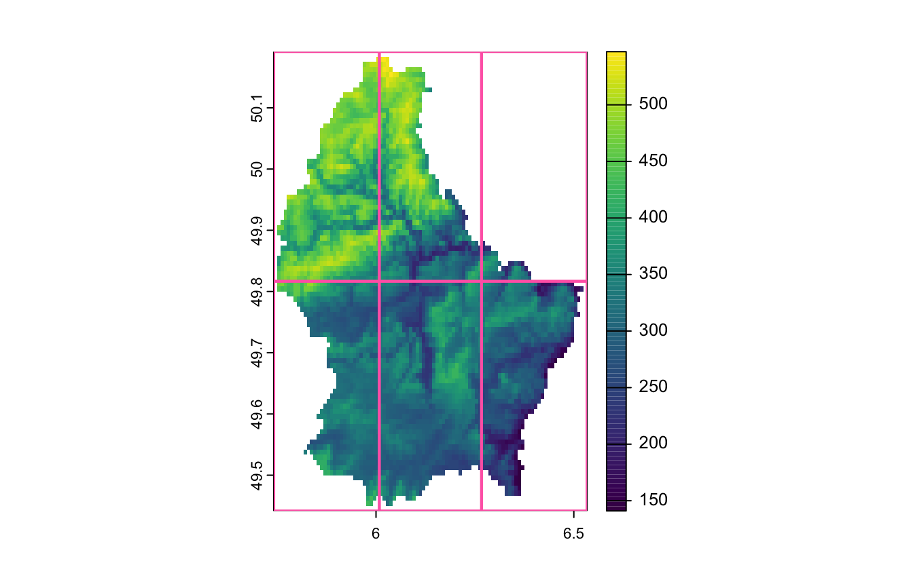
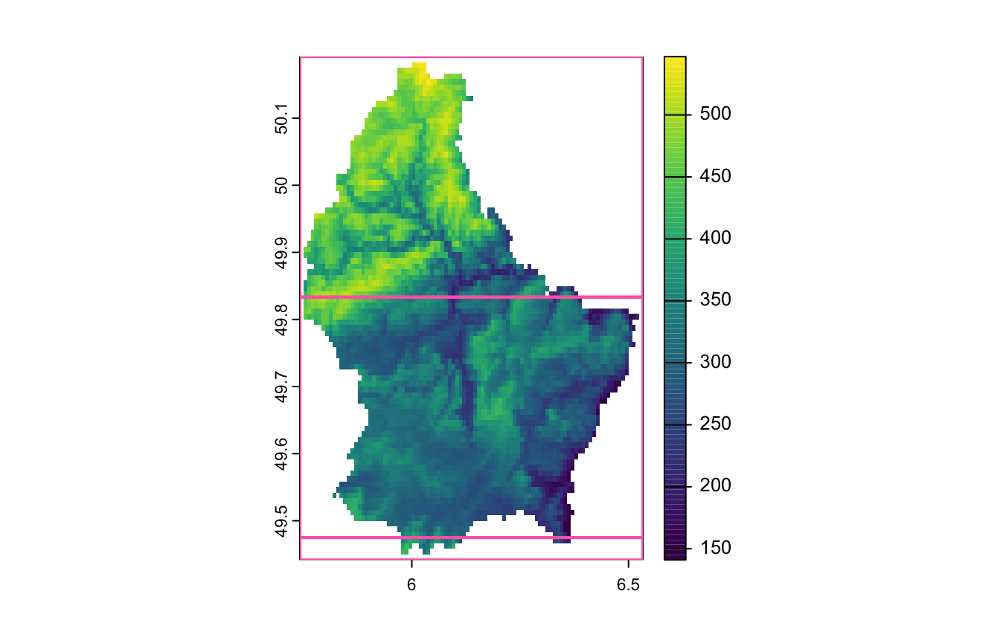

I'm super stoked to announce [{geotargets}](https://njtierney.github.io/geotargets/) version 0.2.0! The [{geotargets}](https://njtierney.github.io/geotargets/) package extends [{targets}](https://docs.ropensci.org/targets/) to work with geospatial data formats.

I'd like to firstly acknowledge the strong work by [Eric Scott](https://ericrscott.com/) on getting this release ready. I do want to emphasise that while post is on my website, this project is very much a team effort.

You can download [{geotargets}](https://njtierney.github.io/geotargets/) from the R universe like so:

``` r
install.packages("geotargets", repos = c("https://njtierney.r-universe.dev", "https://cran.r-project.org"))
```

# Why should I use geotargets and targets?

You could benefit from using targets and geotargets if you do geospatial data analysis involving rasters or shapefiles, specifically with terra or stars R packages. For example, if you are doing large downloads of rasters, then operations like cropping, reprojection, resampling, and masking.

The main benefit to using targets and geotargets is your analysis will only rerun when you change relevant parts of your data analysis. For example, you might do a lot of geospatial data processing that feeds downstream into a machine learning model to make predictions on bushfire risk. Writing with targets and geotargets means if you change the parts of the code that related to the machine learning components, then only the relevant parts with machine learning would change. This means you can save time by avoiding running computational expensive spatial data processing.

For more details on what targets is, and why we need geotargets, I would recommend reading the [0.1.0 release blog post](https://www.njtierney.com/post/2024/05/27/geotargets-0-1-0/), as well as [reading the {targets} manual](https://books.ropensci.org/targets/). The ["Get started in 4 minutes"](https://github.com/ropensci/targets/?tab=readme-ov-file#get-started-in-4-minutes) guide to targets is also excellent.

# Main changes in 0.2.0?

In addition to smaller changes and improvements, there are three main additions in this release:

-   Support for [dynamic branching](https://books.ropensci.org/targets/dynamic.html#about-dynamic-branching).
-   Preserving spatRaster metadata.
-   Support of `stars` and `stars_proxy`.

And very in very exciting news, we have a new hex sticker!

Thanks to [Eric Scott](https://ericrscott.com/) and [Hubert Hałun](https://www.linkedin.com/in/huberthalun/?originalSubdomain=pl) for their work on getting this together, we are really happy with the new sticker!

<figure>

<figcaption aria-hidden="true">geotargets hex sticker</figcaption>
</figure>

## Dynamic Branching

The main addition in this release is a demonstration of using [dynamic branching](https://books.ropensci.org/targets/dynamic.html#about-dynamic-branching) using a new "target factory" function, [`tar_terra_tiles()`](https://njtierney.github.io/geotargets/reference/tar_terra_tiles.html). This allows you to break raster operations into tiles, and then perform these operations on the tiles and combine them together. This means we can break computationally intensive raster operations that work in pixel-wise manner over tiled subsets of the raster. This is useful when, for example, loading an entire raster into memory and doing computations on it results in out of memory errors.

As part of this addition, we created helper functions:

-   [`tile_n()`](https://njtierney.github.io/geotargets/reference/tile_helpers.html)
-   [`tile_grid()`](https://njtierney.github.io/geotargets/reference/tile_helpers.html), and
-   [`tile_blocksize()`](https://njtierney.github.io/geotargets/reference/tile_helpers.html).

These help us define different extents that we can pass along as different parts of the dynamic branches. You can think of these as tools that we can use to specify how to slice, or tile up, a raster into smaller pieces that we can then do analysis on separately and combine later.

Let's briefly unpack these, and then show how these would be used in dynamic branching. First let's read in some example elevation data from terra and plot it:

<div class="highlight">

<pre class='chroma'><code class='language-r' data-lang='r'><span><span class='nv'>f</span> <span class='o'>&lt;-</span> <span class='nf'><a href='https://rdrr.io/r/base/system.file.html'>system.file</a></span><span class='o'>(</span><span class='s'>"ex/elev.tif"</span>, package<span class='o'>=</span><span class='s'>"terra"</span><span class='o'>)</span></span>
<span><span class='nv'>r</span> <span class='o'>&lt;-</span> <span class='nf'><a href='https://rspatial.github.io/terra/reference/rast.html'>rast</a></span><span class='o'>(</span><span class='nv'>f</span><span class='o'>)</span></span>
<span><span class='nf'><a href='https://rspatial.github.io/terra/reference/plot.html'>plot</a></span><span class='o'>(</span><span class='nv'>r</span><span class='o'>)</span></span>
</code></pre>


</div>

### `tile_n()`

We can use [`tile_n()`](https://njtierney.github.io/geotargets/reference/tile_helpers.html), which is the simplest of the three. It produces *about* `n` tiles in a grid.

<div class="highlight">

<pre class='chroma'><code class='language-r' data-lang='r'><span><span class='nv'>r_tile_4</span> <span class='o'>&lt;-</span> <span class='nf'><a href='https://njtierney.github.io/geotargets/reference/tile_helpers.html'>tile_n</a></span><span class='o'>(</span><span class='nv'>r</span>, <span class='m'>4</span><span class='o'>)</span></span>
<span><span class='c'>#&gt; creating 2 * 2 = 4 tile extents</span></span>
<span></span><span><span class='nv'>r_tile_4</span></span>
<span><span class='c'>#&gt; [[1]]</span></span>
<span><span class='c'>#&gt;      xmin      xmax      ymin      ymax </span></span>
<span><span class='c'>#&gt;  5.741667  6.141667 49.816667 50.191667 </span></span>
<span><span class='c'>#&gt; </span></span>
<span><span class='c'>#&gt; [[2]]</span></span>
<span><span class='c'>#&gt;      xmin      xmax      ymin      ymax </span></span>
<span><span class='c'>#&gt;  6.141667  6.533333 49.816667 50.191667 </span></span>
<span><span class='c'>#&gt; </span></span>
<span><span class='c'>#&gt; [[3]]</span></span>
<span><span class='c'>#&gt;      xmin      xmax      ymin      ymax </span></span>
<span><span class='c'>#&gt;  5.741667  6.141667 49.441667 49.816667 </span></span>
<span><span class='c'>#&gt; </span></span>
<span><span class='c'>#&gt; [[4]]</span></span>
<span><span class='c'>#&gt;      xmin      xmax      ymin      ymax </span></span>
<span><span class='c'>#&gt;  6.141667  6.533333 49.441667 49.816667</span></span>
<span></span></code></pre>

</div>

<div class="highlight">

<pre class='chroma'><code class='language-r' data-lang='r'><span><span class='c'># some plot helpers</span></span>
<span><span class='nv'>rect_extent</span> <span class='o'>&lt;-</span> <span class='kr'>function</span><span class='o'>(</span><span class='nv'>x</span>, <span class='nv'>...</span><span class='o'>)</span> <span class='o'>&#123;</span></span>
<span>  <span class='nf'><a href='https://rdrr.io/r/graphics/rect.html'>rect</a></span><span class='o'>(</span><span class='nv'>x</span><span class='o'>[</span><span class='m'>1</span><span class='o'>]</span>, <span class='nv'>x</span><span class='o'>[</span><span class='m'>3</span><span class='o'>]</span>, <span class='nv'>x</span><span class='o'>[</span><span class='m'>2</span><span class='o'>]</span>, <span class='nv'>x</span><span class='o'>[</span><span class='m'>4</span><span class='o'>]</span>, <span class='nv'>...</span><span class='o'>)</span></span>
<span><span class='o'>&#125;</span></span>
<span><span class='nv'>plot_extents</span> <span class='o'>&lt;-</span> <span class='kr'>function</span><span class='o'>(</span><span class='nv'>x</span>, <span class='nv'>...</span><span class='o'>)</span> <span class='o'>&#123;</span></span>
<span>  <span class='nf'><a href='https://rdrr.io/r/base/invisible.html'>invisible</a></span><span class='o'>(</span><span class='nf'><a href='https://rdrr.io/r/base/lapply.html'>lapply</a></span><span class='o'>(</span><span class='nv'>x</span>, <span class='nv'>rect_extent</span>, border <span class='o'>=</span> <span class='s'>"hotpink"</span>, lwd <span class='o'>=</span> <span class='m'>2</span><span class='o'>)</span><span class='o'>)</span></span>
<span><span class='o'>&#125;</span></span></code></pre>

</div>

<div class="highlight">

<pre class='chroma'><code class='language-r' data-lang='r'><span><span class='nf'><a href='https://rspatial.github.io/terra/reference/plot.html'>plot</a></span><span class='o'>(</span><span class='nv'>r</span><span class='o'>)</span></span>
<span><span class='nf'>plot_extents</span><span class='o'>(</span><span class='nv'>r_tile_4</span><span class='o'>)</span></span>
</code></pre>

<pre class='chroma'><code class='language-r' data-lang='r'><span><span class='nf'><a href='https://rspatial.github.io/terra/reference/plot.html'>plot</a></span><span class='o'>(</span><span class='nv'>r</span><span class='o'>)</span></span>
<span><span class='nf'><a href='https://njtierney.github.io/geotargets/reference/tile_helpers.html'>tile_n</a></span><span class='o'>(</span><span class='nv'>r</span>, <span class='m'>6</span><span class='o'>)</span> <span class='o'>|&gt;</span> <span class='nf'>plot_extents</span><span class='o'>(</span><span class='o'>)</span></span>
<span><span class='c'>#&gt; creating 2 * 3 = 6 tile extents</span></span>
<span></span></code></pre>


</div>

### `tile_grid()`

For more control, use [`tile_grid()`](https://njtierney.github.io/geotargets/reference/tile_helpers.html), which allows specification of the number of rows and columns to split the raster into. Here we are specify that we want three columns and 1 row:

<div class="highlight">

<pre class='chroma'><code class='language-r' data-lang='r'><span><span class='nv'>r_grid_3x1</span> <span class='o'>&lt;-</span> <span class='nf'><a href='https://njtierney.github.io/geotargets/reference/tile_helpers.html'>tile_grid</a></span><span class='o'>(</span><span class='nv'>r</span>, ncol <span class='o'>=</span> <span class='m'>3</span>, nrow <span class='o'>=</span> <span class='m'>1</span><span class='o'>)</span></span>
<span><span class='nv'>r_grid_3x1</span></span>
<span><span class='c'>#&gt; [[1]]</span></span>
<span><span class='c'>#&gt;      xmin      xmax      ymin      ymax </span></span>
<span><span class='c'>#&gt;  5.741667  6.008333 49.441667 50.191667 </span></span>
<span><span class='c'>#&gt; </span></span>
<span><span class='c'>#&gt; [[2]]</span></span>
<span><span class='c'>#&gt;      xmin      xmax      ymin      ymax </span></span>
<span><span class='c'>#&gt;  6.008333  6.266667 49.441667 50.191667 </span></span>
<span><span class='c'>#&gt; </span></span>
<span><span class='c'>#&gt; [[3]]</span></span>
<span><span class='c'>#&gt;      xmin      xmax      ymin      ymax </span></span>
<span><span class='c'>#&gt;  6.266667  6.533333 49.441667 50.191667</span></span>
<span></span><span><span class='nf'><a href='https://rspatial.github.io/terra/reference/plot.html'>plot</a></span><span class='o'>(</span><span class='nv'>r</span><span class='o'>)</span></span>
<span><span class='nf'>plot_extents</span><span class='o'>(</span><span class='nv'>r_grid_3x1</span><span class='o'>)</span></span>
</code></pre>

<pre class='chroma'><code class='language-r' data-lang='r'><span></span>
<span><span class='nf'><a href='https://rspatial.github.io/terra/reference/plot.html'>plot</a></span><span class='o'>(</span><span class='nv'>r</span><span class='o'>)</span></span>
<span><span class='nf'><a href='https://njtierney.github.io/geotargets/reference/tile_helpers.html'>tile_grid</a></span><span class='o'>(</span><span class='nv'>r</span>, ncol <span class='o'>=</span> <span class='m'>2</span>, nrow <span class='o'>=</span> <span class='m'>3</span><span class='o'>)</span> <span class='o'>|&gt;</span> <span class='nf'>plot_extents</span><span class='o'>(</span><span class='o'>)</span></span>
</code></pre>


</div>

### `tile_blocksize()`

The third included helper is [`tile_blocksize()`](https://njtierney.github.io/geotargets/reference/tile_helpers.html), which tiles by file **block size**. The **block size** is a property of raster files, and is the number of pixels (in the x and y direction) that is read into memory at a time. Tiling by multiples of block size may therefore be more efficient because only one block should need to be loaded to create each tile target. You can find the blocksize with `fileBlocksize`:

<div class="highlight">

<pre class='chroma'><code class='language-r' data-lang='r'><span><span class='nf'><a href='https://rspatial.github.io/terra/reference/readwrite.html'>fileBlocksize</a></span><span class='o'>(</span><span class='nv'>r</span><span class='o'>)</span></span>
<span><span class='c'>#&gt;      rows cols</span></span>
<span><span class='c'>#&gt; [1,]   43   95</span></span>
<span></span></code></pre>

</div>

This tells us that it reads in the raster in 43x95 pixel sizes.

The `tile_blocksize` function is similar to `tile_grid`, except instead of saying how many rows and columns, we specify in units of blocksize.

If we just run [`tile_blocksize()`](https://njtierney.github.io/geotargets/reference/tile_helpers.html) on `r` we get the extents of the specified blocksize:

<div class="highlight">

<pre class='chroma'><code class='language-r' data-lang='r'><span><span class='nf'><a href='https://njtierney.github.io/geotargets/reference/tile_helpers.html'>tile_blocksize</a></span><span class='o'>(</span><span class='nv'>r</span><span class='o'>)</span></span>
<span><span class='c'>#&gt; [[1]]</span></span>
<span><span class='c'>#&gt;      xmin      xmax      ymin      ymax </span></span>
<span><span class='c'>#&gt;  5.741667  6.533333 49.833333 50.191667 </span></span>
<span><span class='c'>#&gt; </span></span>
<span><span class='c'>#&gt; [[2]]</span></span>
<span><span class='c'>#&gt;      xmin      xmax      ymin      ymax </span></span>
<span><span class='c'>#&gt;  5.741667  6.533333 49.475000 49.833333 </span></span>
<span><span class='c'>#&gt; </span></span>
<span><span class='c'>#&gt; [[3]]</span></span>
<span><span class='c'>#&gt;      xmin      xmax      ymin      ymax </span></span>
<span><span class='c'>#&gt;  5.741667  6.533333 49.441667 49.475000</span></span>
<span></span></code></pre>

</div>

Which is the same as specifying blocksize for row and column at unit 1:

<div class="highlight">

<pre class='chroma'><code class='language-r' data-lang='r'><span><span class='nv'>r_block_size_1x1</span> <span class='o'>&lt;-</span> <span class='nf'><a href='https://njtierney.github.io/geotargets/reference/tile_helpers.html'>tile_blocksize</a></span><span class='o'>(</span><span class='nv'>r</span>, n_blocks_row <span class='o'>=</span> <span class='m'>1</span>, n_blocks_col <span class='o'>=</span> <span class='m'>1</span><span class='o'>)</span></span>
<span><span class='nv'>r_block_size_1x1</span></span>
<span><span class='c'>#&gt; [[1]]</span></span>
<span><span class='c'>#&gt;      xmin      xmax      ymin      ymax </span></span>
<span><span class='c'>#&gt;  5.741667  6.533333 49.833333 50.191667 </span></span>
<span><span class='c'>#&gt; </span></span>
<span><span class='c'>#&gt; [[2]]</span></span>
<span><span class='c'>#&gt;      xmin      xmax      ymin      ymax </span></span>
<span><span class='c'>#&gt;  5.741667  6.533333 49.475000 49.833333 </span></span>
<span><span class='c'>#&gt; </span></span>
<span><span class='c'>#&gt; [[3]]</span></span>
<span><span class='c'>#&gt;      xmin      xmax      ymin      ymax </span></span>
<span><span class='c'>#&gt;  5.741667  6.533333 49.441667 49.475000</span></span>
<span></span><span><span class='nf'><a href='https://rspatial.github.io/terra/reference/plot.html'>plot</a></span><span class='o'>(</span><span class='nv'>r</span><span class='o'>)</span></span>
<span><span class='nf'>plot_extents</span><span class='o'>(</span><span class='nv'>r_block_size_1x1</span><span class='o'>)</span></span>
</code></pre>


</div>

Here the block size is the same size for the first two blocks, and then a much more narrow block. This is different to the two other tile methods.

Here the column block size is the full width of the raster.

So we could instead have the blocksize extent be written out to 2 blocks in a row, and 1 block size for the columns:

<div class="highlight">

<pre class='chroma'><code class='language-r' data-lang='r'><span><span class='nv'>r_block_size_2x1</span> <span class='o'>&lt;-</span> <span class='nf'><a href='https://njtierney.github.io/geotargets/reference/tile_helpers.html'>tile_blocksize</a></span><span class='o'>(</span><span class='nv'>r</span>, n_blocks_row <span class='o'>=</span> <span class='m'>2</span>, n_blocks_col <span class='o'>=</span> <span class='m'>1</span><span class='o'>)</span></span>
<span><span class='nv'>r_block_size_2x1</span></span>
<span><span class='c'>#&gt; [[1]]</span></span>
<span><span class='c'>#&gt;      xmin      xmax      ymin      ymax </span></span>
<span><span class='c'>#&gt;  5.741667  6.533333 49.475000 50.191667 </span></span>
<span><span class='c'>#&gt; </span></span>
<span><span class='c'>#&gt; [[2]]</span></span>
<span><span class='c'>#&gt;      xmin      xmax      ymin      ymax </span></span>
<span><span class='c'>#&gt;  5.741667  6.533333 49.441667 49.475000</span></span>
<span></span><span><span class='nf'><a href='https://rspatial.github.io/terra/reference/plot.html'>plot</a></span><span class='o'>(</span><span class='nv'>r</span><span class='o'>)</span></span>
<span><span class='nf'>plot_extents</span><span class='o'>(</span><span class='nv'>r_block_size_2x1</span><span class='o'>)</span></span>
</code></pre>


</div>

This only works when the `SpatRaster` points to a file---in-memory rasters have no inherent block size.

<div class="highlight">

<pre class='chroma'><code class='language-r' data-lang='r'><span><span class='nf'><a href='https://rspatial.github.io/terra/reference/sources.html'>sources</a></span><span class='o'>(</span><span class='nv'>r</span><span class='o'>)</span></span>
<span><span class='c'>#&gt; [1] "/Users/nick/Library/R/arm64/4.4/library/terra/ex/elev.tif"</span></span>
<span></span><span><span class='c'>#force into memory</span></span>
<span><span class='nv'>r2</span> <span class='o'>&lt;-</span> <span class='nv'>r</span> <span class='o'>+</span> <span class='m'>0</span></span>
<span><span class='nf'><a href='https://rspatial.github.io/terra/reference/sources.html'>sources</a></span><span class='o'>(</span><span class='nv'>r2</span><span class='o'>)</span></span>
<span><span class='c'>#&gt; [1] ""</span></span>
<span></span><span><span class='c'>#this now errors</span></span>
<span><span class='nf'><a href='https://njtierney.github.io/geotargets/reference/tile_helpers.html'>tile_blocksize</a></span><span class='o'>(</span><span class='nv'>r2</span><span class='o'>)</span></span>
<span><span class='c'>#&gt; Error: [aggregate] values in argument 'fact' should be &gt; 0</span></span>
<span></span></code></pre>

</div>

For more detail on using this in targets, please see the geotargets vignette, ["Dynamic branching with raster tiles"](https://njtierney.github.io/geotargets/articles/tar_terra_tiles.html)

## Preserving spatRaster metadata

[`tar_terra_rast()`](https://njtierney.github.io/geotargets/reference/tar_terra_rast.html) gains a `preserve_metadata` option that when set to `"zip"` reads/writes targets as zip archives that include aux.json "sidecar" files sometimes written by `terra` ([#58](https://github.com/njtierney/geotargets/issues/58)).

## Support of `stars` and `stars_proxy`

We have created [`tar_stars()`](https://njtierney.github.io/geotargets/reference/tar_stars.html) and [`tar_stars_proxy()`](https://njtierney.github.io/geotargets/reference/tar_stars.html) that create `stars` and `stars_proxy` objects, respectively. These are currently experimental.

# Minor changes in 0.2.0

Other changes include:

-   Created utility function [`set_window()`](https://njtierney.github.io/geotargets/reference/set_window.html) mostly for internal use within [`tar_terra_tiles()`](https://njtierney.github.io/geotargets/reference/tar_terra_tiles.html).
-   Removes the `iteration` argument from all `tar_*()` functions. `iteration` now hard-coded as `"list"` since it is the only option that works (for now at least).
-   Added the `description` argument to all `tar_*()` functions which is passed to [`tar_target()`](https://docs.ropensci.org/targets/reference/tar_target.html).
-   Suppressed the warning "\[rast\] skipped sub-datasets" from [`tar_terra_sprc()`](https://njtierney.github.io/geotargets/reference/tar_terra_sprc.html), which is misleading in this context ([#92](https://github.com/njtierney/geotargets/issues/92), [#104](https://github.com/njtierney/geotargets/issues/104)).
-   Requires GDAL 3.1 or greater to use "ESRI Shapefile" driver in [`tar_terra_vect()`](https://njtierney.github.io/geotargets/reference/tar_terra_vect.html) ([#71](https://github.com/njtierney/geotargets/issues/71), [#97](https://github.com/njtierney/geotargets/pull/97))
-   `geotargets` now requires `targets` version 1.8.0 or higher
-   `terra` (\>= 1.7.71), `withr` (\>= 3.0.0), and `zip` are now required dependencies of `geotargets` (moved from `Suggests` to `Imports`)

# What's next?

We have finished developing the main milestones for geotargets, but will continue actively developing it. Soon we will be submitting the package for review by rOpenSci, and subsequently submit the work to the Journal of Open Source Software (JOSS), and then submit to CRAN.

Currently, the next release will focus on adding support for:

-   [Add support for ArcGIS services using {arcgislayers}](https://github.com/njtierney/geotargets/issues/110)

-   [Adding support for tar_terra_rast on cloud storage](https://github.com/njtierney/geotargets/issues/112)

-   [explore support for {gdalraster}](https://github.com/njtierney/geotargets/issues/48)

-   [Add support for terra SpatVectorProxy, and format="file" for SpatRaster](https://github.com/njtierney/geotargets/issues/42)

You can see the [full list of issues](https://github.com/njtierney/geotargets/issues) for more detail on what we are working on.

# Thanks

We would like to thank the R Consortium for generously supporting this project, "[{geotargets}: Enabling geospatial workflow management with {targets}"](https://github.com/cct-datascience/geotargets-isc-proposal).

We would also like to thank [Michael Sumner](https://github.com/mdsumner), [Anthony North](https://github.com/anthonynorth), and [Miles McBain](https://milesmcbain.xyz/) for their helpful discussions throughout, as well as [Will Landau](https://wlandau.github.io/) for writing targets, and being incredibly responsive and helpful to the issues and questions we have asked as we wrote [{geotargets}](https://njtierney.github.io/geotargets/).

