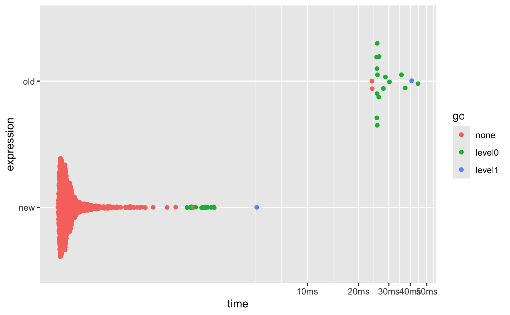

*My venetian blinds, in black and white*

I recently watched [Josiah Parry's](https://josiahparry.com/) wonderful video, ["Making R 300x times faster!"](https://www.youtube.com/watch?v=-v9qaqaj4Ug) It's a great demonstration of how to rewrite code to be faster, and it's worth your time. He rewrites some R code to be faster, then improves the speed again by writing some Rust code, which is called from R. He gets a 300 times speedup, which is really awesome.

Then someone writes in with an example of some code that is even faster than that, just using R code. It ends up being about 6 times faster than his Rust code. So a (300x6) 2000 times speed up. The main thing that helped with that was ensuring to vectorise your R code. Essentially, not working on the rows, but instead working on the columns.

Throughout the video Josiah makes good use of the [`bench`](https://github.com/r-lib/bench) R package to evaluate how much faster your code is. This idea is called "microbenchmarking", and it involves running your code many times to evaluate how much faster it is than some other option. The reason you want to run your code many times is there is often variation around the runtimes in your code, so you don't just want to base your improvements around a single measurement. It's a general standard approach to attempt tp truly compare your approach to another.

All this being said, you should be wary of trying to make your code fast first without good reason. You want to make sure your code does the right thing first. Don't just start trying to write performant code. Or as [Donald Knuth](https://en.wikiquote.org/wiki/Donald_Knuth) says:

> "The real problem is that programmers have spent far too much time worrying about efficiency in the wrong places and at the wrong times; **premature optimization is the root of all evil (or at least most of it) in programming.**".

If you want to learn more about how to speed up your code, I think it's worthwhile reading up on the [measuring performance](https://adv-r.hadley.nz/perf-measure.html) chapter in Advanced R.

# An example microbenchmark

Let's take an example from the [`naniar`](https://naniar.njtierney.com/) package. I'll give more detail of this story of this optimisation at the end of this section. For the moment, let's say we want to get the number of missing values in a row of a data frame. We can do something like this:

<pre class='chroma'><code class='language-r' data-lang='r'><a href='https://rdrr.io/r/base/library.html'>library</a>(<a href='https://dplyr.tidyverse.org'>dplyr</a>)
#&gt; 
#&gt; Attaching package: 'dplyr'
#&gt; The following objects are masked from 'package:stats':
#&gt; 
#&gt;     filter, lag
#&gt; The following objects are masked from 'package:base':
#&gt; 
#&gt;     intersect, setdiff, setequal, union
my_n_miss &lt;- function(data)&#123;
  data |&gt; 
  <a href='https://dplyr.tidyverse.org/reference/rowwise.html'>rowwise</a>() |&gt; 
  <a href='https://dplyr.tidyverse.org/reference/mutate.html'>mutate</a>(
    n_miss = <a href='https://rdrr.io/r/base/sum.html'>sum</a>(<a href='https://rdrr.io/r/base/NA.html'>is.na</a>(<a href='https://dplyr.tidyverse.org/reference/c_across.html'>c_across</a>(<a href='https://tidyselect.r-lib.org/reference/everything.html'>everything</a>())))
  ) |&gt; 
    <a href='https://dplyr.tidyverse.org/reference/group_by.html'>ungroup</a>()
&#125;

my_n_miss(airquality)
#&gt; # A tibble: 153 × 7
#&gt;    Ozone Solar.R  Wind  Temp Month   Day n_miss
#&gt;    &lt;int&gt;   &lt;int&gt; &lt;dbl&gt; &lt;int&gt; &lt;int&gt; &lt;int&gt;  &lt;int&gt;
#&gt;  1    41     190   7.4    67     5     1      0
#&gt;  2    36     118   8      72     5     2      0
#&gt;  3    12     149  12.6    74     5     3      0
#&gt;  4    18     313  11.5    62     5     4      0
#&gt;  5    NA      NA  14.3    56     5     5      2
#&gt;  6    28      NA  14.9    66     5     6      1
#&gt;  7    23     299   8.6    65     5     7      0
#&gt;  8    19      99  13.8    59     5     8      0
#&gt;  9     8      19  20.1    61     5     9      0
#&gt; 10    NA     194   8.6    69     5    10      1
#&gt; # ℹ 143 more rows
</code></pre>

But we can speed this up using [`rowSums()`](https://rdrr.io/r/base/colSums.html) instead:

<pre class='chroma'><code class='language-r' data-lang='r'>new_n_miss &lt;- function(data)&#123;
  n_misses &lt;- <a href='https://rdrr.io/r/base/colSums.html'>rowSums</a>(<a href='https://rdrr.io/r/base/NA.html'>is.na</a>(data))
  data |&gt; 
  <a href='https://dplyr.tidyverse.org/reference/mutate.html'>mutate</a>(
    n_miss = n_misses
  ) |&gt; 
    <a href='https://tibble.tidyverse.org/reference/as_tibble.html'>as_tibble</a>()
&#125;

new_n_miss(airquality)
#&gt; # A tibble: 153 × 7
#&gt;    Ozone Solar.R  Wind  Temp Month   Day n_miss
#&gt;    &lt;int&gt;   &lt;int&gt; &lt;dbl&gt; &lt;int&gt; &lt;int&gt; &lt;int&gt;  &lt;dbl&gt;
#&gt;  1    41     190   7.4    67     5     1      0
#&gt;  2    36     118   8      72     5     2      0
#&gt;  3    12     149  12.6    74     5     3      0
#&gt;  4    18     313  11.5    62     5     4      0
#&gt;  5    NA      NA  14.3    56     5     5      2
#&gt;  6    28      NA  14.9    66     5     6      1
#&gt;  7    23     299   8.6    65     5     7      0
#&gt;  8    19      99  13.8    59     5     8      0
#&gt;  9     8      19  20.1    61     5     9      0
#&gt; 10    NA     194   8.6    69     5    10      1
#&gt; # ℹ 143 more rows
my_n_miss(airquality)
#&gt; # A tibble: 153 × 7
#&gt;    Ozone Solar.R  Wind  Temp Month   Day n_miss
#&gt;    &lt;int&gt;   &lt;int&gt; &lt;dbl&gt; &lt;int&gt; &lt;int&gt; &lt;int&gt;  &lt;int&gt;
#&gt;  1    41     190   7.4    67     5     1      0
#&gt;  2    36     118   8      72     5     2      0
#&gt;  3    12     149  12.6    74     5     3      0
#&gt;  4    18     313  11.5    62     5     4      0
#&gt;  5    NA      NA  14.3    56     5     5      2
#&gt;  6    28      NA  14.9    66     5     6      1
#&gt;  7    23     299   8.6    65     5     7      0
#&gt;  8    19      99  13.8    59     5     8      0
#&gt;  9     8      19  20.1    61     5     9      0
#&gt; 10    NA     194   8.6    69     5    10      1
#&gt; # ℹ 143 more rows
</code></pre>

We can measure the speed using [`bench::mark()`](http://bench.r-lib.org/reference/mark.html):

<pre class='chroma'><code class='language-r' data-lang='r'><a href='https://rdrr.io/r/base/library.html'>library</a>(<a href='https://bench.r-lib.org/'>bench</a>)

bm &lt;- <a href='http://bench.r-lib.org/reference/mark.html'>mark</a>(
  old = my_n_miss(airquality),
  new = new_n_miss(airquality)
)

bm
#&gt; # A tibble: 2 × 6
#&gt;   expression      min   median `itr/sec` mem_alloc `gc/sec`
#&gt;   &lt;bch:expr&gt; &lt;bch:tm&gt; &lt;bch:tm&gt;     &lt;dbl&gt; &lt;bch:byt&gt;    &lt;dbl&gt;
#&gt; 1 old          23.9ms   23.9ms      41.8   355.5KB    334. 
#&gt; 2 new         347.5µs  384.5µs    2385.     81.8KB     34.8
</code></pre>

This runs the code at least twice, and prints out the amount of time it takes to run the code provided on the right hand side of "old" and "new". But you can name them whatever you want.

Now, it can be kind of hard to see just *how much* faster this is, if you just look at comparing the times, as the times are given here in...well, actually I'm not sure why our friend from the greek alphabet mu, µ, from the greek alphabet is here, actually? If, like me, you needed to [double check the standard measures of order of magnitude wiki page](https://simple.wikipedia.org/wiki/Order_of_magnitude), you might not know that "ms" means milli - or one thousandth, and µ means "micro", or one millionth. The point is that the new one is many times faster than the old one.

We can do a plot to help see this:

<pre class='chroma'><code class='language-r' data-lang='r'><a href='https://rdrr.io/r/graphics/plot.default.html'>plot</a>(bm)
#&gt; Loading required namespace: tidyr
</code></pre>

So we can see that the new one really is *a lot* faster.

But if I just want to be able to say something like:

> It is XX times faster

then we can use the (somewhat unknown?) `relative = TRUE` option of [bench's S3 method for `summary` method](https://bench.r-lib.org/reference/summary.bench_mark.html):

<pre class='chroma'><code class='language-r' data-lang='r'><a href='https://rdrr.io/r/base/summary.html'>summary</a>(bm, relative = TRUE)
#&gt; # A tibble: 2 × 6
#&gt;   expression   min median `itr/sec` mem_alloc `gc/sec`
#&gt;   &lt;bch:expr&gt; &lt;dbl&gt;  &lt;dbl&gt;     &lt;dbl&gt;     &lt;dbl&gt;    &lt;dbl&gt;
#&gt; 1 old         68.7   62.2       1        4.34     9.62
#&gt; 2 new          1      1        57.0      1        1
</code></pre>

And this is great, from this we can see it is about 60 times faster. And that the old approach uses 15 times more memory.

## The story behind this speedup in naniar.

Now, I didn't just come up with a speedup for missing values on the fly. The story here is that there was going to be some (very generous) improvements to the naniar package from [Romain François](https://github.com/romainfrancois) [in the form of C++ code](https://github.com/njtierney/naniar/issues/113). However, [Jim Hester](https://www.jimhester.com/) suggested some changes, I think twitter (which I can't find anymore), and he then kindly submitted a [pull request showing that rowSums in R ends up being plenty fast](https://github.com/njtierney/naniar/pull/112/).

This is a similar story to Josiah's, where he used Rust code to get it faster, but then there was a faster way just staying within R.

Sometimes, you don't need extra C or Fortran or Rust. R is enough!

And if you want to be able to compare the speeds of things, don't forget the `relative = TRUE` argument in `summary` when using [`bench::mark`](http://bench.r-lib.org/reference/mark.html).

# Other packages for microbenchmarking

`bench` isn't the only way to measure things! Other ones I've enjoyed using in the past are [microbenchmark](https://cran.r-project.org/web/packages/microbenchmark/index.html) and [tictoc](https://cran.r-project.org/web/packages/tictoc/index.html). I've particularly enjoyed `tictoc` because you get to do this:

<pre class='chroma'><code class='language-r' data-lang='r'><a href='https://rdrr.io/r/base/library.html'>library</a>(<a href='https://github.com/jabiru/tictoc'>tictoc</a>)
<a href='https://rdrr.io/pkg/tictoc/man/tic.html'>tic</a>()
new_n_miss(airquality)
#&gt; # A tibble: 153 × 7
#&gt;    Ozone Solar.R  Wind  Temp Month   Day n_miss
#&gt;    &lt;int&gt;   &lt;int&gt; &lt;dbl&gt; &lt;int&gt; &lt;int&gt; &lt;int&gt;  &lt;dbl&gt;
#&gt;  1    41     190   7.4    67     5     1      0
#&gt;  2    36     118   8      72     5     2      0
#&gt;  3    12     149  12.6    74     5     3      0
#&gt;  4    18     313  11.5    62     5     4      0
#&gt;  5    NA      NA  14.3    56     5     5      2
#&gt;  6    28      NA  14.9    66     5     6      1
#&gt;  7    23     299   8.6    65     5     7      0
#&gt;  8    19      99  13.8    59     5     8      0
#&gt;  9     8      19  20.1    61     5     9      0
#&gt; 10    NA     194   8.6    69     5    10      1
#&gt; # ℹ 143 more rows
<a href='https://rdrr.io/pkg/tictoc/man/tic.html'>toc</a>()
#&gt; 0.01 sec elapsed
</code></pre>

Which feels a bit nicer than using [`system.time()`](https://rdrr.io/r/base/system.time.html):

<pre class='chroma'><code class='language-r' data-lang='r'><a href='https://rdrr.io/r/base/system.time.html'>system.time</a>(&#123;
  new_n_miss(airquality)
&#125;)
#&gt;    user  system elapsed 
#&gt;   0.001   0.000   0.002
</code></pre>

Also, notice that those two times are different? This is why we use benchmarking, to run those checks many times!

# End

And that's it, that's the blog post. The `relative = TRUE` option in `mark` is super neat, and I don't think many people know about it. Thanks again to Jim Hester for originally creating the `bench` package.

