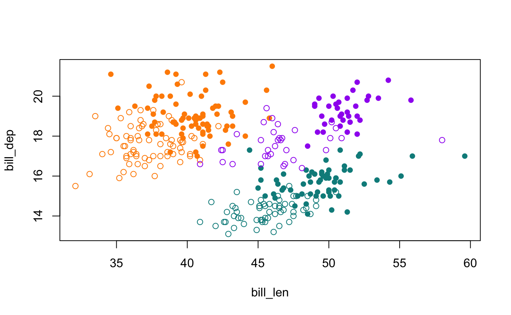

The new R version 4.5.0 is out, and you should get it!

I've read through [the NEWS file](https://cran.r-project.org/doc/manuals/r-release/NEWS.html), which details every change - there are many! I would recommend having a skim.

I thought I'd share a couple of changes that jumped out at me as particularly interesting. This isn't to say that the changes in R are boring - more so there **are a lot of changes**, so I just thought I'd highlight a couple.

# Installation is now faster

> [`install.packages()`](https://rdrr.io/r/utils/install.packages.html) and [`download.packages()`](https://rdrr.io/r/utils/download.packages.html) download packages simultaneously using `libcurl`, significantly reducing download times when installing or downloading multiple packages.

This is cool! Installing packages is now much faster! I love this. Generally, I use [`pak`](https://github.com/r-lib/pak), which I believe already does this. But it's a nice win for vanilla R to know I can download things faster.

# Data

There are two new datasets added to R! The last time (that I could find) a new dataset was added to R was in [R version 3.0.2](https://cran.r-project.org/doc/manuals/r-devel/NEWS.3.html), which, [going to the release dates](https://cran.r-project.org/bin/windows/base/old/), was in September 2013. So, nearly 12 years ago! That NEWS item read:

> Dataset `npk` has been copied from MASS to allow more tests to be run without recommended packages being installed.

You might be familiar with one of these new datasets, the penguins data!

<div class="highlight">


</div>

*artwork by [Allison Horst](https://allisonhorst.com/)*

The NEWS item reads:

> New datasets penguins and penguins_raw thanks to [Ella Kaye](https://ellakaye.co.uk/), [Heather Turner](https://www.heatherturner.net/), and [Kristen Gorman](https://gormankb.github.io/).

This is huge! Well, I think it is. Now we don't need to write [`library(palmerpenguins)`](https://allisonhorst.github.io/palmerpenguins/) if you want to use the `penguins` or `penguins_raw` data. Looking at the examples, we can see the following base visualisations:

<div class="highlight">

<pre class='chroma'><code class='language-r' data-lang='r'><span><span class='c'>## bill depth vs. length by species (color) and sex (symbol):</span></span>
<span><span class='c'>## positive correlations for all species, males tend to have bigger bills</span></span>
<span><span class='nv'>sym</span> <span class='o'>&lt;-</span> <span class='nf'><a href='https://rdrr.io/r/base/c.html'>c</a></span><span class='o'>(</span><span class='m'>1</span>, <span class='m'>16</span><span class='o'>)</span></span>
<span><span class='nv'>pal</span> <span class='o'>&lt;-</span> <span class='nf'><a href='https://rdrr.io/r/base/c.html'>c</a></span><span class='o'>(</span></span>
<span>  <span class='s'>"darkorange"</span>,</span>
<span>  <span class='s'>"purple"</span>,</span>
<span>  <span class='s'>"cyan4"</span></span>
<span>  <span class='o'>)</span></span>
<span><span class='nf'><a href='https://rdrr.io/r/graphics/plot.default.html'>plot</a></span><span class='o'>(</span></span>
<span>  <span class='nv'>bill_dep</span> <span class='o'>~</span> <span class='nv'>bill_len</span>, </span>
<span>  data <span class='o'>=</span> <span class='nv'>penguins</span>, </span>
<span>  pch <span class='o'>=</span> <span class='nv'>sym</span><span class='o'>[</span><span class='nv'>sex</span><span class='o'>]</span>, </span>
<span>  col <span class='o'>=</span> <span class='nv'>pal</span><span class='o'>[</span><span class='nv'>species</span><span class='o'>]</span></span>
<span>  <span class='o'>)</span></span>
</code></pre>


</div>

(Also worth noting that the variable names are slightly different in the new base R version - `bill_len` (not `bill_length`) `bill_dep` (not `bill_depth`), and `flipper_len` (not `flipper_length`)).

> New dataset gait thanks to Heather Turner and Ella Kaye, used in examples.

# BLAS and LAPACK update

> The bundled BLAS and LAPACK sources have been updated to those shipped as part of January 2025's LAPACK 3.12.1.

These help power many linear algebra operations in R, and there will likely be speed improvements and other efficiencies. So, worth installing for that alone.

# A note on reading NEWS files

I have tried to read the R NEWS files since about 2017 or 2018. I believe I heard [Roger Peng](https://rdpeng.org/) say he read the R NEWS files on the [Not So Standard Deviations podcast](https://nssdeviations.com/) with [Hilary Parker](https://hilaryparker.com/). It seemed like a good idea, so I have tried to do the same.

It usually involves me reading over the NEWS file and looking out for things that seem relevant to me and my work. I don't always understand everything, in fact, I would say I don't understand a lot of it. But every now and again something comes up that is important to me. For example, the NEWS item for [R 4.0.0](https://cran.r-project.org/doc/manuals/r-release/NEWS.html) about matrices and arrays:

> matrix objects now also inherit from class "array", so e.g., class(diag(1)) is c("matrix", "array"). This invalidates code incorrectly assuming that class(matrix_obj)) has length one.

> S3 methods for class "array" are now dispatched for matrix objects.

Resulted in a breaking change in greta, that I was able [to identify and fix](https://github.com/greta-dev/greta/pull/409/files).

Another time that I find it useful to know how to look up the NEWS file is remembering when some key new features were introduced. For example, knowing that the native pipe `|>` was introduced in 4.1.0, but the underscore `_` placeholder was only introduced in 4.2.0 is really useful if I'm developing packages to know which version of R to depend on.

I also often visit the ["Previous releases of R for Windows"](https://cran.r-project.org/bin/windows/base/old/) page to see *when* a version of R was released. This is for my (somewhat) arbitrary rule that

# Yes, it **is annoying** to reinstall R packages again.

When you install a new **minor version** of R (that is, when you change its minor version, for example going from 4.1.0 to 4.2.0, not 4.1.0 to 4.1.1), you need to install all your R packages again.

Sure, it's annoying. But I see it as an opportunity to start afresh. I usually do something like the following

``` r
install.packages("pak")
library(pak)
pkg_install("tidyverse", dependencies = TRUE)
pkg_install("devtools", dependencies = TRUE)
pkg_install("naniar", dependencies = TRUE)
pkg_install("blogdown", dependencies = TRUE)
pkg_install("greta", dependencies = TRUE)
pkg_install("brolgar", dependencies = TRUE)
pkg_install("targets", dependencies = TRUE)
pkg_install("ropensci/geotargets", dependencies = TRUE)
pkg_install("milesmcbain/datapasta", dependencies = TRUE)
```

And this gets me 90% of the way there.

It is worth noting that if you're a windows user, you can use the [`installr`](https://talgalili.github.io/installr/) package to update R and other dependencies.

And on that note it's ALSO worth mentioning the [`rig`](https://github.com/r-lib/rig) command line utility. This allows you to more easily install different, and release versions of R. If you've seen [Bob Rudis's RSwitch](https://github.com/hrbrmstr/RSwitch) software, this is the updated version of this (Bob has archived RSwitch).

