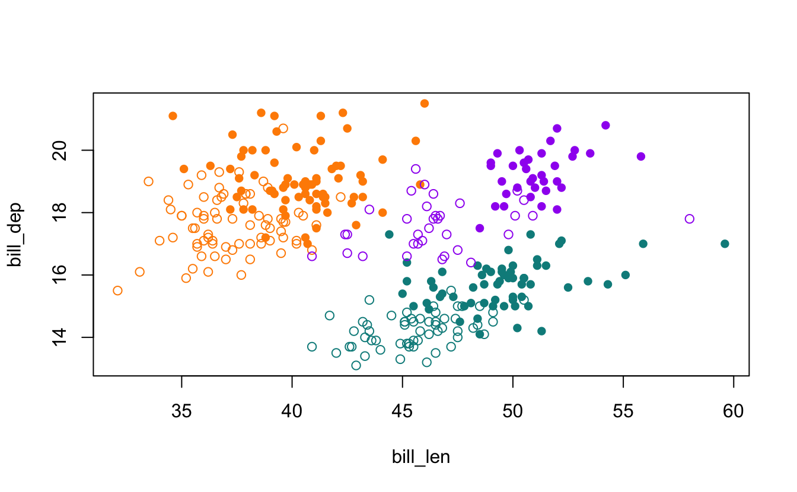
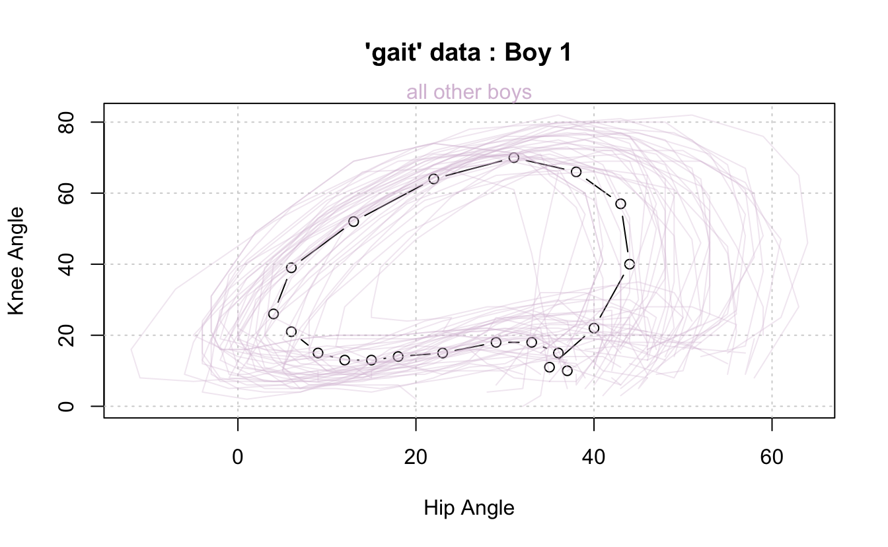

The new R version 4.5.0 is out, and you should get it!

I've read through [the NEWS file](https://cran.r-project.org/doc/manuals/r-release/NEWS.html), which details every change - there are many! I would recommend having a skim.

I thought I'd share a couple of changes that jumped out at me as particularly interesting. This isn't to say that the changes in R are boring - more so there **are a lot of changes**, so I just thought I'd highlight a couple.

# Installation is now faster

> [`install.packages()`](https://rdrr.io/r/utils/install.packages.html) and [`download.packages()`](https://rdrr.io/r/utils/download.packages.html) download packages simultaneously using `libcurl`, significantly reducing download times when installing or downloading multiple packages.

This is cool! Installing packages is now much faster! I love this. Generally, I use [`pak`](https://github.com/r-lib/pak), which I believe already does this. But it's a nice win for vanilla R to know I can download things faster.

# Data

There are two new datasets added to R! The last time (that I could find) a new dataset was added to R was in [R version 3.0.2](https://cran.r-project.org/doc/manuals/r-devel/NEWS.3.html), which, [going to the release dates](https://cran.r-project.org/bin/windows/base/old/), was in September 2013. So, nearly 12 years ago! That NEWS item read:

> Dataset `npk` has been copied from MASS to allow more tests to be run without recommended packages being installed.

You might be familiar with one of these new datasets, the penguins data (!) from the [`palmerpenguins`](https://github.com/allisonhorst/palmerpenguins/) R package.

<div class="highlight">


</div>

*artwork by [Allison Horst](https://allisonhorst.com/)*

The NEWS item reads:

> New datasets penguins and penguins_raw thanks to [Ella Kaye](https://ellakaye.co.uk/), [Heather Turner](https://www.heatherturner.net/), and [Kristen Gorman](https://gormankb.github.io/).

This is huge! Well, I think it is. Now we don't need to write [`library(palmerpenguins)`](https://allisonhorst.github.io/palmerpenguins/) if you want to use the `penguins` or `penguins_raw` data. Looking at the examples, we can see the following base visualisations:

<div class="highlight">

<pre class='chroma'><code class='language-r' data-lang='r'><span><span class='c'>## bill depth vs. length by species (color) and sex (symbol):</span></span>
<span><span class='c'>## positive correlations for all species, males tend to have bigger bills</span></span>
<span><span class='nf'><a href='https://rdrr.io/r/utils/head.html'>head</a></span><span class='o'>(</span><span class='nv'>penguins</span><span class='o'>)</span></span>
<span><span class='c'>#&gt;   species    island bill_len bill_dep flipper_len body_mass    sex year</span></span>
<span><span class='c'>#&gt; 1  Adelie Torgersen     39.1     18.7         181      3750   male 2007</span></span>
<span><span class='c'>#&gt; 2  Adelie Torgersen     39.5     17.4         186      3800 female 2007</span></span>
<span><span class='c'>#&gt; 3  Adelie Torgersen     40.3     18.0         195      3250 female 2007</span></span>
<span><span class='c'>#&gt; 4  Adelie Torgersen       NA       NA          NA        NA   &lt;NA&gt; 2007</span></span>
<span><span class='c'>#&gt; 5  Adelie Torgersen     36.7     19.3         193      3450 female 2007</span></span>
<span><span class='c'>#&gt; 6  Adelie Torgersen     39.3     20.6         190      3650   male 2007</span></span>
<span></span><span><span class='nf'><a href='https://rdrr.io/r/base/names.html'>names</a></span><span class='o'>(</span><span class='nv'>penguins</span><span class='o'>)</span></span>
<span><span class='c'>#&gt; [1] "species"     "island"      "bill_len"    "bill_dep"    "flipper_len"</span></span>
<span><span class='c'>#&gt; [6] "body_mass"   "sex"         "year"</span></span>
<span></span><span><span class='nv'>sym</span> <span class='o'>&lt;-</span> <span class='nf'><a href='https://rdrr.io/r/base/c.html'>c</a></span><span class='o'>(</span><span class='m'>1</span>, <span class='m'>16</span><span class='o'>)</span></span>
<span><span class='nv'>pal</span> <span class='o'>&lt;-</span> <span class='nf'><a href='https://rdrr.io/r/base/c.html'>c</a></span><span class='o'>(</span></span>
<span>  <span class='s'>"darkorange"</span>,</span>
<span>  <span class='s'>"purple"</span>,</span>
<span>  <span class='s'>"cyan4"</span></span>
<span>  <span class='o'>)</span></span>
<span><span class='nf'><a href='https://rdrr.io/r/graphics/plot.default.html'>plot</a></span><span class='o'>(</span></span>
<span>  <span class='nv'>bill_dep</span> <span class='o'>~</span> <span class='nv'>bill_len</span>, </span>
<span>  data <span class='o'>=</span> <span class='nv'>penguins</span>, </span>
<span>  pch <span class='o'>=</span> <span class='nv'>sym</span><span class='o'>[</span><span class='nv'>sex</span><span class='o'>]</span>, </span>
<span>  col <span class='o'>=</span> <span class='nv'>pal</span><span class='o'>[</span><span class='nv'>species</span><span class='o'>]</span></span>
<span>  <span class='o'>)</span></span>
</code></pre>


</div>

It is worth noting that the variable names are slightly different in the new base R version - `bill_len` (not `bill_length`) `bill_dep` (not `bill_depth`), and `flipper_len` (not `flipper_length`), which they note in the helpfile: "The penguins data has some shorter variable names than the palmerpenguins version, for compact code and data display."

There has been a bit of work done on the penguins data, and I wanted to share the relevant references:

-   Gorman, K. B., Williams, T. D. and Fraser, W. R. (2014) Ecological Sexual Dimorphism and Environmental Variability within a Community of Antarctic Penguins (Genus Pygoscelis). PLoS ONE 9, 3, e90081; [doi:10.1371/journal.pone.0090081](https://doi.org/10.1371/journal.pone.0090081).

-   Horst, A. M., Hill, A. P. and Gorman, K. B. (2022) Palmer Archipelago Penguins Data in the palmerpenguins R Package - An Alternative to Anderson's Irises. R Journal 14, 1; [doi:10.32614/RJ-2022-020](https://doi.org/10.32614/RJ-2022-020).

-   Kaye, E., Turner, H., Gorman, K. B., Horst, A. M. and Hill, A. P. (2025) Preparing the Palmer Penguins Data for the datasets Package in R. [doi:10.5281/zenodo.14902740](https://doi.org/10.5281/zenodo.14902740).

And there's ANOTHER dataset!

> New dataset gait thanks to [Heather Turner]() and [Ella Kaye](), used in examples.

I hadn't come across this before, the helpfile ([`?gait`](https://rdrr.io/r/datasets/gait.html)) reads:

> Hip and knee angle (in degrees) through a 20 point movement cycle for 39 boys.

Which is stored as a 3D array, as stated in the helpfile:

> A 3-dimensional array with dimensions c(20, 39, 2) giving the "Hip Angle" and "Knee Angle" (in degrees) for 39 repetitions of a 20 point gait cycle (over standardized gait times).

<div class="highlight">

<pre class='chroma'><code class='language-r' data-lang='r'><span><span class='nf'><a href='https://rdrr.io/r/utils/head.html'>head</a></span><span class='o'>(</span><span class='nv'>gait</span><span class='o'>)</span></span>
<span><span class='c'>#&gt; , , Variable = Hip Angle</span></span>
<span><span class='c'>#&gt; </span></span>
<span><span class='c'>#&gt;        Subject</span></span>
<span><span class='c'>#&gt; Time    boy1 boy2 boy3 boy4 boy5 boy6 boy7 boy8 boy9 boy10 boy11 boy12 boy13</span></span>
<span><span class='c'>#&gt;   0.025   37   47   46   37   20   57   46   46   46    35    38    35    34</span></span>
<span><span class='c'>#&gt;   0.075   36   46   44   36   18   48   38   46   42    34    37    31    31</span></span>
<span><span class='c'>#&gt;   0.125   33   42   39   27   11   44   33   43   37    29    33    29    27</span></span>
<span><span class='c'>#&gt;   0.175   29   34   34   20    8   35   25   40   34    28    29    26    23</span></span>
<span><span class='c'>#&gt;   0.225   23   27   33   15    7   31   18   36   31    19    26    22    19</span></span>
<span><span class='c'>#&gt;   0.275   18   21   27   15    5   27   15   30   25    15    20    19    15</span></span>
<span><span class='c'>#&gt;        Subject</span></span>
<span><span class='c'>#&gt; Time    boy14 boy15 boy16 boy17 boy18 boy19 boy20 boy21 boy22 boy23 boy24 boy25</span></span>
<span><span class='c'>#&gt;   0.025    43    43    40    51    52    36    35    46    43    55    39    37</span></span>
<span><span class='c'>#&gt;   0.075    41    37    41    49    46    33    37    38    41    51    38    34</span></span>
<span><span class='c'>#&gt;   0.125    36    35    36    45    41    28    33    30    37    47    31    30</span></span>
<span><span class='c'>#&gt;   0.175    31    28    32    39    35    22    27    23    30    41    27    27</span></span>
<span><span class='c'>#&gt;   0.225    26    26    27    31    31    18    22    17    24    35    21    26</span></span>
<span><span class='c'>#&gt;   0.275    20    21    20    23    24    13    14    13    16    30    14    19</span></span>
<span><span class='c'>#&gt;        Subject</span></span>
<span><span class='c'>#&gt; Time    boy26 boy27 boy28 boy29 boy30 boy31 boy32 boy33 boy34 boy35 boy36 boy37</span></span>
<span><span class='c'>#&gt;   0.025    36    36    42    38    46    54    52    32    46    46    48    44</span></span>
<span><span class='c'>#&gt;   0.075    33    33    40    34    47    48    44    28    41    44    42    41</span></span>
<span><span class='c'>#&gt;   0.125    28    30    40    30    44    44    44    26    38    40    42    38</span></span>
<span><span class='c'>#&gt;   0.175    22    28    34    23    37    37    33    22    31    35    35    32</span></span>
<span><span class='c'>#&gt;   0.225    18    21    23    17    29    30    28    19    25    31    30    24</span></span>
<span><span class='c'>#&gt;   0.275    13    15    15    12    23    27    27    13    20    25    23    18</span></span>
<span><span class='c'>#&gt;        Subject</span></span>
<span><span class='c'>#&gt; Time    boy38 boy39</span></span>
<span><span class='c'>#&gt;   0.025    55    48</span></span>
<span><span class='c'>#&gt;   0.075    56    50</span></span>
<span><span class='c'>#&gt;   0.125    51    47</span></span>
<span><span class='c'>#&gt;   0.175    46    42</span></span>
<span><span class='c'>#&gt;   0.225    41    37</span></span>
<span><span class='c'>#&gt;   0.275    36    29</span></span>
<span><span class='c'>#&gt; </span></span>
<span><span class='c'>#&gt; , , Variable = Knee Angle</span></span>
<span><span class='c'>#&gt; </span></span>
<span><span class='c'>#&gt;        Subject</span></span>
<span><span class='c'>#&gt; Time    boy1 boy2 boy3 boy4 boy5 boy6 boy7 boy8 boy9 boy10 boy11 boy12 boy13</span></span>
<span><span class='c'>#&gt;   0.025   10   16   18    5    2   15   13   14   15     9    13     7     9</span></span>
<span><span class='c'>#&gt;   0.075   15   25   27   14    6   17   16   17   20    22    24     8    14</span></span>
<span><span class='c'>#&gt;   0.125   18   28   32   16    6   23   22   18   23    25    27    11    16</span></span>
<span><span class='c'>#&gt;   0.175   18   25   32   17    6   23   17   19   26    21    23    12    15</span></span>
<span><span class='c'>#&gt;   0.225   15   18   28   10    5   20   12   19   25    10    18     8    15</span></span>
<span><span class='c'>#&gt;   0.275   14   12   23    8    6   19    9   15   21     9    13     6    12</span></span>
<span><span class='c'>#&gt;        Subject</span></span>
<span><span class='c'>#&gt; Time    boy14 boy15 boy16 boy17 boy18 boy19 boy20 boy21 boy22 boy23 boy24 boy25</span></span>
<span><span class='c'>#&gt;   0.025    15     6    11    24    16    16     7    21    11    12     8    11</span></span>
<span><span class='c'>#&gt;   0.075    20    11    19    32    20    20    13    24    14    17    12    20</span></span>
<span><span class='c'>#&gt;   0.125    22    20    30    35    21    22    14    25    14    20    14    22</span></span>
<span><span class='c'>#&gt;   0.175    22    18    28    33    20    21    17    21    11    20    13    21</span></span>
<span><span class='c'>#&gt;   0.225    21    13    25    29    18    20    14    16     8    18    12    21</span></span>
<span><span class='c'>#&gt;   0.275    19     9    17    24    14    20     8     9     5    12     9    17</span></span>
<span><span class='c'>#&gt;        Subject</span></span>
<span><span class='c'>#&gt; Time    boy26 boy27 boy28 boy29 boy30 boy31 boy32 boy33 boy34 boy35 boy36 boy37</span></span>
<span><span class='c'>#&gt;   0.025    16    19    13    11    17    20    18     9     8     9    13    19</span></span>
<span><span class='c'>#&gt;   0.075    20    26    23    15    25    20    18    12    10    18    18    23</span></span>
<span><span class='c'>#&gt;   0.125    22    28    30    19    30    22    25    16    17    19    27    26</span></span>
<span><span class='c'>#&gt;   0.175    21    28    28    20    30    16    23    15    16    19    26    25</span></span>
<span><span class='c'>#&gt;   0.225    20    24    19    18    27    10    18    14    12    19    25    21</span></span>
<span><span class='c'>#&gt;   0.275    20    18    10    17    22    10    19    11    10    15    18    18</span></span>
<span><span class='c'>#&gt;        Subject</span></span>
<span><span class='c'>#&gt; Time    boy38 boy39</span></span>
<span><span class='c'>#&gt;   0.025    16    14</span></span>
<span><span class='c'>#&gt;   0.075    23    25</span></span>
<span><span class='c'>#&gt;   0.125    28    32</span></span>
<span><span class='c'>#&gt;   0.175    28    34</span></span>
<span><span class='c'>#&gt;   0.225    25    30</span></span>
<span><span class='c'>#&gt;   0.275    21    20</span></span>
<span></span></code></pre>

</div>

With the examples having a nifty data visualisation:

<div class="highlight">

<pre class='chroma'><code class='language-r' data-lang='r'><span><span class='nf'><a href='https://rdrr.io/r/graphics/plot.default.html'>plot</a></span><span class='o'>(</span></span>
<span>  <span class='nv'>gait</span><span class='o'>[</span>, <span class='m'>1</span>, <span class='o'>]</span>, </span>
<span>  type <span class='o'>=</span> <span class='s'>"b"</span>,</span>
<span>  xlim <span class='o'>=</span> <span class='nf'><a href='https://rdrr.io/r/base/range.html'>range</a></span><span class='o'>(</span><span class='nv'>gait</span><span class='o'>[</span>,,<span class='m'>1</span><span class='o'>]</span><span class='o'>)</span>, </span>
<span>  ylim <span class='o'>=</span> <span class='nf'><a href='https://rdrr.io/r/base/range.html'>range</a></span><span class='o'>(</span><span class='nv'>gait</span><span class='o'>[</span>,,<span class='m'>2</span><span class='o'>]</span><span class='o'>)</span>, </span>
<span>  xlab <span class='o'>=</span> <span class='s'>"Hip Angle"</span>, </span>
<span>  ylab <span class='o'>=</span> <span class='s'>"Knee Angle"</span>, </span>
<span>  main <span class='o'>=</span> <span class='s'>"'gait' data : Boy 1"</span></span>
<span><span class='o'>)</span></span>
<span><span class='nf'><a href='https://rdrr.io/r/graphics/mtext.html'>mtext</a></span><span class='o'>(</span></span>
<span>  <span class='s'>"all other boys"</span>, </span>
<span>  col <span class='o'>=</span> <span class='s'>"thistle"</span></span>
<span>  <span class='o'>)</span></span>
<span><span class='nf'><a href='https://rdrr.io/r/graphics/grid.html'>grid</a></span><span class='o'>(</span><span class='o'>)</span></span>
<span><span class='nf'><a href='https://rdrr.io/r/graphics/matplot.html'>matlines</a></span><span class='o'>(</span></span>
<span>  <span class='nv'>gait</span><span class='o'>[</span>, <span class='o'>-</span><span class='m'>1</span>, <span class='m'>1</span><span class='o'>]</span>, </span>
<span>  <span class='nv'>gait</span><span class='o'>[</span>, <span class='o'>-</span><span class='m'>1</span>, <span class='m'>2</span><span class='o'>]</span>, </span>
<span>  type <span class='o'>=</span> <span class='s'>"l"</span>, </span>
<span>  lty <span class='o'>=</span> <span class='m'>1</span>, </span>
<span>  col <span class='o'>=</span> <span class='nf'><a href='https://rdrr.io/r/grDevices/adjustcolor.html'>adjustcolor</a></span><span class='o'>(</span><span class='s'>"thistle"</span>, <span class='m'>1</span><span class='o'>/</span><span class='m'>3</span><span class='o'>)</span></span>
<span>  <span class='o'>)</span></span>
</code></pre>


</div>

It is worth noting the references for this data:

-   Olshen, R. A., Biden, E. N., Wyatt, M. P., and Sutherland, D. (1989) Gait Analysis and the Bootstrap. Annals of Statistics 17, 4, 1419--1440. [doi:10.1214/AOS/1176347372](https://doi.org/10.1214/AOS/1176347372)

-   Ramsay, J. O., and Silverman, B. W. (2006) Functional Data Analysis, 2nd ed., New York: Springer.

-   Ramsay, J. (2023) fda: Functional Data Analysis. R package version 6.1.4, <https://CRAN.R-project.org/package=fda>.

# BLAS and LAPACK update

> The bundled BLAS and LAPACK sources have been updated to those shipped as part of January 2025's LAPACK 3.12.1.

These help power many linear algebra operations in R, and there will likely be speed improvements and other efficiencies. So, worth installing for that alone.

# A note on reading NEWS files

I have tried to read the R NEWS files since about 2017 or 2018. I believe I heard [Roger Peng](https://rdpeng.org/) say he read the R NEWS files on the [Not So Standard Deviations podcast](https://nssdeviations.com/) with [Hilary Parker](https://hilaryparker.com/). It seemed like a good idea, so I have tried to do the same.

It usually involves me reading over the NEWS file and looking out for things that seem relevant to me and my work. I don't always understand everything, in fact, I would say I don't understand a lot of it. But every now and again something comes up that is important to me. For example, the NEWS item for [R 4.0.0](https://cran.r-project.org/doc/manuals/r-release/NEWS.html) about matrices and arrays:

> matrix objects now also inherit from class "array", so e.g., class(diag(1)) is c("matrix", "array"). This invalidates code incorrectly assuming that class(matrix_obj)) has length one.

> S3 methods for class "array" are now dispatched for matrix objects.

Resulted in a breaking change in greta, that I was able [to identify and fix](https://github.com/greta-dev/greta/pull/409/files).

Another time that I find it useful to know how to look up the NEWS file is remembering when some key new features were introduced. For example, knowing that the native pipe `|>` was introduced in 4.1.0, but the underscore `_` placeholder was only introduced in 4.2.0 is really useful if I'm developing packages to know which version of R to depend on.

I also often visit the ["Previous releases of R for Windows"](https://cran.r-project.org/bin/windows/base/old/) page to see *when* a version of R was released. This is for my (somewhat) arbitrary rule that

# Yes, it **is annoying** to reinstall R packages again.

When you install a new **minor version** of R (that is, when you change its minor version, for example going from 4.1.0 to 4.2.0, not 4.1.0 to 4.1.1), you need to install all your R packages again.

Sure, it's annoying. But I see it as an opportunity to start afresh. I usually do something like the following

``` r
install.packages("pak")
library(pak)
pkg_install("tidyverse", dependencies = TRUE)
pkg_install("devtools", dependencies = TRUE)
pkg_install("naniar", dependencies = TRUE)
pkg_install("blogdown", dependencies = TRUE)
pkg_install("greta", dependencies = TRUE)
pkg_install("brolgar", dependencies = TRUE)
pkg_install("targets", dependencies = TRUE)
pkg_install("ropensci/geotargets", dependencies = TRUE)
pkg_install("milesmcbain/datapasta", dependencies = TRUE)
```

And this gets me 90% of the way there.

It is worth noting that if you're a windows user, you can use the [`installr`](https://talgalili.github.io/installr/) package to update R and other dependencies.

And on that note it's ALSO worth mentioning the [`rig`](https://github.com/r-lib/rig) command line utility. This allows you to more easily install different, and release versions of R. If you've seen [Bob Rudis's RSwitch](https://github.com/hrbrmstr/RSwitch) software, this is the updated version of this (Bob has archived RSwitch).

