This blog post is about using and assessing good colours in R.

It's ended up being a bit of a big blog post, so I'm splitting this up into a few parts. This is part 1, which discusses colourblindness.

Whenever I see a data visualisation, I'm always cued in to look at the colours that people use in their plots. In particular, I keep an eye out for things that are not colourblind safe, and not perceptually uniform.

In particular, I'm wary of three scales:

1.  Jet
2.  Rainbow
3.  Terrain.colours

<pre class='chroma'>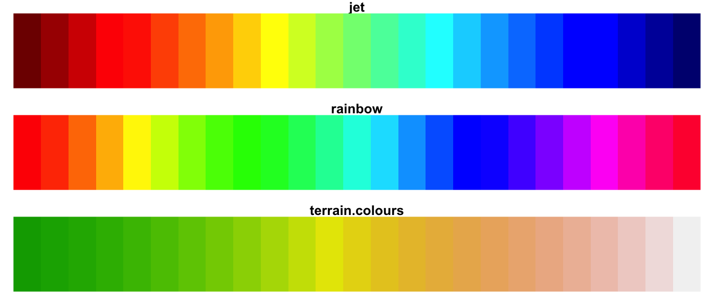</pre>

Why?

Two main reasons:

1.  Colourblindness: Those with colourblindness might not be able to distinguish the colours used.
2.  Perceptual uniformity: For these colourscales, a one unit change in data value does not often mean a one unit change in perceived colour.

Let's break these topics down.

Colourblindness
---------------

tl;dr

> For some people, some colours that everyone else perceives as different are perceived the same. This can be problematic for interpreting graphics. This difference is due to a biological difference in their eyes.

Simplifying things somewhat, let's talk briefly about anatomy.

Here's a side (sagittal) view eyeball and a retina, with some exaggerated rays of light going through the lens of the eye.

*shotty drawing of side view of the eye*

The retina connects to light sensitive cells known as "rods and cones", called so because, well, they look like rods, and cones.

*shotty drawing of rods and cones*

It's about 120 million rod cells to 6 to 7 million cone cells, about a 20:1 ratio.

Light comes in, and gets focussed by the lens onto a section of the eye called the *fovea*. Think of this like the bullseye on a target. It's the center of attention and has the most points. It represents the center of our focus.

*shotty drawing*

The fovea contains a crazy high concentration of cones. So the light hits these rods and cones, and then, after some certain amount of neurological magic (like the fact that the image is presented upside down but our brain flips it), we see an image in full colour.

*magic neurology*

*image presented*

Amazing.

So let's break down what makes up an image here. Let's first just look at a black and white view, where we see the intensity/brightness of the colour.

*Black and white image*

<pre class='chroma'>#&gt; Linking to ImageMagick 7.0.10.10
#&gt; Enabled features: freetype, ghostscript, lcms, webp
#&gt; Disabled features: cairo, fontconfig, fftw, pango, rsvg, x11
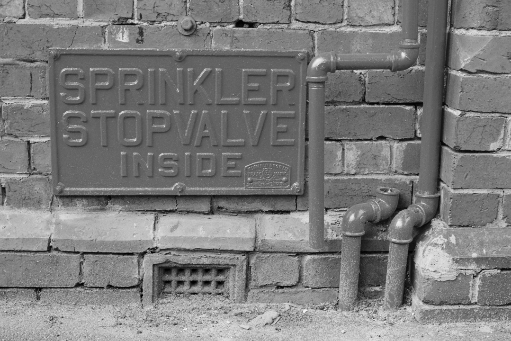</pre>

We add colour to the image using the cones in our eye. These react more to certain light wavelengths. You can think of these like "colour channels" of an image:

So, this image here in black and white, could be created by adding together the sum of the red channel, green channel, and blue channel:

<pre class='chroma'></pre>

There are three types of cones in the eye. They each activate more when they receive light of certain spectrum:

-   Red *red cone image*
-   Green *green cone image*
-   Blue *blue cone image*

colourblindness (generally) comes from an absence, or reduction in sensitivity of the cones in the eye.

Depending on which cones are missing, this means some sets of colours are indistinguishable from one another. It affects up to 10% of males of European descent, and 1 in 200 women (REF).

So, why does it matter?

Well let's say you have two colours, red and green. Here is what non-colourblind people see:

<pre class='chroma'>red_green &lt;- prismatic::<a href='https://rdrr.io/pkg/prismatic/man/color.html'>colour</a>(c("red", "darkgreen"))
plot_cols(red_green)
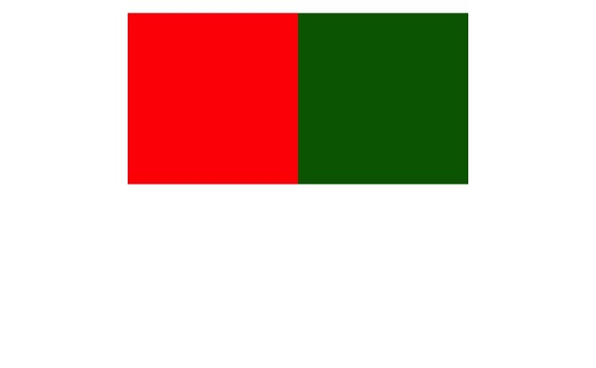</pre>

But if you have colourblindness, you will likely see something like the following:

<pre class='chroma'>library(<a href='https://rdrr.io/pkg/magrittr/man'>magrittr</a>)
colorspace::<a href='http://colorspace.R-Forge.R-project.org//reference/demoplot.html'>demoplot</a>(red_green)
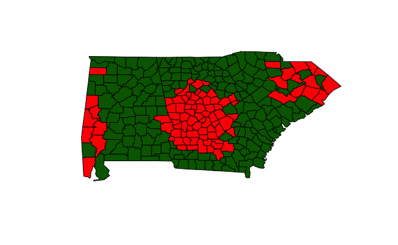
red_green %&gt;% 
  colorspace::<a href='http://colorspace.R-Forge.R-project.org//reference/simulate_cvd.html'>deutan</a>() %&gt;% 
  colorspace::<a href='http://colorspace.R-Forge.R-project.org//reference/demoplot.html'>demoplot</a>()
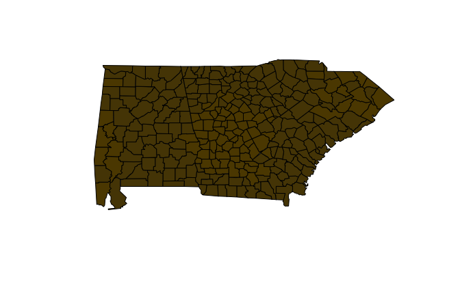
red_green %&gt;% 
  colorspace::<a href='http://colorspace.R-Forge.R-project.org//reference/simulate_cvd.html'>tritan</a>() %&gt;% 
  colorspace::<a href='http://colorspace.R-Forge.R-project.org//reference/demoplot.html'>demoplot</a>()
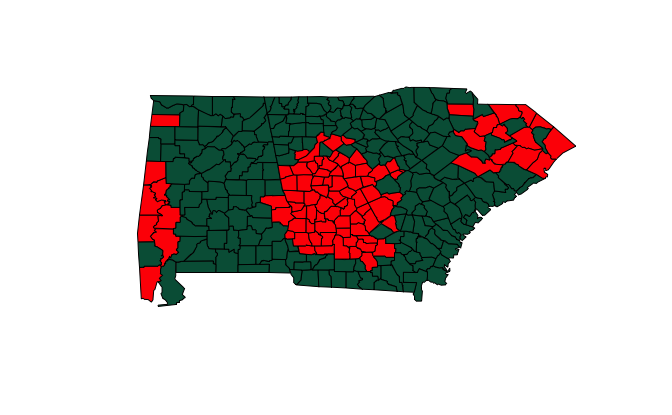
red_green %&gt;% 
  colorspace::<a href='http://colorspace.R-Forge.R-project.org//reference/simulate_cvd.html'>protan</a>() %&gt;% 
  colorspace::<a href='http://colorspace.R-Forge.R-project.org//reference/demoplot.html'>demoplot</a>(type = "pie")
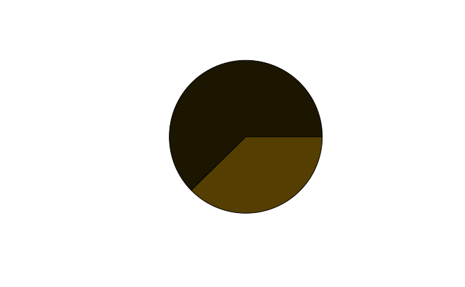
red_green_dt &lt;- colorspace::<a href='http://colorspace.R-Forge.R-project.org//reference/simulate_cvd.html'>deutan</a>(red_green)
red_green_pt &lt;- colorspace::<a href='http://colorspace.R-Forge.R-project.org//reference/simulate_cvd.html'>protan</a>(red_green)
red_green_tt &lt;- colorspace::<a href='http://colorspace.R-Forge.R-project.org//reference/simulate_cvd.html'>tritan</a>(red_green)

plot_cols(red_green_dt)
plot_cols(red_green_pt)
plot_cols(red_green_tt)
</pre>

This is why traffic lights have position markings, instead of just the same position changing colour.

*gif of good traffic light for different vision*

vs

*gif of bad traffic light with different vision*

So the point here is:

> Some colours cannot be distinguished by those with colourblindness, so we need to be careful how we present colour, and what colours we present.

Why does this matter when using other previously mentioned colour scales?
=========================================================================

Here's Rainbow:

<pre class='chroma'>prismatic::<a href='https://rdrr.io/pkg/prismatic/man/check_color_blindness.html'>check_color_blindness</a>(rainbow(25))
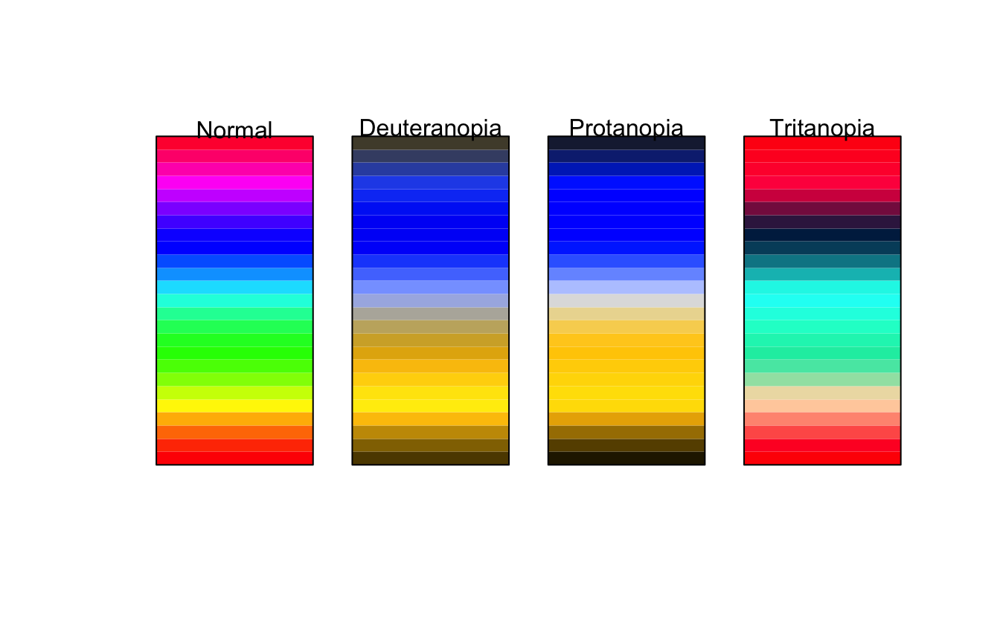pals::<a href='https://rdrr.io/pkg/pals/man/pal.safe.html'>pal.safe</a>(rainbow(25))
</pre>

Jet:

<pre class='chroma'>prismatic::<a href='https://rdrr.io/pkg/prismatic/man/check_color_blindness.html'>check_color_blindness</a>(pals::<a href='https://rdrr.io/pkg/pals/man/continuous.html'>jet</a>(25))
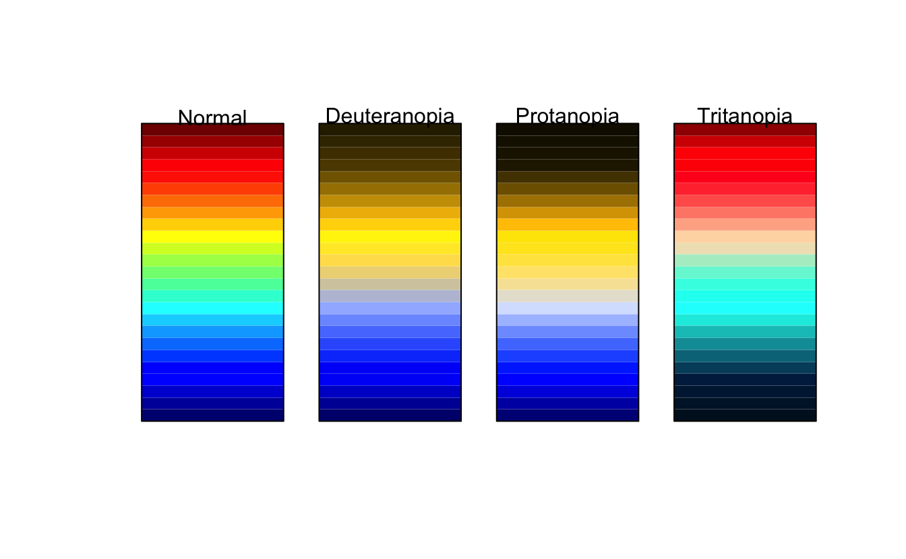pals::<a href='https://rdrr.io/pkg/pals/man/pal.safe.html'>pal.safe</a>(pals::<a href='https://rdrr.io/pkg/pals/man/continuous.html'>jet</a>(25))
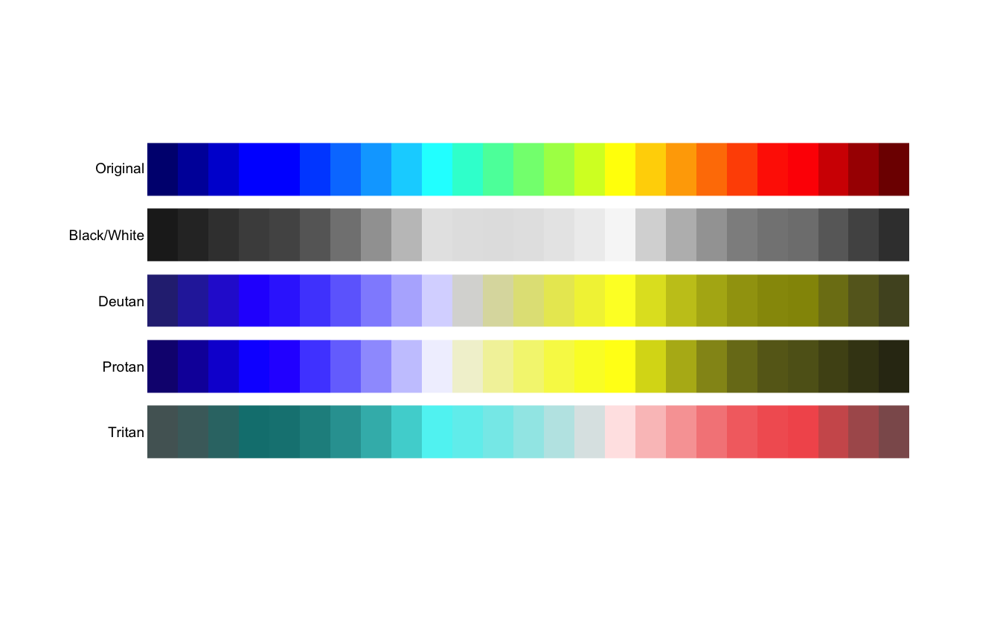</pre>

And Terrain Colours

<pre class='chroma'>prismatic::<a href='https://rdrr.io/pkg/prismatic/man/check_color_blindness.html'>check_color_blindness</a>(terrain.colors(25))
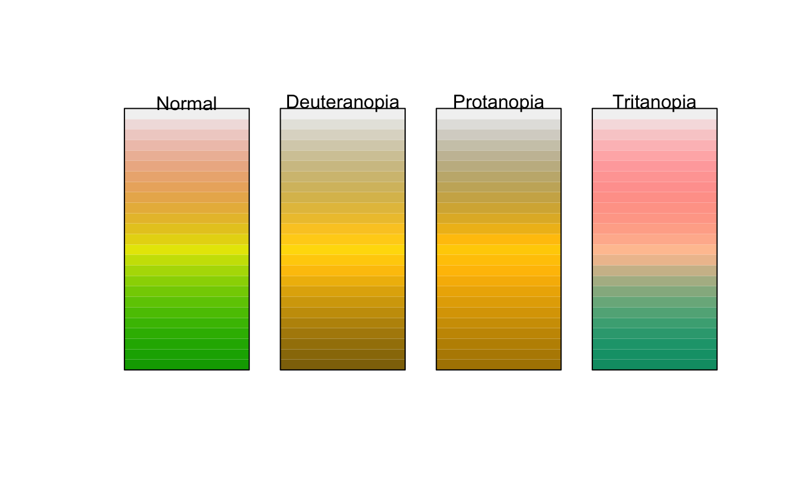pals::<a href='https://rdrr.io/pkg/pals/man/pal.safe.html'>pal.safe</a>(terrain.colors(25))
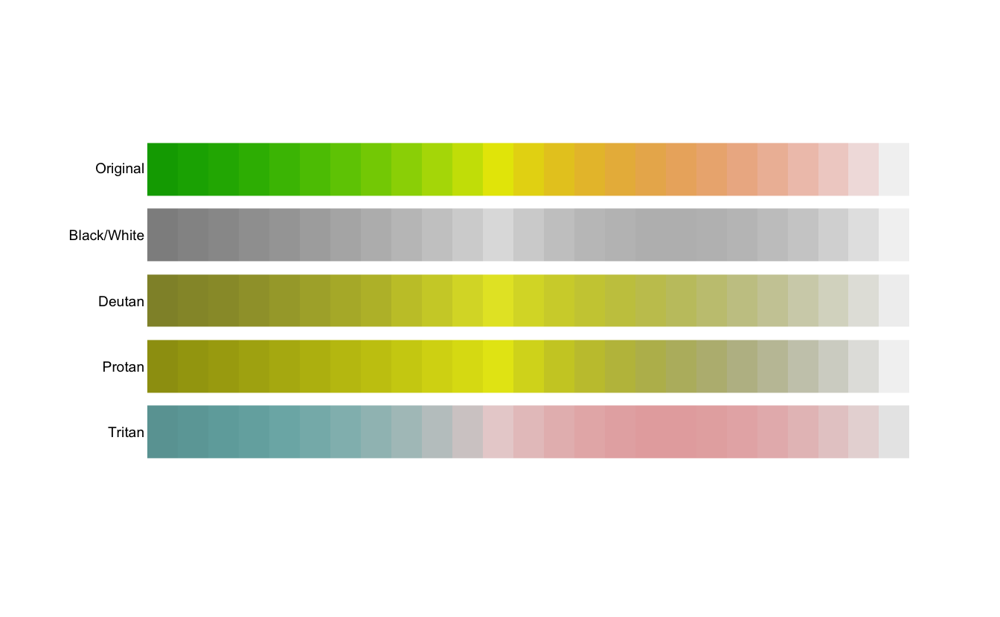</pre>

What does this mean?

Well, there are three categories of colourblindness:

-   Deuteranopia:
-   Protanopia:
-   Tritanopia:

<pre class='chroma'>terrain.colors(25) %&gt;% 
  colorspace::<a href='http://colorspace.R-Forge.R-project.org//reference/simulate_cvd.html'>deutan</a>() %&gt;% 
  colorspace::<a href='http://colorspace.R-Forge.R-project.org//reference/demoplot.html'>demoplot</a>()

terrain.colors(25) %&gt;% 
  colorspace::<a href='http://colorspace.R-Forge.R-project.org//reference/simulate_cvd.html'>tritan</a>() %&gt;% 
  colorspace::<a href='http://colorspace.R-Forge.R-project.org//reference/demoplot.html'>demoplot</a>()
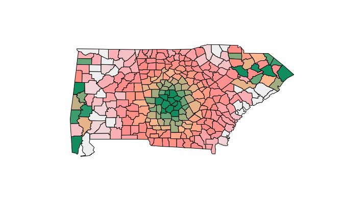
terrain.colors(25) %&gt;% 
  colorspace::<a href='http://colorspace.R-Forge.R-project.org//reference/simulate_cvd.html'>protan</a>() %&gt;% 
  colorspace::<a href='http://colorspace.R-Forge.R-project.org//reference/demoplot.html'>demoplot</a>()
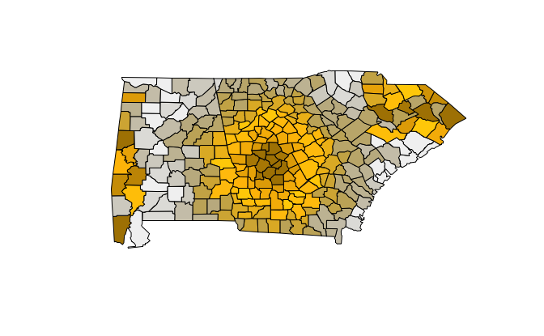
terrain.colors(25) %&gt;% 
  prismatic::<a href='https://rdrr.io/pkg/prismatic/man/check_color_blindness.html'>check_color_blindness</a>()
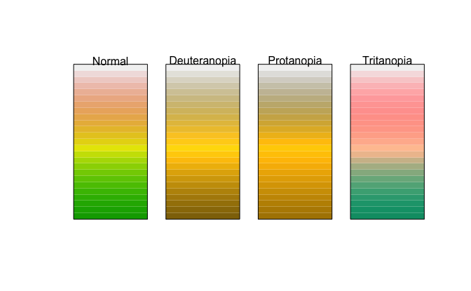
terrain.colors(25) %&gt;% 
  colorspace::<a href='http://colorspace.R-Forge.R-project.org//reference/specplot.html'>specplot</a>()
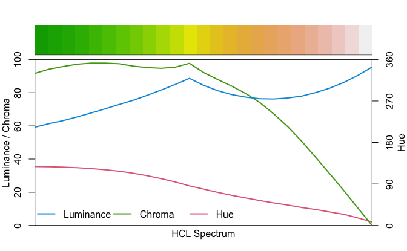
scico::<a href='https://rdrr.io/pkg/scico/man/scico.html'>scico</a>(n = 25, palette = "oleron") %&gt;% 
  colorspace::<a href='http://colorspace.R-Forge.R-project.org//reference/specplot.html'>specplot</a>()
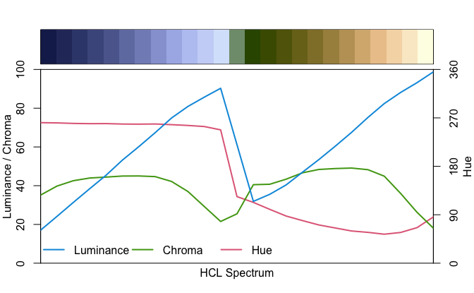
scico::<a href='https://rdrr.io/pkg/scico/man/scico.html'>scico</a>(n = 10, palette = "hawaii") %&gt;% 
  colorspace::<a href='http://colorspace.R-Forge.R-project.org//reference/specplot.html'>specplot</a>()

scico::<a href='https://rdrr.io/pkg/scico/man/scico.html'>scico</a>(n = 10, palette = "hawaii")[c(1,5,7)] %&gt;% 
  colorspace::<a href='http://colorspace.R-Forge.R-project.org//reference/specplot.html'>specplot</a>()

terrain.colors(25) %&gt;% 
  colorspace::<a href='http://colorspace.R-Forge.R-project.org//reference/demoplot.html'>demoplot</a>()
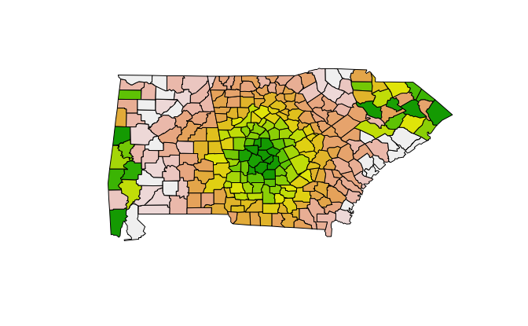</pre>

Perceptually uniform
--------------------

I also discussed this term of "perceptually uniform" - this is defined as:

> a unit step of colour produces a constant perceptual change in color

One that I found useful was at this SO thread:

> if a color space is perceptually uniform, it means that a change of length x in any direction of the color space would be perceived by a human as the same change -- [slhck](https://stackoverflow.com/users/435093/slhck)

So how do you test out your colours?
====================================

Let's look at a few common scenarios.

1.  Evaluating an existing palette
2.  Creating a new palette
3.  Evaluating a plot

Evaluating an existing palette
------------------------------

Creating a new palette
----------------------

Say, for example that you were tasked with creating a Red Amber Green (RAG) palette for work, because, that's what they need.

Let's assume that Red, Amber, and Green are from bad to worse

<pre class='chroma'>rag &lt;- prismatic::<a href='https://rdrr.io/pkg/prismatic/man/color.html'>colour</a>(c("red", "orange", "green"))
colorspace::<a href='http://colorspace.R-Forge.R-project.org//reference/specplot.html'>specplot</a>(rag)
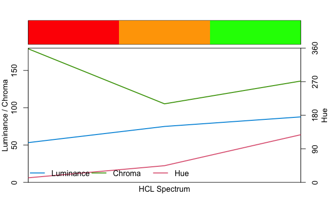colorspace::<a href='http://colorspace.R-Forge.R-project.org//reference/demoplot.html'>demoplot</a>(rag)

rag %&gt;% 
  colorspace::<a href='http://colorspace.R-Forge.R-project.org//reference/simulate_cvd.html'>deutan</a>() %&gt;% 
  colorspace::<a href='http://colorspace.R-Forge.R-project.org//reference/demoplot.html'>demoplot</a>()
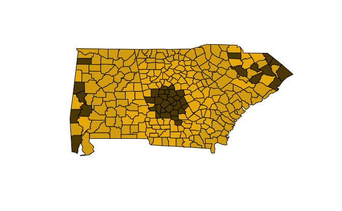
rag %&gt;% 
  colorspace::<a href='http://colorspace.R-Forge.R-project.org//reference/demoplot.html'>demoplot</a>()

rag %&gt;% 
  colorspace::<a href='http://colorspace.R-Forge.R-project.org//reference/simulate_cvd.html'>protan</a>() %&gt;% 
  colorspace::<a href='http://colorspace.R-Forge.R-project.org//reference/demoplot.html'>demoplot</a>()
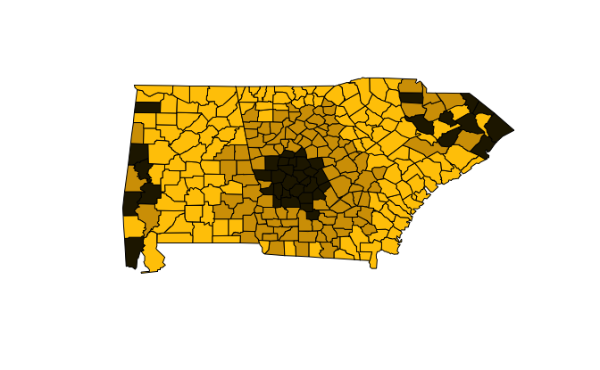
rag %&gt;% 
  colorspace::<a href='http://colorspace.R-Forge.R-project.org//reference/simulate_cvd.html'>tritan</a>() %&gt;% 
  colorspace::<a href='http://colorspace.R-Forge.R-project.org//reference/demoplot.html'>demoplot</a>()
</pre>

Evaluating a plot
-----------------

In the past I've told people to use

This refers to the properties of a sequence of colours

Let's briefly explore these using two packages, [`prismatic`](https://github.com/EmilHvitfeldt/prismatic), by [Emil Hvilfeldt](https://github.com/EmilHvitfeldt), and `colorspace` by ...

<pre class='chroma'>library(<a href='https://rdrr.io/pkg/prismatic/man'>prismatic</a>) 
library(<a href='https://rdrr.io/pkg/pals/man'>pals</a>)

jet &lt;- pals::<a href='https://rdrr.io/pkg/pals/man/continuous.html'>jet</a>(25)
jet_2 &lt;- colorRampPalette(c("#00007F", "blue", "#007FFF", "cyan",
                     "#7FFF7F", "yellow", "#FF7F00", "red", "#7F0000"))
tc &lt;- <a href='https://rdrr.io/pkg/prismatic/man/color.html'>colour</a>(terrain.colors(25))
tc_heat &lt;- <a href='https://rdrr.io/pkg/prismatic/man/color.html'>color</a>(heat.colors(n = 25))
tc_rainbow &lt;- <a href='https://rdrr.io/pkg/prismatic/man/color.html'>color</a>(rainbow(n = 25))

plot(tc)
</pre>
<pre class='chroma'>library(<a href='https://rdrr.io/pkg/scico/man'>scico</a>)
library(<a href='https://rdrr.io/pkg/viridisLite/man'>viridisLite</a>)
#&gt; 
#&gt; Attaching package: 'viridisLite'
#&gt; The following objects are masked from 'package:pals':
#&gt; 
#&gt;     cividis, inferno, magma, plasma, viridis

tc_oleron &lt;- <a href='https://rdrr.io/pkg/prismatic/man/color.html'>color</a>(<a href='https://rdrr.io/pkg/scico/man/scico.html'>scico</a>(n = 20, palette = "oleron")) 
tc_bamako &lt;- <a href='https://rdrr.io/pkg/prismatic/man/color.html'>color</a>(<a href='https://rdrr.io/pkg/scico/man/scico.html'>scico</a>(n = 20, palette = "bamako")) 
tc_vir &lt;- <a href='https://rdrr.io/pkg/prismatic/man/color.html'>color</a>(<a href='https://rdrr.io/pkg/viridisLite/man/viridis.html'>viridis</a>(n = 20)) 
</pre>
<pre class='chroma'><a href='https://rdrr.io/pkg/pals/man/pal.safe.html'>pal.safe</a>(tc)
</pre>

How do I test my colours?
=========================

So suppose you have a set of colours you want to use, how do you test them?

Put the colours into hex format, and then

Test the palette
----------------

The process is similar with a palette

Testing the ggplot graphic
--------------------------

For a ggplot graphic, if you have a plot handy, you can use `colorblindr` to help assess the colourblindness

How do I test someone else's colours?
=====================================

If you've got someone else's image, I know that there are ways you can simulate what colourblindness looks like, as I've seen people do this. But I'm actually not aware of how to do it myself.

OK, so, what should I use then?
===============================

I'd recommend choosing from one of the following:

1.  Viridis (only works for continuous colours (0-100))
2.  Scico (which includes a terrain map)
3.  ColorBrewer website

Further reading
===============

I initially started writing this blog post after seeing a lot of graphics that were good, but didn't use good colours scales. Once I started writing all this down, I did some more reading to bolster my understanding of colourscales. I highly recommend reading the following to help you as well:

-   [The refining plots chapter](https://socviz.co/refineplots.html#refineplots) of the draft of [Kieran Healy's](https://kieranhealy.org/) Book, "Data Visualisation: A practical introduction"

-   The [colour basics](https://serialmentor.com/dataviz/color-basics.html) and [colour pitfalls](https://serialmentor.com/dataviz/color-pitfalls.html) chapters of [Claus Wilke's](https://github.com/clauswilke) book, "Fundamentals of Data Visualisation"

-   [This interesting chapter of percetually uniform colour spaces](https://programmingdesignsystems.com/color/perceptually-uniform-color-spaces/) from the book, "Programming design systems", by [Rune Madsen](https://twitter.com/runemadsen)

-   [This SO thread](https://stackoverflow.com/questions/20172607/what-is-perceptually-uniform-color-space-and-how-lab-color-space-is-perceptually) also provided some interesting definitions:

-   The [wikipedia article on colour difference](https://en.wikipedia.org/wiki/Color_difference) is also quite interesting.

<a href="http://medvis.org/2012/08/21/rainbow-colormaps-what-are-they-good-for-absolutely-nothing/" class="uri">http://medvis.org/2012/08/21/rainbow-colormaps-what-are-they-good-for-absolutely-nothing/</a>

Note: I started this on '2019-10-04'

But what about those with colourblindness? How do we see what they might see? We can put the colours into [`pals::pal.safe`](https://rdrr.io/pkg/pals/man/pal.safe.html) or [`prismatic::check_color_blindness`](https://rdrr.io/pkg/prismatic/man/check_color_blindness.html):

What makes up colour?
=====================

I think describing colour is actually quite hard. I often hear people talk about "saturation, luminance, brightness, hue", and I actually get pretty confused.

But here's a graphic reproduced from the [excellent paper on colorspace](https://arxiv.org/pdf/1903.06490.pdf) by ...

-   Hue means different colour

-   Chroma means **how much** of that colour is used (how *saturated* it is)

-   Luminance means how **bright** that colour is.

-   great post on [imageMagick](https://www.imagemagick.org/Usage/color_basics/)

