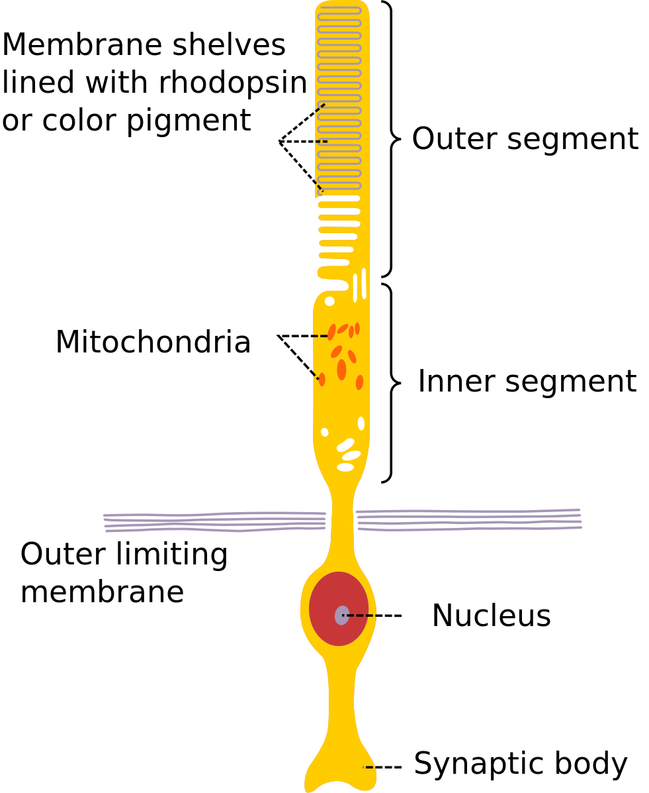

```{r setup, include = FALSE}
knitr::opts_chunk$set(
  collapse = TRUE, 
  comment = "#>", 
  fig.width = 7, 
  fig.align = 'center',
  fig.retina = 2,
  fig.asp = 0.618, # 1 / phi
  out.width = "700px"
)
```

```{r funs-p-img}
p_img <- function(obj, nam) {
  image(1:length(obj), 1, as.matrix(1:length(obj)), col=obj, 
        main = nam, ylab = "", xaxt = "n", yaxt = "n",  bty = "n")
}
```

This blog post is in a series about using and assessing good colours in R. 
This is part 1, which discusses colourblindness. Future parts will discuss how to create your own colour palettes and assess others. It draws from work done by [Kevin Wright in pals](), [Stefan]() and [Nathaniel Smith](), and implementations in a paper by Achim Zeil ...

# What is colourblindness?

tl;dr

> People with colourblindness might perceive some colours as the same, while those without colourblindness perceive them as different. This can be problematic for interpreting graphics. This difference is due to a biological difference in their eyes.

Simplifying things somewhat, let's talk briefly about anatomy.

Here's a side (sagittal) view  eyeball and a retina, with some exaggerated rays of light going through the lens of the eye. 

_shotty drawing of side view of the eye_

The retina is this layer of the eye that connects to light sensitive cells known as "rods and cones", called so because, well, they look like rods, and cones. 

_shotty drawing of rods and cones_

```{r rods-and-cones, fig.show='hold', out.width = "40%"}

knitr::include_graphics("imgs/wiki-cone.png.png")
```

_Illustrations of [Rods](https://en.wikipedia.org/wiki/File:Cone2.svg) and [Cones](https://en.wikipedia.org/wiki/File:Cone_cell_eng.png), taken from from Wikipedia, Licensed under [CC BY-SA 3.0](https://creativecommons.org/licenses/by-sa/3.0/deed.en)._

It's about 120 million rod cells to 6 to 7 million cone cells, about a 20:1 ratio. 

Light comes in, and gets focussed by the lens onto a section of the eye called the _fovea_. Think of this like the bullseye on a target. It's the center of attention and has the most points. It represents the center of our focus. 

_shotty drawing_

The fovea contains a crazy high concentration of cones. So the light hits these rods and cones, and then, after some certain amount of neurological magic (like the fact that the image is presented upside down but our brain flips it), we see an image in full colour.

_magic neurology_

_image presented_

Amazing.

So let's break down what makes up an image here. Let's first just look at a black and white view, where we see the intensity/brightness of the colour.

_Black and white image_

```{r read-img, echo = FALSE}
library(magick)

fire <- image_read("imgs/fire-sprinkler-small.JPG")

fire_bw <- fire %>% image_convert(colorspace = "gray")
```

We add colour to the image using the cones in our eye. These react more to certain light wavelengths. You can think of these like "colour channels" of an image. Summing these together we end up at our previous image. We can actually separate the image into these channels, and represent the intensity of each of these colours, red, green, and blue:

```{r image-channels, echo = FALSE}
fire_red <- fire %>% 
  image_channel(channel = "red") %>% 
  image_border(color = "none")

fire_green <- fire %>% 
  image_channel(channel = "green") %>% 
  image_border(color = "none")

fire_blue <- fire %>% 
  image_channel(channel = "blue") %>% 
  image_border(color = "none")

fire_rgb <- image_append(c(fire_red, fire_green, fire_blue))
fire_rgb
```

Initially I was expecting to just see only the literal colours, red, green, and blue - so while grayscale? This represents the chroma/saturation/intensity of that single colour. So really white means really read.

This might more sense seeing all of these together:

```{r stack-all, echo = FALSE}
image_append(c(fire_bw,fire_rgb, fire), stack = TRUE)
```


There are three types of cones in the eye. They each activate more when they receive light of certain spectrum:

- Red  _red cone image_
- Green _green cone image_
- Blue _blue cone image_

These are more sensitive to each of these colour wavelengths:

```{r cone-sensitivity}
knitr::include_graphics("https://upload.wikimedia.org/wikipedia/commons/0/04/Cone-fundamentals-with-srgb-spectrum.svg")
```

[from https://en.wikipedia.org/wiki/Cone_cell]

> Normalized responsivity spectra of human cone cells, S, M, and L types

```{r}
read_tidy_photowave <- function(path){
  readr::read_csv(file = path,
                  col_names = c("wavelength_nm",
                                "cone_s",
                                "cone_m",
                                "cone_l")) %>% 
  tidyr::pivot_longer(cols = cone_s:cone_l,
                      names_to = "type",
                      values_to = "response")
}

# data provided from http://cvrl.ucl.ac.uk/cones.htm
# 10-deg fundamentals based on the Stiles & Burch 10-deg CMFs
  # units: energy (linear)
  # stepsize: 0.1 nm
  # Format: csv

cone_response <- read_tidy_photowave(
  here::here("content/post/drafts/2020-06-10-what-is-colourblindness/data/linss2_10e_fine.csv")
)
```


```{r}
library(tidyverse)
library(ggspectra)
library(scales)
library(photobiology)
library(photobiologyWavebands)

gg_cone_receptor <- function(cone_response){
ggplot(cone_response,
       aes(x = wavelength_nm,
           y = response,
           group = type)) + 
  wl_guide(chroma.type = "CMF") +
  geom_line(colour = "white", size = 0.75) +
  scale_x_continuous(limits = c(390, 710), 
                     expand = c(0, 0),
                     breaks = scales::breaks_width(25)) +
    labs(x = "Wavelength (nm)",
         y = "Normalised cone response (linear energy)")
}

cone_response %>% gg_cone_receptor()
cone_response %>% filter(type == "cone_s") %>%  gg_cone_receptor()
cone_response %>% filter(type == "cone_m") %>%  gg_cone_receptor()
cone_response %>% filter(type == "cone_l") %>%  gg_cone_receptor()
```


Image inspired by [figure of responsivity of human eye from Wikipedia](https://en.wikipedia.org/wiki/File:Cone-fundamentals-with-srgb-spectrum.svg), data extracted from [Colour & Vision Research laboratory at UCL's](http://cvrl.ucl.ac.uk) section on [cones](http://cvrl.ucl.ac.uk/cones.htm).

colourblindness (generally) comes from an absence, or reduction in sensitivity of the cones in the eye. 

Depending on which cones are missing, this means some sets of colours are indistinguishable from one another. It affects up to 10% of males of European descent, and 1 in 200 women (REF).

So, why does it matter? 

Well let's say you have two colours, red and green. Here is what non-colourblind people see:


```{r plot-red-green}
red_green <- prismatic::colour(c("red", "darkgreen"))
p_img(red_green, "Red & Green")
```

But if you have colourblindness, you will likely see something like the following:

```{r}
red_green_dt <- colorspace::deutan(red_green)
red_green_pt <- colorspace::protan(red_green)
red_green_tt <- colorspace::tritan(red_green)

p_img(red_green_dt, "Red & Green at Deutan")
p_img(red_green_pt, "Red & Green at Protan")
p_img(red_green_tt, "Red & Green at Tritan")
```

This is why traffic lights have position markings, instead of just the same position changing colour.

_gif of good traffic light for different vision_

vs

_gif of bad traffic light with different vision_

```{r}
traffic <- image_read_svg(
  here::here("content/post/drafts/2020-06-10-what-is-colourblindness/imgs/traffic-light.svg")
)

red_light <- traffic %>% image_crop("275x230 + 0 + 29")
amber_light <- traffic %>% image_crop("275x230 + 0 + 260")
green_light <- traffic %>% image_crop("275x230 + 0 + 491")

# colorspace::cvd_emulator(here::here("content/post/drafts/2020-06-10-what-is-colourblindness/imgs/traffic-light.jpeg"))

traffic_deutan <- image_read(
  here::here("content/post/drafts/2020-06-10-what-is-colourblindness/imgs/deutan_traffic-light.jpeg")
)
traffic_protan <- image_read(
  here::here("content/post/drafts/2020-06-10-what-is-colourblindness/imgs/protan_traffic-light.jpeg")
)
traffic_tritan <- image_read(
  here::here("content/post/drafts/2020-06-10-what-is-colourblindness/imgs/tritan_traffic-light.jpeg")
)

traffic_deutan %>% image_annotate(text = "Deutan", 
                                  color = "white",
                                  gravity = "south",
                                  size = 20)

image_append(c(traffic,
               traffic_deutan,
               traffic_protan,
               traffic_tritan))

```


So the point here is:

> Some colours cannot be distinguished by those with colourblindness, so we need to be careful how we present colour, and what colours we present.

# Fin

The next blog post will go into details

## Further Reading

* Achim's paper
* Radiolab episiode on mantis shrimp
* https://cran.r-project.org/web/packages/viridis/vignettes/intro-to-viridis.html
* https://www.imagemagick.org/Usage/color_basics/
* https://cran.r-project.org/web/packages/ggspectra/vignettes/userguide1-grammar.html
