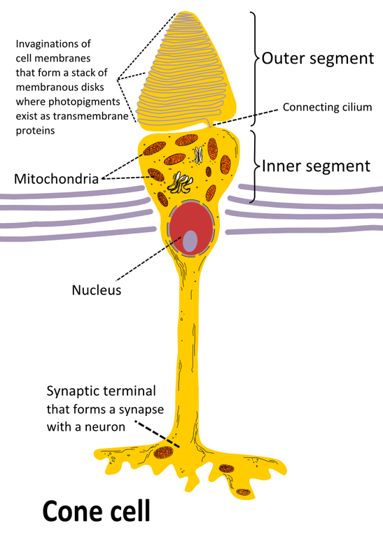
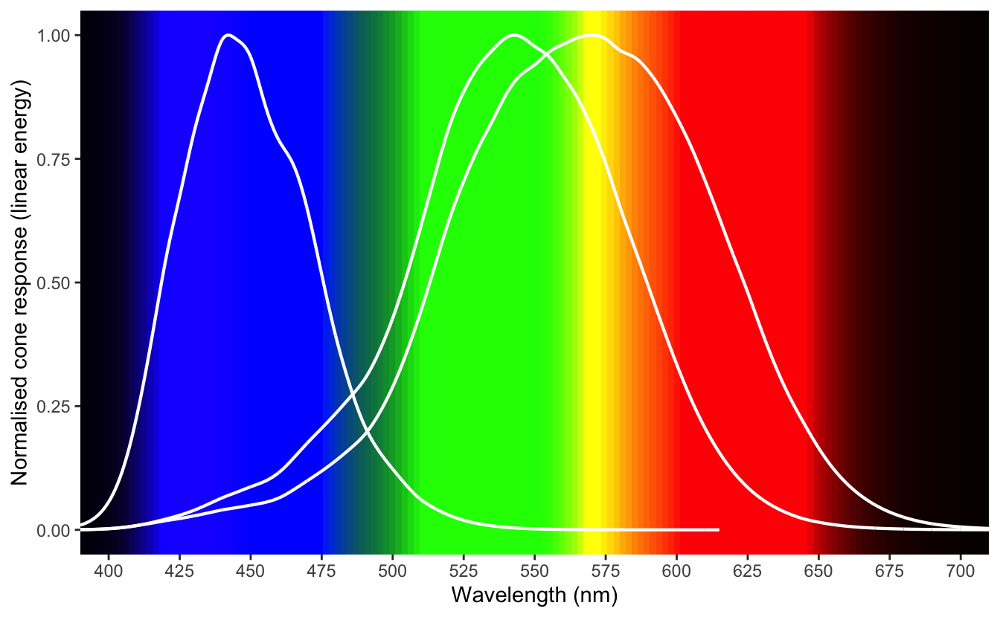
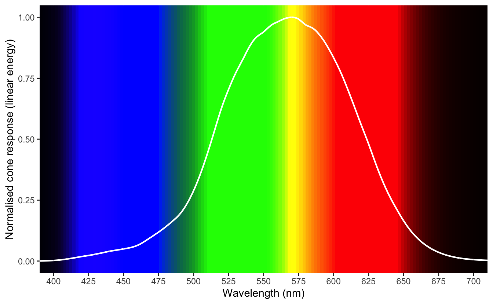
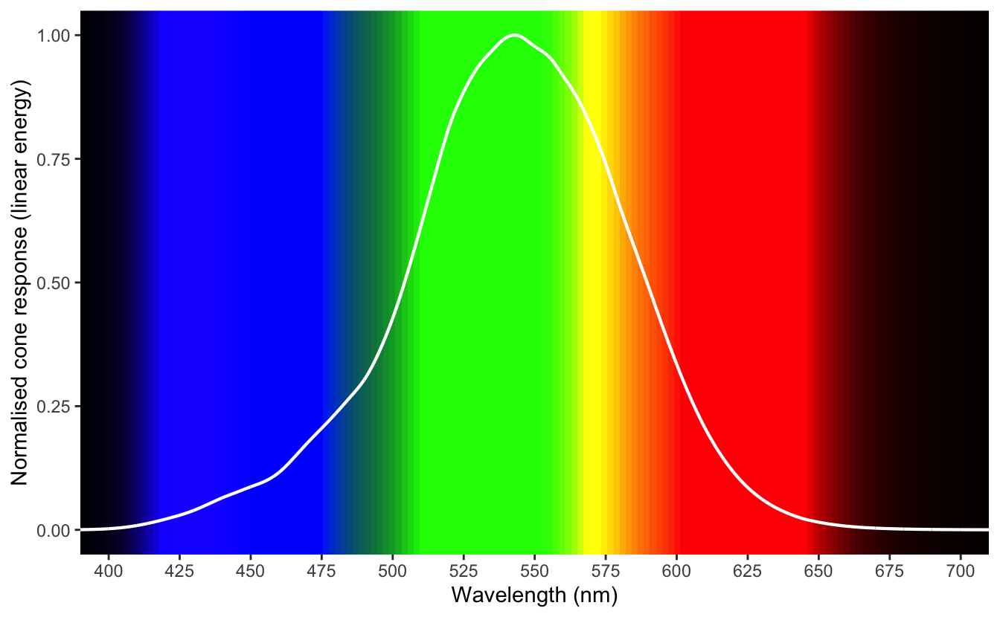
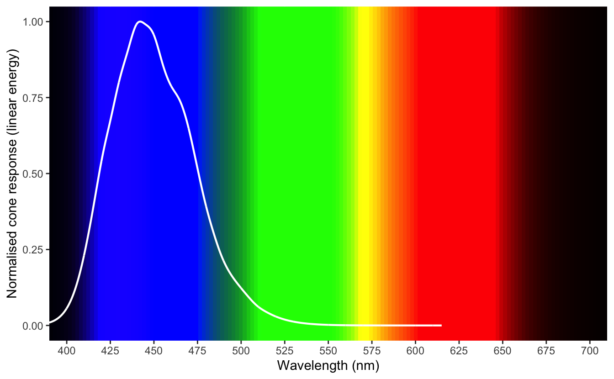
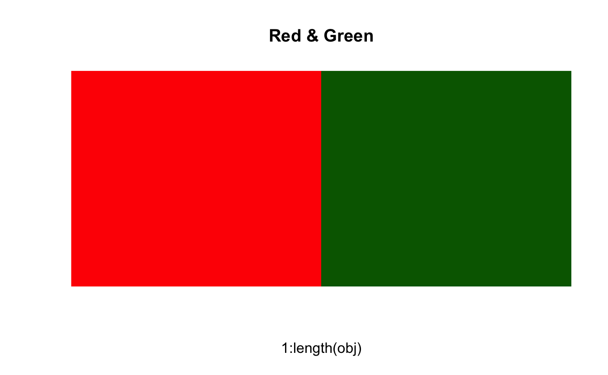
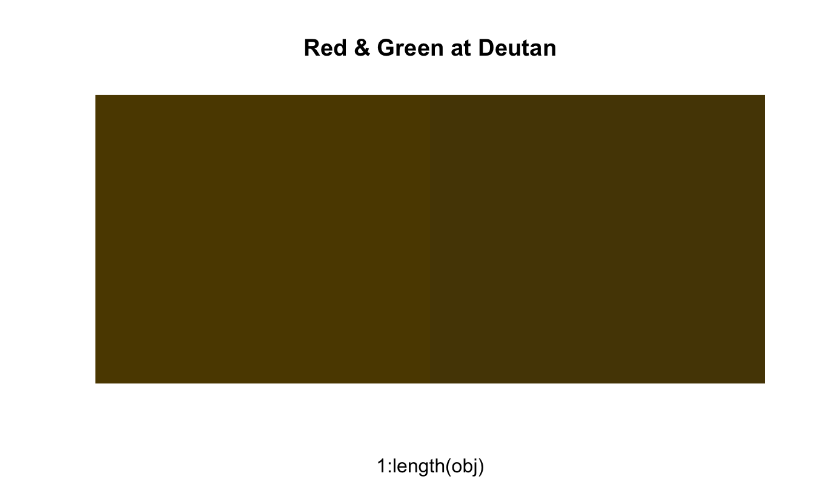
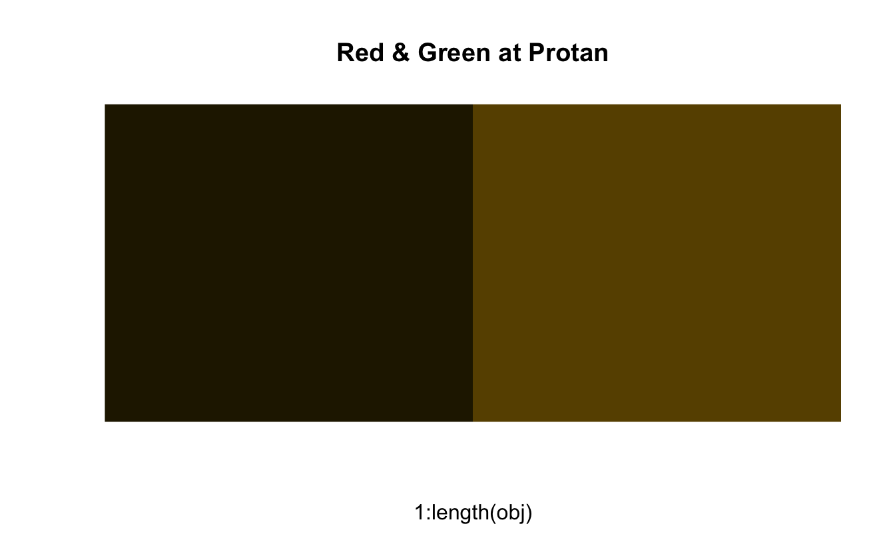
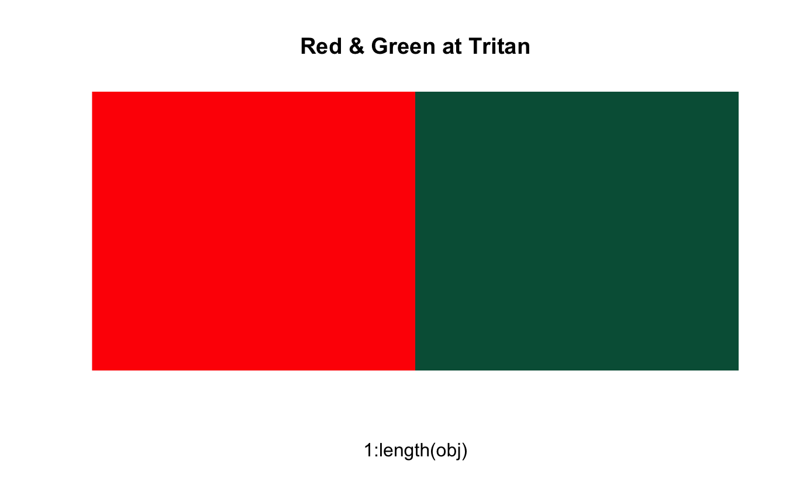
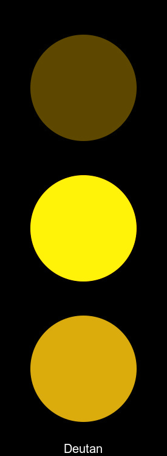

<pre class='chroma'><code class='language-r' data-lang='r'>p_img &lt;- function(obj, nam) {
  <a href='https://rdrr.io/r/graphics/image.html'>image</a>(1:<a href='https://rdrr.io/r/base/length.html'>length</a>(obj), 1, <a href='https://rdrr.io/r/base/matrix.html'>as.matrix</a>(1:<a href='https://rdrr.io/r/base/length.html'>length</a>(obj)), col=obj, 
        main = nam, ylab = "", xaxt = "n", yaxt = "n",  bty = "n")
}</code></pre>

This blog post is in a series about using and assessing good colours in R. This is part 1, which discusses colourblindness. Future parts will discuss how to create your own colour palettes and assess others. It draws from work done by [Kevin Wright in pals](), [Stefan]() and [Nathaniel Smith](), and implementations in a paper by Achim Zeil ...

What is colourblindness?
========================

tl;dr

> People with colourblindness might perceive some colours as the same, while those without colourblindness perceive them as different. This can be problematic for interpreting graphics. This difference is due to a biological difference in their eyes.

Simplifying things somewhat, let's talk briefly about anatomy.

Here's a side (sagittal) view eyeball and a retina, with some exaggerated rays of light going through the lens of the eye.

*shotty drawing of side view of the eye*

The retina is this layer of the eye that connects to light sensitive cells known as "rods and cones", called so because, well, they look like rods, and cones.

*shotty drawing of rods and cones*

<pre class='chroma'><code class='language-r' data-lang='r'>knitr::<a href='https://rdrr.io/pkg/knitr/man/include_graphics.html'>include_graphics</a>("imgs/wiki-rod.png")
knitr::<a href='https://rdrr.io/pkg/knitr/man/include_graphics.html'>include_graphics</a>("imgs/wiki-cone.png")
</code></pre>

*Illustrations of [Rods](https://en.wikipedia.org/wiki/File:Cone2.svg) and [Cones](https://en.wikipedia.org/wiki/File:Cone_cell_eng.png), taken from from Wikipedia, Licensed under [CC BY-SA 3.0](https://creativecommons.org/licenses/by-sa/3.0/deed.en).*

It's about 120 million rod cells to 6 to 7 million cone cells, about a 20:1 ratio.

Light comes in, and gets focussed by the lens onto a section of the eye called the *fovea*. Think of this like the bullseye on a target. It's the center of attention and has the most points. It represents the center of our focus.

*shotty drawing*

The fovea contains a crazy high concentration of cones. So the light hits these rods and cones, and then, after some certain amount of neurological magic (like the fact that the image is presented upside down but our brain flips it), we see an image in full colour.

*magic neurology*

*image presented*

Amazing.

So let's break down what makes up an image here. Let's first just look at a black and white view, where we see the intensity/brightness of the colour.

*Black and white image*

<pre class='chroma'><code class='language-r' data-lang='r'>#&gt; Linking to ImageMagick 7.0.10.10
#&gt; Enabled features: freetype, ghostscript, lcms, webp
#&gt; Disabled features: cairo, fontconfig, fftw, pango, rsvg, x11</code></pre>

We add colour to the image using the cones in our eye. These react more to certain light wavelengths. You can think of these like "colour channels" of an image. Summing these together we end up at our previous image. We can actually separate the image into these channels, and represent the intensity of each of these colours, red, green, and blue:

Initially I was expecting to just see only the literal colours, red, green, and blue - so while grayscale? This represents the chroma/saturation/intensity of that single colour. So really white means really read.

This might more sense seeing all of these together:

There are three types of cones in the eye. They each activate more when they receive light of certain spectrum:

-   Red *red cone image*
-   Green *green cone image*
-   Blue *blue cone image*

These are more sensitive to each of these colour wavelengths:

<pre class='chroma'><code class='language-r' data-lang='r'>knitr::<a href='https://rdrr.io/pkg/knitr/man/include_graphics.html'>include_graphics</a>("https://upload.wikimedia.org/wikipedia/commons/0/04/Cone-fundamentals-with-srgb-spectrum.svg")
</code></pre>

\[from <a href="https://en.wikipedia.org/wiki/Cone_cell" class="uri">https://en.wikipedia.org/wiki/Cone_cell</a>\]

> Normalized responsivity spectra of human cone cells, S, M, and L types

<pre class='chroma'><code class='language-r' data-lang='r'>read_tidy_photowave &lt;- function(path){
  readr::<a href='https://readr.tidyverse.org/reference/read_delim.html'>read_csv</a>(file = path,
                  col_names = <a href='https://rdrr.io/r/base/c.html'>c</a>("wavelength_nm",
                                "cone_s",
                                "cone_m",
                                "cone_l")) %&gt;% 
  tidyr::<a href='https://tidyr.tidyverse.org/reference/pivot_longer.html'>pivot_longer</a>(cols = cone_s:cone_l,
                      names_to = "type",
                      values_to = "response")
}

# data provided from http://cvrl.ucl.ac.uk/cones.htm
# 10-deg fundamentals based on the Stiles &amp; Burch 10-deg CMFs
  # units: energy (linear)
  # stepsize: 0.1 nm
  # Format: csv

cone_response &lt;- read_tidy_photowave(
  here::<a href='https://rdrr.io/pkg/here/man/here.html'>here</a>("content/post/drafts/2020-06-10-what-is-colourblindness/data/linss2_10e_fine.csv")
)
#&gt; Parsed with column specification:
#&gt; cols(
#&gt;   wavelength_nm = col_double(),
#&gt;   cone_s = col_double(),
#&gt;   cone_m = col_double(),
#&gt;   cone_l = col_double()
#&gt; )</code></pre>

<pre class='chroma'><code class='language-r' data-lang='r'><a href='https://rdrr.io/r/base/library.html'>library</a>(<a href='http://tidyverse.tidyverse.org'>tidyverse</a>)
#&gt; ── Attaching packages ───────────────────────────── tidyverse 1.3.0 ──
#&gt; ✔ ggplot2 3.3.1     ✔ purrr   0.3.4
#&gt; ✔ tibble  3.0.1     ✔ dplyr   1.0.0
#&gt; ✔ tidyr   1.1.0     ✔ stringr 1.4.0
#&gt; ✔ readr   1.3.1     ✔ forcats 0.5.0
#&gt; ── Conflicts ──────────────────────────────── tidyverse_conflicts() ──
#&gt; ✖ dplyr::filter() masks stats::filter()
#&gt; ✖ dplyr::lag()    masks stats::lag()
<a href='https://rdrr.io/r/base/library.html'>library</a>(<a href='https://docs.r4photobiology.info/ggspectra'>ggspectra</a>)
#&gt; Loading required package: photobiology
#&gt; News at https://www.r4photobiology.info/
#&gt; 
#&gt; Attaching package: 'photobiology'
#&gt; The following object is masked from 'package:tidyr':
#&gt; 
#&gt;     spread
<a href='https://rdrr.io/r/base/library.html'>library</a>(<a href='https://scales.r-lib.org'>scales</a>)
#&gt; 
#&gt; Attaching package: 'scales'
#&gt; The following object is masked from 'package:purrr':
#&gt; 
#&gt;     discard
#&gt; The following object is masked from 'package:readr':
#&gt; 
#&gt;     col_factor
<a href='https://rdrr.io/r/base/library.html'>library</a>(<a href='https://docs.r4photobiology.info/photobiology'>photobiology</a>)
<a href='https://rdrr.io/r/base/library.html'>library</a>(<a href='https://docs.r4photobiology.info/photobiologyWavebands'>photobiologyWavebands</a>)

gg_cone_receptor &lt;- function(cone_response){
<a href='https://docs.r4photobiology.info/ggspectra//reference/ggplot.html'>ggplot</a>(cone_response,
       aes(x = wavelength_nm,
           y = response,
           group = type)) + 
  <a href='https://docs.r4photobiology.info/ggspectra//reference/stat_wl_strip.html'>wl_guide</a>(chroma.type = "CMF") +
  geom_line(colour = "white", size = 0.75) +
  scale_x_continuous(limits = <a href='https://docs.r4photobiology.info/photobiology//reference/c.html'>c</a>(390, 710), 
                     expand = <a href='https://docs.r4photobiology.info/photobiology//reference/c.html'>c</a>(0, 0),
                     breaks = scales::<a href='https://scales.r-lib.org//reference/breaks_width.html'>breaks_width</a>(25)) +
    labs(x = "Wavelength (nm)",
         y = "Normalised cone response (linear energy)")
}

cone_response %&gt;% gg_cone_receptor()
#&gt; Warning: Removed 4550 row(s) containing missing values (geom_path).
</code></pre>

<pre class='chroma'><code class='language-r' data-lang='r'>cone_response %&gt;% <a href='https://rdrr.io/r/stats/filter.html'>filter</a>(type == "cone_s") %&gt;%  gg_cone_receptor()
#&gt; Warning: Removed 1200 row(s) containing missing values (geom_path).
</code></pre>

<pre class='chroma'><code class='language-r' data-lang='r'>cone_response %&gt;% <a href='https://rdrr.io/r/stats/filter.html'>filter</a>(type == "cone_m") %&gt;%  gg_cone_receptor()
#&gt; Warning: Removed 1200 row(s) containing missing values (geom_path).
</code></pre>

<pre class='chroma'><code class='language-r' data-lang='r'>cone_response %&gt;% <a href='https://rdrr.io/r/stats/filter.html'>filter</a>(type == "cone_l") %&gt;%  gg_cone_receptor()
#&gt; Warning: Removed 2150 row(s) containing missing values (geom_path).
</code></pre>

Image inspired by [figure of responsivity of human eye from Wikipedia](https://en.wikipedia.org/wiki/File:Cone-fundamentals-with-srgb-spectrum.svg), data extracted from [Colour & Vision Research laboratory at UCL's](http://cvrl.ucl.ac.uk) section on [cones](http://cvrl.ucl.ac.uk/cones.htm).

colourblindness (generally) comes from an absence, or reduction in sensitivity of the cones in the eye.

Depending on which cones are missing, this means some sets of colours are indistinguishable from one another. It affects up to 10% of males of European descent, and 1 in 200 women (REF).

So, why does it matter?

Well let's say you have two colours, red and green. Here is what non-colourblind people see:

<pre class='chroma'><code class='language-r' data-lang='r'>red_green &lt;- prismatic::<a href='https://rdrr.io/pkg/prismatic/man/color.html'>colour</a>(<a href='https://docs.r4photobiology.info/photobiology//reference/c.html'>c</a>("red", "darkgreen"))
p_img(red_green, "Red &amp; Green")
</code></pre>

But if you have colourblindness, you will likely see something like the following:

<pre class='chroma'><code class='language-r' data-lang='r'>red_green_dt &lt;- colorspace::<a href='http://colorspace.R-Forge.R-project.org//reference/simulate_cvd.html'>deutan</a>(red_green)
red_green_pt &lt;- colorspace::<a href='http://colorspace.R-Forge.R-project.org//reference/simulate_cvd.html'>protan</a>(red_green)
red_green_tt &lt;- colorspace::<a href='http://colorspace.R-Forge.R-project.org//reference/simulate_cvd.html'>tritan</a>(red_green)

p_img(red_green_dt, "Red &amp; Green at Deutan")
</code></pre>

<pre class='chroma'><code class='language-r' data-lang='r'>p_img(red_green_pt, "Red &amp; Green at Protan")
</code></pre>

<pre class='chroma'><code class='language-r' data-lang='r'>p_img(red_green_tt, "Red &amp; Green at Tritan")
</code></pre>

This is why traffic lights have position markings, instead of just the same position changing colour.

*gif of good traffic light for different vision*

vs

*gif of bad traffic light with different vision*

<pre class='chroma'><code class='language-r' data-lang='r'>traffic &lt;- image_read_svg(
  here::<a href='https://rdrr.io/pkg/here/man/here.html'>here</a>("content/post/drafts/2020-06-10-what-is-colourblindness/imgs/traffic-light.svg")
)

red_light &lt;- traffic %&gt;% image_crop("275x230 + 0 + 29")
amber_light &lt;- traffic %&gt;% image_crop("275x230 + 0 + 260")
green_light &lt;- traffic %&gt;% image_crop("275x230 + 0 + 491")

# colorspace::cvd_emulator(here::here("content/post/drafts/2020-06-10-what-is-colourblindness/imgs/traffic-light.jpeg"))

traffic_deutan &lt;- image_read(
  here::<a href='https://rdrr.io/pkg/here/man/here.html'>here</a>("content/post/drafts/2020-06-10-what-is-colourblindness/imgs/deutan_traffic-light.jpeg")
)
traffic_protan &lt;- image_read(
  here::<a href='https://rdrr.io/pkg/here/man/here.html'>here</a>("content/post/drafts/2020-06-10-what-is-colourblindness/imgs/protan_traffic-light.jpeg")
)
traffic_tritan &lt;- image_read(
  here::<a href='https://rdrr.io/pkg/here/man/here.html'>here</a>("content/post/drafts/2020-06-10-what-is-colourblindness/imgs/tritan_traffic-light.jpeg")
)

traffic_deutan %&gt;% image_annotate(text = "Deutan", 
                                  color = "white",
                                  gravity = "south",
                                  size = 20)
</code></pre>

<pre class='chroma'><code class='language-r' data-lang='r'>
image_append(<a href='https://docs.r4photobiology.info/photobiology//reference/c.html'>c</a>(traffic,
               traffic_deutan,
               traffic_protan,
               traffic_tritan))
</code></pre>

So the point here is:

> Some colours cannot be distinguished by those with colourblindness, so we need to be careful how we present colour, and what colours we present.

Fin
===

The next blog post will go into details

Further Reading
---------------

-   Achim's paper
-   Radiolab episiode on mantis shrimp
-   <a href="https://cran.r-project.org/web/packages/viridis/vignettes/intro-to-viridis.html" class="uri">https://cran.r-project.org/web/packages/viridis/vignettes/intro-to-viridis.html</a>
-   <a href="https://www.imagemagick.org/Usage/color_basics/" class="uri">https://www.imagemagick.org/Usage/color_basics/</a>
-   <a href="https://cran.r-project.org/web/packages/ggspectra/vignettes/userguide1-grammar.html" class="uri">https://cran.r-project.org/web/packages/ggspectra/vignettes/userguide1-grammar.html</a>

