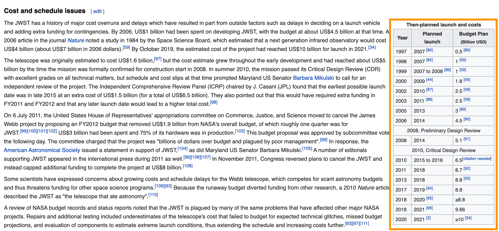
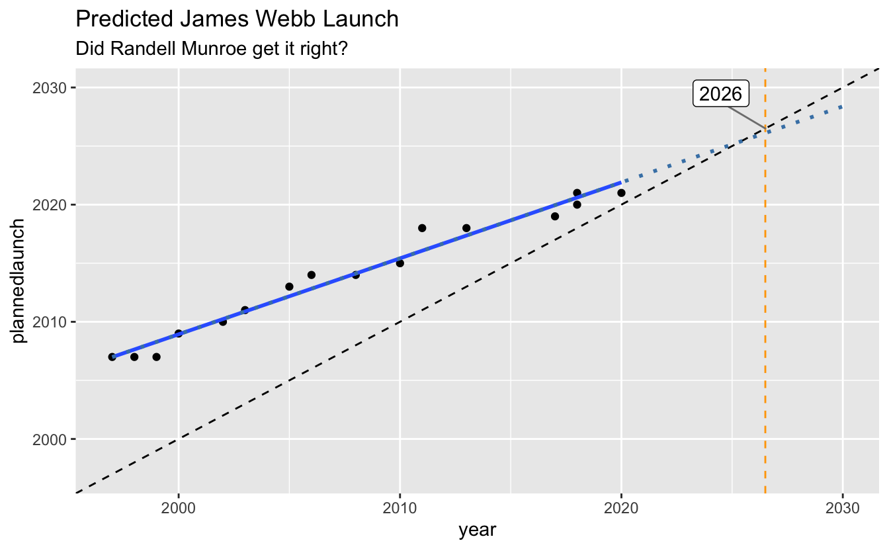

I was talking (well, via video) to a friend about the [James Webb Telescope](https://en.wikipedia.org/wiki/James_Webb_Space_Telescope). The James Webb is going to be a pretty big deal when it launches. It is one of the most complex things designed by humans, and it will do a lot more than the Hubble telescope, which means we can learn more about space, and, well, who knows?

When is it due to launch? It's been delayed quite a few times. There's even a relevant XKCD on this:

And, looking at this, I was wondering how accurate the plot Randall Munrow made was? Turns out this was an interesting exercise in itself!

This blog post covers how to scrape some tables from Wikipedia, tidy them up, perform some basic modelling, make some forecasts, and plot them.

The packages
============

First let's load up a few libraries:

<pre class='chroma'><code class='language-r' data-lang='r'><a href='https://rdrr.io/r/base/library.html'>library</a>(<a href='https://github.com/dmi3kno/polite'>polite</a>)
<a href='https://rdrr.io/r/base/library.html'>library</a>(<a href='http://rvest.tidyverse.org/'>rvest</a>)

#&gt; Loading required package: xml2

<a href='https://rdrr.io/r/base/library.html'>library</a>(<a href='http://tidyverse.tidyverse.org'>tidyverse</a>)

#&gt; ── Attaching packages ───────────────────────────── tidyverse 1.3.0 ──

#&gt; ✔ ggplot2 3.3.2     ✔ purrr   0.3.4
#&gt; ✔ tibble  3.0.4     ✔ dplyr   1.0.2
#&gt; ✔ tidyr   1.1.2     ✔ stringr 1.4.0
#&gt; ✔ readr   1.4.0     ✔ forcats 0.5.0

#&gt; ── Conflicts ──────────────────────────────── tidyverse_conflicts() ──
#&gt; ✖ dplyr::filter()         masks stats::filter()
#&gt; ✖ readr::guess_encoding() masks rvest::guess_encoding()
#&gt; ✖ dplyr::lag()            masks stats::lag()
#&gt; ✖ purrr::pluck()          masks rvest::pluck()

<a href='https://rdrr.io/r/base/library.html'>library</a>(<a href='https://github.com/sfirke/janitor'>janitor</a>)

#&gt; 
#&gt; Attaching package: 'janitor'

#&gt; The following objects are masked from 'package:stats':
#&gt; 
#&gt;     chisq.test, fisher.test

conflicted::<a href='https://rdrr.io/pkg/conflicted/man/conflict_prefer.html'>conflict_prefer</a>("pluck", "purrr")

#&gt; [conflicted] Will prefer purrr::pluck over any other package
</code></pre>

-   `polite` and `rvest` are the webscraping tools
-   `tidyverse` gives us many data analysis tools
-   `janitor` provides some extra data cleaning powers.

We also use `conflicted` to state we prefer `pluck` from the `purrr` package (as there is a `map` in `rvest`, which has caught me out many a time)

First, let's take a look at the [Wiki article](https://en.wikipedia.org/wiki/James_Webb_Space_Telescope) to get the data and the dates.

It looks like this table is what we want:

But how do we download the table into R?

We "inspect element" to identify the table (CMD + Shift + C on Chrome):

Mousing over the table we see that this has the class: "wikitable". We can use this information to help extract out the right part of the website.

First, let's use the `polite` package to check we can download the data:

<pre class='chroma'><code class='language-r' data-lang='r'>wiki_url &lt;- "https://en.wikipedia.org/wiki/James_Webb_Space_Telescope"

<a href='https://rdrr.io/pkg/polite/man/bow.html'>bow</a>(wiki_url)

#&gt; &lt;polite session&gt; https://en.wikipedia.org/wiki/James_Webb_Space_Telescope
#&gt;     User-agent: polite R package - https://github.com/dmi3kno/polite
#&gt;     robots.txt: 456 rules are defined for 33 bots
#&gt;    Crawl delay: 5 sec
#&gt;   The path is scrapable for this user-agent
</code></pre>

Ok looks like we are all good! Now let's `scrape` it.

<pre class='chroma'><code class='language-r' data-lang='r'>jwebb_data &lt;- <a href='https://rdrr.io/pkg/polite/man/bow.html'>bow</a>(wiki_url) %&gt;% <a href='https://rdrr.io/pkg/polite/man/scrape.html'>scrape</a>()

jwebb_data

#&gt; {html_document}
#&gt; &lt;html class="client-nojs" lang="en" dir="ltr"&gt;
#&gt; [1] &lt;head&gt;\n&lt;meta http-equiv="Content-Type" content="text/html; charset=UTF-8 ...
#&gt; [2] &lt;body class="mediawiki ltr sitedir-ltr mw-hide-empty-elt ns-0 ns-subject  ...
</code></pre>

We use tools from `rvest` to identify particular parts. In our case, we want to use `html_nodes` and tell it to get the `.wikitable` that we saw earlier.

<pre class='chroma'><code class='language-r' data-lang='r'>jwebb_data %&gt;% 
  <a href='https://rvest.tidyverse.org/reference/html_nodes.html'>html_nodes</a>(".wikitable")

#&gt; {xml_nodeset (3)}
#&gt; [1] &lt;table class="wikitable" style="text-align:center; float:center; margin:1 ...
#&gt; [2] &lt;table class="wikitable" style="font-size:88%; float:right; margin-left:0 ...
#&gt; [3] &lt;table class="wikitable" style="font-size:0.9em; float:right; margin-left ...
</code></pre>

We see here that we have three tables, let's extract the tables from each of these, using `map` to run `html_table` on each, using `fill = TRUE` to fill rows with fewer than max columns with NAs, to ensure we get proper data back.

<pre class='chroma'><code class='language-r' data-lang='r'>jwebb_data %&gt;% 
  <a href='https://rvest.tidyverse.org/reference/html_nodes.html'>html_nodes</a>(".wikitable") %&gt;% 
  map(html_table, fill = TRUE)

#&gt; [[1]]
#&gt;                                                                    X1
#&gt; 1                       Selected space telescopes and instruments[56]
#&gt; 2                                                                Name
#&gt; 3                                                                 IRT
#&gt; 4                                Infrared Space Observatory (ISO)[57]
#&gt; 5                  Hubble Space Telescope Imaging Spectrograph (STIS)
#&gt; 6  Hubble Near Infrared Camera and Multi-Object Spectrometer (NICMOS)
#&gt; 7                                             Spitzer Space Telescope
#&gt; 8                                   Hubble Wide Field Camera 3 (WFC3)
#&gt; 9                                          Herschel Space Observatory
#&gt; 10                                                               JWST
#&gt;                                               X2
#&gt; 1  Selected space telescopes and instruments[56]
#&gt; 2                                           Year
#&gt; 3                                           1985
#&gt; 4                                           1995
#&gt; 5                                           1997
#&gt; 6                                           1997
#&gt; 7                                           2003
#&gt; 8                                           2009
#&gt; 9                                           2009
#&gt; 10                                          2021
#&gt;                                               X3
#&gt; 1  Selected space telescopes and instruments[56]
#&gt; 2                                     Wavelength
#&gt; 3                                     1.7–118 μm
#&gt; 4                                     2.5–240 μm
#&gt; 5                                  0.115–1.03 μm
#&gt; 6                                     0.8–2.4 μm
#&gt; 7                                       3–180 μm
#&gt; 8                                     0.2–1.7 μm
#&gt; 9                                      55–672 μm
#&gt; 10                                   0.6–28.5 μm
#&gt;                                               X4
#&gt; 1  Selected space telescopes and instruments[56]
#&gt; 2                                       Aperture
#&gt; 3                                         0.15 m
#&gt; 4                                         0.60 m
#&gt; 5                                          2.4 m
#&gt; 6                                          2.4 m
#&gt; 7                                         0.85 m
#&gt; 8                                          2.4 m
#&gt; 9                                          3.5 m
#&gt; 10                                         6.5 m
#&gt;                                               X5
#&gt; 1  Selected space telescopes and instruments[56]
#&gt; 2                                        Cooling
#&gt; 3                                         Helium
#&gt; 4                                         Helium
#&gt; 5                                        Passive
#&gt; 6                     Nitrogen, later cryocooler
#&gt; 7                                         Helium
#&gt; 8                 Passive + Thermo-electric [58]
#&gt; 9                                         Helium
#&gt; 10                   Passive + cryocooler (MIRI)
#&gt;                                               X6
#&gt; 1  Selected space telescopes and instruments[56]
#&gt; 2                                           &lt;NA&gt;
#&gt; 3                                           &lt;NA&gt;
#&gt; 4                                           &lt;NA&gt;
#&gt; 5                                           &lt;NA&gt;
#&gt; 6                                           &lt;NA&gt;
#&gt; 7                                           &lt;NA&gt;
#&gt; 8                                           &lt;NA&gt;
#&gt; 9                                           &lt;NA&gt;
#&gt; 10                                          &lt;NA&gt;
#&gt;                                               X7
#&gt; 1  Selected space telescopes and instruments[56]
#&gt; 2                                           &lt;NA&gt;
#&gt; 3                                           &lt;NA&gt;
#&gt; 4                                           &lt;NA&gt;
#&gt; 5                                           &lt;NA&gt;
#&gt; 6                                           &lt;NA&gt;
#&gt; 7                                           &lt;NA&gt;
#&gt; 8                                           &lt;NA&gt;
#&gt; 9                                           &lt;NA&gt;
#&gt; 10                                          &lt;NA&gt;
#&gt;                                               X8
#&gt; 1  Selected space telescopes and instruments[56]
#&gt; 2                                           &lt;NA&gt;
#&gt; 3                                           &lt;NA&gt;
#&gt; 4                                           &lt;NA&gt;
#&gt; 5                                           &lt;NA&gt;
#&gt; 6                                           &lt;NA&gt;
#&gt; 7                                           &lt;NA&gt;
#&gt; 8                                           &lt;NA&gt;
#&gt; 9                                           &lt;NA&gt;
#&gt; 10                                          &lt;NA&gt;
#&gt; 
#&gt; [[2]]
#&gt;   Year               Events
#&gt; 1 1996        NGST started.
#&gt; 2 2002 named JWST, 8 to 6 m
#&gt; 3 2004 NEXUS cancelled [60]
#&gt; 4 2007         ESA/NASA MOU
#&gt; 5 2010          MCDR passed
#&gt; 6 2011      Proposed cancel
#&gt; 7 2021       Planned launch
#&gt; 
#&gt; [[3]]
#&gt;                               Year                   Plannedlaunch
#&gt; 1                             1997                       2007 [80]
#&gt; 2                             1998                       2007 [85]
#&gt; 3                             1999               2007 to 2008 [86]
#&gt; 4                             2000                       2009 [44]
#&gt; 5                             2002                       2010 [87]
#&gt; 6                             2003                       2011 [88]
#&gt; 7                             2005                            2013
#&gt; 8                             2006                            2014
#&gt; 9  2008, Preliminary Design Review 2008, Preliminary Design Review
#&gt; 10                            2008                            2014
#&gt; 11    2010, Critical Design Review    2010, Critical Design Review
#&gt; 12                            2010                    2015 to 2016
#&gt; 13                            2011                            2018
#&gt; 14                            2013                            2018
#&gt; 15                            2017                       2019 [94]
#&gt; 16                            2018                       2020 [95]
#&gt; 17                            2018                       2021 [96]
#&gt; 18                            2020                        2021 [3]
#&gt;           Budget Plan(Billion USD)
#&gt; 1                         0.5 [80]
#&gt; 2                           1 [59]
#&gt; 3                           1 [59]
#&gt; 4                         1.8 [59]
#&gt; 5                         2.5 [59]
#&gt; 6                         2.5 [59]
#&gt; 7                           3 [89]
#&gt; 8                         4.5 [90]
#&gt; 9  2008, Preliminary Design Review
#&gt; 10                        5.1 [91]
#&gt; 11    2010, Critical Design Review
#&gt; 12            6.5[citation needed]
#&gt; 13                        8.7 [92]
#&gt; 14                        8.8 [93]
#&gt; 15                             8.8
#&gt; 16                            ≥8.8
#&gt; 17                            9.66
#&gt; 18                        ≥10 [34]
</code></pre>

We want the third table, so we use `pluck`, and convert it to a `tibble` for nice printing

<pre class='chroma'><code class='language-r' data-lang='r'>jwebb_data %&gt;% 
  <a href='https://rvest.tidyverse.org/reference/html_nodes.html'>html_nodes</a>(".wikitable") %&gt;% 
  map(html_table, fill = TRUE) %&gt;% 
  <a href='https://rvest.tidyverse.org/reference/pluck.html'>pluck</a>(3) %&gt;% 
  as_tibble()

#&gt; # A tibble: 18 x 3
#&gt;    Year                     Plannedlaunch             `Budget Plan(Billion USD)`
#&gt;    &lt;chr&gt;                    &lt;chr&gt;                     &lt;chr&gt;                     
#&gt;  1 1997                     2007 [80]                 0.5 [80]                  
#&gt;  2 1998                     2007 [85]                 1 [59]                    
#&gt;  3 1999                     2007 to 2008 [86]         1 [59]                    
#&gt;  4 2000                     2009 [44]                 1.8 [59]                  
#&gt;  5 2002                     2010 [87]                 2.5 [59]                  
#&gt;  6 2003                     2011 [88]                 2.5 [59]                  
#&gt;  7 2005                     2013                      3 [89]                    
#&gt;  8 2006                     2014                      4.5 [90]                  
#&gt;  9 2008, Preliminary Desig… 2008, Preliminary Design… 2008, Preliminary Design …
#&gt; 10 2008                     2014                      5.1 [91]                  
#&gt; 11 2010, Critical Design R… 2010, Critical Design Re… 2010, Critical Design Rev…
#&gt; 12 2010                     2015 to 2016              6.5[citation needed]      
#&gt; 13 2011                     2018                      8.7 [92]                  
#&gt; 14 2013                     2018                      8.8 [93]                  
#&gt; 15 2017                     2019 [94]                 8.8                       
#&gt; 16 2018                     2020 [95]                 ≥8.8                      
#&gt; 17 2018                     2021 [96]                 9.66                      
#&gt; 18 2020                     2021 [3]                  ≥10 [34]
</code></pre>

We get rid of rows 9 and 11 as they are rows that span the full table and aren't proper data in this context, and then run `clean_names` from `janitor` to make the variable names nicer.

<pre class='chroma'><code class='language-r' data-lang='r'>jwebb_data %&gt;% 
  <a href='https://rvest.tidyverse.org/reference/html_nodes.html'>html_nodes</a>(".wikitable") %&gt;% 
  map(html_table, fill = TRUE) %&gt;% 
  <a href='https://rvest.tidyverse.org/reference/pluck.html'>pluck</a>(3) %&gt;% 
  as_tibble() %&gt;% 
  slice(-9, 
        -11) %&gt;% 
  <a href='https://rdrr.io/pkg/janitor/man/clean_names.html'>clean_names</a>()

#&gt; # A tibble: 16 x 3
#&gt;    year  plannedlaunch     budget_plan_billion_usd
#&gt;    &lt;chr&gt; &lt;chr&gt;             &lt;chr&gt;                  
#&gt;  1 1997  2007 [80]         0.5 [80]               
#&gt;  2 1998  2007 [85]         1 [59]                 
#&gt;  3 1999  2007 to 2008 [86] 1 [59]                 
#&gt;  4 2000  2009 [44]         1.8 [59]               
#&gt;  5 2002  2010 [87]         2.5 [59]               
#&gt;  6 2003  2011 [88]         2.5 [59]               
#&gt;  7 2005  2013              3 [89]                 
#&gt;  8 2006  2014              4.5 [90]               
#&gt;  9 2008  2014              5.1 [91]               
#&gt; 10 2010  2015 to 2016      6.5[citation needed]   
#&gt; 11 2011  2018              8.7 [92]               
#&gt; 12 2013  2018              8.8 [93]               
#&gt; 13 2017  2019 [94]         8.8                    
#&gt; 14 2018  2020 [95]         ≥8.8                   
#&gt; 15 2018  2021 [96]         9.66                   
#&gt; 16 2020  2021 [3]          ≥10 [34]
</code></pre>

Finally we `parse_number` over all columns, using `across` and friends:

<pre class='chroma'><code class='language-r' data-lang='r'>jwebb &lt;- jwebb_data %&gt;% 
  <a href='https://rvest.tidyverse.org/reference/html_nodes.html'>html_nodes</a>(".wikitable") %&gt;% 
  map(html_table, fill = TRUE) %&gt;% 
  <a href='https://rvest.tidyverse.org/reference/pluck.html'>pluck</a>(3) %&gt;% 
  as_tibble() %&gt;% 
  slice(-9,
        -11) %&gt;% 
  <a href='https://rdrr.io/pkg/janitor/man/clean_names.html'>clean_names</a>() %&gt;% 
  mutate(across(everything(), parse_number))

jwebb

#&gt; # A tibble: 16 x 3
#&gt;     year plannedlaunch budget_plan_billion_usd
#&gt;    &lt;dbl&gt;         &lt;dbl&gt;                   &lt;dbl&gt;
#&gt;  1  1997          2007                    0.5 
#&gt;  2  1998          2007                    1   
#&gt;  3  1999          2007                    1   
#&gt;  4  2000          2009                    1.8 
#&gt;  5  2002          2010                    2.5 
#&gt;  6  2003          2011                    2.5 
#&gt;  7  2005          2013                    3   
#&gt;  8  2006          2014                    4.5 
#&gt;  9  2008          2014                    5.1 
#&gt; 10  2010          2015                    6.5 
#&gt; 11  2011          2018                    8.7 
#&gt; 12  2013          2018                    8.8 
#&gt; 13  2017          2019                    8.8 
#&gt; 14  2018          2020                    8.8 
#&gt; 15  2018          2021                    9.66
#&gt; 16  2020          2021                   10
</code></pre>

We now want to check we can make a similar plot to XKCD, let's plot the data, with a linear model fit overlayed:

<pre class='chroma'><code class='language-r' data-lang='r'>gg_jwebb &lt;- ggplot(jwebb,
       aes(x = year,
           y = plannedlaunch)) + 
  geom_point() + 
  geom_smooth(method = "lm",
              se = FALSE)
gg_jwebb

#&gt; `geom_smooth()` using formula 'y ~ x'

</code></pre>

OK but now we need to extend out the plot to get a sense of where it can extrapolate to. Let's extend the limits, and add an abline, a line with slope of 1 and intercept through 0.

<pre class='chroma'><code class='language-r' data-lang='r'>gg_jwebb +
  lims(x = <a href='https://rdrr.io/r/base/c.html'>c</a>(1997,2030),
       y = <a href='https://rdrr.io/r/base/c.html'>c</a>(1997,2030)) + 
  geom_abline(linetype = 2)

#&gt; `geom_smooth()` using formula 'y ~ x'

</code></pre>

We want to extend that fitted line ahead, so let's fit a linear model to the data with `plannedlaunch` being predicted by `year` (which is what `geom_smooth(method = "lm")` does under the hood):

<pre class='chroma'><code class='language-r' data-lang='r'>lm_jwebb &lt;- <a href='https://rdrr.io/r/stats/lm.html'>lm</a>(plannedlaunch ~ year, jwebb)
</code></pre>

Then we use `augment` to predict some new data for 1997 through to 2030:

<pre class='chroma'><code class='language-r' data-lang='r'><a href='https://rdrr.io/r/base/library.html'>library</a>(<a href='https://broom.tidymodels.org/'>broom</a>)
new_data &lt;- tibble(year = 1997:2030)
jwebb_predict &lt;- <a href='https://rdrr.io/pkg/generics/man/augment.html'>augment</a>(lm_jwebb, newdata = new_data)
jwebb_predict

#&gt; # A tibble: 34 x 2
#&gt;     year .fitted
#&gt;    &lt;int&gt;   &lt;dbl&gt;
#&gt;  1  1997   2007.
#&gt;  2  1998   2008.
#&gt;  3  1999   2008.
#&gt;  4  2000   2009.
#&gt;  5  2001   2010.
#&gt;  6  2002   2010.
#&gt;  7  2003   2011.
#&gt;  8  2004   2012.
#&gt;  9  2005   2012.
#&gt; 10  2006   2013.
#&gt; # … with 24 more rows
</code></pre>

Now we can add that to our plot:

<pre class='chroma'><code class='language-r' data-lang='r'>gg_jwebb_pred &lt;- gg_jwebb +
  lims(x = <a href='https://rdrr.io/r/base/c.html'>c</a>(1997,2030),
       y = <a href='https://rdrr.io/r/base/c.html'>c</a>(1997,2030)) + 
  geom_abline(linetype = 2) +
  geom_line(data = jwebb_predict,
            colour = "steelblue",
            linetype = 3,
            size = 1,
            aes(x = year,
                y = .fitted))
gg_jwebb_pred

#&gt; `geom_smooth()` using formula 'y ~ x'

</code></pre>

And finally add some extra details that XKCD had, using `geom_vline` and `geom_label_rep`

<pre class='chroma'><code class='language-r' data-lang='r'><a href='https://rdrr.io/r/base/library.html'>library</a>(<a href='http://github.com/slowkow/ggrepel'>ggrepel</a>)

gg_jwebb_pred + 
  geom_vline(xintercept = 2026.5,
             linetype = 2,
             colour = "orange") +
  labs(title = "Predicted James Webb Launch",
       subtitle = "Did Randell Munroe get it right?") +
  <a href='https://rdrr.io/pkg/ggrepel/man/geom_text_repel.html'>geom_label_repel</a>(data = <a href='https://rdrr.io/r/base/data.frame.html'>data.frame</a>(year = 2026.5,
                               plannedlaunch = 2026.5),
             label = "2026",
             nudge_x = -2,
             nudge_y = 3,
             segment.colour = "gray50")

#&gt; `geom_smooth()` using formula 'y ~ x'

</code></pre>

Did he get it right?

Yes, of course. Why did I ever doubt him.

