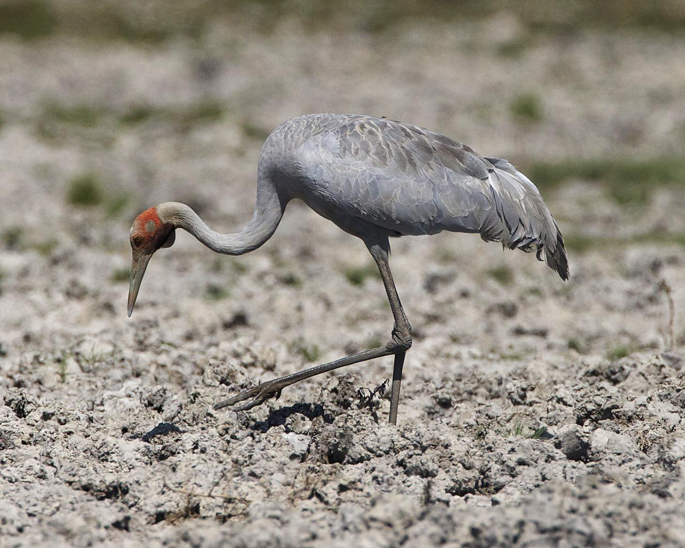

layout: true
<div class="my-footer"><span>bit.ly/ysc-njt • @nj_tierney</span></div> 

```{r setup, include=FALSE}
# options(htmltools.dir.version = FALSE, width = 120)
# NOTE TO SELF: The CSS styles were created in `create-njt-theme.R`
library(brolgar)
library(tidyverse)
library(visdat)
library(naniar)
library(gganimate)
library(knitr)

opts_chunk$set(
  fig.path = "figures/",
  cache.path = "cache/",
  fig.align = "center",
  fig.width = 13,
  fig.height = 6,
  fig.retina = 3,
  fig.show = "hold",
  external = TRUE,
  # dev = "svglite",
  # dev.args = list(bg = "transparent"),
  message = FALSE,
  warning = FALSE,
  cache = TRUE,
  echo = FALSE,
  autodep = TRUE
)

mp4_vid <- function(src){
  HTML(
    paste0(
      '<video autoplay>
        <source src="', src, '" type="video/mp4">
      </video>'
    )
  )
}

fig.fullsize <- c(fig.height = 3.5, fig.width = 8, out.width = "150%"
)


# hook_output <- knit_hooks$get("output")
# knit_hooks$set(output = function(x, options) {
#    lines <- options$output.lines
#    if (is.null(lines)) {
#      return(hook_output(x, options))  # pass to default hook
#    }
#    x <- unlist(strsplit(x, "\n"))
#    more <- "..."
#    if (length(lines)==1) {        # first n lines
#      if (length(x) > lines) {
#        # truncate the output, but add ....
#        x <- c(head(x, lines), more)
#      }
#    } else {
#      x <- c(more, x[lines], more)
#    }
#    # paste these lines together
#    x <- paste(c(x, ""), collapse = "\n")
#    hook_output(x, options)
#  })

theme_set(
  theme_grey(base_size = 16) +
  theme(
    legend.position = "bottom",
    plot.background = element_rect(fill = "transparent"),
    legend.background = element_rect(fill = "transparent")
  )
)

example <- heights %>%
  filter(country == "Australia",
         year >= 1910)

# **ni**ck's **pa**lette
nipa <- list(red = "#c03018",
             orange = "#f0a800",
             green = "#609048",
             purple = "#484878",
             light_purple = "#A3A3BB",
             light_green = "#AFC7A3",
             light_orange = "#F7D37F",
             light_red = "#DF978B",
             pale_purple = "#ECECF1",
             pale_green = "#D7E3D1",
             pale_orange = "#FBE9BF",
             pale_red = "#EFCBC4")

```

```{r fun-heights-appear}
anim_height_appear <- function(){
  anim <- ggplot(heights,
                 aes(x = year,
                     y = height_cm,
                     group = country)) + 
    geom_line() + 
    transition_manual(country, cumulative = TRUE) + 
    ease_aes("exponential")
  animate(anim, fps = 24)
}
```

```{r fun-height-reveal}
anim_height_reveal <- function(){
p <- ggplot(example, 
            aes(x = year, 
                y = height_cm)) + 
  geom_line() + 
  geom_point(colour = "red", size = 2) + 
  geom_point(aes(group = seq_along(year))) + 
  transition_reveal(year) + 
  ease_aes('cubic-in-out')
animate(p, fps = 24)
}
```

```{r fun-gg-heights}
gg_heights <- function(data){  
  ggplot(data, 
         aes(x = year,
             y = height_cm,
             group = country)) + 
  geom_line()
}
```


---
class: inverse, middle,

# What is longitudinal data?

.huge[
> Something observed sequentially over time
]


---

# What is longitudinal data?

.large[
```{r example-1}
example[1,]
```
]

---

# What is longitudinal data?

.large[
```{r example-2}
example[1:2,]
```
]

---

# What is longitudinal data?

.large[
```{r example-3}
example[1:3,]
```
]

---

# What is longitudinal data?

.large[
```{r example-4}
example[1:4,]
```
]

---
class: center, middle, inverse

.huge[
But we are **statisticians**:

let's **visualise**
]

---

```{r reveal-height, fig.height = 3.5, fig.width = 8, out.width = "150%"}

anim_height_reveal()
```

---

```{r gg-example, fig.height = 3.5, fig.width = 8, out.width = "150%"}
ggplot(example,
       aes(x = year,
           y = height_cm)) + 
  geom_point() + 
  geom_line()
```

---

# All of Australia

```{r gg-all-australia}
heights %>%
  filter(country %in% c("Australia")) %>%
  gg_heights() + 
  lims(x = range(heights$year),
       y = range(heights$height_cm))

```


---

# ...And New Zealand

```{r gg-show-a-few-countries}
heights %>%
  filter(country %in% c("Australia",
                        "New Zealand")) %>%
gg_heights() + 
  lims(x = range(heights$year),
       y = range(heights$height_cm))
```


---

# ... And Afghanistan and Albania

```{r sample-more-heights}
heights %>%
  filter(country %in% c("Australia",
                        "Afghanistan",
                        "Albania",
                        "New Zealand")) %>%
gg_heights() + 
  lims(x = range(heights$year),
       y = range(heights$height_cm))
```

---

# And the rest?

```{r animate-all-data}

anim_height_appear()
```

---

# And the rest?

```{r gg-show-all}
ggplot(heights,
       aes(x = year,
           y = height_cm,
           group = country)) + 
  geom_line()
```


---

```{r noodle-explode-gif, out.width = "50%"}

```


---

# Does transparency help?

```{r gg-show-all-w-alpha}
ggplot(heights,
       aes(x = year,
           y = height_cm,
           group = country)) + 
  geom_line(alpha = 0.2) 
```

---

# Does transparency + a model help?

```{r gg-show-all-w-model}
ggplot(heights,
       aes(x = year,
           y = height_cm)) + 
  geom_line(alpha = 0.2,
            aes(group = country)) + 
  geom_smooth(method = "lm")
```

---
class: inverse, middle, center

.vhuge[
I've got ~~99 problems~~ **153 countries** but I can't see **anything**
]

---
class: middle, center

<iframe width="1120" height="630" src="https://www.youtube.com/embed/UerBCXHKJ5s?start=15" frameborder="0" allow="accelerometer; autoplay; encrypted-media; gyroscope; picture-in-picture" allowfullscreen></iframe>

---
class: inverse, middle, center

.huge[
Problem #1: How do I look at **some** of the data?
]

--

.huge[
Problem #2: How do I find **interesting** observations?
]


---

# Introducing `brolgar`:

.pull-left.large[
* **br**owsing
* **o**ver
* **l**ongitudinal data 
* **g**raphically, and
* **a**nalytically, in
* **r**
]

.pull-right[
```{r show-brolgar}

```
**
]

???

* It's a crane, it fishes, and it's a native Australian bird


---

```{r gg-remind-spaghetti, fig.width = 8, fig.height = 4, out.width = "200%"}
gg_spag <- 
gg_heights(heights) + 
  labs(title = "Remember, this is a spaghetti plot",
       subtitle = "This plot is the problem we are trying to solve")

gg_spag
```


---
class: inverse, middle, center

# What is longitudinal data?

.vlarge[
> Something observed sequentially over time
]
---
class: inverse, middle, center

# What is longitudinal data?


.vlarge[
> ~~Something~~ **Anything that is** observed sequentially over time **is a time series**
]

--

.large[
[-- Rob Hyndman and George Athanasopolous,
Forecasting: Principles and Practice](https://otexts.com/fpp2/data-methods.html)
]

---

# Longitudinal data as a time series 


```{r show-tsibble-creation, echo = TRUE, eval = FALSE}
heights <- as_tsibble(heights,
                      index = year,
                      key = country,
                      regular = FALSE) #<<
```

1. **index**: Your time variable
2. **key**: Variable(s) defining individual groups (or series)

`1. +  2.` determine distinct rows in a tsibble.

(From Earo Wang's talk: [Melt the clock](https://slides.earo.me/rstudioconf19/#8))


---

.large[
```{r show-heights}
print(heights, n = 6)
```
]

---
class: inverse, middle, center

.huge[
Remember: 

**key**  = variable(s) defining individual groups (or series)
]

---

# `sample_n_keys()` to sample ... **keys**

```{r show-sample-keys, echo = TRUE, eval = FALSE}
heights %>% sample_n_keys(5)
```
```{r print-show-sample-keys}
heights %>% sample_n_keys(5) %>% print(n = 6)
```

---

# `sample_n_keys()` to sample ... **keys**

```{r ggplot-sample-keys}
heights %>%
  sample_n_keys(5) %>% 
  gg_heights()
```

---

# `facet_sample()`: See more individuals

```{r gg-facet-sample-all, echo = TRUE, out.width = "60%"}
ggplot(heights, aes(x = year, 
                    y = height_cm, 
                    group = country)) + 
  geom_line() 
```

---

# `facet_sample()`: See more individuals

```{r gg-facet-sample, echo = TRUE, eval = FALSE}
ggplot(heights,
       aes(x = year,
             y = height_cm,
             group = country)) + 
  geom_line() + 
  facet_sample() #<<
```

---

# `facet_sample()`: See more individuals

```{r print-gg-facet-sample, ref.label='gg-facet-sample'}
```

---

# `facet_strata()`: See all individuals

```{r gg-facet-strata, echo = TRUE, eval = FALSE}
ggplot(heights,
       aes(x = year,
             y = height_cm,
             group = country)) + 
  geom_line() + 
  facet_strata() #<<
```

---

# `facet_strata()`: See all individuals

```{r print-gg-facet-strata, ref.label='gg-facet-strata'}
```

---

## `facet_strata(along = -year)`: see all individuals **along** some variable

```{r gg-facet-strata-along, echo = TRUE, eval = FALSE}
ggplot(heights,
       aes(x = year,
             y = height_cm,
             group = country)) + 
  geom_line() + 
  facet_strata(along = -year) #<<
```

---

## `facet_strata(along = -year)`: see all individuals **along** some variable

```{r print-gg-facet-strata-along, ref.label = "gg-facet-strata-along"}
```

---

## Problem #1: How do I look at some of the data?

--

.large[

`as_tsibble()`

`sample_n_keys()`

`facet_sample()`

`facet_strata()`

]

---

## ~~Problem #1: How do I look at some of the data?~~

.large[

`as_tsibble()`

`sample_n_keys()`

`facet_sample()`

`facet_strata()`

]


---

## Problem #2: How do I find **interesting** observations?

```{r quote-interesting-obs}
ggplot(heights,
       aes(x = year,
             y = height_cm,
             group = country)) + 
  geom_line()
```

---
class: inverse, center, middle

.huge[
Define interesting?
]


---

## Identify features: one per **key** 

```{r show-features, echo = TRUE, eval = FALSE}
heights %>%
  features(height_cm, #<<
           feat_five_num) #<<
```
 
```{r create-feature-five}
heights_five <- heights %>%
  features(height_cm, #<<
           feat_five_num) #<<

print(heights_five, n = 6)
```


---

## Identify features: summarise down to one observation

```{r anim-line-flat}
set.seed(2019-09-30-0012)

heights_feature <- heights %>%
  features(height_cm, feat_spread) 

heights_feature_flat <- heights_feature %>%
  left_join(heights, by = "country") %>%
  group_by(country) %>%
  mutate(height_cm = max(height_cm))

heights_feature_flat_var <- heights_feature %>%
  left_join(heights, by = "country") %>%
  group_by(country) %>%
  mutate(height_cm = var(height_cm))

heights_flat_combine <- bind_rows(spaghetti = as_tibble(heights),
                                  summary = heights_feature_flat,
                                  .id = "state") %>%
  mutate(state = factor(state, levels = c("spaghetti", 
                                          "summary")))

heights_flat_combine_var <- bind_rows(spaghetti = as_tibble(heights),
                                      summary = heights_feature_flat_var,
                                      .id = "state") %>%
  mutate(state = factor(state, levels = c("spaghetti", 
                                          "summary")))
```


```{r anim-line-flat-max, cache = TRUE}
library(gganimate)
anim_flat <- ggplot(heights_flat_combine,
       aes(x = year,
           y = height_cm,
           group = country)) + 
  geom_line() + 
  labs(title = "Go from spaghetti to summary (max)",
       subtitle = "{closest_state}") +
  transition_states(state)

animate(anim_flat, nframes = 24, duration = 3)

```


---

## Identify features: summarise down to one observation

```{r show-line-range-point}
heights_feature_flat_point <- heights_feature_flat %>%
  filter(year == max(year))

gg_id_features_line_point <- 
ggplot(heights_feature_flat,
       aes(x = year,
           y = height_cm,
           group = country)) + 
  geom_line() + 
  geom_point(data = heights_feature_flat_point,
             aes(x = year,
                 y = height_cm)) +
  lims(y = range(heights$height_cm))

gg_id_features_line_point
```


---

## Identify important features and decide how to filter 

```{r gg-show-point}

gg_id_just_points <-
ggplot(heights_feature_flat_point,
       aes(x = year,
           y = height_cm)) +
  geom_point() +
  lims(y = range(heights$height_cm),
       x = range(heights$year))

gg_id_just_points
```

---

## Identify important features and decide how to filter 

```{r gg-show-red-points}
min_max <- heights_feature_flat_point %>%
  ungroup() %>%
  filter(near_quantile(height_cm, c(0,1), 0.01)) 

gg_id_features_red_dots <- 
  ggplot(heights_feature_flat_point,
         aes(x = year,
             y = height_cm)) +
  geom_point(data = min_max,
             colour = "#c03018",
             size = 6) +
  geom_point() +
  lims(y = range(heights$height_cm),
       x = range(heights$year))

gg_id_features_red_dots
```

---

## Identify important features and decide how to filter 

```{r gg-just-red-points}
gg_id_features_red_dots_only <- 
ggplot(min_max,
       aes(x = year,
           y = height_cm,
           group = country)) + 
  geom_point(colour = nipa[["red"]],
             size = 6) + 
  geom_point() + 
  lims(y = range(heights$height_cm),
       x = range(heights$year))

gg_id_features_red_dots_only
```


---

## Join this feature back to the data

```{r gg-join-red}
min_max_joined <- heights %>% filter(country %in% min_max$country)

gg_join_red <- 
ggplot(min_max,
       aes(x = year,
           y = height_cm,
           group = country)) + 
  geom_point(colour = nipa[["red"]],
             size = 6) + 
  geom_point() + 
  geom_line(data = min_max_joined,
            colour = nipa[["red"]],
            size = 2) + 
  lims(y = range(heights$height_cm),
       x = range(heights$year))

gg_join_red
```

---

## Join this feature back to the data

```{r gg-join-red-show-all}
gg_join_red_all <- 
ggplot(min_max,
       aes(x = year,
           y = height_cm,
           group = country)) + 
  geom_point(colour = nipa[["red"]],
             size = 6) + 
  geom_point() + 
  geom_line(data = heights,
            aes(x = year,
                y = height_cm),
            alpha = 0.3) +
  geom_line(data = min_max_joined,
            colour = nipa[["red"]],
            size = 2) + 
  lims(y = range(heights$height_cm),
       x = range(heights$year))

gg_join_red_all
```

---

## `r emo::ji("tada")` Countries with smallest and largest max height

```{r show-red-all-again}
library(ggrepel)
gg_join_red_all + 
  geom_label_repel(colour = nipa[["red"]],
             aes(label = country),
             size = 10,
             nudge_x = -10)
```

---
class: inverse, middle, cetner

.vhuge[
Let's see that **one more time**, but with the data
]

---

## Identify features: summarise down to one observation

```{r print-heights-again}
heights
```

---

## Identify features: summarise down to one observation

```{r print-heights-for-features}
heights_five
```

---

## Identify important features and decide how to filter 

```{r jus-obs, echo = TRUE}
heights_five %>% 
  filter(max == max(max) | max == min(max))
```

---

## Join summaries back to data

```{r show-code, echo = TRUE}
heights_five %>% 
  filter(max == max(max) | max == min(max)) %>% 
  left_join(heights, by = "country")
```

---
class: middle, center
# Other available `features()` in `brolgar` 

---

# What is the range of the data? `feat_ranges`

```{r features-feat-ranges, echo = TRUE}
heights %>%
  features(height_cm, feat_ranges)
```

---

# Does my data only increase or decrease? `feat_monotonic`

```{r features-feat-monotonic, echo = TRUE}
heights %>%
  features(height_cm, feat_monotonic)
```

---

# What is the spread of my data? `feat_spread`

```{r features-feat-spread, echo = TRUE}
heights %>%
  features(height_cm, feat_spread)
```

---

# Take homes

.large[
1. Longitudinal data is a time series
2. Specify structure once
2. Use `facet_sample()` / `facet_strata()` to look at data
1. Summarise with `features` to find interesting observations
3. Reconnect summaries to data with a **left join**
]

---

# Thanks

.large[
- Di Cook
- Tania Prvan
- Stuart Lee
- Mitchell O'Hara Wild
- Earo Wang
- Rob Hyndman
- Miles McBain
- Monash University
]

---

# Resources

.large[
- [feasts](http://feasts.tidyverts.org/)
- [tsibble](http://tsibble.tidyverts.org/)
- [Time series graphics using feasts](https://robjhyndman.com/hyndsight/feasts/)
- [Feature-based time series analysis](https://robjhyndman.com/hyndsight/fbtsa/)
]

---

# Colophon

.large[
- Slides made using [xaringan](https://github.com/yihui/xaringan)
- Extended with [xaringanthemer](https://github.com/gadenbuie/xaringanthemer)
- Colours taken + modified from [lorikeet theme from ochRe](https://github.com/ropenscilabs/ochRe)
- Header font is **Josefin Sans**
- Body text font is **Montserrat**
- Code font is **Fira Mono**
]

---

# Learning more

.large[
`r icon::fa_box_open() ` [brolgar.njtierney.com](http://brolgar.njtierney.com/)

`r icon::fa('link')` [bit.ly/ysc-njt](https://bit.ly/ysc-njt)

`r icon::fa_twitter()` nj_tierney

`r icon::fa_github()` njtierney

`r icon::fa_paper_plane()` nicholas.tierney@gmail.com

]

---

.vhuge[
bonus round
`r emo::ji("tada")` `r emo::ji("dancer")` `r emo::ji("tada")`
]
 
---

## Identify features: summarise down to one observation (variance)

```{r show-line-range}
library(gganimate)
anim_flat_var <- ggplot(heights_flat_combine_var,
       aes(x = year,
           y = height_cm,
           group = country)) + 
  geom_line() + 
  labs(title = "Go from spaghetti to summary (var)",
       subtitle = "{closest_state}") +
  transition_states(state)

animate(anim_flat_var, nframes = 24, duration = 3)
```

 
---
class: inverse, middle, center

# Example: What is the growth of countries like?

---

# `key_slope`: Fit a linear model to each key

```{r heights-slope, echo = TRUE}
heights_slope <- key_slope(heights, height_cm ~ year)
heights_slope
```

---

# Who is similar to the summary?

```{r summary-slope, echo = TRUE}
summary(heights_slope$.slope_year)
```

--

.vlarge[
which keys are **nearest** to the summary statistics of the slope?
]

---

# `keys_near()`

```{r show-keys-near, echo = TRUE}
heights_slope_near <- heights_slope %>%
  keys_near(key = country,
            var = .slope_year)
```

---

# `keys_near()`

```{r print-keys-near}
heights_slope_near
```

---

# Join back to data

```{r join-near-back, echo = TRUE}
heights_near <- heights_slope_near %>% 
  left_join(heights, by = "country") 

heights_near
```


---

```{r show-palap}
library(palap)
heights_near <- heights_slope_near %>% left_join(heights, by = "country") 
plot_summaries <- 
  ggplot(heights_near, aes(x = year,
             y = height_cm,
             group = country,
             colour = stat)) + 
  geom_line() + 
  scale_colour_palap_d(palette = "devon", 
                       begin = 0, 
                       end = 0.5)

plot_summaries
```

---

```{r show-palap-label}
plot_summaries + 
  geom_label(data = heights_near %>%
               group_by(country) %>%
               filter(year == max(year)),
             aes(label = country))
```


---

.vhuge[
**End.**
]
---

```{r show-doggo, out.width = "50%"}

```
